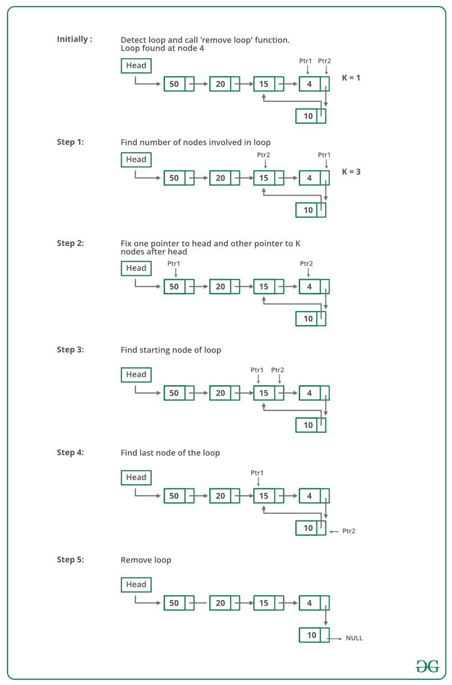
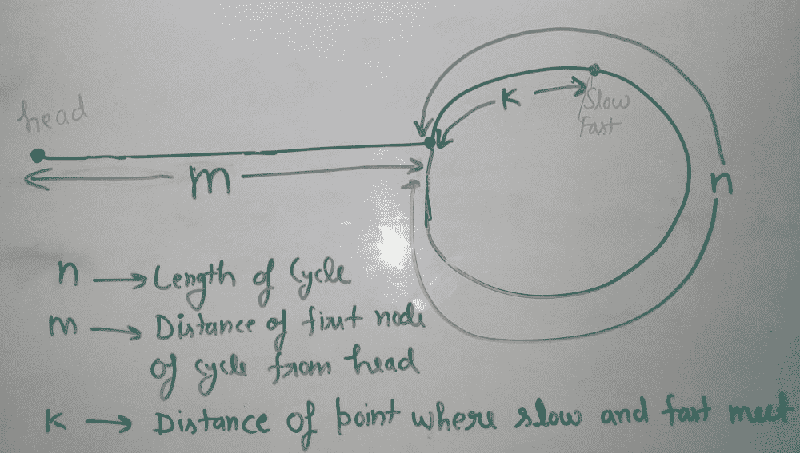

# 检测并删除链表中的循环

> 原文：[https://www.geeksforgeeks.org/detect-and-remove-loop-in-a-linked-list/](https://www.geeksforgeeks.org/detect-and-remove-loop-in-a-linked-list/)

编写一个函数`detectAndRemoveLoop()`，该函数检查给定的链表是否包含循环，如果存在循环，则删除该循环并返回`true`。 如果列表不包含循环，则返回`false`。 下图显示了带有循环的链表。`detectAndRemoveLoop()`必须将以下列表更改为`1 -> 2 -> 3 -> 4 -> 5 -> NULL`。


我们还建议阅读以下文章，作为此处讨论的解决方案的先决条件。

[编写一个 C 函数来检测链表中的循环](http://www.geeksforgeeks.org/detect-loop-in-a-linked-list/)

在尝试删除循环之前，我们必须对其进行检测。 以上文章中讨论的技术可用于检测循环。 要删除循环，我们要做的就是获取指向循环最后一个节点的指针。 例如，上图中的值为 5 的节点。 一旦有了指向最后一个节点的指针，就可以使该节点的下一个成为`NULL`，并且循环消失了。

我们可以轻松地使用哈希或访问节点技术（在上述文章中讨论）来获取指向最后一个节点的指针。 想法很简单：下一个已经被访问（或散列）的第一个节点是最后一个节点。

我们还可以使用[弗洛伊德循环检测](https://www.geeksforgeeks.org/detect-loop-in-a-linked-list/)算法来检测并删除循环。 在弗洛伊德算法中，慢速指针和快速指针在循环节点处相遇。 我们可以使用这个循环节点来消除循环。 当 Floyd 算法用于环路检测时，有以下两种不同的消除环路的方法。

**方法 1（一一检查）**我们知道，当快速指针和慢速指针在同一点相遇时，弗洛伊德的循环检测算法就会终止。 我们也知道这个公共点是循环节点之一（上图中的 2 或 3 或 4 或 5）。 将此地址存储在指针变量（如`ptr2`）中。 之后，从链表的开头开始，并逐个检查节点是否可以从`ptr2`到达。 每当我们找到一个可到达的节点时，我们都知道该节点是链表中循环的起始节点，并且可以获得指向该节点前一个节点的指针。

## CPP

```

// C++ program to detect and remove loop in linked list
#include <bits/stdc++.h>
using namespace std;

/* Link list node */
struct Node {
    int data;
    struct Node* next;
};

/* Function to remove loop. 
Used by detectAndRemoveLoop() */
void removeLoop(struct Node*, struct Node*);

/* This function detects and 
  removes loop in the list
  If loop was there in the 
  list then it returns 1,
  otherwise returns 0 */
int detectAndRemoveLoop(struct Node* list)
{
    struct Node *slow_p = list, *fast_p = list;

    while (slow_p && fast_p && fast_p->next) 
    {
        slow_p = slow_p->next;
        fast_p = fast_p->next->next;

        /* If slow_p and fast_p meet at 
            some point then
           there is a loop */
        if (slow_p == fast_p) {
            removeLoop(slow_p, list);

            /* Return 1 to indicate that loop is found */
            return 1;
        }
    }

    /* Return 0 to indeciate that ther is no loop*/
    return 0;
}

/* Function to remove loop.
 loop_node --> Pointer to 
 one of the loop nodes
 head -->  Pointer to the 
 start node of the linked list */
void removeLoop(struct Node* loop_node, struct Node* head)
{
    struct Node* ptr1;
    struct Node* ptr2;

    /* Set a pointer to the beginning 
      of the Linked List and
      move it one by one to find the 
      first node which is
      part of the Linked List */
    ptr1 = head;
    while (1) {
        /* Now start a pointer from 
        loop_node and check if
       it ever reaches ptr2 */
        ptr2 = loop_node;
        while (ptr2->next != loop_node
               && ptr2->next != ptr1)
            ptr2 = ptr2->next;

        /* If ptr2 reahced ptr1 
        then there is a loop. So
        break the loop */
        if (ptr2->next == ptr1)
            break;

        /* If ptr2 did't reach ptr1 
         then try the next node
         * after ptr1 */
        ptr1 = ptr1->next;
    }

    /* After the end of loop ptr2
     is the last node of the
     loop. So make next of ptr2 as NULL */
    ptr2->next = NULL;
}

/* Function to print linked list */
void printList(struct Node* node)
{
    while (node != NULL) {
        cout << node->data << " ";
        node = node->next;
    }
}

struct Node* newNode(int key)
{
    struct Node* temp = new Node();
    temp->data = key;
    temp->next = NULL;
    return temp;
}

// Driver Code
int main()
{
    struct Node* head = newNode(50);
    head->next = newNode(20);
    head->next->next = newNode(15);
    head->next->next->next = newNode(4);
    head->next->next->next->next = newNode(10);

    /* Create a loop for testing */
    head->next->next->next->next->next = head->next->next;

    detectAndRemoveLoop(head);

    cout << "Linked List after removing loop" << endl;

    printList(head);

    return 0;
}

// This code has been contributed by Striver

```

## C

```c

// C program to detect and remove loop in linked list
#include <stdio.h>
#include <stdlib.h>

/* Link list node */
struct Node {
    int data;
    struct Node* next;
};

/* Function to remove loop.
Used by detectAndRemoveLoop() */
void removeLoop(struct Node*, struct Node*);

/* This function detects and 
   removes loop in the list
  If loop was there in the 
  list then it returns 1,
  otherwise returns 0 */
int detectAndRemoveLoop(struct Node* list)
{
    struct Node *slow_p = list, *fast_p = list;

    while (slow_p && fast_p && fast_p->next) 
    {
        slow_p = slow_p->next;
        fast_p = fast_p->next->next;

        /* If slow_p and fast_p 
        meet at some point then
           there is a loop */
        if (slow_p == fast_p) {
            removeLoop(slow_p, list);

            /* Return 1 to indicate 
              that loop is found */
            return 1;
        }
    }

    /* Return 0 to indeciate that ther is no loop*/
    return 0;
}

/* Function to remove loop.
 loop_node --> Pointer to one of the loop nodes
 head -->  Pointer to the start node of the linked list */
void removeLoop(struct Node* loop_node, struct Node* head)
{
    struct Node* ptr1;
    struct Node* ptr2;

    /* Set a pointer to the beginning of the Linked List and
      move it one by one to find the first node which is
      part of the Linked List */
    ptr1 = head;
    while (1) {
        /* Now start a pointer from loop_node and check if
       it ever reaches ptr2 */
        ptr2 = loop_node;
        while (ptr2->next != loop_node
               && ptr2->next != ptr1)
            ptr2 = ptr2->next;

        /* If ptr2 reahced ptr1 then there is a loop. So
        break the loop */
        if (ptr2->next == ptr1)
            break;

        /* If ptr2 did't reach ptr1 then try the next node
         * after ptr1 */
        ptr1 = ptr1->next;
    }

    /* After the end of loop ptr2 is the last node of the
     loop. So make next of ptr2 as NULL */
    ptr2->next = NULL;
}

/* Function to print linked list */
void printList(struct Node* node)
{
    while (node != NULL) {
        printf("%d  ", node->data);
        node = node->next;
    }
}

struct Node* newNode(int key)
{
    struct Node* temp
        = (struct Node*)malloc(sizeof(struct Node));
    temp->data = key;
    temp->next = NULL;
    return temp;
}

/* Driver code*/
int main()
{
    struct Node* head = newNode(50);
    head->next = newNode(20);
    head->next->next = newNode(15);
    head->next->next->next = newNode(4);
    head->next->next->next->next = newNode(10);

    /* Create a loop for testing */
    head->next->next->next->next->next = head->next->next;

    detectAndRemoveLoop(head);

    printf("Linked List after removing loop \n");
    printList(head);
    return 0;
}

```

## Java

```java

// Java program to detect and remove loop in linked list

class LinkedList {

    static Node head;

    static class Node {

        int data;
        Node next;

        Node(int d)
        {
            data = d;
            next = null;
        }
    }

    // Function that detects loop in the list
    int detectAndRemoveLoop(Node node)
    {
        Node slow = node, fast = node;
        while (slow != null && fast != null
               && fast.next != null) {
            slow = slow.next;
            fast = fast.next.next;

            // If slow and fast meet at same point then loop
            // is present
            if (slow == fast) {
                removeLoop(slow, node);
                return 1;
            }
        }
        return 0;
    }

    // Function to remove loop
    void removeLoop(Node loop, Node curr)
    {
        Node ptr1 = null, ptr2 = null;

        /* Set a pointer to the beginning of the Linked List
         and move it one by one to find the first node which
         is part of the Linked List */
        ptr1 = curr;
        while (1 == 1) {

            /* Now start a pointer from loop_node and check
             if it ever reaches ptr2 */
            ptr2 = loop;
            while (ptr2.next != loop && ptr2.next != ptr1) {
                ptr2 = ptr2.next;
            }

            /* If ptr2 reahced ptr1 then there is a loop. So
             break the loop */
            if (ptr2.next == ptr1) {
                break;
            }

            /* If ptr2 did't reach ptr1 then try the next
             * node after ptr1 */
            ptr1 = ptr1.next;
        }

        /* After the end of loop ptr2 is the last node of
         the loop. So make next of ptr2 as NULL */
        ptr2.next = null;
    }

    // Function to print the linked list
    void printList(Node node)
    {
        while (node != null) {
            System.out.print(node.data + " ");
            node = node.next;
        }
    }

    // Driver code
    public static void main(String[] args)
    {
        LinkedList list = new LinkedList();
        list.head = new Node(50);
        list.head.next = new Node(20);
        list.head.next.next = new Node(15);
        list.head.next.next.next = new Node(4);
        list.head.next.next.next.next = new Node(10);

        // Creating a loop for testing
        head.next.next.next.next.next = head.next.next;
        list.detectAndRemoveLoop(head);
        System.out.println(
            "Linked List after removing loop : ");
        list.printList(head);
    }
}

// This code has been contributed by Mayank Jaiswal

```

## Python

```py

# Python program to detect and remove loop in linked list

# Node class

class Node:

    # Constructor to initialize the node object
    def __init__(self, data):
        self.data = data
        self.next = None

class LinkedList:

    # Function to initialize head
    def __init__(self):
        self.head = None

    def detectAndRemoveLoop(self):
        slow_p = fast_p = self.head
        while(slow_p and fast_p and fast_p.next):
            slow_p = slow_p.next
            fast_p = fast_p.next.next

            # If slow_p and fast_p meet at some poin
            # then there is a loop
            if slow_p == fast_p:
                self.removeLoop(slow_p)

                # Return 1 to indicate that loop if found
                return 1

        # Return 0 to indicate that there is no loop
        return 0

    # Function to remove loop
    # loop node-> Pointer to one of the loop nodes
    # head --> Pointer to the start node of the
    # linked list
    def removeLoop(self, loop_node):

        # Set a pointer to the beginning of the linked
        # list and move it one by one to find the first
        # node which is part of the linked list
        ptr1 = self.head
        while(1):
            # Now start a pointer from loop_node and check
            # if it ever reaches ptr2
            ptr2 = loop_node
            while(ptr2.next != loop_node and ptr2.next != ptr1):
                ptr2 = ptr2.next

            # If ptr2 reached ptr1 then there is a loop.
            # So break the loop
            if ptr2.next == ptr1:
                break

            ptr1 = ptr1.next

        # After the end of loop ptr2 is the lsat node of
        # the loop. So make next of ptr2 as NULL
        ptr2.next = None
    # Function to insert a new node at the beginning

    def push(self, new_data):
        new_node = Node(new_data)
        new_node.next = self.head
        self.head = new_node

    # Utility function to prit the linked LinkedList
    def printList(self):
        temp = self.head
        while(temp):
            print temp.data,
            temp = temp.next

# Driver code
llist = LinkedList()
llist.push(10)
llist.push(4)
llist.push(15)
llist.push(20)
llist.push(50)

# Create a loop for testing
llist.head.next.next.next.next.next = llist.head.next.next

llist.detectAndRemoveLoop()

print "Linked List after removing loop"
llist.printList()

# This code is contributed by Nikhil Kumar Singh(nickzuck_007)

```

## C#

```cs

// C# program to detect and remove loop in linked list
using System;

public class LinkedList {

    public Node head;

    public class Node {

        public int data;
        public Node next;

        public Node(int d)
        {
            data = d;
            next = null;
        }
    }

    // Function that detects loop in the list
    int detectAndRemoveLoop(Node node)
    {
        Node slow = node, fast = node;
        while (slow != null && fast != null
               && fast.next != null) {
            slow = slow.next;
            fast = fast.next.next;

            // If slow and fast meet at same point then loop
            // is present
            if (slow == fast) {
                removeLoop(slow, node);
                return 1;
            }
        }
        return 0;
    }

    // Function to remove loop
    void removeLoop(Node loop, Node curr)
    {
        Node ptr1 = null, ptr2 = null;

        /* Set a pointer to the beginning of the Linked List
         and move it one by one to find the first node which
         is part of the Linked List */
        ptr1 = curr;
        while (1 == 1) {

            /* Now start a pointer from loop_node and check
             if it ever reaches ptr2 */
            ptr2 = loop;
            while (ptr2.next != loop && ptr2.next != ptr1) {
                ptr2 = ptr2.next;
            }

            /* If ptr2 reahced ptr1 then there is a loop. So
             break the loop */
            if (ptr2.next == ptr1) {
                break;
            }

            /* If ptr2 did't reach ptr1 then try the next
             * node after ptr1 */
            ptr1 = ptr1.next;
        }

        /* After the end of loop ptr2 is the last node of
         the loop. So make next of ptr2 as NULL */
        ptr2.next = null;
    }

    // Function to print the linked list
    void printList(Node node)
    {
        while (node != null) {
            Console.Write(node.data + " ");
            node = node.next;
        }
    }

    // Driver code
    public static void Main(String[] args)
    {
        LinkedList list = new LinkedList();
        list.head = new Node(50);
        list.head.next = new Node(20);
        list.head.next.next = new Node(15);
        list.head.next.next.next = new Node(4);
        list.head.next.next.next.next = new Node(10);

        // Creating a loop for testing
        list.head.next.next.next.next.next
            = list.head.next.next;
        list.detectAndRemoveLoop(list.head);
        Console.WriteLine(
            "Linked List after removing loop : ");
        list.printList(list.head);
    }
}

// This code has been contributed by 29AjayKumar

```

**输出**：

```
Linked List after removing loop 
50 20 15 4 10 

```

**方法 2（更好的解决方案）**

1.  此方法还取决于 Floyd 的循环检测算法。

2.  使用弗洛伊德（Floyd）的循环检测算法检测循环，并获得指向循环节点的指针。

3.  计算循环中的节点数。 令计数为`k`。

4.  将一个指针固定到头部，将另一个指针固定到头部的第`k`个节点。

5.  以相同的速度移动两个指针，它们将在循环起始节点相遇。

6.  获取指向循环的最后一个节点的指针，然后将其作为`NULL`。

感谢 WgpShashank 提出了这种方法。

下图是代码中的“删除循环”功能的摘要：



下面是上述方法的实现：

## CPP

```

#include <bits/stdc++.h>
using namespace std;

/* Link list node */
struct Node {
    int data;
    struct Node* next;
};

/* Function to remove loop. */
void removeLoop(struct Node*, struct Node*);

/* This function detects and removes loop in the list
  If loop was there in the list then it returns 1,
  otherwise returns 0 */
int detectAndRemoveLoop(struct Node* list)
{
    struct Node *slow_p = list, *fast_p = list;

    // Iterate and find if loop exists or not
    while (slow_p && fast_p && fast_p->next) {
        slow_p = slow_p->next;
        fast_p = fast_p->next->next;

        /* If slow_p and fast_p meet at some point then there
           is a loop */
        if (slow_p == fast_p) {
            removeLoop(slow_p, list);

            /* Return 1 to indicate that loop is found */
            return 1;
        }
    }

    /* Return 0 to indicate that there is no loop*/
    return 0;
}

/* Function to remove loop.
 loop_node --> Pointer to one of the loop nodes
 head -->  Pointer to the start node of the linked list */
void removeLoop(struct Node* loop_node, struct Node* head)
{
    struct Node* ptr1 = loop_node;
    struct Node* ptr2 = loop_node;

    // Count the number of nodes in loop
    unsigned int k = 1, i;
    while (ptr1->next != ptr2) {
        ptr1 = ptr1->next;
        k++;
    }

    // Fix one pointer to head
    ptr1 = head;

    // And the other pointer to k nodes after head
    ptr2 = head;
    for (i = 0; i < k; i++)
        ptr2 = ptr2->next;

    /*  Move both pointers at the same pace,
      they will meet at loop starting node */
    while (ptr2 != ptr1) {
        ptr1 = ptr1->next;
        ptr2 = ptr2->next;
    }

    // Get pointer to the last node
    while (ptr2->next != ptr1)
        ptr2 = ptr2->next;

    /* Set the next node of the loop ending node
      to fix the loop */
    ptr2->next = NULL;
}

/* Function to print linked list */
void printList(struct Node* node)
{
    // Print the list after loop removal
    while (node != NULL) {
        cout << node->data << " ";
        node = node->next;
    }
}

struct Node* newNode(int key)
{
    struct Node* temp = new Node();
    temp->data = key;
    temp->next = NULL;
    return temp;
}

// Driver Code
int main()
{
    struct Node* head = newNode(50);
    head->next = newNode(20);
    head->next->next = newNode(15);
    head->next->next->next = newNode(4);
    head->next->next->next->next = newNode(10);

    /* Create a loop for testing */
    head->next->next->next->next->next = head->next->next;

    detectAndRemoveLoop(head);

    cout << "Linked List after removing loop \n";
    printList(head);
    return 0;
}

// This code has been contributed by Striver

```

## C

```c

#include <bits/stdc++.h>
using namespace std;

/* Link list node */
struct Node {
    int data;
    struct Node* next;
};

/* Function to remove loop. */
void removeLoop(struct Node*, struct Node*);

/* This function detects and removes loop in the list
  If loop was there in the list then it returns 1,
  otherwise returns 0 */
int detectAndRemoveLoop(struct Node* list)
{
    struct Node *slow_p = list, *fast_p = list;

    // Iterate and find if loop exists or not
    while (slow_p && fast_p && fast_p->next) {
        slow_p = slow_p->next;
        fast_p = fast_p->next->next;

        /* If slow_p and fast_p meet at some point then there
           is a loop */
        if (slow_p == fast_p) {
            removeLoop(slow_p, list);

            /* Return 1 to indicate that loop is found */
            return 1;
        }
    }

    /* Return 0 to indicate that there is no loop*/
    return 0;
}

/* Function to remove loop.
 loop_node --> Pointer to one of the loop nodes
 head -->  Pointer to the start node of the linked list */
void removeLoop(struct Node* loop_node, struct Node* head)
{
    struct Node* ptr1 = loop_node;
    struct Node* ptr2 = loop_node;

    // Count the number of nodes in loop
    unsigned int k = 1, i;
    while (ptr1->next != ptr2) {
        ptr1 = ptr1->next;
        k++;
    }

    // Fix one pointer to head
    ptr1 = head;

    // And the other pointer to k nodes after head
    ptr2 = head;
    for (i = 0; i < k; i++)
        ptr2 = ptr2->next;

    /*  Move both pointers at the same pace,
      they will meet at loop starting node */
    while (ptr2 != ptr1) {
        ptr1 = ptr1->next;
        ptr2 = ptr2->next;
    }

    // Get pointer to the last node
    while (ptr2->next != ptr1)
        ptr2 = ptr2->next;

    /* Set the next node of the loop ending node
      to fix the loop */
    ptr2->next = NULL;
}

/* Function to print linked list */
void printList(struct Node* node)
{
    // Print the list after loop removal
    while (node != NULL) {
        cout << node->data << " ";
        node = node->next;
    }
}

struct Node* newNode(int key)
{
    struct Node* temp = new Node();
    temp->data = key;
    temp->next = NULL;
    return temp;
}

// Driver Code
int main()
{
    struct Node* head = newNode(50);
    head->next = newNode(20);
    head->next->next = newNode(15);
    head->next->next->next = newNode(4);
    head->next->next->next->next = newNode(10);

    /* Create a loop for testing */
    head->next->next->next->next->next = head->next->next;

    detectAndRemoveLoop(head);

    cout << "Linked List after removing loop \n";
    printList(head);
    return 0;
}

// This code has been contributed by Striver

```

## Java

```java

// Java program to detect and remove loop in linked list

class LinkedList {

    static Node head;

    static class Node {

        int data;
        Node next;

        Node(int d)
        {
            data = d;
            next = null;
        }
    }

    // Function that detects loop in the list
    int detectAndRemoveLoop(Node node)
    {
        Node slow = node, fast = node;
        while (slow != null && fast != null && fast.next != null) {
            slow = slow.next;
            fast = fast.next.next;

            // If slow and fast meet at same point then loop is present
            if (slow == fast) {
                removeLoop(slow, node);
                return 1;
            }
        }
        return 0;
    }

    // Function to remove loop
    void removeLoop(Node loop, Node head)
    {
        Node ptr1 = loop;
        Node ptr2 = loop;

        // Count the number of nodes in loop
        int k = 1, i;
        while (ptr1.next != ptr2) {
            ptr1 = ptr1.next;
            k++;
        }

        // Fix one pointer to head
        ptr1 = head;

        // And the other pointer to k nodes after head
        ptr2 = head;
        for (i = 0; i < k; i++) {
            ptr2 = ptr2.next;
        }

        /*  Move both pointers at the same pace,
         they will meet at loop starting node */
        while (ptr2 != ptr1) {
            ptr1 = ptr1.next;
            ptr2 = ptr2.next;
        }

        // Get pointer to the last node
        while (ptr2.next != ptr1) {
            ptr2 = ptr2.next;
        }

        /* Set the next node of the loop ending node
         to fix the loop */
        ptr2.next = null;
    }

    // Function to print the linked list
    void printList(Node node)
    {
        while (node != null) {
            System.out.print(node.data + " ");
            node = node.next;
        }
    }

    // Driver program to test above functions
    public static void main(String[] args)
    {
        LinkedList list = new LinkedList();
        list.head = new Node(50);
        list.head.next = new Node(20);
        list.head.next.next = new Node(15);
        list.head.next.next.next = new Node(4);
        list.head.next.next.next.next = new Node(10);

        // Creating a loop for testing
        head.next.next.next.next.next = head.next.next;
        list.detectAndRemoveLoop(head);
        System.out.println("Linked List after removing loop : ");
        list.printList(head);
    }
}

// This code has been contributed by Mayank Jaiswal

```

## Python

```py

# Python program to detect and remove loop in linked list

# Node class 
class Node:

    # Constructor to initialize the node object
    def __init__(self, data):
        self.data = data
        self.next = None

class LinkedList:

    # Function to initialize head
    def __init__(self):
        self.head = None

    def detectAndRemoveLoop(self):
        slow_p = fast_p = self.head

        while(slow_p and fast_p and fast_p.next):
            slow_p = slow_p.next
            fast_p = fast_p.next.next

            # If slow_p and fast_p meet at some point then
            # there is a loop
            if slow_p == fast_p:
                self.removeLoop(slow_p)

                # Return 1 to indicate that loop is found
                return 1

        # Return 0 to indicate that there is no loop
        return 0

    # Function to remove loop
    # loop_node --> pointer to one of the loop nodes
    # head --> Pointer to the start node of the linked list
    def removeLoop(self, loop_node):
        ptr1 = loop_node
        ptr2 = loop_node

        # Count the number of nodes in loop
        k = 1
        while(ptr1.next != ptr2):
            ptr1 = ptr1.next
            k += 1

        # Fix one pointer to head
        ptr1 = self.head

        # And the other pointer to k nodes after head
        ptr2 = self.head
        for i in range(k):
            ptr2 = ptr2.next

        # Move both pointers at the same place
        # they will meet at loop starting node
        while(ptr2 != ptr1):
            ptr1 = ptr1.next
            ptr2 = ptr2.next

        # Get pointer to the last node
        while(ptr2.next != ptr1):
            ptr2 = ptr2.next

        # Set the next node of the loop ending node
        # to fix the loop
        ptr2.next = None

    # Function to insert a new node at the beginning
    def push(self, new_data):
        new_node = Node(new_data)
        new_node.next = self.head
        self.head = new_node

    # Utility function to print the linked LinkedList
    def printList(self):
        temp = self.head
        while(temp):
            print temp.data,
            temp = temp.next

# Driver program
llist = LinkedList()
llist.push(10)
llist.push(4)
llist.push(15)
llist.push(20)
llist.push(50)

# Create a loop for testing
llist.head.next.next.next.next.next = llist.head.next.next

llist.detectAndRemoveLoop()

print "Linked List after removing loop"
llist.printList()

# This code is contributed by Nikhil Kumar Singh(nickzuck_007)

```

## C#

```cs

// A C# program to detect and remove loop in linked list
using System;
public class LinkedList {

    Node head;

    public class Node {

        public int data;
        public Node next;

        public Node(int d)
        {
            data = d;
            next = null;
        }
    }

    // Function that detects loop in the list
    int detectAndRemoveLoop(Node node)
    {
        Node slow = node, fast = node;
        while (slow != null && fast != null && fast.next != null) {
            slow = slow.next;
            fast = fast.next.next;

            // If slow and fast meet at same
            // point then loop is present
            if (slow == fast) {
                removeLoop(slow, node);
                return 1;
            }
        }
        return 0;
    }

    // Function to remove loop
    void removeLoop(Node loop, Node head)
    {
        Node ptr1 = loop;
        Node ptr2 = loop;

        // Count the number of nodes in loop
        int k = 1, i;
        while (ptr1.next != ptr2) {
            ptr1 = ptr1.next;
            k++;
        }

        // Fix one pointer to head
        ptr1 = head;

        // And the other pointer to k nodes after head
        ptr2 = head;
        for (i = 0; i < k; i++) {
            ptr2 = ptr2.next;
        }

        /* Move both pointers at the same pace, 
        they will meet at loop starting node */
        while (ptr2 != ptr1) {
            ptr1 = ptr1.next;
            ptr2 = ptr2.next;
        }

        // Get pointer to the last node
        while (ptr2.next != ptr1) {
            ptr2 = ptr2.next;
        }

        /* Set the next node of the loop ending node 
        to fix the loop */
        ptr2.next = null;
    }

    // Function to print the linked list
    void printList(Node node)
    {
        while (node != null) {
            Console.Write(node.data + " ");
            node = node.next;
        }
    }

    // Driver program to test above functions
    public static void Main(String[] args)
    {
        LinkedList list = new LinkedList();
        list.head = new Node(50);
        list.head.next = new Node(20);
        list.head.next.next = new Node(15);
        list.head.next.next.next = new Node(4);
        list.head.next.next.next.next = new Node(10);

        // Creating a loop for testing
        list.head.next.next.next.next.next = list.head.next.next;
        list.detectAndRemoveLoop(list.head);
        Console.WriteLine("Linked List after removing loop : ");
        list.printList(list.head);
    }
}

// This code contributed by Rajput-Ji

```

**输出**：

```
Linked List after removing loop 
50 20 15 4 10 

```

**方法 3（优化方法 2：不计算循环中的节点）**

我们不需要计算循环中的节点数。 在检测到循环之后，如果我们从头开始慢速指针，并以相同的速度移动慢速指针和快速指针，直到快不相交，它们就会在循环开始时相遇。

**如何运作？**

在弗洛伊德（Floyd）的循环发现算法之后的某个时间点让慢速和快速相遇。 下图显示了找到循环时的情况。



我们可以从上图得出以下结论

```
Distance traveled by fast pointer = 2 * (Distance traveled 
                                         by slow pointer)

(m + n*x + k) = 2*(m + n*y + k)

Note that before meeting the point shown above, fast
was moving at twice speed.

x -->  Number of complete cyclic rounds made by 
       fast pointer before they meet first time

y -->  Number of complete cyclic rounds made by 
       slow pointer before they meet first time

```

从上面的方程式，我们可以得出以下结论

```
    m + k = (x-2y)*n

Which means m+k is a multiple of n. 
Thus we can write, m + k = i*n or m = i*n - k.
Hence, distance moved by slow pointer: m, is equal to distance moved by fast pointer:
i*n - k or (i-1)*n + n - k (cover the loop completely i-1 times and start from n-k).

```

因此，如果我们再次以**相同的速度**移动两个指针，以使一个指针（例如慢速）从链表的头节点开始，而另一个指针（例如快速）从会合点开始。 当慢速指针到达循环的起点（已进行`m`步）时，快速指针也将进行`m`步的移动，因为它们现在以相同的速度移动。 因为`m + k`是`n`的倍数，并且从`k`快速开始，所以它们将在开始时相遇。 他们还可以见面吗？ 否，因为慢指针在`m`步后第一次进入循环。

## C++

```cpp

// C++ program to detect and remove loop
#include <bits/stdc++.h>
using namespace std;

struct Node {
    int key;
    struct Node* next;
};

Node* newNode(int key)
{
    Node* temp = new Node;
    temp->key = key;
    temp->next = NULL;
    return temp;
}

// A utility function to print a linked list
void printList(Node* head)
{
    while (head != NULL) {
        cout << head->key << " ";
        head = head->next;
    }
    cout << endl;
}

// Function to detect and remove loop
// in a linked list that may contain loop
void detectAndRemoveLoop(Node* head)
{
    // If list is empty or has only one node
    // without loop
    if (head == NULL || head->next == NULL)
        return;

    Node *slow = head, *fast = head;

    // Move slow and fast 1 and 2 steps
    // ahead respectively.
    slow = slow->next;
    fast = fast->next->next;

    // Search for loop using slow and
    // fast pointers
    while (fast && fast->next) {
        if (slow == fast)
            break;
        slow = slow->next;
        fast = fast->next->next;
    }

    /* If loop exists */
    if (slow == fast) 
    {
        slow = head;

        // this check is needed when slow 
        // and fast both meet at the head of the LL
          // eg: 1->2->3->4->5 and then 
        // 5->next = 1 i.e the head of the LL
          if(slow == fast) {
              while(fast->next != slow) fast = fast->next;
        }
          else {
            while (slow->next != fast->next) {
                slow = slow->next;
                fast = fast->next;
            }
        }

        /* since fast->next is the looping point */
        fast->next = NULL; /* remove loop */
    }
}

/* Driver program to test above function*/
int main()
{
    Node* head = newNode(50);
    head->next = head;
    head->next = newNode(20);
    head->next->next = newNode(15);
    head->next->next->next = newNode(4);
    head->next->next->next->next = newNode(10);

    /* Create a loop for testing */
    head->next->next->next->next->next = head;

    detectAndRemoveLoop(head);

    printf("Linked List after removing loop \n");
    printList(head);

    return 0;
}

```

## Java

```java

// Java program to detect 
// and remove loop in linked list

class LinkedList {

    static Node head;

    static class Node {

        int data;
        Node next;

        Node(int d)
        {
            data = d;
            next = null;
        }
    }

    // Function that detects loop in the list
    void detectAndRemoveLoop(Node node)
    {

        // If list is empty or has only one node
        // without loop
        if (node == null || node.next == null)
            return;

        Node slow = node, fast = node;

        // Move slow and fast 1 and 2 steps
        // ahead respectively.
        slow = slow.next;
        fast = fast.next.next;

        // Search for loop using slow and fast pointers
        while (fast != null && fast.next != null) {
            if (slow == fast)
                break;

            slow = slow.next;
            fast = fast.next.next;
        }

        /* If loop exists */
        if (slow == fast) {
            slow = node;
            while (slow.next != fast.next) {
                slow = slow.next;
                fast = fast.next;
            }

            /* since fast->next is the looping point */
            fast.next = null; /* remove loop */
        }
    }

    // Function to print the linked list
    void printList(Node node)
    {
        while (node != null) {
            System.out.print(node.data + " ");
            node = node.next;
        }
    }

    // Driver code
    public static void main(String[] args)
    {
        LinkedList list = new LinkedList();
        list.head = new Node(50);
        list.head.next = new Node(20);
        list.head.next.next = new Node(15);
        list.head.next.next.next = new Node(4);
        list.head.next.next.next.next = new Node(10);

        // Creating a loop for testing
        head.next.next.next.next.next = head.next.next;
        list.detectAndRemoveLoop(head);
        System.out.println("Linked List after removing loop : ");
        list.printList(head);
    }
}

// This code has been contributed by Mayank Jaiswal

```

## Python

```py

# Python program to detect and remove loop

# Node class

class Node:

    # Constructor to initialize the node object
    def __init__(self, data):
        self.data = data
        self.next = None

class LinkedList:

    # Function to initialize head
    def __init__(self):
        self.head = None

    # Function to insert a new node at the beginning
    def push(self, new_data):
        new_node = Node(new_data)
        new_node.next = self.head
        self.head = new_node

    def detectAndRemoveLoop(self):

        if self.head is None:
            return
        if self.head.next is None:
            return

        slow = self.head
        fast = self.head

        # Move slow and fast 1 and 2 steps respectively
        slow = slow.next
        fast = fast.next.next

        # Search for loop using slow and fast pointers
        while (fast is not None):
            if fast.next is None:
                break
            if slow == fast:
                break
            slow = slow.next
            fast = fast.next.next

        # if loop exists
        if slow == fast:
            slow = self.head
            while (slow.next != fast.next):
                slow = slow.next
                fast = fast.next

            # Sinc fast.next is the looping point
            fast.next = None  # Remove loop

    # Utility function to print the linked LinkedList

    def printList(self):
        temp = self.head
        while(temp):
            print temp.data,
            temp = temp.next

# Driver program
llist = LinkedList()
llist.head = Node(50)
llist.head.next = Node(20)
llist.head.next.next = Node(15)
llist.head.next.next.next = Node(4)
llist.head.next.next.next.next = Node(10)

# Create a loop for testing
llist.head.next.next.next.next.next = llist.head.next.next

llist.detectAndRemoveLoop()

print "Linked List after removing loop"
llist.printList()

# This code is contributed by Nikhil Kumar Singh(nickzuck_007)

```

## C#

```cs

// C# program to detect and remove loop in linked list
using System;

public class LinkedList {

    public Node head;

    public class Node {

        public int data;
        public Node next;

        public Node(int d)
        {
            data = d;
            next = null;
        }
    }

    // Function that detects loop in the list
    void detectAndRemoveLoop(Node node)
    {

        // If list is empty or has only one node
        // without loop
        if (node == null || node.next == null)
            return;

        Node slow = node, fast = node;

        // Move slow and fast 1 and 2 steps
        // ahead respectively.
        slow = slow.next;
        fast = fast.next.next;

        // Search for loop using slow and fast pointers
        while (fast != null && fast.next != null) {
            if (slow == fast)
                break;

            slow = slow.next;
            fast = fast.next.next;
        }

        /* If loop exists */
        if (slow == fast) {
            slow = node;
            while (slow.next != fast.next) {
                slow = slow.next;
                fast = fast.next;
            }

            /* since fast->next is the looping point */
            fast.next = null; /* remove loop */
        }
    }

    // Function to print the linked list
    void printList(Node node)
    {
        while (node != null) {
            Console.Write(node.data + " ");
            node = node.next;
        }
    }

    // Driver program to test above functions
    public static void Main(String[] args)
    {
        LinkedList list = new LinkedList();
        list.head = new Node(50);
        list.head.next = new Node(20);
        list.head.next.next = new Node(15);
        list.head.next.next.next = new Node(4);
        list.head.next.next.next.next = new Node(10);

        // Creating a loop for testing
        list.head.next.next.next.next.next = list.head.next.next;
        list.detectAndRemoveLoop(list.head);
        Console.WriteLine("Linked List after removing loop : ");
        list.printList(list.head);
    }
}

// This code contributed by Rajput-Ji

```

**输出**：

```
Linked List after removing loop 
50 20 15 4 10 

```

**方法 4 散列：散列链表节点的地址**

我们可以散列无序映射中链表节点的地址，仅检查元素是否已存在于映射中。 如果存在，则我们已经到达一个已经存在一个周期的节点，因此我们需要使最后一个节点的下一个指针为`NULL`。

## C++

```cpp

// C++ program to detect and remove loop
#include <bits/stdc++.h>
using namespace std;

struct Node {
    int key;
    struct Node* next;
};

Node* newNode(int key)
{
    Node* temp = new Node;
    temp->key = key;
    temp->next = NULL;
    return temp;
}

// A utility function to print a linked list
void printList(Node* head)
{
    while (head != NULL) {
        cout << head->key << " ";
        head = head->next;
    }
    cout << endl;
}

// Function to detect and remove loop
// in a linked list that may contain loop
void hashAndRemove(Node* head)
{
    // hash map to hash addresses of the linked list nodes
    unordered_map<Node*, int> node_map;
    // pointer to last node
    Node* last = NULL;
    while (head != NULL) {
        // if node not present in the map, insert it in the map
        if (node_map.find(head) == node_map.end()) {
            node_map[head]++;
            last = head;
            head = head->next;
        }
        // if present, it is a cycle, make the last node's next pointer NULL
        else {
            last->next = NULL;
            break;
        }
    }
}
/* Driver program to test above function*/
int main()
{
    Node* head = newNode(50);
    head->next = head;
    head->next = newNode(20);
    head->next->next = newNode(15);
    head->next->next->next = newNode(4);
    head->next->next->next->next = newNode(10);

    /* Create a loop for testing */
    head->next->next->next->next->next = head->next->next;

    // printList(head);
    hashAndRemove(head);

    printf("Linked List after removing loop \n");
    printList(head);

    return 0;
}

```

## Java

```java

// Java program to detect  and remove loop in a linked list
import java.util.*;

public class LinkedList {

    static Node head; // head of list

    /* Linked list Node*/
    static class Node {
        int data;
        Node next;
        Node(int d)
        {
            data = d;
            next = null;
        }
    }

    /* Inserts a new Node at front of the list. */
    static public void push(int new_data)
    {
        /* 1 & 2: Allocate the Node & 
                Put in the data*/
        Node new_node = new Node(new_data);

        /* 3\. Make next of new Node as head */
        new_node.next = head;

        /* 4\. Move the head to point to new Node */
        head = new_node;
    }

    // Function to print the linked list
    void printList(Node node)
    {
        while (node != null) {
            System.out.print(node.data + " ");
            node = node.next;
        }
    }

    // Returns true if the loop is removed from the linked
    // list else returns false.
    static boolean removeLoop(Node h)
    {
        HashSet<Node> s = new HashSet<Node>();
        Node prev = null;
        while (h != null) {
            // If we have already has this node
            // in hashmap it means their is a cycle and we
            // need to remove this cycle so set the next of
            // the previous pointer with null.

            if (s.contains(h)) {
                prev.next = null;
                return true;
            }

            // If we are seeing the node for
            // the first time, insert it in hash
            else {
                s.add(h);
                prev = h;
                h = h.next;
            }
        }

        return false;
    }

    /* Driver program to test above function */
    public static void main(String[] args)
    {
        LinkedList llist = new LinkedList();

        llist.push(20);
        llist.push(4);
        llist.push(15);
        llist.push(10);

        /*Create loop for testing */
        llist.head.next.next.next.next = llist.head;

        if (removeLoop(head)) {
            System.out.println("Linked List after removing loop");
            llist.printList(head);
        }
        else
            System.out.println("No Loop found");
    }
}

// This code is contributed by Animesh Nag.

```

**Output**

```
Linked List after removing loop 
50 20 15 4 10 

```

我们感谢 Shubham Agrawal 提出了此解决方案。

https://www.youtube.com/watch?v=_BG9rjkAXj8 

感谢 Gaurav Ahirwar 提供上述解决方案。

如果您发现上述代码/算法不正确，或者找到其他解决同一问题的方法，请发表评论。

