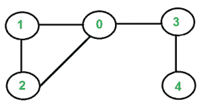

# 使用 BFS 检测无向图中的循环

> 原文： [https://www.geeksforgeeks.org/detect-cycle-in-an-undirected-graph-using-bfs/](https://www.geeksforgeeks.org/detect-cycle-in-an-undirected-graph-using-bfs/)

给定无向图，如何检查图中是否存在循环？ 例如，下图具有循环 1-0-2-1。
[](https://media.geeksforgeeks.org/wp-content/cdn-uploads/cycleGraph.png)

我们已经讨论了有向图的[循环检测。 我们还讨论了](https://www.geeksforgeeks.org/detect-cycle-in-a-graph/)[联合查找算法，用于无向图中的循环检测。](https://www.geeksforgeeks.org/union-find/) 。 联合查找算法的时间复杂度为 O（ELogV）。 像有向图一样，我们可以使用 [DFS](https://www.geeksforgeeks.org/depth-first-traversal-for-a-graph/) 来检测 O（V + E）时间中无向图的周期。 我们已经讨论了用于无向图中用于循环检测的[基于 DFS 的解决方案。](https://www.geeksforgeeks.org/detect-cycle-undirected-graph/)

本文讨论了基于 [BFS](http://www.geeksforgeeks.org/breadth-first-traversal-for-a-graph/) 的解决方案。 我们对给定的图形进行 BFS 遍历。 对于每个访问的顶点“ v”，如果存在一个相邻的“ u”，使得 u 已被访问并且 u 不是 v 的父代，则图中存在一个循环。 如果找不到任何顶点的相邻像素，则表示没有循环。 这种方法的假设是，任意两个顶点之间没有平行边。

我们使用父级数组来跟踪某个顶点的父级顶点，因此我们不会将访问的父级视为循环。

## C ++

```

// C++ program to detect cycle in an undirected graph 
// using BFS. 
#include <bits/stdc++.h> 
using namespace std; 

void addEdge(vector<int> adj[], int u, int v) 
{ 
    adj[u].push_back(v); 
    adj[v].push_back(u); 
} 

bool isCyclicConntected(vector<int> adj[], int s, 
                        int V, vector<bool>& visited) 
{ 
    // Set parent vertex for every vertex as -1\. 
    vector<int> parent(V, -1); 

    // Create a queue for BFS 
    queue<int> q; 

    // Mark the current node as visited and enqueue it 
    visited[s] = true; 
    q.push(s); 

    while (!q.empty()) { 

        // Dequeue a vertex from queue and print it 
        int u = q.front(); 
        q.pop(); 

        // Get all adjacent vertices of the dequeued 
        // vertex u. If a adjacent has not been visited, 
        // then mark it visited and enqueue it. We also 
        // mark parent so that parent is not considered 
        // for cycle. 
        for (auto v : adj[u]) { 
            if (!visited[v]) { 
                visited[v] = true; 
                q.push(v); 
                parent[v] = u; 
            } 
            else if (parent[u] != v) 
                return true; 
        } 
    } 
    return false; 
} 

bool isCyclicDisconntected(vector<int> adj[], int V) 
{ 
    // Mark all the vertices as not visited 
    vector<bool> visited(V, false); 

    for (int i = 0; i < V; i++) 
        if (!visited[i] && isCyclicConntected(adj, i, 
                                         V, visited)) 
            return true; 
    return false; 
} 

// Driver program to test methods of graph class 
int main() 
{ 
    int V = 4; 
    vector<int> adj[V]; 
    addEdge(adj, 0, 1); 
    addEdge(adj, 1, 2); 
    addEdge(adj, 2, 0); 
    addEdge(adj, 2, 3); 

    if (isCyclicDisconntected(adj, V)) 
        cout << "Yes"; 
    else
        cout << "No"; 

    return 0; 
} 

```