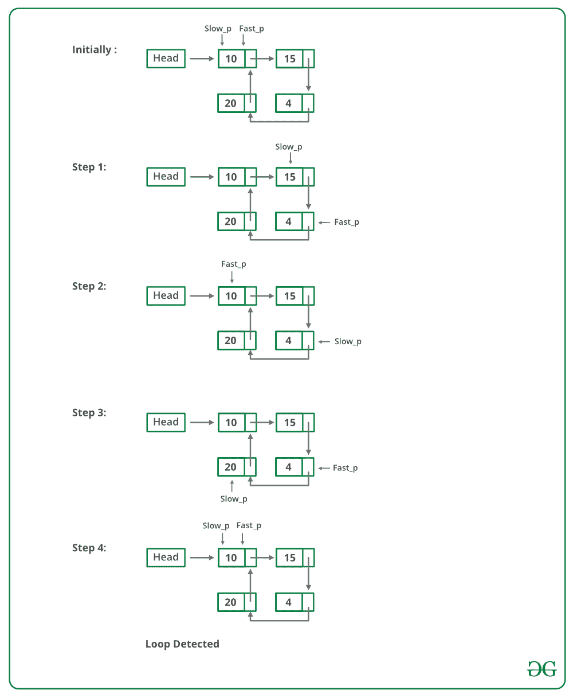

# 检测到链表

> 原文：[https://www.geeksforgeeks.org/detect-loop-in-a-linked-list/](https://www.geeksforgeeks.org/detect-loop-in-a-linked-list/)

中的循环

给定一个链表，检查链表是否有循环。 下图显示了带有循环的链表。


以下是执行此操作的不同方法。

**解决方案 1**：散列

**方法**：

逐一遍历列表，并不断放入 哈希表中的节点地址。 在任何时候，如果达到`NULL`，则返回`false`，如果当前节点的下一个指向哈希中先前存储的任何节点，则返回`true`。

## C++

```cpp

// C++ program to detect loop in a linked list 
#include <bits/stdc++.h> 
using namespace std; 

/* Link list node */
struct Node { 
    int data; 
    struct Node* next; 
}; 

void push(struct Node** head_ref, int new_data) 
{ 
    /* allocate node */
    struct Node* new_node = new Node; 

    /* put in the data  */
    new_node->data = new_data; 

    /* link the old list off the new node */
    new_node->next = (*head_ref); 

    /* move the head to point to the new node */
    (*head_ref) = new_node; 
} 

// Returns true if there is a loop in linked list 
// else returns false. 
bool detectLoop(struct Node* h) 
{ 
    unordered_set<Node*> s; 
    while (h != NULL) { 
        // If this node is already present 
        // in hashmap it means there is a cycle 
        // (Because you we encountering the 
        // node for the second time). 
        if (s.find(h) != s.end()) 
            return true; 

        // If we are seeing the node for 
        // the first time, insert it in hash 
        s.insert(h); 

        h = h->next; 
    } 

    return false; 
} 

/* Driver program to test above function*/
int main() 
{ 
    /* Start with the empty list */
    struct Node* head = NULL; 

    push(&head, 20); 
    push(&head, 4); 
    push(&head, 15); 
    push(&head, 10); 

    /* Create a loop for testing */
    head->next->next->next->next = head; 

    if (detectLoop(head)) 
        cout << "Loop found"; 
    else
        cout << "No Loop"; 

    return 0; 
} 
// This code is contributed by Geetanjali 

```

## Java

```java

// Java program to detect loop in a linked list 
import java.util.*; 

public class LinkedList { 

    static Node head; // head of list 

    /* Linked list Node*/
    static class Node { 
        int data; 
        Node next; 
        Node(int d) 
        { 
            data = d; 
            next = null; 
        } 
    } 

    /* Inserts a new Node at front of the list. */
    static public void push(int new_data) 
    { 
        /* 1 & 2: Allocate the Node & 
                  Put in the data*/
        Node new_node = new Node(new_data); 

        /* 3\. Make next of new Node as head */
        new_node.next = head; 

        /* 4\. Move the head to point to new Node */
        head = new_node; 
    } 

    // Returns true if there is a loop in linked 
    // list else returns false. 
    static boolean detectLoop(Node h) 
    { 
        HashSet<Node> s = new HashSet<Node>(); 
        while (h != null) { 
            // If we have already has this node 
            // in hashmap it means their is a cycle 
            // (Because you we encountering the 
            // node second time). 
            if (s.contains(h)) 
                return true; 

            // If we are seeing the node for 
            // the first time, insert it in hash 
            s.add(h); 

            h = h.next; 
        } 

        return false; 
    } 

    /* Driver program to test above function */
    public static void main(String[] args) 
    { 
        LinkedList llist = new LinkedList(); 

        llist.push(20); 
        llist.push(4); 
        llist.push(15); 
        llist.push(10); 

        /*Create loop for testing */
        llist.head.next.next.next.next = llist.head; 

        if (detectLoop(head)) 
            System.out.println("Loop found"); 
        else
            System.out.println("No Loop"); 
    } 
} 

// This code is contributed by Arnav Kr. Mandal. 

```

## Python3

```py

# Python program to detect loop 
# in the linked list 

# Node class  
class Node: 

    # Constructor to initialize 
    # the node object 
    def __init__(self, data): 
        self.data = data 
        self.next = None

class LinkedList: 

    # Function to initialize head 
    def __init__(self): 
        self.head = None

    # Function to insert a new 
    # node at the beginning 
    def push(self, new_data): 
        new_node = Node(new_data) 
        new_node.next = self.head 
        self.head = new_node 

    # Utility function to print it 
    # the linked LinkedList 
    def printList(self): 
        temp = self.head 
        while(temp): 
            print (temp.data, end =" ") 
            temp = temp.next

    def detectLoop(self): 
         s = set() 
         temp = self.head 
         while (temp): 

             # If we have already has 
             # this node in hashmap it 
             # means their is a cycle 
             # (Because you we encountering 
             # the node second time). 
            if (temp in s): 
                return True

            # If we are seeing the node for 
            # the first time, insert it in hash 
            s.add(temp) 

            temp = temp.next

         return False

# Driver program for testing 
llist = LinkedList() 
llist.push(20) 
llist.push(4) 
llist.push(15) 
llist.push(10) 

# Create a loop for testing 
llist.head.next.next.next.next = llist.head; 

if( llist.detectLoop()): 
    print ("Loop found") 
else : 
    print ("No Loop ") 

# This code is contributed by Gitanjali. 

```

## C#

```cs

// C# program to detect loop in a linked list 
using System; 
using System.Collections.Generic; 

class LinkedList { 

    // head of list 
    public Node head; 

    /* Linked list Node*/
    public class Node { 
        public int data; 
        public Node next; 
        public Node(int d) 
        { 
            data = d; 
            next = null; 
        } 
    } 

    /* Inserts a new Node at front of the list. */
    public void push(int new_data) 
    { 
        /* 1 & 2: Allocate the Node & 
                Put in the data*/
        Node new_node = new Node(new_data); 

        /* 3\. Make next of new Node as head */
        new_node.next = head; 

        /* 4\. Move the head to point to new Node */
        head = new_node; 
    } 

    // Returns true if there is a loop in linked 
    // list else returns false. 
    public static bool detectLoop(Node h) 
    { 
        HashSet<Node> s = new HashSet<Node>(); 
        while (h != null) { 
            // If we have already has this node 
            // in hashmap it means their is a cycle 
            // (Because you we encountering the 
            // node second time). 
            if (s.Contains(h)) 
                return true; 

            // If we are seeing the node for 
            // the first time, insert it in hash 
            s.Add(h); 

            h = h.next; 
        } 

        return false; 
    } 

    /* Driver code*/
    public static void Main(String[] args) 
    { 
        LinkedList llist = new LinkedList(); 

        llist.push(20); 
        llist.push(4); 
        llist.push(15); 
        llist.push(10); 

        /*Create loop for testing */
        llist.head.next.next.next.next = llist.head; 

        if (detectLoop(llist.head)) 
            Console.WriteLine("Loop found"); 
        else
            Console.WriteLine("No Loop"); 
    } 
} 

// This code has been contributed by 29AjayKumar 

```

**Output:** 

```
Loop found

```

**复杂度分析**：，

*   **时间复杂度**：`O(n)`。

    仅需要循环遍历一次。

*   **辅助空间**：`O(n)`。

    `n`是将值存储在哈希图中所需的空间。

**解决方案 2**：通过修改链表数据结构，无需哈希图即可解决此问题。

**方法**：此解决方案需要对基本链表数据结构进行修改。

*   每个节点都有一个访问标志。

*   遍历链表并继续标记访问的节点。

*   如果您再次看到一个访问过的节点，那么就会有一个循环。 该解决方案适用于`O(n)`，但每个节点都需要其他信息。

*   此解决方案的一种变体不需要修改基本数据结构，可以使用哈希来实现，只需将访问的节点的地址存储在哈希中即可，如果您看到哈希中已存在的地址，则会出现循环。

## CPP14

```

// C++ program to detect loop in a linked list 
#include <bits/stdc++.h> 
using namespace std; 

/* Link list node */
struct Node { 
    int data; 
    struct Node* next; 
    int flag; 
}; 

void push(struct Node** head_ref, int new_data) 
{ 
    /* allocate node */
    struct Node* new_node = new Node; 

    /* put in the data */
    new_node->data = new_data; 

    new_node->flag = 0; 

    /* link the old list off the new node */
    new_node->next = (*head_ref); 

    /* move the head to point to the new node */
    (*head_ref) = new_node; 
} 

// Returns true if there is a loop in linked list 
// else returns false. 
bool detectLoop(struct Node* h) 
{ 
    while (h != NULL) { 
        // If this node is already traverse 
        // it means there is a cycle 
        // (Because you we encountering the 
        // node for the second time). 
        if (h->flag == 1) 
            return true; 

        // If we are seeing the node for 
        // the first time, mark its flag as 1 
        h->flag = 1; 

        h = h->next; 
    } 

    return false; 
} 

/* Driver program to test above function*/
int main() 
{ 
    /* Start with the empty list */
    struct Node* head = NULL; 

    push(&head, 20); 
    push(&head, 4); 
    push(&head, 15); 
    push(&head, 10); 

    /* Create a loop for testing */
    head->next->next->next->next = head; 

    if (detectLoop(head)) 
        cout << "Loop found"; 
    else
        cout << "No Loop"; 

    return 0; 
} 
// This code is contributed by Geetanjali 

```

**Output:** 

```
Loop Found

```

**复杂度分析**：，

*   **时间复杂度**：`O(n)`。

    仅需要循环遍历一次。

*   **辅助空间**：`O(n)`。

    `n`是将值存储在哈希图中所需的空间。

**解决方案 3**：弗洛伊德（Floyd）的循环查找算法。

**方法**：这是最快的方法，下面进行了介绍：

*   使用两个指针遍历链表。

*   将一个指针（`slow_p`）移动一个，将另一个指针（`fast_p`）移动两个。

*   如果这些指针在同一节点相遇，则存在循环。 如果指针不符合要求，则链表没有循环。

下图显示了`detectloop`函数在代码中的工作方式：



Floyd 的循环查找算法的实现：

## C++

```cpp

// C++ program to detect loop in a linked list 
#include <bits/stdc++.h> 
using namespace std; 

/* Link list node */
class Node { 
public: 
    int data; 
    Node* next; 
}; 

void push(Node** head_ref, int new_data) 
{ 
    /* allocate node */
    Node* new_node = new Node(); 

    /* put in the data */
    new_node->data = new_data; 

    /* link the old list off the new node */
    new_node->next = (*head_ref); 

    /* move the head to point to the new node */
    (*head_ref) = new_node; 
} 

int detectLoop(Node* list) 
{ 
    Node *slow_p = list, *fast_p = list; 

    while (slow_p && fast_p && fast_p->next) { 
        slow_p = slow_p->next; 
        fast_p = fast_p->next->next; 
        if (slow_p == fast_p) { 
            return 1; 
        } 
    } 
    return 0; 
} 

/* Driver code*/
int main() 
{ 
    /* Start with the empty list */
    Node* head = NULL; 

    push(&head, 20); 
    push(&head, 4); 
    push(&head, 15); 
    push(&head, 10); 

    /* Create a loop for testing */
    head->next->next->next->next = head; 
    if (detectLoop(head)) 
        cout << "Loop found"; 
    else
        cout << "No Loop"; 
    return 0; 
} 

// This is code is contributed by rathbhupendra 

```

## C

```c

// C program to detect loop in a linked list 
#include <stdio.h> 
#include <stdlib.h> 

/* Link list node */
struct Node { 
    int data; 
    struct Node* next; 
}; 

void push(struct Node** head_ref, int new_data) 
{ 
    /* allocate node */
    struct Node* new_node = (struct Node*)malloc(sizeof(struct Node)); 

    /* put in the data  */
    new_node->data = new_data; 

    /* link the old list off the new node */
    new_node->next = (*head_ref); 

    /* move the head to point to the new node */
    (*head_ref) = new_node; 
} 

int detectLoop(struct Node* list) 
{ 
    struct Node *slow_p = list, *fast_p = list; 

    while (slow_p && fast_p && fast_p->next) { 
        slow_p = slow_p->next; 
        fast_p = fast_p->next->next; 
        if (slow_p == fast_p) { 
            return 1; 
        } 
    } 
    return 0; 
} 

/* Driver program to test above function*/
int main() 
{ 
    /* Start with the empty list */
    struct Node* head = NULL; 

    push(&head, 20); 
    push(&head, 4); 
    push(&head, 15); 
    push(&head, 10); 

    /* Create a loop for testing */
    head->next->next->next->next = head; 

    if (detectLoop(head)) 
        printf("Loop found"); 
    else
        printf("No Loop"); 
    return 0; 
} 

```

## Java

```java

// Java program to detect loop in a linked list 
class LinkedList { 
    Node head; // head of list 

    /* Linked list Node*/
    class Node { 
        int data; 
        Node next; 
        Node(int d) 
        { 
            data = d; 
            next = null; 
        } 
    } 

    /* Inserts a new Node at front of the list. */
    public void push(int new_data) 
    { 
        /* 1 & 2: Allocate the Node &  
                Put in the data*/
        Node new_node = new Node(new_data); 

        /* 3\. Make next of new Node as head */
        new_node.next = head; 

        /* 4\. Move the head to point to new Node */
        head = new_node; 
    } 

    void detectLoop() 
    { 
        Node slow_p = head, fast_p = head; 
        int flag = 0; 
        while (slow_p != null && fast_p != null && fast_p.next != null) { 
            slow_p = slow_p.next; 
            fast_p = fast_p.next.next; 
            if (slow_p == fast_p) { 
                flag = 1; 
                break; 
            } 
        } 
        if (flag == 1) 
            System.out.println("Loop found"); 
        else
            System.out.println("Loop not found"); 
    } 

    /* Driver program to test above functions */
    public static void main(String args[]) 
    { 
        LinkedList llist = new LinkedList(); 

        llist.push(20); 
        llist.push(4); 
        llist.push(15); 
        llist.push(10); 

        /*Create loop for testing */
        llist.head.next.next.next.next = llist.head; 

        llist.detectLoop(); 
    } 
} 
/* This code is contributed by Rajat Mishra. */

```

## Python

```py

# Python program to detect loop in the linked list 

# Node class  
class Node: 

    # Constructor to initialize the node object 
    def __init__(self, data): 
        self.data = data 
        self.next = None

class LinkedList: 

    # Function to initialize head 
    def __init__(self): 
        self.head = None

    # Function to insert a new node at the beginning 
    def push(self, new_data): 
        new_node = Node(new_data) 
        new_node.next = self.head 
        self.head = new_node 

    # Utility function to print it the linked LinkedList 
    def printList(self): 
        temp = self.head 
        while(temp): 
            print temp.data, 
            temp = temp.next

    def detectLoop(self): 
        slow_p = self.head 
        fast_p = self.head 
        while(slow_p and fast_p and fast_p.next): 
            slow_p = slow_p.next
            fast_p = fast_p.next.next
            if slow_p == fast_p: 
                return 

# Driver program for testing 
llist = LinkedList() 
llist.push(20) 
llist.push(4) 
llist.push(15) 
llist.push(10) 

# Create a loop for testing 
llist.head.next.next.next.next = llist.head 
if(llist.detectLoop()): 
        print "Found Loop"
else: 
        print "No Loop"

# This code is contributed by Nikhil Kumar Singh(nickzuck_007) 

```

## C#

```cs

// C# program to detect loop in a linked list 
using System; 

public class LinkedList { 
    Node head; // head of list 

    /* Linked list Node*/
    public class Node { 
        public int data; 
        public Node next; 
        public Node(int d) 
        { 
            data = d; 
            next = null; 
        } 
    } 

    /* Inserts a new Node at front of the list. */
    public void push(int new_data) 
    { 
        /* 1 & 2: Allocate the Node &  
                Put in the data*/
        Node new_node = new Node(new_data); 

        /* 3\. Make next of new Node as head */
        new_node.next = head; 

        /* 4\. Move the head to point to new Node */
        head = new_node; 
    } 

    Boolean detectLoop() 
    { 
        Node slow_p = head, fast_p = head; 
        while (slow_p != null && fast_p != null && fast_p.next != null) { 
            slow_p = slow_p.next; 
            fast_p = fast_p.next.next; 
            if (slow_p == fast_p) { 
                return true; 
            } 
        } 
        return false; 
    } 

    /* Driver code */
    public static void Main(String[] args) 
    { 
        LinkedList llist = new LinkedList(); 

        llist.push(20); 
        llist.push(4); 
        llist.push(15); 
        llist.push(10); 
        /*Create loop for testing */
        llist.head.next.next.next.next = llist.head; 

        Boolean found = llist.detectLoop(); 
        if (found) { 
            Console.WriteLine("Loop Found"); 
        } 
        else { 
            Console.WriteLine("No Loop"); 
        } 
    } 
} 

// This code is contributed by Princi Singh 

```

**Output:** 

```
Found Loop

```

**复杂度分析**：，

*   **时间复杂度**：`O(n)`。

    仅需要循环遍历一次。

*   **辅助空间**：`O(1)`。

    不需要空间。

**以上算法如何工作？**

请参阅： [Floyd 的慢速指针和快速指针方法是如何工作的？](https://www.geeksforgeeks.org/how-does-floyds-slow-and-fast-pointers-approach-work/)

**参考**：

[http://en.wikipedia.org/wiki/Cycle_detection](http://en.wikipedia.org/wiki/Cycle_detection)

[http://ostermiller.org/find_loop_singly_linked_list.html](http://ostermiller.org/find_loop_singly_linked_list.html)

**解决方案 4**：在不修改链表数据结构的情况下标记访问的节点

在这种方法中，将创建一个临时节点。 使遍历的每个节点的下一个指针指向该临时节点。 这样，我们将节点的下一个指针用作标志来指示该节点是否已遍历。 检查每个节点以查看下一个节点是否指向临时节点。 在循环的第一个节点的情况下，第二次遍历该条件将成立，因此我们发现该循环存在。 如果遇到一个指向`null`的节点，则循环不存在。

以下是上述方法的实现：

## C++

```cpp

// C++ program to return first node of loop 
#include <bits/stdc++.h> 
using namespace std; 

struct Node { 
    int key; 
    struct Node* next; 
}; 

Node* newNode(int key) 
{ 
    Node* temp = new Node; 
    temp->key = key; 
    temp->next = NULL; 
    return temp; 
} 

// A utility function to print a linked list 
void printList(Node* head) 
{ 
    while (head != NULL) { 
        cout << head->key << " "; 
        head = head->next; 
    } 
    cout << endl; 
} 

// Function to detect first node of loop 
// in a linked list that may contain loop 
bool detectLoop(Node* head) 
{ 

    // Create a temporary node 
    Node* temp = new Node; 
    while (head != NULL) { 

        // This condition is for the case 
        // when there is no loop 
        if (head->next == NULL) { 
            return false; 
        } 

        // Check if next is already 
        // pointing to temp 
        if (head->next == temp) { 
            return true; 
        } 

        // Store the pointer to the next node 
        // in order to get to it in the next step 
        Node* nex = head->next; 

        // Make next point to temp 
        head->next = temp; 

        // Get to the next node in the list 
        head = nex; 
    } 

    return false; 
} 

/* Driver program to test above function*/
int main() 
{ 
    Node* head = newNode(1); 
    head->next = newNode(2); 
    head->next->next = newNode(3); 
    head->next->next->next = newNode(4); 
    head->next->next->next->next = newNode(5); 

    /* Create a loop for testing(5 is pointing to 3) */
    head->next->next->next->next->next = head->next->next; 

    bool found = detectLoop(head); 
    if (found) 
        cout << "Loop Found"; 
    else
        cout << "No Loop"; 

    return 0; 
} 

```

## Java

```java

// Java program to return first node of loop 
class GFG { 

    static class Node { 
        int key; 
        Node next; 
    }; 

    static Node newNode(int key) 
    { 
        Node temp = new Node(); 
        temp.key = key; 
        temp.next = null; 
        return temp; 
    } 

    // A utility function to print a linked list 
    static void printList(Node head) 
    { 
        while (head != null) { 
            System.out.print(head.key + " "); 
            head = head.next; 
        } 
        System.out.println(); 
    } 

    // Function to detect first node of loop 
    // in a linked list that may contain loop 
    static boolean detectLoop(Node head) 
    { 

        // Create a temporary node 
        Node temp = new Node(); 
        while (head != null) { 

            // This condition is for the case 
            // when there is no loop 
            if (head.next == null) { 
                return false; 
            } 

            // Check if next is already 
            // pointing to temp 
            if (head.next == temp) { 
                return true; 
            } 

            // Store the pointer to the next node 
            // in order to get to it in the next step 
            Node nex = head.next; 

            // Make next point to temp 
            head.next = temp; 

            // Get to the next node in the list 
            head = nex; 
        } 

        return false; 
    } 

    // Driver code 
    public static void main(String args[]) 
    { 
        Node head = newNode(1); 
        head.next = newNode(2); 
        head.next.next = newNode(3); 
        head.next.next.next = newNode(4); 
        head.next.next.next.next = newNode(5); 

        // Create a loop for testing(5 is pointing to 3) / 
        head.next.next.next.next.next = head.next.next; 

        boolean found = detectLoop(head); 
        if (found) 
            System.out.println("Loop Found"); 
        else
            System.out.println("No Loop"); 
    } 
} 

// This code is contributed by Arnab Kundu 

```

## Python3

```py

# Python3 program to return first node of loop  

# A binary tree node has data, pointer to  
# left child and a pointer to right child  
# Helper function that allocates a new node  
# with the given data and None left and  
# right pointers  
class newNode: 
    def __init__(self, key): 
        self.key = key 
        self.left = None
        self.right = None

# A utility function to pra linked list  
def printList(head): 
    while (head != None): 
        print(head.key, end = " ") 
        head = head.next

    print() 

# Function to detect first node of loop  
# in a linked list that may contain loop  
def detectLoop( head): 

    # Create a temporary node 
    temp = "" 
    while (head != None): 

        # This condition is for the case 
        # when there is no loop 
        if (head.next == None): 
            return False

        # Check if next is already 
        # pointing to temp 
        if (head.next == temp): 
            return True

        # Store the pointer to the next node 
        # in order to get to it in the next step 
        nex = head.next

        # Make next poto temp 
        head.next = temp 

        # Get to the next node in the list 
        head = nex 

    return False

# Driver Code 
head = newNode(1)  
head.next = newNode(2)  
head.next.next = newNode(3)  
head.next.next.next = newNode(4)  
head.next.next.next.next = newNode(5)  

# Create a loop for testing(5 is pointing to 3) 
head.next.next.next.next.next = head.next.next

found = detectLoop(head)  
if (found): 
    print("Loop Found") 
else: 
    print("No Loop") 

# This code is contributed by SHUBHAMSINGH10 

```

## C#

```cs

// C# program to return first node of loop 
using System; 
public class GFG { 

    public class Node { 
        public int key; 
        public Node next; 
    }; 

    static Node newNode(int key) 
    { 
        Node temp = new Node(); 
        temp.key = key; 
        temp.next = null; 
        return temp; 
    } 

    // A utility function to print a linked list 
    static void printList(Node head) 
    { 
        while (head != null) { 
            Console.Write(head.key + " "); 
            head = head.next; 
        } 
        Console.WriteLine(); 
    } 

    // Function to detect first node of loop 
    // in a linked list that may contain loop 
    static Boolean detectLoop(Node head) 
    { 

        // Create a temporary node 
        Node temp = new Node(); 
        while (head != null) { 

            // This condition is for the case 
            // when there is no loop 
            if (head.next == null) { 
                return false; 
            } 

            // Check if next is already 
            // pointing to temp 
            if (head.next == temp) { 
                return true; 
            } 

            // Store the pointer to the next node 
            // in order to get to it in the next step 
            Node nex = head.next; 

            // Make next point to temp 
            head.next = temp; 

            // Get to the next node in the list 
            head = nex; 
        } 

        return false; 
    } 

    // Driver code 
    public static void Main(String[] args) 
    { 
        Node head = newNode(1); 
        head.next = newNode(2); 
        head.next.next = newNode(3); 
        head.next.next.next = newNode(4); 
        head.next.next.next.next = newNode(5); 

        // Create a loop for testing(5 is pointing to 3) 
        head.next.next.next.next.next = head.next.next; 

        Boolean found = detectLoop(head); 
        if (found) { 
            Console.WriteLine("Loop Found"); 
        } 
        else { 
            Console.WriteLine("No Loop"); 
        } 
    } 
} 

// This code is contributed by Princi Singh 

```

**Output:** 

```
Loop Found

```

**复杂度分析**：，

*   **时间复杂度**：`O(n)`。

    仅需要循环遍历一次。

*   **辅助空间**：`O(1)`。

    不需要空间。

**解决方案 5：存储长度**

在此方法中，将创建两个指针，第一个（始终指向头）和最后一个指针。 每次最后一个指针移动时，我们都会计算第一个和最后一个之间的节点数，并检查当前节点数是否大于先前的节点数，如果是，我们通过移动最后一个指针进行操作，否则就意味着我们已经到达循环的终点， 我们相应地返回输出。

## C++

```cpp

// C++ program to return first node of loop 
#include <bits/stdc++.h> 
using namespace std; 

struct Node { 
    int key; 
    struct Node* next; 
}; 

Node* newNode(int key) 
{ 
    Node* temp = new Node; 
    temp->key = key; 
    temp->next = NULL; 
    return temp; 
} 

// A utility function to print a linked list 
void printList(Node* head) 
{ 
    while (head != NULL) { 
        cout << head->key << " "; 
        head = head->next; 
    } 
    cout << endl; 
} 

/*returns distance between first and last node every time 
 * last node moves forwars*/
int distance(Node* first, Node* last) 
{ 
    /*counts no of nodes between first and last*/
    int counter = 0; 

    Node* curr; 
    curr = first; 

    while (curr != last) { 
        counter += 1; 
        curr = curr->next; 
    } 

    return counter + 1; 
} 

// Function to detect first node of loop 
// in a linked list that may contain loop 
bool detectLoop(Node* head) 
{ 

    // Create a temporary node 
    Node* temp = new Node; 

    Node *first, *last; 

    /*first always points to head*/
    first = head; 
    /*last pointer initially points to head*/
    last = head; 

    /*current_length stores no of nodes between current 
     * position of first and last*/
    int current_length = 0; 

    /*current_length stores no of nodes between previous 
     * position of first and last*/
    int prev_length = -1; 

    while (current_length > prev_length && last != NULL) { 
        // set prev_length to current length then update the 
        // current length 
          prev_length = current_length; 
        // distance is calculated 
        current_length = distance(first, last); 
        // last node points the next node 
        last = last->next; 
    } 

    if (last == NULL) { 
        return false; 
    } 
    else {  
        return true; 
    } 
} 

/* Driver program to test above function*/
int main() 
{ 
    Node* head = newNode(1); 
    head->next = newNode(2); 
    head->next->next = newNode(3); 
    head->next->next->next = newNode(4); 
    head->next->next->next->next = newNode(5); 

    /* Create a loop for testing(5 is pointing to 3) */
    head->next->next->next->next->next = head->next->next; 

    bool found = detectLoop(head); 
    if (found) 
        cout << "Loop Found"; 
    else
        cout << "No Loop Found"; 

    return 0; 
}

```

**Output**

```
Loop Found
```

**复杂度分析**：

*   **时间复杂度**：`O(N ^ 2)`

*   **辅助空间**：`O(1)`

    如果发现任何不正确的内容，或者想共享有关上述主题的更多信息，请写评论。

