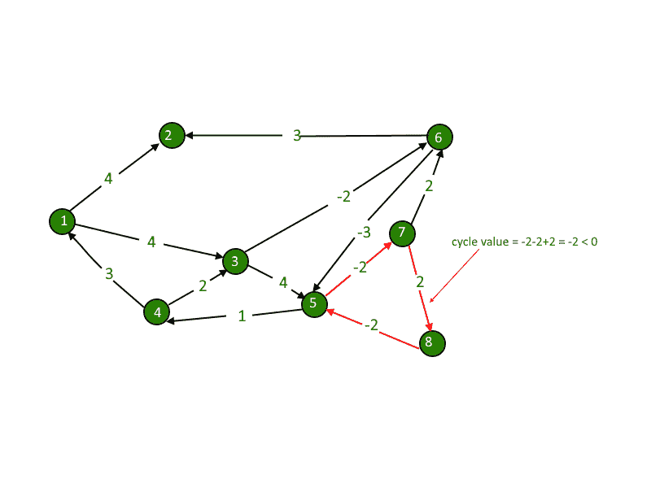
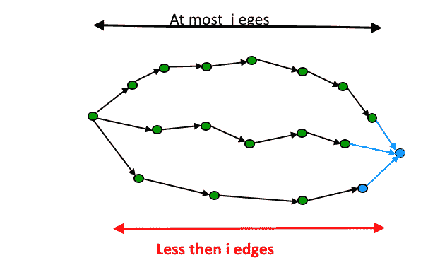

# 检测图形中的负周期| （贝尔曼·福特）

> 原文： [https://www.geeksforgeeks.org/detect-negative-cycle-graph-bellman-ford/](https://www.geeksforgeeks.org/detect-negative-cycle-graph-bellman-ford/)

我们得到一个有向图。 我们需要计算图是否具有负周期。 负周期是指周期总和为负的周期。



在图表的各种应用中都可以找到负权重。 例如，如果您沿着路径行进，则无需为路径付费，而可以得到一些好处。

示例：

```
Input : 4 4
        0 1 1
        1 2 -1
        2 3 -1
        3 0 -1

Output : Yes
The graph contains a negative cycle.

```


这个想法是使用 [Bellman Ford 算法](https://www.geeksforgeeks.org/dynamic-programming-set-23-bellman-ford-algorithm/)。

下面是算法查找，是否可以从给定来源获得负负重循环。

**1）**初始化从源到所有顶点的距离为无穷大，到源自身的距离为 0。创建大小为| V |的数组 dist []。 除了 dist [src]（其中 src 是源顶点）之外的所有值都为无穷大。

**2）**此步骤计算最短距离。 跟随| V | -1 次，其中| V | 是给定图中的顶点数。

….. **a）**对每个边 uv 执行以下操作

………………如果 dist [v] > dist [u] +边 uv 的权重，则更新 dist [v]

………………….dist [v] = dist [u] +边 uv 的权重

**3）**此步骤报告在权重周期中是否存在负的权重周期 图形。 对每个边 u-v 执行以下操作

……如果 dist [v] > dist [u] +边 uv 的权重，则“图形包含负权重周期”

第 3 步的想法是，如果图形不包含负权重循环，则第 2 步可确保最短距离。 如果我们再遍历所有边一次，并且获得任意顶点的较短路径，那么权重周期将为负。

## C++

```cpp

// A C++ program to check if a graph contains negative
// weight cycle using Bellman-Ford algorithm. This program
// works only if all vertices are reachable from a source
// vertex 0.
#include <bits/stdc++.h>
using namespace std;

// a structure to represent a weighted edge in graph
struct Edge {
    int src, dest, weight;
};

// a structure to represent a connected, directed and
// weighted graph
struct Graph {
    // V-> Number of vertices, E-> Number of edges
    int V, E;

    // graph is represented as an array of edges.
    struct Edge* edge;
};

// Creates a graph with V vertices and E edges
struct Graph* createGraph(int V, int E)
{
    struct Graph* graph = new Graph;
    graph->V = V;
    graph->E = E;
    graph->edge = new Edge[graph->E];
    return graph;
}

// The main function that finds shortest distances
// from src to all other vertices using Bellman-
// Ford algorithm.  The function also detects
// negative weight cycle
bool isNegCycleBellmanFord(struct Graph* graph,
                           int src)
{
    int V = graph->V;
    int E = graph->E;
    int dist[V];

    // Step 1: Initialize distances from src
    // to all other vertices as INFINITE
    for (int i = 0; i < V; i++)
        dist[i] = INT_MAX;
    dist[src] = 0;

    // Step 2: Relax all edges |V| - 1 times.
    // A simple shortest path from src to any
    // other vertex can have at-most |V| - 1
    // edges
    for (int i = 1; i <= V - 1; i++) {
        for (int j = 0; j < E; j++) {
            int u = graph->edge[j].src;
            int v = graph->edge[j].dest;
            int weight = graph->edge[j].weight;
            if (dist[u] != INT_MAX && dist[u] + weight < dist[v])
                dist[v] = dist[u] + weight;
        }
    }

    // Step 3: check for negative-weight cycles.
    // The above step guarantees shortest distances
    // if graph doesn't contain negative weight cycle.
    // If we get a shorter path, then there
    // is a cycle.
    for (int i = 0; i < E; i++) {
        int u = graph->edge[i].src;
        int v = graph->edge[i].dest;
        int weight = graph->edge[i].weight;
        if (dist[u] != INT_MAX && dist[u] + weight < dist[v])
            return true;
    }

    return false;
}

// Driver program to test above functions
int main()
{
    /* Let us create the graph given in above example */
    int V = 5; // Number of vertices in graph
    int E = 8; // Number of edges in graph
    struct Graph* graph = createGraph(V, E);

    // add edge 0-1 (or A-B in above figure)
    graph->edge[0].src = 0;
    graph->edge[0].dest = 1;
    graph->edge[0].weight = -1;

    // add edge 0-2 (or A-C in above figure)
    graph->edge[1].src = 0;
    graph->edge[1].dest = 2;
    graph->edge[1].weight = 4;

    // add edge 1-2 (or B-C in above figure)
    graph->edge[2].src = 1;
    graph->edge[2].dest = 2;
    graph->edge[2].weight = 3;

    // add edge 1-3 (or B-D in above figure)
    graph->edge[3].src = 1;
    graph->edge[3].dest = 3;
    graph->edge[3].weight = 2;

    // add edge 1-4 (or A-E in above figure)
    graph->edge[4].src = 1;
    graph->edge[4].dest = 4;
    graph->edge[4].weight = 2;

    // add edge 3-2 (or D-C in above figure)
    graph->edge[5].src = 3;
    graph->edge[5].dest = 2;
    graph->edge[5].weight = 5;

    // add edge 3-1 (or D-B in above figure)
    graph->edge[6].src = 3;
    graph->edge[6].dest = 1;
    graph->edge[6].weight = 1;

    // add edge 4-3 (or E-D in above figure)
    graph->edge[7].src = 4;
    graph->edge[7].dest = 3;
    graph->edge[7].weight = -3;

    if (isNegCycleBellmanFord(graph, 0))
        cout << "Yes";
    else
        cout << "No";

    return 0;
}

```

## Java

```java

// Java program to check if a graph contains negative 
// weight cycle using Bellman-Ford algorithm. This program 
// works only if all vertices are reachable from a source 
// vertex 0\. 
import java.util.*;

class GFG {

    // a structure to represent a weighted edge in graph
    static class Edge {
        int src, dest, weight;
    }

    // a structure to represent a connected, directed and
    // weighted graph
    static class Graph {

        // V-> Number of vertices, E-> Number of edges
        int V, E;

        // graph is represented as an array of edges.
        Edge edge[];

    }

    // Creates a graph with V vertices and E edges
    static Graph createGraph(int V, int E) {
        Graph graph = new Graph();
        graph.V = V;
        graph.E = E;
        graph.edge = new Edge[graph.E];

        for (int i = 0; i < graph.E; i++) {
            graph.edge[i] = new Edge();
        }

        return graph;
    }

    // The main function that finds shortest distances
    // from src to all other vertices using Bellman-
    // Ford algorithm. The function also detects
    // negative weight cycle
    static boolean isNegCycleBellmanFord(Graph graph, int src) {
        int V = graph.V;
        int E = graph.E;
        int[] dist = new int[V];

        // Step 1: Initialize distances from src
        // to all other vertices as INFINITE
        for (int i = 0; i < V; i++)
            dist[i] = Integer.MAX_VALUE;
        dist[src] = 0;

        // Step 2: Relax all edges |V| - 1 times.
        // A simple shortest path from src to any
        // other vertex can have at-most |V| - 1
        // edges
        for (int i = 1; i <= V - 1; i++) {
            for (int j = 0; j < E; j++) {
                int u = graph.edge[j].src;
                int v = graph.edge[j].dest;
                int weight = graph.edge[j].weight;
                if (dist[u] != Integer.MAX_VALUE && dist[u] + weight < dist[v])
                    dist[v] = dist[u] + weight;
            }
        }

        // Step 3: check for negative-weight cycles.
        // The above step guarantees shortest distances
        // if graph doesn't contain negative weight cycle.
        // If we get a shorter path, then there
        // is a cycle.
        for (int i = 0; i < E; i++) {
            int u = graph.edge[i].src;
            int v = graph.edge[i].dest;
            int weight = graph.edge[i].weight;
            if (dist[u] != Integer.MAX_VALUE && dist[u] + weight < dist[v])
                return true;
        }

        return false;
    }

    // Driver Code
    public static void main(String[] args) {
        int V = 5, E = 8;
        Graph graph = createGraph(V, E);

        // add edge 0-1 (or A-B in above figure)
        graph.edge[0].src = 0;
        graph.edge[0].dest = 1;
        graph.edge[0].weight = -1;

        // add edge 0-2 (or A-C in above figure)
        graph.edge[1].src = 0;
        graph.edge[1].dest = 2;
        graph.edge[1].weight = 4;

        // add edge 1-2 (or B-C in above figure)
        graph.edge[2].src = 1;
        graph.edge[2].dest = 2;
        graph.edge[2].weight = 3;

        // add edge 1-3 (or B-D in above figure)
        graph.edge[3].src = 1;
        graph.edge[3].dest = 3;
        graph.edge[3].weight = 2;

        // add edge 1-4 (or A-E in above figure)
        graph.edge[4].src = 1;
        graph.edge[4].dest = 4;
        graph.edge[4].weight = 2;

        // add edge 3-2 (or D-C in above figure)
        graph.edge[5].src = 3;
        graph.edge[5].dest = 2;
        graph.edge[5].weight = 5;

        // add edge 3-1 (or D-B in above figure)
        graph.edge[6].src = 3;
        graph.edge[6].dest = 1;
        graph.edge[6].weight = 1;

        // add edge 4-3 (or E-D in above figure)
        graph.edge[7].src = 4;
        graph.edge[7].dest = 3;
        graph.edge[7].weight = -3;

        if (isNegCycleBellmanFord(graph, 0))
            System.out.println("Yes");
        else
            System.out.println("No");
    }
}

// This code is contributed by
// sanjeev2552

```

**输出**：

```
No

```

**它是如何工作的？**

如 [Bellman Ford 算法](https://www.geeksforgeeks.org/dynamic-programming-set-23-bellman-ford-algorithm/)中所讨论的，对于给定源，它首先计算路径中最多具有一个边的最短距离。 然后，它计算出带有 2 个边的最短路径，依此类推。 在第 i 次外循环迭代之后，将计算最多 i 个边的最短路径。 可以有最大| V |。 –在任何简单路径中都有 1 条边，这就是为什么外循环运行| v |的原因 – 1 次。 如果存在负的权重循环，则再进行一次迭代将缩短路径。



**如何处理断开的图形（如果无法从源到达循环）？**

如果断开给定图形的连接，上述算法和程序可能无法正常工作。 当所有顶点都可以从源顶点 0 到达时，它就可以工作。

## C++

```cpp

// A C++ program for Bellman-Ford's single source
// shortest path algorithm.
#include <bits/stdc++.h>
using namespace std;

// a structure to represent a weighted edge in graph
struct Edge {
    int src, dest, weight;
};

// a structure to represent a connected, directed and
// weighted graph
struct Graph {
    // V-> Number of vertices, E-> Number of edges
    int V, E;

    // graph is represented as an array of edges.
    struct Edge* edge;
};

// Creates a graph with V vertices and E edges
struct Graph* createGraph(int V, int E)
{
    struct Graph* graph = new Graph;
    graph->V = V;
    graph->E = E;
    graph->edge = new Edge[graph->E];
    return graph;
}

// The main function that finds shortest distances
// from src to all other vertices using Bellman-
// Ford algorithm. The function also detects
// negative weight cycle
bool isNegCycleBellmanFord(struct Graph* graph,
                           int src, int dist[])
{
    int V = graph->V;
    int E = graph->E;

    // Step 1: Initialize distances from src
    // to all other vertices as INFINITE
    for (int i = 0; i < V; i++)
        dist[i] = INT_MAX;
    dist[src] = 0;

    // Step 2: Relax all edges |V| - 1 times.
    // A simple shortest path from src to any
    // other vertex can have at-most |V| - 1
    // edges
    for (int i = 1; i <= V - 1; i++) {
        for (int j = 0; j < E; j++) {
            int u = graph->edge[j].src;
            int v = graph->edge[j].dest;
            int weight = graph->edge[j].weight;
            if (dist[u] != INT_MAX && dist[u] + weight < dist[v])
                dist[v] = dist[u] + weight;
        }
    }

    // Step 3: check for negative-weight cycles.
    // The above step guarantees shortest distances
    // if graph doesn't contain negative weight cycle.
    // If we get a shorter path, then there
    // is a cycle.
    for (int i = 0; i < E; i++) {
        int u = graph->edge[i].src;
        int v = graph->edge[i].dest;
        int weight = graph->edge[i].weight;
        if (dist[u] != INT_MAX && dist[u] + weight < dist[v])
            return true;
    }

    return false;
}

// Returns true if given graph has negative weight
// cycle.
bool isNegCycleDisconnected(struct Graph* graph)
{

    int V = graph->V;
    // To keep track of visited vertices to avoid
    // recomputations.
    bool visited[V];
    memset(visited, 0, sizeof(visited));

    // This array is filled by Bellman-Ford
    int dist[V];

    // Call Bellman-Ford for all those vertices
    // that are not visited
    for (int i = 0; i < V; i++) {
        if (visited[i] == false) {
            // If cycle found
            if (isNegCycleBellmanFord(graph, i, dist))
                return true;

            // Mark all vertices that are visited
            // in above call.
            for (int i = 0; i < V; i++)
                if (dist[i] != INT_MAX)
                    visited[i] = true;
        }
    }

    return false;
}

// Driver program to test above functions
int main()
{
    /* Let us create the graph given in above example */
    int V = 5; // Number of vertices in graph
    int E = 8; // Number of edges in graph
    struct Graph* graph = createGraph(V, E);

    // add edge 0-1 (or A-B in above figure)
    graph->edge[0].src = 0;
    graph->edge[0].dest = 1;
    graph->edge[0].weight = -1;

    // add edge 0-2 (or A-C in above figure)
    graph->edge[1].src = 0;
    graph->edge[1].dest = 2;
    graph->edge[1].weight = 4;

    // add edge 1-2 (or B-C in above figure)
    graph->edge[2].src = 1;
    graph->edge[2].dest = 2;
    graph->edge[2].weight = 3;

    // add edge 1-3 (or B-D in above figure)
    graph->edge[3].src = 1;
    graph->edge[3].dest = 3;
    graph->edge[3].weight = 2;

    // add edge 1-4 (or A-E in above figure)
    graph->edge[4].src = 1;
    graph->edge[4].dest = 4;
    graph->edge[4].weight = 2;

    // add edge 3-2 (or D-C in above figure)
    graph->edge[5].src = 3;
    graph->edge[5].dest = 2;
    graph->edge[5].weight = 5;

    // add edge 3-1 (or D-B in above figure)
    graph->edge[6].src = 3;
    graph->edge[6].dest = 1;
    graph->edge[6].weight = 1;

    // add edge 4-3 (or E-D in above figure)
    graph->edge[7].src = 4;
    graph->edge[7].dest = 3;
    graph->edge[7].weight = -3;

    if (isNegCycleDisconnected(graph))
        cout << "Yes";
    else
        cout << "No";

    return 0;
}

```

## Java

```java

// A Java program for Bellman-Ford's single source 
// shortest path algorithm. 
import java.util.*; 

class GFG{ 

// A structure to represent a weighted 
// edge in graph 
static class Edge
{ 
    int src, dest, weight; 
} 

// A structure to represent a connected, 
// directed and weighted graph 
static class Graph 
{ 

    // V-> Number of vertices, 
    // E-> Number of edges 
    int V, E; 

    // Graph is represented as
    // an array of edges. 
    Edge edge[]; 
} 

// Creates a graph with V vertices and E edges 
static Graph createGraph(int V, int E)
{ 
    Graph graph = new Graph(); 
    graph.V = V; 
    graph.E = E; 
    graph.edge = new Edge[graph.E]; 

    for(int i = 0; i < graph.E; i++) 
    { 
        graph.edge[i] = new Edge(); 
    } 

    return graph; 
} 

// The main function that finds shortest distances 
// from src to all other vertices using Bellman- 
// Ford algorithm. The function also detects 
// negative weight cycle 
static boolean isNegCycleBellmanFord(Graph graph, 
                                     int src,
                                     int dist[]) 
{ 
    int V = graph.V; 
    int E = graph.E; 

    // Step 1: Initialize distances from src 
    // to all other vertices as INFINITE 
    for(int i = 0; i < V; i++) 
        dist[i] = Integer.MAX_VALUE; 

    dist[src] = 0; 

    // Step 2: Relax all edges |V| - 1 times. 
    // A simple shortest path from src to any 
    // other vertex can have at-most |V| - 1 
    // edges 
    for(int i = 1; i <= V - 1; i++)
    { 
        for(int j = 0; j < E; j++) 
        { 
            int u = graph.edge[j].src; 
            int v = graph.edge[j].dest; 
            int weight = graph.edge[j].weight;

            if (dist[u] != Integer.MAX_VALUE &&
                dist[u] + weight < dist[v]) 
                dist[v] = dist[u] + weight; 
        } 
    } 

    // Step 3: check for negative-weight cycles. 
    // The above step guarantees shortest distances 
    // if graph doesn't contain negative weight cycle. 
    // If we get a shorter path, then there 
    // is a cycle. 
    for(int i = 0; i < E; i++)
    { 
        int u = graph.edge[i].src; 
        int v = graph.edge[i].dest; 
        int weight = graph.edge[i].weight; 

        if (dist[u] != Integer.MAX_VALUE &&
            dist[u] + weight < dist[v]) 
            return true; 
    } 

    return false; 
} 

// Returns true if given graph has negative weight 
// cycle. 
static boolean isNegCycleDisconnected(Graph graph) 
{ 
    int V = graph.V; 

    // To keep track of visited vertices
    // to avoid recomputations. 
    boolean visited[] = new boolean[V]; 
    Arrays.fill(visited, false); 

    // This array is filled by Bellman-Ford 
    int dist[] = new int[V]; 

    // Call Bellman-Ford for all those vertices 
    // that are not visited 
    for(int i = 0; i < V; i++)
    { 
        if (visited[i] == false)
        {

            // If cycle found 
            if (isNegCycleBellmanFord(graph, i, dist)) 
                return true; 

            // Mark all vertices that are visited 
            // in above call. 
            for(int j = 0; j < V; j++) 
                if (dist[j] != Integer.MAX_VALUE) 
                    visited[j] = true; 
        } 
    } 
    return false; 
}

// Driver Code 
public static void main(String[] args) 
{ 
    int V = 5, E = 8; 
    Graph graph = createGraph(V, E); 

    // Add edge 0-1 (or A-B in above figure) 
    graph.edge[0].src = 0; 
    graph.edge[0].dest = 1; 
    graph.edge[0].weight = -1; 

    // Add edge 0-2 (or A-C in above figure) 
    graph.edge[1].src = 0; 
    graph.edge[1].dest = 2; 
    graph.edge[1].weight = 4; 

    // Add edge 1-2 (or B-C in above figure) 
    graph.edge[2].src = 1; 
    graph.edge[2].dest = 2; 
    graph.edge[2].weight = 3; 

    // Add edge 1-3 (or B-D in above figure) 
    graph.edge[3].src = 1; 
    graph.edge[3].dest = 3; 
    graph.edge[3].weight = 2; 

    // Add edge 1-4 (or A-E in above figure) 
    graph.edge[4].src = 1; 
    graph.edge[4].dest = 4; 
    graph.edge[4].weight = 2; 

    // Add edge 3-2 (or D-C in above figure) 
    graph.edge[5].src = 3; 
    graph.edge[5].dest = 2; 
    graph.edge[5].weight = 5; 

    // Add edge 3-1 (or D-B in above figure) 
    graph.edge[6].src = 3; 
    graph.edge[6].dest = 1; 
    graph.edge[6].weight = 1; 

    // Add edge 4-3 (or E-D in above figure) 
    graph.edge[7].src = 4; 
    graph.edge[7].dest = 3; 
    graph.edge[7].weight = -3; 

    if (isNegCycleDisconnected(graph)) 
        System.out.println("Yes"); 
    else
        System.out.println("No"); 
} 
} 

// This code is contributed by adityapande88

```

**输出**：

```
No

```

[**使用 Floyd Warshall**](https://www.geeksforgeeks.org/detecting-negative-cycle-using-floyd-warshall/) 检测负周期

本文由 **kartik** 提供。 如果您喜欢 GeeksforGeeks 并希望做出贡献，则还可以使用 [tribution.geeksforgeeks.org](http://www.contribute.geeksforgeeks.org) 撰写文章，或将您的文章邮寄至 tribution@geeksforgeeks.org。 查看您的文章出现在 GeeksforGeeks 主页上，并帮助其他 Geeks。

如果发现任何不正确的内容，或者想分享有关上述主题的更多信息，请发表评论。

