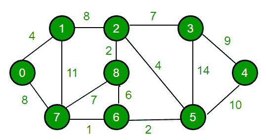
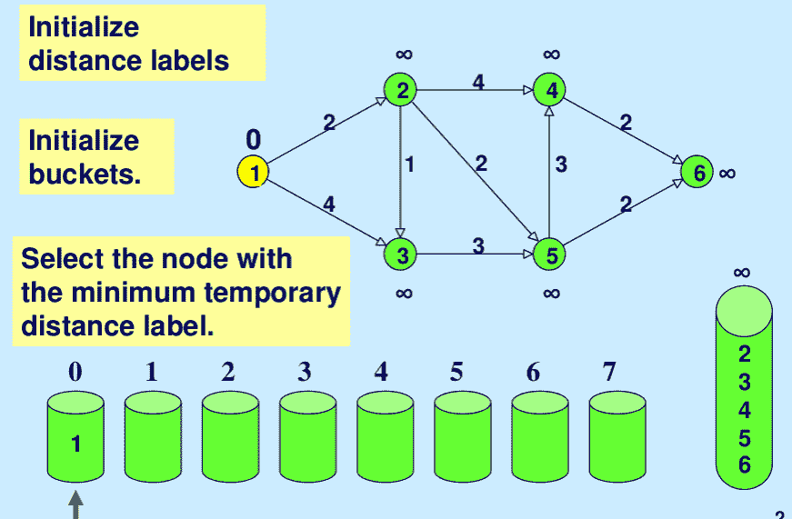
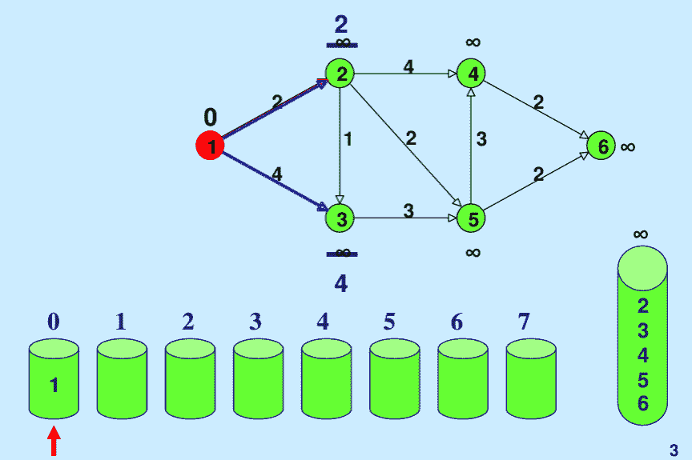
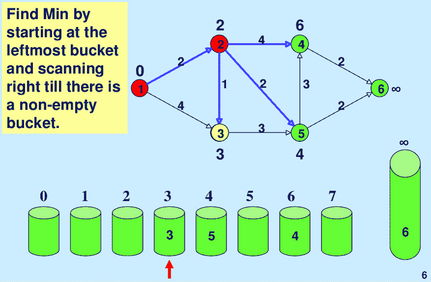

# 拨盘的算法（针对小范围砝码优化了 Dijkstra）

> 原文： [https://www.geeksforgeeks.org/dials-algorithm-optimized-dijkstra-for-small-range-weights/](https://www.geeksforgeeks.org/dials-algorithm-optimized-dijkstra-for-small-range-weights/)

用邻接表表示实现时，Dijkstra 的最短路径算法在 O（Elog V）时间中运行（有关详细信息，请参见 [C 实现](https://www.geeksforgeeks.org/greedy-algorithms-set-7-dijkstras-algorithm-for-adjacency-list-representation/)和[基于 STL 的 C++实现](https://www.geeksforgeeks.org/dijkstras-shortest-path-algorithm-using-set-in-stl/)）。

```


Input : Source = 0, Maximum Weight W = 14
Output : 
     Vertex   Distance from Source
        0                0
        1                4
        2                12
        3                19
        4                21
        5                11
        6                9
        7                8
        8                14
```

**如果最大权重较小（或边权重范围较小），我们能否优化 Dijkstra 的最短路径算法以使其优于 O（E log V）？**

例如，在上图中，最大权重为 14。很多时候，边上的权重范围处于较小范围内（即，所有边权重都可以映射为 0、1、2。w 其中 w 是一个小数）。 在这种情况下，可以通过使用不同的数据结构存储区来修改 Dijkstra 算法，这被称为 dijkstra 算法的拨号实现。 时间复杂度为 **O（E + WV）**，其中 W 是图的任意边上的最大权重，因此我们可以看到，如果 W 小，则此实现比传统算法运行得快得多。 以下是重要观察。

*   任何两个节点之间的最大距离可以为最大 w（V – 1）（w 是最大边权重，两个顶点之间可以有最大 V-1 边）。

*   在 Dijkstra 算法中，距离是在不减小的情况下完成的，即，较近（到给定源）顶点的距离是在遥远的顶点之前确定的。

<center>**Algorithm**</center>

Below is complete algorithm:

1.  维护一些存储桶，编号为 0、1、2，...，wV。

2.  存储桶 k 包含距离等于 k 的所有临时标记的节点。

3.  每个存储桶中的节点由顶点列表表示。

4.  依次检查桶 0、1、2，.. wV，直到找到第一个非空桶。 根据定义，第一个非空存储桶中包含的每个节点都具有最小距离标签。

5.  这些具有最小距离标签的节点被一一标记，并在扫描过程中从存储桶中永久删除。

6.  因此，涉及顶点的操作包括：

    *   检查桶是否空

    *   向存储桶添加顶点

    *   从存储桶中删除顶点。

7.  当顶点的距离标签更改时，会相应地更新临时标记的顶点在存储桶中的位置。

8.  重复此过程，直到所有顶点都被永久标记（或确定所有顶点的距离）为止。

<center>**Implementation**</center>

由于最大距离可以是 w（V – 1），因此我们创建了 wV 桶（为简化代码，更多）来实现算法，如果 w 大，则可以大。

```

// C++ Program for Dijkstra's dial implementation 
#include<bits/stdc++.h> 
using namespace std; 
# define INF 0x3f3f3f3f 

// This class represents a directed graph using 
// adjacency list representation 
class Graph 
{ 
    int V;  // No. of vertices 

    // In a weighted graph, we need to store vertex 
    // and weight pair for every edge 
    list< pair<int, int> > *adj; 

public: 
    Graph(int V);  // Constructor 

    // function to add an edge to graph 
    void addEdge(int u, int v, int w); 

    // prints shortest path from s 
    void shortestPath(int s, int W); 
}; 

// Allocates memory for adjacency list 
Graph::Graph(int V) 
{ 
    this->V = V; 
    adj = new list< pair<int, int> >[V]; 
} 

//  adds edge between u and v of weight w 
void Graph::addEdge(int u, int v, int w) 
{ 
    adj[u].push_back(make_pair(v, w)); 
    adj[v].push_back(make_pair(u, w)); 
} 

// Prints shortest paths from src to all other vertices. 
// W is the maximum weight of an edge 
void Graph::shortestPath(int src, int W) 
{ 
    /* With each distance, iterator to that vertex in 
       its bucket is stored so that vertex can be deleted 
       in O(1) at time of updation. So 
    dist[i].first = distance of ith vertex from src vertex 
    dits[i].second = iterator to vertex i in bucket number */
    vector<pair<int, list<int>::iterator> > dist(V); 

    // Initialize all distances as infinite (INF) 
    for (int i = 0; i < V; i++) 
        dist[i].first = INF; 

    // Create buckets B[]. 
    // B[i] keep vertex of distance label i 
    list<int> B[W * V + 1]; 

    B[0].push_back(src); 
    dist[src].first = 0; 

    // 
    int idx = 0; 
    while (1) 
    { 
        // Go sequentially through buckets till one non-empty 
        // bucket is found 
        while (B[idx].size() == 0 && idx < W*V) 
            idx++; 

        // If all buckets are empty, we are done. 
        if (idx == W * V) 
            break; 

        // Take top vertex from bucket and pop it 
        int u = B[idx].front(); 
        B[idx].pop_front(); 

        // Process all adjacents of extracted vertex 'u' and 
        // update their distanced if required. 
        for (auto i = adj[u].begin(); i != adj[u].end(); ++i) 
        { 
            int v = (*i).first; 
            int weight = (*i).second; 

            int du = dist[u].first; 
            int dv = dist[v].first; 

            // If there is shorted path to v through u. 
            if (dv > du + weight) 
            { 
                // If dv is not INF then it must be in B[dv] 
                // bucket, so erase its entry using iterator 
                // in O(1) 
                if (dv != INF) 
                    B[dv].erase(dist[v].second); 

                //  updating the distance 
                dist[v].first = du + weight; 
                dv = dist[v].first; 

                // pushing vertex v into updated distance's bucket 
                B[dv].push_front(v); 

                // storing updated iterator in dist[v].second 
                dist[v].second = B[dv].begin(); 
            } 
        } 
    } 

    // Print shortest distances stored in dist[] 
    printf("Vertex   Distance from Source\n"); 
    for (int i = 0; i < V; ++i) 
        printf("%d     %d\n", i, dist[i].first); 
} 

// Driver program to test methods of graph class 
int main() 
{ 
    // create the graph given in above fugure 
    int V = 9; 
    Graph g(V); 

    //  making above shown graph 
    g.addEdge(0, 1, 4); 
    g.addEdge(0, 7, 8); 
    g.addEdge(1, 2, 8); 
    g.addEdge(1, 7, 11); 
    g.addEdge(2, 3, 7); 
    g.addEdge(2, 8, 2); 
    g.addEdge(2, 5, 4); 
    g.addEdge(3, 4, 9); 
    g.addEdge(3, 5, 14); 
    g.addEdge(4, 5, 10); 
    g.addEdge(5, 6, 2); 
    g.addEdge(6, 7, 1); 
    g.addEdge(6, 8, 6); 
    g.addEdge(7, 8, 7); 

    //  maximum weighted edge - 14 
    g.shortestPath(0, 14); 

    return 0; 
} 

```

输出：

```
Vertex Distance from Source
0     0
1     4
2     12
3     19
4     21
5     11
6     9
7     8
8     14
```

<center>**Illustration**</center>

Below is step by step illustration taken from [here](http://ocw.mit.edu/courses/sloan-school-of-management/15-082j-network-optimization-fall-2010/animations/MIT15_082JF10_av07.pdf).









 

本文由 Utkarsh Trivedi 提供。 如果发现任何不正确的地方，或者想分享有关上述主题的更多信息，请写评论。

