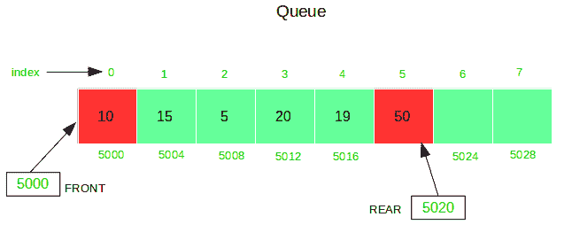
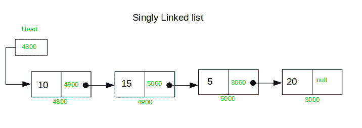

# 静态队列和单链接列表

之间的区别

**[静态队列](https://www.geeksforgeeks.org/queue-data-structure/)：** [队列](https://www.geeksforgeeks.org/queue-set-1introduction-and-array-implementation/)是元素的有序列表。 它始终以先进先出（FIFO）的方式工作。 所有元素都插入在*后*处，并从队列的 *FRONT* 中删除。 在静态队列的实现中，将使用数组，因此队列的所有操作都是基于索引的，这使得除删除之外的所有操作都更快，因为删除需要将所有其余元素向前移动一个位置。

**静态队列**是使用数组实现的固定大小[的队列。](https://www.geeksforgeeks.org/array-implementation-of-queue-simple/)




**[单链表](https://www.geeksforgeeks.org/linked-list-set-1-introduction/)：**链表也是元素的有序列表。 您可以在列表中的任何位置添加元素，在列表中的任何位置更改元素，或从列表中的任何位置删除元素。 列表中的每个节点都存储内容以及指向列表中下一个节点的指针或引用。 要存储单个链接列表，仅必须存储指向该列表中第一个节点的引用或指针。 单个链接列表中的最后一个节点指向无（或为空）。



**以下是静态队列和单链接列表**之间的一些主要区别

| 静态队列 | 单链表 |
| 队列是一个或多个元素以连续方式排列在内存中的集合。 | 链表是一个或多个元素以不连续的方式排列在内存中的集合。 |
| 静态队列始终是固定大小。 | 列表大小永远不会固定。 |
| 在Queue中，仅存储一种和一种类型的信息，因为静态Queue实现是通过Array实现的。 | 列表还存储了下一个节点的地址及其内容。 |
| 静态队列基于索引。 | 单链表是基于参考的。 |
| 始终可以在称为 *REAR* 的单端上执行插入操作，而可以在称为 *FRONT* 的另一端上执行删除操作。 | 列表中的任何位置都可以执行插入和删除操作。 |
| 队列始终基于FIFO。 | 列表可以基于FIFI或LIFO等。 |
| 队列有两个指针FRONT和REAR。 | List仅具有一个基本上称为HEAD的指针。 |

**以下是静态队列**的实现：

## Java

```java

// Java program to implement a queue using an array 
class Queue { 
    private static int front, rear, capacity; 
    private static int queue[]; 

    Queue(int c) 
    { 
        front = rear = 0; 
        capacity = c; 
        queue = new int[capacity]; 
    } 

    // function to insert an element 
    // at the rear of the queue 
    static void queueEnqueue(int data) 
    { 
        // check queue is full or not 
        if (capacity == rear) { 
            System.out.printf("\nQueue is full\n"); 
            return; 
        } 

        // insert element at the rear 
        else { 
            queue[rear] = data; 
            rear++; 
        } 
        return; 
    } 

    // function to delete an element 
    // from the front of the queue 
    static void queueDequeue() 
    { 
        // if queue is empty 
        if (front == rear) { 
            System.out.printf("\nQueue is empty\n"); 
            return; 
        } 

        // shift all the elements from index 2 till rear 
        // to the right by one 
        else { 
            for (int i = 0; i < rear - 1; i++) { 
                queue[i] = queue[i + 1]; 
            } 

            // store 0 at rear indicating there's no element 
            if (rear < capacity) 
                queue[rear] = 0; 

            // decrement rear 
            rear--; 
        } 
        return; 
    } 

    // print queue elements 
    static void queueDisplay() 
    { 
        int i; 
        if (front == rear) { 
            System.out.printf("\nQueue is Empty\n"); 
            return; 
        } 

        // traverse front to rear and print elements 
        for (i = front; i < rear; i++) { 
            System.out.printf(" %d <-- ", queue[i]); 
        } 
        return; 
    } 

    // print front of queue 
    static void queueFront() 
    { 
        if (front == rear) { 
            System.out.printf("\nQueue is Empty\n"); 
            return; 
        } 
        System.out.printf("\nFront Element is: %d", queue[front]); 
        return; 
    } 
} 

public class StaticQueueinjava { 

    // Driver code 
    public static void main(String[] args) 
    { 
        // Create a queue of capacity 4 
        Queue q = new Queue(4); 

        // print Queue elements 
        q.queueDisplay(); 

        // inserting elements in the queue 
        q.queueEnqueue(20); 
        q.queueEnqueue(30); 
        q.queueEnqueue(40); 
        q.queueEnqueue(50); 

        // print Queue elements 
        q.queueDisplay(); 

        // insert element in the queue 
        q.queueEnqueue(60); 

        // print Queue elements 
        q.queueDisplay(); 

        q.queueDequeue(); 
        q.queueDequeue(); 
        System.out.printf("\n\nafter two node deletion\n\n"); 

        // print Queue elements 
        q.queueDisplay(); 

        // print front of the queue 
        q.queueFront(); 
    } 
} 

```

## C#

```cs

// C# program to implement a queue using an array 
using System;  

public class Queue  
{ 
    private static int front, rear, capacity; 
    private static int []queue; 

    public Queue(int c) 
    { 
        front = rear = 0; 
        capacity = c; 
        queue = new int[capacity]; 
    } 

    // function to insert an element 
    // at the rear of the queue 
    public void queueEnqueue(int data) 
    { 
        // check queue is full or not 
        if (capacity == rear)  
        { 
            Console.Write("\nQueue is full\n"); 
            return; 
        } 

        // insert element at the rear 
        else
        { 
            queue[rear] = data; 
            rear++; 
        } 
        return; 
    } 

    // function to delete an element 
    // from the front of the queue 
    public void queueDequeue() 
    { 
        // if queue is empty 
        if (front == rear)  
        { 
            Console.Write("\nQueue is empty\n"); 
            return; 
        } 

        // shift all the elements from index 2 till rear 
        // to the right by one 
        else
        { 
            for (int i = 0; i < rear - 1; i++)  
            { 
                queue[i] = queue[i + 1]; 
            } 

            // store 0 at rear indicating there's no element 
            if (rear < capacity) 
                queue[rear] = 0; 

            // decrement rear 
            rear--; 
        } 
        return; 
    } 

    // print queue elements 
    public void queueDisplay() 
    { 
        int i; 
        if (front == rear)  
        { 
            Console.Write("\nQueue is Empty\n"); 
            return; 
        } 

        // traverse front to rear and print elements 
        for (i = front; i < rear; i++) 
        { 
            Console.Write(" {0} <-- ", queue[i]); 
        } 
        return; 
    } 

    // print front of queue 
    public void queueFront() 
    { 
        if (front == rear)  
        { 
            Console.Write("\nQueue is Empty\n"); 
            return; 
        } 
        Console.Write("\nFront Element is: {0}", queue[front]); 
        return; 
    } 
} 

public class StaticQueueinjava  
{ 

    // Driver code 
    public static void Main(String[] args) 
    { 
        // Create a queue of capacity 4 
        Queue q = new Queue(4); 

        // print Queue elements 
        q.queueDisplay(); 

        // inserting elements in the queue 
        q.queueEnqueue(20); 
        q.queueEnqueue(30); 
        q.queueEnqueue(40); 
        q.queueEnqueue(50); 

        // print Queue elements 
        q.queueDisplay(); 

        // insert element in the queue 
        q.queueEnqueue(60); 

        // print Queue elements 
        q.queueDisplay(); 

        q.queueDequeue(); 
        q.queueDequeue(); 
        Console.Write("\n\nafter two node deletion\n\n"); 

        // print Queue elements 
        q.queueDisplay(); 

        // print front of the queue 
        q.queueFront(); 
    } 
} 

/* This code contributed by PrinciRaj1992 */

```

**Output:**

```
Queue is Empty
 20 <--  30 <--  40 <--  50 <-- 
Queue is full
 20 <--  30 <--  40 <--  50 <-- 

after two node deletion

 40 <--  50 <-- 
Front Element is: 40

```

**下面是单链接列表**的实现：

## Java

```java

// Java program to implement singly linked list 
class SinglyLList { 

    class Node { 

        // node variables 
        int data; 
        Node next; 

        public Node(int data) 
        { 
            this.data = data; 
            this.next = null; 
        } 
    } 

    // create reference variable of Node 
    Node head; 

    // function to insert a node 
    // at the beginning of the list 
    void InsertAtStart(int data) 
    { 
        // create a node 
        Node new_node = new Node(data); 

        new_node.next = head; 
        head = new_node; 
    } 

    // function to insert node 
    // at the end of the list 
    void InsertAtLast(int data) 
    { 

        Node new_node = new Node(data); 
        if (head == null) { 
            head = new_node; 
            return; 
        } 

        new_node.next = null; 

        Node last = head; 
        while (last.next != null) { 
            last = last.next; 
        } 

        last.next = new_node; 
    } 

    // function to delete a node 
    // at the beginning of the list 
    void DeleteAtStart() 
    { 
        if (head == null) { 
            System.out.println("List is empty"); 
            return; 
        } 
        head = head.next; 
    } 

    // function to delete a node at 
    // a given position in the list 
    void DeleteAtPos(int pos) throws Exception 
    { 
        int position = 0; 
        if (pos > Count() || pos < 0) { 
            throw new Exception("Incorrect position exception"); 
        } 
        Node temp = head; 
        while (position != pos - 1) { 
            temp = temp.next; 
            position++; 
        } 
        temp.next = temp.next.next; 
    } 

    // function to delete a node 
    // from the end of the list 
    void DeleteAtLast() 
    { 
        Node delete = head; 
        while (delete.next != null
               && delete.next.next != null) { 
            delete = delete.next; 
        } 
        delete.next = null; 
    } 

    // function to display all the nodes of the list 
    void Display() 
    { 
        Node disp = head; 
        while (disp != null) { 
            System.out.print(disp.data + "->"); 
            disp = disp.next; 
        } 
    } 

    // function to return the total nodes in the list 
    int Count() 
    { 
        int elements = 0; 
        Node count = head; 
        while (count != null) { 
            count = count.next; 
            elements++; 
        } 
        return elements; 
    } 
} 

public class GFG { 

    // Driver code 
    public static void main(String[] args) throws Exception 
    { 
        // create object of class singlyList 
        SinglyLList list = new SinglyLList(); 

        // insert elements of singly linked list 
        // at beginning 
        list.InsertAtStart(3); 
        list.InsertAtStart(2); 
        list.InsertAtStart(1); 

        // print linked list elements 
        list.Display(); 

        // insert element at the end of list 

        list.InsertAtLast(1); 
        System.out.println("\nafter inserting node at the end\n "); 

        // print linked list elements 
        list.Display(); 

        // delete an element at the given position 
        list.DeleteAtPos(1); 

        // delete starting element 
        list.DeleteAtStart(); 

        // delete last element 
        list.DeleteAtLast(); 

        System.out.println("\nafter deleting node: second, first and last\n "); 

        // print linked list elements 
        list.Display(); 
    } 
} 

```

## C#

```cs

// C# program to implement singly linked list  
using System; 

public class SinglyLList  
{  

    public class Node 
    {  

        // node variables  
        public int data;  
        public Node next;  

        public Node(int data)  
        {  
            this.data = data;  
            this.next = null;  
        }  
    }  

    // create reference variable of Node  
    public Node head;  

    // function to insert a node  
    // at the beginning of the list  
    public void InsertAtStart(int data)  
    {  
        // create a node  
        Node new_node = new Node(data);  

        new_node.next = head;  
        head = new_node;  
    }  

    // function to insert node  
    // at the end of the list  
    public void InsertAtLast(int data)  
    {  

        Node new_node = new Node(data);  
        if (head == null)  
        {  
            head = new_node;  
            return;  
        }  

        new_node.next = null;  

        Node last = head;  
        while (last.next != null) 
        {  
            last = last.next;  
        }  

        last.next = new_node;  
    }  

    // function to delete a node  
    // at the beginning of the list  
    public void DeleteAtStart()  
    {  
        if (head == null)  
        {  
            Console.WriteLine("List is empty");  
            return;  
        }  
        head = head.next;  
    }  

    // function to delete a node at  
    // a given position in the list  
    public void DeleteAtPos(int pos)  
    {  
        int position = 0;  
        if (pos > Count() || pos < 0) 
        {  
            throw new Exception("Incorrect position exception");  
        }  
        Node temp = head;  
        while (position != pos - 1)  
        {  
            temp = temp.next;  
            position++;  
        }  
        temp.next = temp.next.next;  
    }  

    // function to delete a node  
    // from the end of the list  
    public void DeleteAtLast()  
    {  
        Node delete = head;  
        while (delete.next != null
            && delete.next.next != null)  
        {  
            delete = delete.next;  
        }  
        delete.next = null;  
    }  

    // function to display all the nodes of the list  
    public void Display()  
    {  
        Node disp = head;  
        while (disp != null) 
        {  
            Console.Write(disp.data + "->");  
            disp = disp.next;  
        }  
    }  

    // function to return the total nodes in the list  
    public int Count()  
    {  
        int elements = 0;  
        Node count = head;  
        while (count != null) 
        {  
            count = count.next;  
            elements++;  
        }  
        return elements;  
    }  
}  

class GFG  
{  

    // Driver code  
    public static void Main(String[] args) 
    {  
        // create object of class singlyList  
        SinglyLList list = new SinglyLList();  

        // insert elements of singly linked list  
        // at beginning  
        list.InsertAtStart(3);  
        list.InsertAtStart(2);  
        list.InsertAtStart(1);  

        // print linked list elements  
        list.Display();  

        // insert element at the end of list  

        list.InsertAtLast(1);  
        Console.WriteLine("\nafter inserting node at the end\n ");  

        // print linked list elements  
        list.Display();  

        // delete an element at the given position  
        list.DeleteAtPos(1);  

        // delete starting element  
        list.DeleteAtStart();  

        // delete last element  
        list.DeleteAtLast();  

        Console.WriteLine("\nafter deleting node: second, first and last\n ");  

        // print linked list elements  
        list.Display();  
    }  
}  

// This code has been contributed by 29AjayKumar 

```

**Output:**

```
1->2->3->
after inserting node at the end

1->2->3->1->
after deleting node: second, first and last

3->

```


* * *

* * *

如果您喜欢GeeksforGeeks并希望做出贡献，则还可以使用 [tribution.geeksforgeeks.org](https://contribute.geeksforgeeks.org/) 撰写文章，或将您的文章邮寄至tribution@geeksforgeeks.org。 查看您的文章出现在GeeksforGeeks主页上，并帮助其他Geeks。

如果您发现任何不正确的地方，请单击下面的“改进文章”按钮，以改进本文。