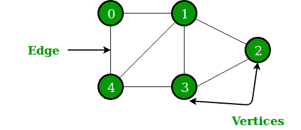

# 图和树之间的区别

> 原文： [https://www.geeksforgeeks.org/difference-between-graph-and-tree/](https://www.geeksforgeeks.org/difference-between-graph-and-tree/)

**[图](https://www.geeksforgeeks.org/graph-data-structure-and-algorithms/)** ：

[图](https://www.geeksforgeeks.org/graph-data-structure-and-algorithms/)是两个集合 V 和 E 的集合，其中 V 是一个有限的非空顶点集，而 E 是一个有限的非空边集。

*   顶点不过是图中的节点。

*   两个相邻的顶点通过边连接。

*   任何图都表示为 G = {V，E}。

例如：

G = {{V 1 ，V 2 ，V 3 ，V 4 ，V 5 ，V 6 }，{E 1 ，E 2 ，E 3 ，E 4 ，E 5 ，E 6 ，E 7 }}

**[树](https://www.geeksforgeeks.org/binary-tree-data-structure/)**：

一棵树是一个或多个节点的有限集，使得–

1.  有一个特别指定的节点，称为根。

2.  其余节点被划分为 n> = 0 个不相交的集合 T 1 ，T 2 ，T 3 ，…，T n [ H [TGG9] 1 ，T 2 ，T 3 ，…，T n 称为根的子树。

树的概念由下图表示。

#### **图与树**

| 没有。 | 图形 | 树 |

| 1 | 图是一种非线性数据结构。 | 树是一种非线性数据结构。 |

| 2 | 它是顶点/节点和边的集合。 | 它是节点和边的集合。 |

| 3 | 每个节点可以具有任意数量的边。 | 常规树由具有任意数量的子节点的节点组成。 但是在使用二叉树的情况下，每个节点最多可以有两个子节点。 |

| 4 | 图中没有称为根的唯一节点。 | 树中有一个称为根的唯一节点。 |

| 5 | 可以形成一个循环。 | 不会有任何周期。 |

| 6 | 应用：用于在网络图中查找最短路径。 | 应用程序：对于游戏树，决策树，使用该树。 |

* * *

* * *

如果您喜欢 GeeksforGeeks 并希望做出贡献，则还可以使用 [tribution.geeksforgeeks.org](https://contribute.geeksforgeeks.org/) 撰写文章，或将您的文章邮寄至 tribution@geeksforgeeks.org。 查看您的文章出现在 GeeksforGeeks 主页上，并帮助其他 Geeks。

如果您发现任何不正确的地方，请单击下面的“改进文章”按钮，以改进本文。