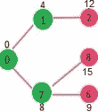

# Dijkstra 的最短路径算法| 贪婪的 Algo-7

> 原文： [https://www.geeksforgeeks.org/dijkstras-shortest-path-algorithm-greedy-algo-7/](https://www.geeksforgeeks.org/dijkstras-shortest-path-algorithm-greedy-algo-7/)

给定一个图和图中的一个源顶点，找到从源到给定图中所有顶点的最短路径。

Dijkstra 算法与 [Prim 的最小生成树](https://www.geeksforgeeks.org/prims-minimum-spanning-tree-mst-greedy-algo-5/)算法非常相似。 与 Prim 的 MST 一样，我们以给定的源为根生成 *SPT（最短路径树）*。 我们维护两组，一组包含最短路径树中包含的顶点，另一组包含尚未包含在最短路径树中的顶点。 在算法的每个步骤中，我们都找到一个顶点，该顶点在另一个集合中（尚未包括在内），并且与源的距离最小。

以下是 Dijkstra 算法使用的详细步骤，以查找从单个源顶点到给定图中所有其他顶点的最短路径。

算法

**1）**创建一个集 *sptSet* （最短路径树集），该集合可跟踪最短路径树中包含的顶点，即距源的最小距离为 计算并最终确定。 最初，此集合为空。

**2）**为输入图中的所有顶点分配距离值。 将所有距离值初始化为 INFINITE。 将源顶点的距离值指定为 0，以便首先拾取它。

**3）**虽然 *sptSet* 并未包含所有顶点

…。 **a）**选取 *sptSet* 中不存在且具有最小距离值的顶点 u。

…。 **b）**将 u 包含在 *sptSet* 中。

…。 **c）**更新 u 的所有相邻顶点的距离值。 要更新距离值，请遍历所有相邻的顶点。 对于每个相邻顶点 v，如果 u（来自源）的距离值和边 u-v 的权重之和小于 v 的距离值，则更新 v 的距离值。

让我们通过以下示例来理解：


集合 *sptSet* 最初为空，分配给顶点的距离为{0，INF，INF，INF，INF，INF，INF，INF}，其中 INF 表示无穷大。 现在选择距离最小的顶点。 选择顶点 0，将其包含在 *sptSet* 中。 因此 *sptSet* 变为{0}。 将 0 包含到 *sptSet* 之后，更新其相邻顶点的距离值。 0 的相邻顶点是 1 和 7。1 和 7 的距离值被更新为 4 和 8。下面的子图显示了顶点及其距离值，仅显示了具有有限距离值的顶点。 SPT 中包含的顶点显示为绿色。


选择具有最小距离值且尚未包含在 SPT 中的顶点（不在 sptSET 中）。 选择顶点 1 并将其添加到 sptSet。 因此，sptSet 现在变为{0，1}。 更新相邻顶点的距离值 1。顶点 2 的距离值变为 12。


选择具有最小距离值且尚未包含在 SPT 中的顶点（不在 sptSET 中）。 选择了顶点 7。 因此，sptSet 现在变为{0，1，7}。 更新相邻顶点 7 的距离值。顶点 6 和 8 的距离值变得有限（分别为 15 和 9）。



选择具有最小距离值且尚未包含在 SPT 中的顶点（不在 sptSET 中）。 选择了顶点 6。 这样 sptSet 现在变成{0，1，7，6}。 更新相邻顶点 6 的距离值。更新顶点 5 和 8 的距离值。


我们重复上述步骤，直到 *sptSet* 确实包含给定图的所有顶点。 最后，我们得到以下最短路径树（SPT）。


***如何实现以上算法？***

我们使用布尔数组 sptSet []表示 SPT 中包含的一组顶点。 如果值 sptSet [v]为 true，则顶点 v 包含在 SPT 中，否则不包含。 数组 dist []用于存储所有顶点的最短距离值。

## C++

```cpp

// A C++ program for Dijkstra's single source shortest path algorithm. 
// The program is for adjacency matrix representation of the graph 

#include <limits.h> 
#include <stdio.h> 

// Number of vertices in the graph 
#define V 9 

// A utility function to find the vertex with minimum distance value, from 
// the set of vertices not yet included in shortest path tree 
int minDistance(int dist[], bool sptSet[]) 
{ 
    // Initialize min value 
    int min = INT_MAX, min_index; 

    for (int v = 0; v < V; v++) 
        if (sptSet[v] == false && dist[v] <= min) 
            min = dist[v], min_index = v; 

    return min_index; 
} 

// A utility function to print the constructed distance array 
void printSolution(int dist[]) 
{ 
    printf("Vertex \t\t Distance from Source\n"); 
    for (int i = 0; i < V; i++) 
        printf("%d \t\t %d\n", i, dist[i]); 
} 

// Function that implements Dijkstra's single source shortest path algorithm 
// for a graph represented using adjacency matrix representation 
void dijkstra(int graph[V][V], int src) 
{ 
    int dist[V]; // The output array.  dist[i] will hold the shortest 
    // distance from src to i 

    bool sptSet[V]; // sptSet[i] will be true if vertex i is included in shortest 
    // path tree or shortest distance from src to i is finalized 

    // Initialize all distances as INFINITE and stpSet[] as false 
    for (int i = 0; i < V; i++) 
        dist[i] = INT_MAX, sptSet[i] = false; 

    // Distance of source vertex from itself is always 0 
    dist[src] = 0; 

    // Find shortest path for all vertices 
    for (int count = 0; count < V - 1; count++) { 
        // Pick the minimum distance vertex from the set of vertices not 
        // yet processed. u is always equal to src in the first iteration. 
        int u = minDistance(dist, sptSet); 

        // Mark the picked vertex as processed 
        sptSet[u] = true; 

        // Update dist value of the adjacent vertices of the picked vertex. 
        for (int v = 0; v < V; v++) 

            // Update dist[v] only if is not in sptSet, there is an edge from 
            // u to v, and total weight of path from src to  v through u is 
            // smaller than current value of dist[v] 
            if (!sptSet[v] && graph[u][v] && dist[u] != INT_MAX 
                && dist[u] + graph[u][v] < dist[v]) 
                dist[v] = dist[u] + graph[u][v]; 
    } 

    // print the constructed distance array 
    printSolution(dist); 
} 

// driver program to test above function 
int main() 
{ 
    /* Let us create the example graph discussed above */
    int graph[V][V] = { { 0, 4, 0, 0, 0, 0, 0, 8, 0 }, 
                        { 4, 0, 8, 0, 0, 0, 0, 11, 0 }, 
                        { 0, 8, 0, 7, 0, 4, 0, 0, 2 }, 
                        { 0, 0, 7, 0, 9, 14, 0, 0, 0 }, 
                        { 0, 0, 0, 9, 0, 10, 0, 0, 0 }, 
                        { 0, 0, 4, 14, 10, 0, 2, 0, 0 }, 
                        { 0, 0, 0, 0, 0, 2, 0, 1, 6 }, 
                        { 8, 11, 0, 0, 0, 0, 1, 0, 7 }, 
                        { 0, 0, 2, 0, 0, 0, 6, 7, 0 } }; 

    dijkstra(graph, 0); 

    return 0; 
} 

```

## Java

```java

// A Java program for Dijkstra's single source shortest path algorithm. 
// The program is for adjacency matrix representation of the graph 
import java.util.*; 
import java.lang.*; 
import java.io.*; 

class ShortestPath { 
    // A utility function to find the vertex with minimum distance value, 
    // from the set of vertices not yet included in shortest path tree 
    static final int V = 9; 
    int minDistance(int dist[], Boolean sptSet[]) 
    { 
        // Initialize min value 
        int min = Integer.MAX_VALUE, min_index = -1; 

        for (int v = 0; v < V; v++) 
            if (sptSet[v] == false && dist[v] <= min) { 
                min = dist[v]; 
                min_index = v; 
            } 

        return min_index; 
    } 

    // A utility function to print the constructed distance array 
    void printSolution(int dist[]) 
    { 
        System.out.println("Vertex \t\t Distance from Source"); 
        for (int i = 0; i < V; i++) 
            System.out.println(i + " \t\t " + dist[i]); 
    } 

    // Function that implements Dijkstra's single source shortest path 
    // algorithm for a graph represented using adjacency matrix 
    // representation 
    void dijkstra(int graph[][], int src) 
    { 
        int dist[] = new int[V]; // The output array. dist[i] will hold 
        // the shortest distance from src to i 

        // sptSet[i] will true if vertex i is included in shortest 
        // path tree or shortest distance from src to i is finalized 
        Boolean sptSet[] = new Boolean[V]; 

        // Initialize all distances as INFINITE and stpSet[] as false 
        for (int i = 0; i < V; i++) { 
            dist[i] = Integer.MAX_VALUE; 
            sptSet[i] = false; 
        } 

        // Distance of source vertex from itself is always 0 
        dist[src] = 0; 

        // Find shortest path for all vertices 
        for (int count = 0; count < V - 1; count++) { 
            // Pick the minimum distance vertex from the set of vertices 
            // not yet processed. u is always equal to src in first 
            // iteration. 
            int u = minDistance(dist, sptSet); 

            // Mark the picked vertex as processed 
            sptSet[u] = true; 

            // Update dist value of the adjacent vertices of the 
            // picked vertex. 
            for (int v = 0; v < V; v++) 

                // Update dist[v] only if is not in sptSet, there is an 
                // edge from u to v, and total weight of path from src to 
                // v through u is smaller than current value of dist[v] 
                if (!sptSet[v] && graph[u][v] != 0 && dist[u] != Integer.MAX_VALUE && dist[u] + graph[u][v] < dist[v]) 
                    dist[v] = dist[u] + graph[u][v]; 
        } 

        // print the constructed distance array 
        printSolution(dist); 
    } 

    // Driver method 
    public static void main(String[] args) 
    { 
        /* Let us create the example graph discussed above */
        int graph[][] = new int[][] { { 0, 4, 0, 0, 0, 0, 0, 8, 0 }, 
                                      { 4, 0, 8, 0, 0, 0, 0, 11, 0 }, 
                                      { 0, 8, 0, 7, 0, 4, 0, 0, 2 }, 
                                      { 0, 0, 7, 0, 9, 14, 0, 0, 0 }, 
                                      { 0, 0, 0, 9, 0, 10, 0, 0, 0 }, 
                                      { 0, 0, 4, 14, 10, 0, 2, 0, 0 }, 
                                      { 0, 0, 0, 0, 0, 2, 0, 1, 6 }, 
                                      { 8, 11, 0, 0, 0, 0, 1, 0, 7 }, 
                                      { 0, 0, 2, 0, 0, 0, 6, 7, 0 } }; 
        ShortestPath t = new ShortestPath(); 
        t.dijkstra(graph, 0); 
    } 
} 
// This code is contributed by Aakash Hasija 

```

## Python

```py

# Python program for Dijkstra's single  
# source shortest path algorithm. The program is  
# for adjacency matrix representation of the graph 

# Library for INT_MAX 
import sys 

class Graph(): 

    def __init__(self, vertices): 
        self.V = vertices 
        self.graph = [[0 for column in range(vertices)]  
                    for row in range(vertices)] 

    def printSolution(self, dist): 
        print "Vertex \tDistance from Source"
        for node in range(self.V): 
            print node, "\t", dist[node] 

    # A utility function to find the vertex with  
    # minimum distance value, from the set of vertices  
    # not yet included in shortest path tree 
    def minDistance(self, dist, sptSet): 

        # Initilaize minimum distance for next node 
        min = sys.maxint 

        # Search not nearest vertex not in the  
        # shortest path tree 
        for v in range(self.V): 
            if dist[v] < min and sptSet[v] == False: 
                min = dist[v] 
                min_index = v 

        return min_index 

    # Funtion that implements Dijkstra's single source  
    # shortest path algorithm for a graph represented  
    # using adjacency matrix representation 
    def dijkstra(self, src): 

        dist = [sys.maxint] * self.V 
        dist[src] = 0
        sptSet = [False] * self.V 

        for cout in range(self.V): 

            # Pick the minimum distance vertex from  
            # the set of vertices not yet processed.  
            # u is always equal to src in first iteration 
            u = self.minDistance(dist, sptSet) 

            # Put the minimum distance vertex in the  
            # shotest path tree 
            sptSet[u] = True

            # Update dist value of the adjacent vertices  
            # of the picked vertex only if the current  
            # distance is greater than new distance and 
            # the vertex in not in the shotest path tree 
            for v in range(self.V): 
                if self.graph[u][v] > 0 and sptSet[v] == False and \ 
                dist[v] > dist[u] + self.graph[u][v]: 
                        dist[v] = dist[u] + self.graph[u][v] 

        self.printSolution(dist) 

# Driver program 
g = Graph(9) 
g.graph = [[0, 4, 0, 0, 0, 0, 0, 8, 0], 
        [4, 0, 8, 0, 0, 0, 0, 11, 0], 
        [0, 8, 0, 7, 0, 4, 0, 0, 2], 
        [0, 0, 7, 0, 9, 14, 0, 0, 0], 
        [0, 0, 0, 9, 0, 10, 0, 0, 0], 
        [0, 0, 4, 14, 10, 0, 2, 0, 0], 
        [0, 0, 0, 0, 0, 2, 0, 1, 6], 
        [8, 11, 0, 0, 0, 0, 1, 0, 7], 
        [0, 0, 2, 0, 0, 0, 6, 7, 0] 
        ]; 

g.dijkstra(0); 

# This code is contributed by Divyanshu Mehta 

```

## C#

```cs

// A C# program for Dijkstra's single 
// source shortest path algorithm. 
// The program is for adjacency matrix 
// representation of the graph 
using System; 

class GFG { 
    // A utility function to find the 
    // vertex with minimum distance 
    // value, from the set of vertices 
    // not yet included in shortest 
    // path tree 
    static int V = 9; 
    int minDistance(int[] dist, 
                    bool[] sptSet) 
    { 
        // Initialize min value 
        int min = int.MaxValue, min_index = -1; 

        for (int v = 0; v < V; v++) 
            if (sptSet[v] == false && dist[v] <= min) { 
                min = dist[v]; 
                min_index = v; 
            } 

        return min_index; 
    } 

    // A utility function to print 
    // the constructed distance array 
    void printSolution(int[] dist) 
    { 
        Console.Write("Vertex \t\t Distance "
                      + "from Source\n"); 
        for (int i = 0; i < V; i++) 
            Console.Write(i + " \t\t " + dist[i] + "\n"); 
    } 

    // Funtion that implements Dijkstra's 
    // single source shortest path algorithm 
    // for a graph represented using adjacency 
    // matrix representation 
    void dijkstra(int[, ] graph, int src) 
    { 
        int[] dist = new int[V]; // The output array. dist[i] 
        // will hold the shortest 
        // distance from src to i 

        // sptSet[i] will true if vertex 
        // i is included in shortest path 
        // tree or shortest distance from 
        // src to i is finalized 
        bool[] sptSet = new bool[V]; 

        // Initialize all distances as 
        // INFINITE and stpSet[] as false 
        for (int i = 0; i < V; i++) { 
            dist[i] = int.MaxValue; 
            sptSet[i] = false; 
        } 

        // Distance of source vertex 
        // from itself is always 0 
        dist[src] = 0; 

        // Find shortest path for all vertices 
        for (int count = 0; count < V - 1; count++) { 
            // Pick the minimum distance vertex 
            // from the set of vertices not yet 
            // processed. u is always equal to 
            // src in first iteration. 
            int u = minDistance(dist, sptSet); 

            // Mark the picked vertex as processed 
            sptSet[u] = true; 

            // Update dist value of the adjacent 
            // vertices of the picked vertex. 
            for (int v = 0; v < V; v++) 

                // Update dist[v] only if is not in 
                // sptSet, there is an edge from u 
                // to v, and total weight of path 
                // from src to v through u is smaller 
                // than current value of dist[v] 
                if (!sptSet[v] && graph[u, v] != 0 && dist[u] != int.MaxValue && dist[u] + graph[u, v] < dist[v]) 
                    dist[v] = dist[u] + graph[u, v]; 
        } 

        // print the constructed distance array 
        printSolution(dist); 
    } 

    // Driver Code 
    public static void Main() 
    { 
        /* Let us create the example  
graph discussed above */
        int[, ] graph = new int[, ] { { 0, 4, 0, 0, 0, 0, 0, 8, 0 }, 
                                      { 4, 0, 8, 0, 0, 0, 0, 11, 0 }, 
                                      { 0, 8, 0, 7, 0, 4, 0, 0, 2 }, 
                                      { 0, 0, 7, 0, 9, 14, 0, 0, 0 }, 
                                      { 0, 0, 0, 9, 0, 10, 0, 0, 0 }, 
                                      { 0, 0, 4, 14, 10, 0, 2, 0, 0 }, 
                                      { 0, 0, 0, 0, 0, 2, 0, 1, 6 }, 
                                      { 8, 11, 0, 0, 0, 0, 1, 0, 7 }, 
                                      { 0, 0, 2, 0, 0, 0, 6, 7, 0 } }; 
        GFG t = new GFG(); 
        t.dijkstra(graph, 0); 
    } 
} 

// This code is contributed by ChitraNayal 

```

**Output:**

```
Vertex   Distance from Source
0                0
1                4
2                12
3                19
4                21
5                11
6                9
7                8
8                14
```

**注意**：

**1）**该代码计算最短距离，但不计算路径信息。 我们可以创建一个父数组，在更新距离时更新父数组（例如 [prim 的实现](https://www.geeksforgeeks.org/prims-minimum-spanning-tree-mst-greedy-algo-5/)），并使用它显示从源到不同顶点的最短路径。

**2）**该代码用于无向图，相同的 dijkstra 函数也可用于有向图。

**3）**该代码查找从源到所有顶点的最短距离。 如果我们在最短的距离只关心从源到单个目标，我们可以在拾取最小距离顶点等于目标（该算法的步骤 3.A）打破的循环。

**4）**实现的时间复杂度为 O（V ^ 2）。 如果使用邻接表表示输入[图，则可以在二进制堆的帮助下将其减小为 O（E log V）。 有关更多详细信息，请参见](https://www.geeksforgeeks.org/graph-and-its-representations/) [Dijkstra 的邻接表表示算法](https://www.geeksforgeeks.org/greedy-algorithms-set-7-dijkstras-algorithm-for-adjacency-list-representation/)。

**5）** Dijkstra 算法不适用于负周期为负的图形，它可能会为负边界的图形提供正确的结果。 对于负边沿和周期为负的图形，可以使用 [Bellman-Ford 算法](http://en.wikipedia.org/wiki/Bellman-Ford_algorithm)，我们很快将在单独的文章中进行讨论。

[Dijkstra 的邻接表表示算法](https://www.geeksforgeeks.org/greedy-algorithms-set-7-dijkstras-algorithm-for-adjacency-list-representation/)

[Dijkstra 最短路径算法](https://www.geeksforgeeks.org/printing-paths-dijkstras-shortest-path-algorithm/)中的打印路径

[Dijkstra 使用 STL 中设置的最短路径算法](https://www.geeksforgeeks.org/dijkstras-shortest-path-algorithm-using-set-in-stl/)

如果发现任何不正确的地方，或者想分享有关上述主题的更多信息，请写评论。

