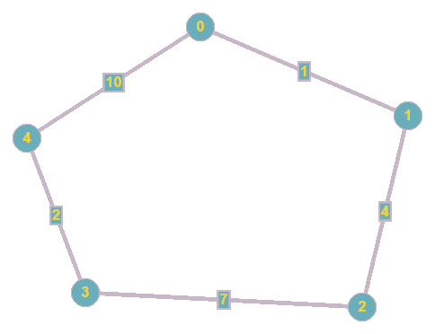
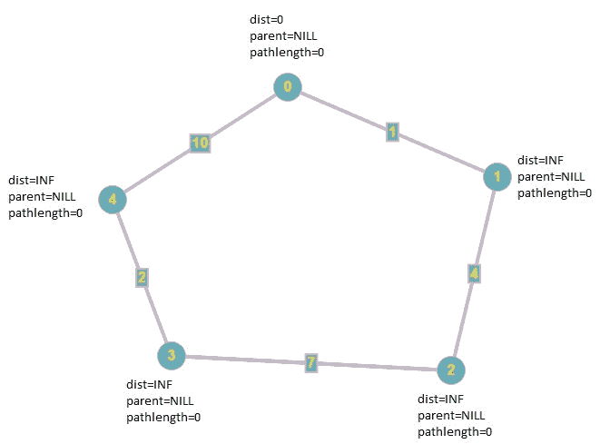
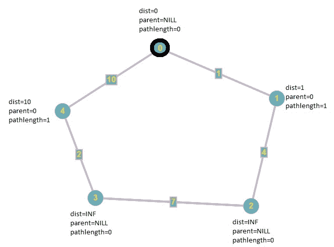
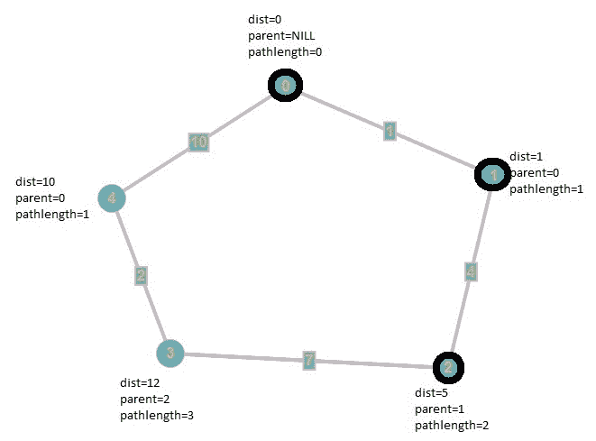
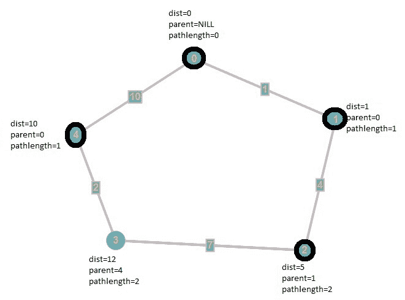

# Dijkstra 的最短路径和最少的边缘

> 原文： [https://www.geeksforgeeks.org/dijkstras-shortest-path-with-minimum-edges/](https://www.geeksforgeeks.org/dijkstras-shortest-path-with-minimum-edges/)

**先决条件**：[Dijkstra 最短路径算法](https://www.geeksforgeeks.org/dijkstras-shortest-path-algorithm-greedy-algo-7/)
给定了表示给定图中节点之间路径的邻接矩阵**图**。 任务是找到边缘最少的最短路径，即如果有多个成本相同的短路径，则选择边缘最少的路径。

考虑下面给出的图形：

从顶点`0`到顶点`3`的权重为 12：

1.  **0-> 1-> 2-> 3**
2.  **0-> 4-> 3**

由于 [Dijkstra 的算法](https://www.geeksforgeeks.org/dijkstras-shortest-path-algorithm-greedy-algo-7/)是[贪婪算法](http://www.geeksforgeeks.org/greedy-algorithms/)，每次迭代都会寻找最小加权顶点，因此原始 Dijkstra 的算法将输出第一条路径，但结果应为第二条路径 包含最少数量的边。

**示例**：

> **输入**：图[] [] = {{0，1，INFINITY，INFINITY，10}，
> {1，0，4，INFINITY，INFINITY}，
> {INFINITY，4， 0，7，INFINITY}，
> {INFINITY，INFINITY，7，0，2}，
> {10，INFINITY，INFINITY，2，0}};
> **输出**：0- > 4- > 3
> INFINITY 在这里显示 u 和 v 不是邻居
> 
> **输入**：图[] [] = {{0，5，INFINITY，INFINITY}，
> {5，0，5，10}，
> {INFINITY，5，0，5} ，
> {INFINITY，10，5，0}};
> **输出**：0- > 1- > 3

**方法**：该算法的思想是使用原始的 Dijkstra 算法，但也通过存储从源顶点到路径的长度的数组来跟踪路径的长度，因此如果我们 找到一条具有相同权重的较短路径，然后我们将采用它。

让我们按照上面的示例进行迭代：
考虑我们想找到从顶点 0 到顶点 3 的最短路径

**初始状态**：距离和所有顶点的父级通常都是 **Infinity** 和 **NILL** 。
但是现在，我们有了另一个名为 **pathlength []** 的数组，该数组存储从源顶点到所有顶点的路径长度。
最初，我们将 **pathlength []** 的所有元素设置为`0`。


**第一次迭代**：首先，我们寻找包含最小距离的顶点，该最小距离为顶点`0`，如上图所示。
然后，遍历其所有未变黑的邻居，即`1`和`4`。 由于顶点`1`和`4`的距离是无穷大，因此我们将它们的权重分别减小为`1`和 **10** 。 更新父级，并将每个顶点（`1`和`4`）的 **pathlength []** 设置为`1`，因为可以从 源顶点乘以 1 个边。
之后，我们像原始 Dijkstra 的算法那样使顶点变黑。


**第二次迭代**：我们继续寻找包含最小距离的非盲顶点，即顶点`1`，然后将其邻居的权重减小为 **1 + 4 = 5** 并像原始 Dijkstra 的算法一样更新其父级，并将其 **pathlength []** 设置为`2`，因为它与源顶点相距两个边缘。
最后，我们使顶点`1`变黑。


**第三次迭代**：再次，包含最小距离的未涂黑的顶点是顶点`2`，因此我们更新了未涂黑的邻居。 它具有一个未变黑的邻居，即顶点`3`。 因此，我们将其权重从 **Infinity** 更新为 **5 + 7 = 12** ，然后将其父级设置为`2`，并设置其**路径长度[]** 至`3`，因为它距源顶点 3 个边。
最后，我们使顶点`2`变黑。


**第四次迭代**：在此迭代中，该算法的作用与原始 Dijkstra 的算法不同。 我们寻求包含最小距离为`4`的非黑色顶点。 由于从源顶点到顶点`3`的距离是 **12** （0- > 1- > 2- > 3）和顶点`4`加上边缘**（4，3）**是 **12** ，这意味着我们刚刚找到了从源顶点到顶点`3`的新路径 一样的重量 然后，我们检查新路径（在边上）是否比现有路径短，并选择边数最少的路径。
最后，我们使顶点`4`变黑。


由于 **V-1** 顶点被涂黑，因此算法结束。

下面是上述方法的实现：

## C++

```cpp

// C++ program to find the shortest path 
// with minimum edges in a graph 
#include <iostream> 
using namespace std; 
#define INFINITY 9999 
#define n 5 
#define s 0 
#define d 3 
#define NILL -1 
int MinDistance(int*, int*); 
void PrintPath(int*, int); 

// Function to find the shortest path 
// with minimum edges in a graph 
void Dijkstra(int Graph[n][n], int _n, int _s, int _d) 
{ 

    int i, u, v, count; 
    int dist[n]; 
    int Blackened[n] = { 0 }; 
    int pathlength[n] = { 0 }; 
    int parent[n]; 

    // The parent Of the source vertex is always equal to nill 
    parent[_s] = NILL; 

    // first, we initialize all distances to infinity. 
    for (i = 0; i < n; i++) 
        dist[i] = INFINITY; 

    dist[_s] = 0; 
    for (count = 0; count < n - 1; count++) { 
        u = MinDistance(dist, Blackened); 

        // if MinDistance() returns INFINITY, then the graph is not 
        // connected and we have traversed all of the vertices in the 
        // connected component of the source vertex, so it can reduce 
        // the time complexity sometimes 
        // In a directed graph, it means that the source vertex 
        // is not a root 
        if (u == INFINITY) 
            break; 
        else { 

            // Mark the vertex as Blackened 
            Blackened[u] = 1; 
            for (v = 0; v < n; v++) { 
                if (!Blackened[v] && Graph[u][v] 
                    && dist[u] + Graph[u][v] < dist[v]) { 
                    parent[v] = u; 
                    pathlength[v] = pathlength[parent[v]] + 1; 
                    dist[v] = dist[u] + Graph[u][v]; 
                } 
                else if (!Blackened[v] && Graph[u][v] 
                         && dist[u] + Graph[u][v] == dist[v] 
                         && pathlength[u] + 1 < pathlength[v]) { 
                    parent[v] = u; 
                    pathlength[v] = pathlength[u] + 1; 
                } 
            } 
        } 
    } 

    // Printing the path 
    if (dist[_d] != INFINITY) 
        PrintPath(parent, _d); 
    else
        cout << "There is no path between vertex "
             << _s << "to vertex " << _d; 
} 

int MinDistance(int* dist, int* Blackened) 
{ 
    int min = INFINITY, min_index, v; 
    for (v = 0; v < n; v++) 
        if (!Blackened[v] && dist[v] < min) { 
            min = dist[v]; 
            min_index = v; 
        } 
    return min == INFINITY ? INFINITY : min_index; 
} 

// Function to print the path 
void PrintPath(int* parent, int _d) 
{ 
    if (parent[_d] == NILL) { 
        cout << _d; 
        return; 
    } 
    PrintPath(parent, parent[_d]); 
    cout << "->" << _d; 
} 

// Driver code 
int main() 
{ 
    // INFINITY means that u and v are not neighbors. 
    int Graph[n][n] = { { 0, 1, INFINITY, INFINITY, 10 }, 
                        { 1, 0, 4, INFINITY, INFINITY }, 
                        { INFINITY, 4, 0, 7, INFINITY }, 
                        { INFINITY, INFINITY, 7, 0, 2 }, 
                        { 10, INFINITY, INFINITY, 2, 0 } }; 
    Dijkstra(Graph, n, s, d); 
    return 0; 
} 

```

## Java

```java

// Java program to find the shortest path  
// with minimum edges in a graph  
import java.io.*; 
import java.util.*; 

class GFG  
{ 

    static int INFINITY = 9999, n = 5, s = 0, d = 3, NILL = -1; 

    // Function to find the shortest path 
    // with minimum edges in a graph 
    static void Dijkstra(int[][] Graph, int _n, int _s, int _d)  
    { 

        int i, u, v, count; 
        int[] dist = new int[n]; 
        int[] Blackened = new int[n]; 
        int[] pathlength = new int[n]; 
        int[] parent = new int[n]; 

        // The parent Of the source vertex is always equal to nill 
        parent[_s] = NILL; 

        // first, we initialize all distances to infinity. 
        for (i = 0; i < n; i++) 
            dist[i] = INFINITY; 

        dist[_s] = 0; 
        for (count = 0; count < n - 1; count++)  
        { 
            u = MinDistance(dist, Blackened); 

            // if MinDistance() returns INFINITY, then the graph is not 
            // connected and we have traversed all of the vertices in the 
            // connected component of the source vertex, so it can reduce 
            // the time complexity sometimes 
            // In a directed graph, it means that the source vertex 
            // is not a root 
            if (u == INFINITY) 
                break; 
            else
            { 

                // Mark the vertex as Blackened 
                Blackened[u] = 1; 
                for (v = 0; v < n; v++)  
                { 
                    if (Blackened[v] == 0 && Graph[u][v] != 0 
                        && dist[u] + Graph[u][v] < dist[v])  
                    { 
                        parent[v] = u; 
                        pathlength[v] = pathlength[parent[v]] + 1; 
                        dist[v] = dist[u] + Graph[u][v]; 
                    }  
                    else if (Blackened[v] == 0 && Graph[u][v] != 0 
                            && dist[u] + Graph[u][v] == dist[v] 
                            && pathlength[u] + 1 < pathlength[v]) 
                    { 
                        parent[v] = u; 
                        pathlength[v] = pathlength[u] + 1; 
                    } 
                } 
            } 
        } 

        // Printing the path 
        if (dist[_d] != INFINITY) 
            PrintPath(parent, _d); 
        else
            System.out.println("There is not path between vertex " + 
                                _s + " to vertex " + _d); 
    } 

    static int MinDistance(int[] dist, int[] Blackened) 
    { 
        int min = INFINITY, min_index = -1, v; 
        for (v = 0; v < n; v++) 
            if (Blackened[v] == 0 && dist[v] < min) 
            { 
                min = dist[v]; 
                min_index = v; 
            } 
        return min == INFINITY ? INFINITY : min_index; 
    } 

    // Function to print the path 
    static void PrintPath(int[] parent, int _d) 
    { 
        if (parent[_d] == NILL) 
        { 
            System.out.print(_d); 
            return; 
        } 
        PrintPath(parent, parent[_d]); 
        System.out.print("->" + _d); 
    } 

    // Driver Code 
    public static void main(String[] args) 
    { 

        // INFINITY means that u and v are not neighbors. 
        int[][] Graph = { { 0, 1, INFINITY, INFINITY, 10 }, 
                        { 1, 0, 4, INFINITY, INFINITY }, 
                        { INFINITY, 4, 0, 7, INFINITY }, 
                        { INFINITY, INFINITY, 7, 0, 2 }, 
                        { 10, INFINITY, INFINITY, 2, 0 } }; 
        Dijkstra(Graph, n, s, d); 
    } 
} 

// This code is contributed by 
// sanjeev2552 

```

## Python

```py

# Python program to find the shortest path 
# with minimum edges in a graph 
def Dijkstra(Graph, _s, _d): 
    row = len(Graph) 
    col = len(Graph[0]) 
    dist = [float("Inf")] * row 
    Blackened =[0] * row 
    pathlength =[0] * row 
    parent = [-1] * row 
    dist[_s]= 0
    for count in range(row-1): 
        u = MinDistance(dist, Blackened) 

        # if MinDistance() returns INFINITY, then the graph is not 
        # connected and we have traversed all of the vertices in the 
        # connected component of the source vertex, so it can reduce 
        # the time complexity sometimes 
        # In a directed graph, it means that the source vertex 
        # is not a root 
        if u == float("Inf"): 
            break
        else: 

            # Mark the vertex as Blackened 
            Blackened[u]= 1 
        for v in range(row): 
            if Blackened[v]== 0 and Graph[u][v] and dist[u]+Graph[u][v]<dist[v]: 
                parent[v]= u 
                pathlength[v]= pathlength[parent[v]]+1
                dist[v]= dist[u]+Graph[u][v] 
            elif Blackened[v]== 0 and Graph[u][v] and dist[u]+Graph[u][v]== dist[v] and pathlength[u]+1<pathlength[v]: 
                parent[v]= u 
                pathlength[v] = pathlength[u] + 1
    if dist[_d]!= float("Inf"): 

        # Printing the path 
        PrintPath(parent, _d) 
    else: 
        print "There is no path between vertex ", _s, "to vertex ", _d 

# Function to print the path 
def PrintPath(parent, _d): 
    if parent[_d]==-1: 
        print _d, 
        return
    PrintPath(parent, parent[_d]) 
    print "->", _d, 
def MinDistance(dist, Blackened): 
    min = float("Inf") 
    for v in range(len(dist)): 
        if not Blackened[v] and dist[v]<min: 
            min = dist[v] 
            Min_index = v 
    return float("Inf") if min == float("Inf") else Min_index 

# Driver code 
# float("Inf") means that u and v are not neighbors 
Graph =[[0, 1, float("Inf"), float("Inf"), 10], 
       [1, 0, 4, float("Inf"), float("Inf")], 
       [float("Inf"), 4, 0, 7, float("Inf")], 
       [float("Inf"), float("Inf"), 7, 0, 2], 
       [10, float("Inf"), float("Inf"), 2, 0]] 
Dijkstra(Graph, 0, 3) 

```

**Output:**

```
0->4->3

```


* * *

* * *

如果您喜欢 GeeksforGeeks 并希望做出贡献，则还可以使用 [tribution.geeksforgeeks.org](https://contribute.geeksforgeeks.org/) 撰写文章，或将您的文章邮寄至 tribution@geeksforgeeks.org。 查看您的文章出现在 GeeksforGeeks 主页上，并帮助其他 Geeks。

如果您发现任何不正确的地方，请单击下面的“改进文章”按钮，以改进本文。