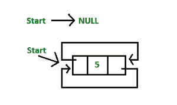
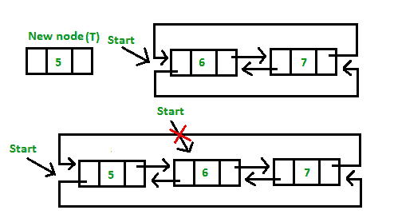

# 双向循环链表 | 系列 1（简介和插入）

> 原文：[https://www.geeksforgeeks.org/doubly-circular-linked-list-set-1-introduction-and-insertion/](https://www.geeksforgeeks.org/doubly-circular-linked-list-set-1-introduction-and-insertion/)

先决条件：[双链表，](http://quiz.geeksforgeeks.org/doubly-linked-list/) [循环链表](https://www.geeksforgeeks.org/circular-singly-linked-list-insertion/)

循环双重链表具有双重链表和循环链表的属性，其中两个连续元素通过上一个指针和下一个指针链接或连接，最后一个节点通过下一个指针指向第一个节点，并且第一个节点通过下一个指针指向最后一个节点 前一个指针。

以下是 C/C++ 中的循环双向链表节点的表示形式：

```
// Structure of the node 
struct node
{
    int data;
    struct node *next; // Pointer to next node
    struct node *prev; // Pointer to previous node
};

```


**插入循环双链表**

1.  **在列表末尾或空列表中插入**：

    *   **空列表（`start = NULL`）**：插入了一个节点（例如`N`），数据为 5，因此`N`的前一个指针指向`N`，`N`的下一个指针也指向`N`。但是现在`start`指针指向列表`N`的第一个节点。

        

    *   **列表最初包含一些节点，起点指向列表的第一个节点**：插入一个节点（例如`M`），数据为 7，因此`M`的前一个指针指向最后一个节点，`M`的下一个指针指向第一个节点，最后一个节点的下一个指针指向这个`M`节点，第一个节点的前一个指针指向这个`M`节点。

        

        ```

        // Function to insert at the end 
        void insertEnd(struct Node** start, int value) 
        { 
            // If the list is empty, create a single node 
            // circular and doubly list 
            if (*start == NULL) 
            { 
                struct Node* new_node = new Node; 
                new_node->data = value; 
                new_node->next = new_node->prev = new_node; 
                *start = new_node; 
                return; 
            } 

            // If list is not empty 

            /* Find last node */
            Node *last = (*start)->prev; 

            // Create Node dynamically 
            struct Node* new_node = new Node; 
            new_node->data = value; 

            // Start is going to be next of new_node 
            new_node->next = *start; 

            // Make new node previous of start 
            (*start)->prev = new_node; 

            // Make last preivous of new node 
            new_node->prev = last; 

            // Make new node next of old last 
            last->next = new_node; 
        } 

        ```

2.  **插入列表的开头**：要在列表的开头插入节点，请创建一个节点（例如`T`），其数据为 5，`T`的下一个指针指向列表的第一个节点，`T`的上一个指针指向列表的最后一个节点，最后一个节点的下一个指针指向这个`T`节点，第一个节点的前一个指针也指向该`T`节点，最后不要忘记将`start`指针移到该`T`节点。

    

    ```

    // Function to insert Node at the beginning 
    // of the List, 
    void insertBegin(struct Node** start, int value) 
    { 
        // Pointer points to last Node 
        struct Node *last = (*start)->prev; 

        struct Node* new_node = new Node; 
        new_node->data = value;   // Inserting the data 

        // setting up previous and next of new node 
        new_node->next = *start; 
        new_node->prev = last; 

        // Update next and previous pointers of start 
        // and last. 
        last->next = (*start)->prev = new_node; 

        // Update start pointer 
        *start = new_node; 
    } 

    ```

3.  **在列表的节点之间插入**：要在列表之间插入节点，需要两个数据值，一个是要插入的新节点之前的节点，另一个是新节点的数据。

    

    ```

    // Function to insert node with value as value1\. 
    // The new node is inserted after the node with 
    // with value2 
    void insertAfter(struct Node** start, int value1, 
                                          int value2) 
    { 
        struct Node* new_node = new Node; 
        new_node->data = value1; // Inserting the data 

        // Find node having value2 and next node of it 
        struct Node *temp = *start; 
        while (temp->data != value2) 
            temp = temp->next; 
        struct Node *next = temp->next; 

        // insert new_node between temp and next. 
        temp->next = new_node; 
        new_node->prev = temp; 
        new_node->next = next; 
        next->prev = new_node; 
    } 

    ```

以下是一个完整的程序，该程序使用上述所有方法来创建循环双向链表。

## C++

```cpp

// C++ program to illustrate inserting a Node in 
// a Cicular Doubly Linked list in begging, end 
// and middle 
#include <bits/stdc++.h> 
using namespace std; 

// Structure of a Node 
struct Node 
{ 
    int data; 
    struct Node *next; 
    struct Node *prev; 
}; 

// Function to insert at the end 
void insertEnd(struct Node** start, int value) 
{ 
    // If the list is empty, create a single node 
    // circular and doubly list 
    if (*start == NULL) 
    { 
        struct Node* new_node = new Node; 
        new_node->data = value; 
        new_node->next = new_node->prev = new_node; 
        *start = new_node; 
        return; 
    } 

    // If list is not empty 

    /* Find last node */
    Node *last = (*start)->prev; 

    // Create Node dynamically 
    struct Node* new_node = new Node; 
    new_node->data = value; 

    // Start is going to be next of new_node 
    new_node->next = *start; 

    // Make new node previous of start 
    (*start)->prev = new_node; 

    // Make last preivous of new node 
    new_node->prev = last; 

    // Make new node next of old last 
    last->next = new_node; 
} 

// Function to insert Node at the beginning 
// of the List, 
void insertBegin(struct Node** start, int value) 
{ 
    // Pointer points to last Node 
    struct Node *last = (*start)->prev; 

    struct Node* new_node = new Node; 
    new_node->data = value;   // Inserting the data 

    // setting up previous and next of new node 
    new_node->next = *start; 
    new_node->prev = last; 

    // Update next and previous pointers of start 
    // and last. 
    last->next = (*start)->prev = new_node; 

    // Update start pointer 
    *start = new_node; 
} 

// Function to insert node with value as value1\. 
// The new node is inserted after the node with 
// with value2 
void insertAfter(struct Node** start, int value1, 
                                      int value2) 
{ 
    struct Node* new_node = new Node; 
    new_node->data = value1; // Inserting the data 

    // Find node having value2 and next node of it 
    struct Node *temp = *start; 
    while (temp->data != value2) 
        temp = temp->next; 
    struct Node *next = temp->next; 

    // insert new_node between temp and next. 
    temp->next = new_node; 
    new_node->prev = temp; 
    new_node->next = next; 
    next->prev = new_node; 
} 

void display(struct Node* start) 
{ 
    struct Node *temp = start; 

    printf("\nTraversal in forward direction \n"); 
    while (temp->next != start) 
    { 
        printf("%d ", temp->data); 
        temp = temp->next; 
    } 
    printf("%d ", temp->data); 

    printf("\nTraversal in reverse direction \n"); 
    Node *last = start->prev; 
    temp = last; 
    while (temp->prev != last) 
    { 
        printf("%d ", temp->data); 
        temp = temp->prev; 
    } 
    printf("%d ", temp->data); 
} 

/* Driver program to test above functions*/
int main() 
{ 
    /* Start with the empty list */
    struct Node* start = NULL; 

    // Insert 5\. So linked list becomes 5->NULL 
    insertEnd(&start, 5); 

    // Insert 4 at the beginning. So linked  
    // list becomes 4->5 
    insertBegin(&start, 4); 

    // Insert 7 at the end. So linked list 
    // becomes 4->5->7 
    insertEnd(&start, 7); 

    // Insert 8 at the end. So linked list  
    // becomes 4->5->7->8 
    insertEnd(&start, 8); 

    // Insert 6, after 5\. So linked list  
    // becomes 4->5->6->7->8 
    insertAfter(&start, 6, 5); 

    printf("Created circular doubly linked list is: "); 
    display(start); 

    return 0; 
} 

```

## Java

```java

// Java program to illustrate inserting a Node in  
// a Cicular Doubly Linked list in begging, end  
// and middle  
import java.util.*; 

class GFG 
{  

static Node start; 

// Structure of a Node  
static class Node  
{  
    int data;  
    Node next;  
    Node prev;  
};  

// Function to insert at the end  
static void insertEnd(int value)  
{  
    // If the list is empty, create a single node  
    // circular and doubly list  
    if (start == null)  
    {  
        Node new_node = new Node();  
        new_node.data = value;  
        new_node.next = new_node.prev = new_node;  
        start = new_node;  
        return;  
    }  

    // If list is not empty  

    /* Find last node */
    Node last = (start).prev;  

    // Create Node dynamically  
    Node new_node = new Node();  
    new_node.data = value;  

    // Start is going to be next of new_node  
    new_node.next = start;  

    // Make new node previous of start  
    (start).prev = new_node;  

    // Make last preivous of new node  
    new_node.prev = last;  

    // Make new node next of old last  
    last.next = new_node;  
}  

// Function to insert Node at the beginning  
// of the List,  
static void insertBegin(int value)  
{  
    // Pointer points to last Node  
    Node last = (start).prev;  

    Node new_node = new Node();  
    new_node.data = value; // Inserting the data  

    // setting up previous and next of new node  
    new_node.next = start;  
    new_node.prev = last;  

    // Update next and previous pointers of start  
    // and last.  
    last.next = (start).prev = new_node;  

    // Update start pointer  
    start = new_node;  
}  

// Function to insert node with value as value1.  
// The new node is inserted after the node with  
// with value2  
static void insertAfter(int value1,  
                                    int value2)  
{  
    Node new_node = new Node();  
    new_node.data = value1; // Inserting the data  

    // Find node having value2 and next node of it  
    Node temp = start;  
    while (temp.data != value2)  
        temp = temp.next;  
    Node next = temp.next;  

    // insert new_node between temp and next.  
    temp.next = new_node;  
    new_node.prev = temp;  
    new_node.next = next;  
    next.prev = new_node;  
}  

static void display()  
{  
    Node temp = start;  

    System.out.printf("\nTraversal in forward direction \n");  
    while (temp.next != start)  
    {  
        System.out.printf("%d ", temp.data);  
        temp = temp.next;  
    }  
    System.out.printf("%d ", temp.data);  

    System.out.printf("\nTraversal in reverse direction \n");  
    Node last = start.prev;  
    temp = last;  
    while (temp.prev != last)  
    {  
        System.out.printf("%d ", temp.data);  
        temp = temp.prev;  
    }  
    System.out.printf("%d ", temp.data);  
}  

/* Driver code*/
public static void main(String[] args)  
{  
    /* Start with the empty list */
    Node start = null;  

    // Insert 5\. So linked list becomes 5.null  
    insertEnd(5);  

    // Insert 4 at the beginning. So linked  
    // list becomes 4.5  
    insertBegin(4);  

    // Insert 7 at the end. So linked list  
    // becomes 4.5.7  
    insertEnd(7);  

    // Insert 8 at the end. So linked list  
    // becomes 4.5.7.8  
    insertEnd(8);  

    // Insert 6, after 5\. So linked list  
    // becomes 4.5.6.7.8  
    insertAfter(6, 5);  

    System.out.printf("Created circular doubly linked list is: ");  
    display();  
}  
}  

// This code is contributed by Rajput-Ji 

```

## Python3

```py

# Python3 program to illustrate inserting  
# a Node in a Cicular Doubly Linked list  
# in begging, end and middle  
start = None

# Structure of a Node  
class Node:  
    def __init__(self, data):  
        self.data = data  
        self.next = None
        self.prev = None

# Function to insert at the end  
def insertEnd(value) : 
    global start 

    # If the list is empty, create a  
    # single node circular and doubly list  
    if (start == None) : 

        new_node = Node(0)  
        new_node.data = value  
        new_node.next = new_node.prev = new_node  
        start = new_node  
        return

    # If list is not empty  

    # Find last node */ 
    last = (start).prev  

    # Create Node dynamically  
    new_node = Node(0)  
    new_node.data = value  

    # Start is going to be next of new_node  
    new_node.next = start  

    # Make new node previous of start  
    (start).prev = new_node  

    # Make last preivous of new node  
    new_node.prev = last  

    # Make new node next of old last  
    last.next = new_node  

# Function to insert Node at the beginning  
# of the List,  
def insertBegin( value) : 
    global start 

    # Pointer points to last Node  
    last = (start).prev  

    new_node = Node(0)  
    new_node.data = value # Inserting the data  

    # setting up previous and  
    # next of new node  
    new_node.next = start  
    new_node.prev = last  

    # Update next and previous pointers  
    # of start and last.  
    last.next = (start).prev = new_node  

    # Update start pointer  
    start = new_node  

# Function to insert node with value as value1.  
# The new node is inserted after the node with  
# with value2  
def insertAfter(value1, value2) : 
    global start 
    new_node = Node(0)  
    new_node.data = value1 # Inserting the data  

    # Find node having value2 and  
    # next node of it  
    temp = start  
    while (temp.data != value2) : 
        temp = temp.next
    next = temp.next

    # insert new_node between temp and next.  
    temp.next = new_node  
    new_node.prev = temp  
    new_node.next = next
    next.prev = new_node  

def display() : 
    global start 
    temp = start  

    print ("Traversal in forward direction:") 
    while (temp.next != start) : 

        print (temp.data, end = " ") 
        temp = temp.next

    print (temp.data) 

    print ("Traversal in reverse direction:")  
    last = start.prev  
    temp = last  
    while (temp.prev != last) : 

        print (temp.data, end = " ")  
        temp = temp.prev  

    print (temp.data) 

# Driver Code  
if __name__ == '__main__':  
    global start 

    # Start with the empty list  
    start = None

    # Insert 5\. So linked list becomes 5.None  
    insertEnd(5)  

    # Insert 4 at the beginning. So linked  
    # list becomes 4.5  
    insertBegin(4)  

    # Insert 7 at the end. So linked list  
    # becomes 4.5.7  
    insertEnd(7)  

    # Insert 8 at the end. So linked list  
    # becomes 4.5.7.8  
    insertEnd(8)  

    # Insert 6, after 5\. So linked list  
    # becomes 4.5.6.7.8  
    insertAfter(6, 5)  

    print ("Created circular doubly linked list is: ")  
    display()  

# This code is contributed by Arnab kundu 

```

## C#

```cs

// C# program to illustrate inserting a Node in  
// a Cicular Doubly Linked list in begging, end  
// and middle  
using System; 
using System.Collections.Generic; 

class GFG 
{  
static Node start; 

// Structure of a Node  
public class Node  
{  
    public int data;  
    public Node next;  
    public Node prev;  
};  

// Function to insert at the end  
static void insertEnd(int value)  
{  
    Node new_node; 

    // If the list is empty, create a single node  
    // circular and doubly list  
    if (start == null)  
    {  
        new_node = new Node();  
        new_node.data = value;  
        new_node.next = new_node.prev = new_node;  
        start = new_node;  
        return;  
    }  

    // If list is not empty  

    /* Find last node */
    Node last = (start).prev;  

    // Create Node dynamically  
    new_node = new Node();  
    new_node.data = value;  

    // Start is going to be next of new_node  
    new_node.next = start;  

    // Make new node previous of start  
    (start).prev = new_node;  

    // Make last preivous of new node  
    new_node.prev = last;  

    // Make new node next of old last  
    last.next = new_node;  
}  

// Function to insert Node at the beginning  
// of the List,  
static void insertBegin(int value)  
{  
    // Pointer points to last Node  
    Node last = (start).prev;  

    Node new_node = new Node();  
    new_node.data = value; // Inserting the data  

    // setting up previous and next of new node  
    new_node.next = start;  
    new_node.prev = last;  

    // Update next and previous pointers of start  
    // and last.  
    last.next = (start).prev = new_node;  

    // Update start pointer  
    start = new_node;  
}  

// Function to insert node with value as value1.  
// The new node is inserted after the node with  
// with value2  
static void insertAfter(int value1, int value2)  
{  
    Node new_node = new Node();  
    new_node.data = value1; // Inserting the data  

    // Find node having value2 and next node of it  
    Node temp = start;  
    while (temp.data != value2)  
        temp = temp.next;  
    Node next = temp.next;  

    // insert new_node between temp and next.  
    temp.next = new_node;  
    new_node.prev = temp;  
    new_node.next = next;  
    next.prev = new_node;  
}  

static void display()  
{  
    Node temp = start;  

    Console.Write("\nTraversal in forward direction \n");  
    while (temp.next != start)  
    {  
        Console.Write("{0} ", temp.data);  
        temp = temp.next;  
    }  
    Console.Write("{0} ", temp.data);  

    Console.Write("\nTraversal in reverse direction \n");  
    Node last = start.prev;  
    temp = last;  
    while (temp.prev != last)  
    {  
        Console.Write("{0} ", temp.data);  
        temp = temp.prev;  
    }  
    Console.Write("{0} ", temp.data);  
}  

/* Driver code*/
public static void Main(String[] args)  
{  
    /* Start with the empty list */
    Node start = null;  

    // Insert 5\. So linked list becomes 5.null  
    insertEnd(5);  

    // Insert 4 at the beginning. So linked  
    // list becomes 4.5  
    insertBegin(4);  

    // Insert 7 at the end. So linked list  
    // becomes 4.5.7  
    insertEnd(7);  

    // Insert 8 at the end. So linked list  
    // becomes 4.5.7.8  
    insertEnd(8);  

    // Insert 6, after 5\. So linked list  
    // becomes 4.5.6.7.8  
    insertAfter(6, 5);  

    Console.Write("Created circular doubly linked list is: ");  
    display();  
}  
}  

// This code is contributed by Rajput-Ji 

```

**输出**：

```
Created circular doubly linked list is: 
Traversal in forward direction 
4 5 6 7 8 
Traversal in reverse direction 
8 7 6 5 4 

```

以下是循环双链表的优缺点：

**优点**：

*   列表可以从两个方向遍历，即从头到尾或从​​尾到头。

*   从头到尾或从​​尾到头的跳跃是在恒定时间`O(1)`中完成的。

*   循环双链表用于实现高级数据结构，例如[斐波那契堆](https://en.wikipedia.org/wiki/Fibonacci_heap)。

**劣势**

*   每个节点需要一点额外的内存来容纳先前的指针。

*   在列表上实现或执行操作时涉及很多指针。 因此，应该小心处理指针，否则列表的数据可能会丢失。

**循环双链表**的应用

*   在媒体播放器应用程序中管理歌曲播放列表。

*   在线购物中管理购物车。

本文由 **Akash Gupta** 提供。 如果您喜欢 GeeksforGeeks 并希望做出贡献，则还可以使用 [tribution.geeksforgeeks.org](http://www.contribute.geeksforgeeks.org) 撰写文章，或将您的文章邮寄至 tribution@geeksforgeeks.org。 查看您的文章出现在 GeeksforGeeks 主页上，并帮助其他 Geeks。

如果发现任何不正确的地方，或者您想分享有关上述主题的更多信息，请发表评论。

