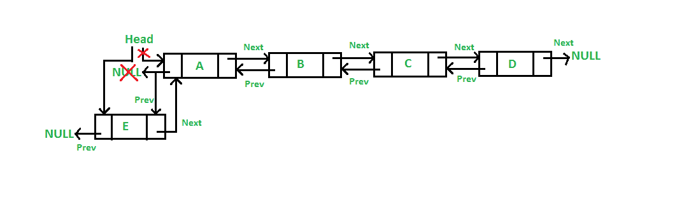
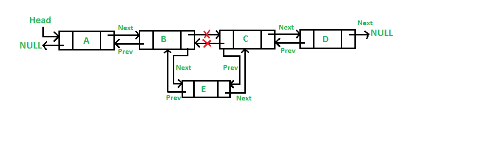

# 双链表| 第 1 组（简介和插入）

我们强烈建议将以下帖子作为该帖子的先决条件。

[链接列表简介](http://quiz.geeksforgeeks.org/linked-list-set-1-introduction/)

[在单链接列表](http://quiz.geeksforgeeks.org/linked-list-set-2-inserting-a-node/)中插入节点

**D** 整体 **L** 着墨 **L** ist（DLL）包含一个额外的指针，通常称为*前一个指针*，以及下一个指针和数据 在单链列表中。

[](https://media.geeksforgeeks.org/wp-content/cdn-uploads/gq/2014/03/DLL1.png)

以下是 C 语言中 DLL 节点的表示。

## C

```c

/* Node of a doubly linked list */
struct Node { 
    int data; 
    struct Node* next; // Pointer to next node in DLL 
    struct Node* prev; // Pointer to previous node in DLL 
};

```

## Java

```java

// Class for Doubly Linked List 
public class DLL { 
    Node head; // head of list 

    /* Doubly Linked list Node*/
    class Node { 
        int data; 
        Node prev; 
        Node next; 

        // Constructor to create a new node 
        // next and prev is by default initialized as null 
        Node(int d) { data = d; } 
    } 
} 

```

## Python3

```py

# Node of a doubly linked list  
class Node: 
    def __init__(self, next=None, prev=None, data=None): 
        self.next = next # reference to next node in DLL 
        self.prev = prev # reference to previous node in DLL 
        self.data = data 

```

以下是双链表相对于单链表的优点/缺点。

**比单链列表的优势**

**1）** DLL 可以向前和向后移动。

**2）**如果给出了指向要删除节点的指针，则 DLL 中的删除操作效率更高。

**3）**我们可以在给定节点之前快速插入新节点。

在单链列表中，要删除节点，需要指向上一个节点的指针。 为了获得该先前节点，有时会遍历列表。 在 DLL 中，我们可以使用先前的指针获取先前的节点。

**比单链表**

**1）**的缺点 DLL 的每个节点都需要额外的空间才能存储先前的指针。 尽管可以用单个指针来实现 DLL（请参阅[和](https://www.geeksforgeeks.org/xor-linked-list-a-memory-efficient-doubly-linked-list-set-1/)[）。

**2）**所有操作都需要事先维护一个额外的指针。 例如，在插入时，我们需要同时修改前一个指针和下一个指针。 例如，在以下用于在不同位置插入的函数中，我们需要 1 或 2 个额外的步骤来设置上一个指针。](https://www.geeksforgeeks.org/xor-linked-list-a-memory-efficient-doubly-linked-list-set-2/)

**插入**

可以通过四种方式添加节点

**1）**在 DLL 的前面

**2）**在给定节点之后 。

**3）**在 DLL 的末尾

**4）**在给定节点之前。

**1）在前面添加一个节点：（一个 5 个步骤的过程）**

新节点总是添加在给定链接列表的开头之前。 新添加的节点成为 DLL 的新负责人。 例如，如果给定的链接列表为 10152025，并且我们在前面添加了项 5，则链接列表将变为 510152025。让我们将添加到列表前面的函数称为 push（）。 push（）必须接收一个指向 head 指针的指针，因为 push 必须将 head 指针更改为指向新节点（请参见[此](https://www.geeksforgeeks.org/how-to-write-functions-that-modify-the-head-pointer-of-a-linked-list/)）

[](https://media.geeksforgeeks.org/wp-content/cdn-uploads/gq/2014/03/DLL_add_front1.png)

以下是在最前面添加节点的 5 个步骤。

## C

```c

/* Given a reference (pointer to pointer) to the head of a list 
   and an int, inserts a new node on the front of the list. */
void push(struct Node** head_ref, int new_data) 
{ 
    /* 1\. allocate node */
    struct Node* new_node = (struct Node*)malloc(sizeof(struct Node)); 

    /* 2\. put in the data  */
    new_node->data = new_data; 

    /* 3\. Make next of new node as head and previous as NULL */
    new_node->next = (*head_ref); 
    new_node->prev = NULL; 

    /* 4\. change prev of head node to new node */
    if ((*head_ref) != NULL) 
        (*head_ref)->prev = new_node; 

    /* 5\. move the head to point to the new node */
    (*head_ref) = new_node; 
}

```

## Java

```java

// Adding a node at the front of the list 
public void push(int new_data) 
{ 
    /* 1\. allocate node  
    * 2\. put in the data */
    Node new_Node = new Node(new_data); 

    /* 3\. Make next of new node as head and previous as NULL */
    new_Node.next = head; 
    new_Node.prev = null; 

    /* 4\. change prev of head node to new node */
    if (head != null) 
        head.prev = new_Node; 

    /* 5\. move the head to point to the new node */
    head = new_Node; 
} 

```

## Python3

```py

# Adding a node at the front of the list 
def push(self, new_data): 

    # 1 & 2: Allocate the Node & Put in the data 
    new_node = Node(data = new_data) 

    # 3\. Make next of new node as head and previous as NULL 
    new_node.next = self.head 
    new_node.prev = None

    # 4\. change prev of head node to new node  
    if self.head is not None: 
        self.head.prev = new_node 

    # 5\. move the head to point to the new node 
    self.head = new_node  

# This code is contributed by jatinreaper 

```

上述五个步骤中的四个步骤与[相同，用于在单链表](http://quiz.geeksforgeeks.org/linked-list-set-2-inserting-a-node/)中的最前面插入的四个步骤。 唯一的额外步骤是更改先头。

**2）在给定节点之后添加一个节点：（一个 7 个步骤的过程）**

我们获得了一个指向节点的指针作为 prev_node，并且在该给定节点之后插入了新节点。

[](https://media.geeksforgeeks.org/wp-content/cdn-uploads/gq/2014/03/DLL_add_middle1.png)

## C

```c

/* Given a node as prev_node, insert a new node after the given node */
void insertAfter(struct Node* prev_node, int new_data) 
{ 
    /*1\. check if the given prev_node is NULL */
    if (prev_node == NULL) { 
        printf("the given previous node cannot be NULL"); 
        return; 
    } 

    /* 2\. allocate new node */
    struct Node* new_node = (struct Node*)malloc(sizeof(struct Node)); 

    /* 3\. put in the data  */
    new_node->data = new_data; 

    /* 4\. Make next of new node as next of prev_node */
    new_node->next = prev_node->next; 

    /* 5\. Make the next of prev_node as new_node */
    prev_node->next = new_node; 

    /* 6\. Make prev_node as previous of new_node */
    new_node->prev = prev_node; 

    /* 7\. Change previous of new_node's next node */
    if (new_node->next != NULL) 
        new_node->next->prev = new_node; 
} 

```

## Java

```java

/* Given a node as prev_node, insert a new node after the given node */
public void InsertAfter(Node prev_Node, int new_data) 
{ 

    /*1\. check if the given prev_node is NULL */
    if (prev_Node == null) { 
        System.out.println("The given previous node cannot be NULL "); 
        return; 
    } 

    /* 2\. allocate node  
    * 3\. put in the data */
    Node new_node = new Node(new_data); 

    /* 4\. Make next of new node as next of prev_node */
    new_node.next = prev_Node.next; 

    /* 5\. Make the next of prev_node as new_node */
    prev_Node.next = new_node; 

    /* 6\. Make prev_node as previous of new_node */
    new_node.prev = prev_Node; 

    /* 7\. Change previous of new_node's next node */
    if (new_node.next != null) 
        new_node.next.prev = new_node; 
} 

```

## Python3

```py

# Given a node as prev_node, insert 
# a new node after the given node 

def insertAfter(self, prev_node, new_data): 

        # 1\. check if the given prev_node is NULL 
        if prev_node is None: 
            print("This node doesn't exist in DLL") 
            return

        #2\. allocate node  & 3\. put in the data 
        new_node = Node(data = new_data) 

        # 4\. Make next of new node as next of prev_node 
        new_node.next = prev_node.next

        # 5\. Make the next of prev_node as new_node  
        prev_node.next = new_node 

        # 6\. Make prev_node as previous of new_node 
        new_node.prev = prev_node 

        # 7\. Change previous of new_node's next node */ 
        if new_node.next is not None: 
            new_node.next.prev = new_node 

#  This code is contributed by jatinreaper 

```

以上步骤中的五个步骤与[相同，用于在单链表](http://quiz.geeksforgeeks.org/linked-list-set-2-inserting-a-node/)中的给定节点之后插入的 5 个步骤。 需要两个额外的步骤来更改新节点的上一个指针和新节点的下一个节点的上一个指针。

**3）在最后添加一个节点：（7 个步骤的过程）**

新节点总是添加在给定链接列表的最后一个节点之后。 例如，如果给定的 DLL 是 510152025，而我们在末尾添加了第 30 个项目，则 DLL 变为 51015202530。

由于链接列表通常由其开头表示，因此我们必须遍历该列表直到结尾，然后 将最后一个节点的下一个更改为新节点。

[](https://media.geeksforgeeks.org/wp-content/cdn-uploads/gq/2014/03/DLL_add_end1.png)

以下是最后添加节点的 7 个步骤。

## C

```c

/* Given a reference (pointer to pointer) to the head 
   of a DLL and an int, appends a new node at the end  */
void append(struct Node** head_ref, int new_data) 
{ 
    /* 1\. allocate node */
    struct Node* new_node = (struct Node*)malloc(sizeof(struct Node)); 

    struct Node* last = *head_ref; /* used in step 5*/

    /* 2\. put in the data  */
    new_node->data = new_data; 

    /* 3\. This new node is going to be the last node, so 
          make next of it as NULL*/
    new_node->next = NULL; 

    /* 4\. If the Linked List is empty, then make the new 
          node as head */
    if (*head_ref == NULL) { 
        new_node->prev = NULL; 
        *head_ref = new_node; 
        return; 
    } 

    /* 5\. Else traverse till the last node */
    while (last->next != NULL) 
        last = last->next; 

    /* 6\. Change the next of last node */
    last->next = new_node; 

    /* 7\. Make last node as previous of new node */
    new_node->prev = last; 

    return; 
} 

```

## Java

```java

// Add a node at the end of the list 
void append(int new_data) 
{ 
    /* 1\. allocate node  
     * 2\. put in the data */
    Node new_node = new Node(new_data); 

    Node last = head; /* used in step 5*/

    /* 3\. This new node is going to be the last node, so 
     * make next of it as NULL*/
    new_node.next = null; 

    /* 4\. If the Linked List is empty, then make the new 
     * node as head */
    if (head == null) { 
        new_node.prev = null; 
        head = new_node; 
        return; 
    } 

    /* 5\. Else traverse till the last node */
    while (last.next != null) 
        last = last.next; 

    /* 6\. Change the next of last node */
    last.next = new_node; 

    /* 7\. Make last node as previous of new node */
    new_node.prev = last; 
} 

```

## Python3

```py

# Add a node at the end of the DLL 
def append(self, new_data): 

        # 1\. allocate node 2\. put in the data 
        new_node = Node(data = new_data) 
        last = self.head 

        # 3\. This new node is going to be the  
        # last node, so make next of it as NULL 
        new_node.next = None

        # 4\. If the Linked List is empty, then 
        #  make the new node as head 
        if self.head is None: 
            new_node.prev = None
            self.head = new_node 
            return

        # 5\. Else traverse till the last node  
        while (last.next is not None): 
            last = last.next

        # 6\. Change the next of last node  
        last.next = new_node 
        # 7\. Make last node as previous of new node */ 
        new_node.prev = last 

#  This code is contributed by jatinreaper 

```

上述 7 个步骤中的 6 个与[相同，用于在单链表](http://quiz.geeksforgeeks.org/linked-list-set-2-inserting-a-node/)中的给定节点之后插入的 6 个步骤。 需要一个额外的步骤来更改新节点的先前指针。

**4）在给定节点之前添加一个节点**：

**步骤**

让指向此给定节点的指针为 next_node，并将要添加的新节点的数据作为 new_data。

1.  检查 next_node 是否为 NULL。 如果为 NULL，则从函数返回，因为在 NULL 之前不能添加任何新节点

2.  为新节点分配内存，将其称为 new_node

3.  设置 new_node-> data = new_data

4.  将此 new_node 的前一个指针设置为 next_node 的前一个节点，new_node-> prev = next_node-> prev

5.  将 next_node 的前一个指针设置为 new_node，next_node-> prev = new_node

6.  将此 new_node 的下一个指针设置为 next_node，new_node-> next = next_node;

7.  如果 new_node 的前一个节点不为 NULL，则将此前一个节点的下一个指针设置为 new_node，new_node-> prev-> next = new_node

8.  否则，如果 new_node 的 prev 为 NULL，它将是新的头节点。 因此，使（* head_ref）= new_node。


以下是上述方法的实现：

## C / C++

```cpp

// A complete working C program to demonstrate all  
// insertion before a given node  
#include <stdio.h>  
#include <stdlib.h>  

// A linked list node  
struct Node {  
    int data;  
    struct Node* next;  
    struct Node* prev;  
};  

/* Given a reference (pointer to pointer) to the head of a list  
and an int, inserts a new node on the front of the list. */
void push(struct Node** head_ref, int new_data)  
{  
    struct Node* new_node = (struct Node*)malloc(sizeof(struct Node));  

    new_node->data = new_data;  

    new_node->next = (*head_ref);  
    new_node->prev = NULL;  

    if ((*head_ref) != NULL)  
        (*head_ref)->prev = new_node;  

    (*head_ref) = new_node;  
}  

/* Given a node as next_node, insert a new node before the given node */
void insertBefore(struct Node** head_ref, struct Node* next_node, int new_data)  
{  
    /*1\. check if the given next_node is NULL */
    if (next_node == NULL) {  
        printf("the given next node cannot be NULL");  
        return;  
    }  

    /* 2\. allocate new node */
    struct Node* new_node = (struct Node*)malloc(sizeof(struct Node));  

    /* 3\. put in the data */
    new_node->data = new_data;  

    /* 4\. Make prev of new node as prev of next_node */
    new_node->prev = next_node->prev;  

    /* 5\. Make the prev of next_node as new_node */
    next_node->prev = new_node;  

    /* 6\. Make next_node as next of new_node */
    new_node->next = next_node;  

    /* 7\. Change next of new_node's previous node */
    if (new_node->prev != NULL)  
        new_node->prev->next = new_node;  
    /* 8\. If the prev of new_node is NULL, it will be 
       the new head node */
    else
        (*head_ref) = new_node; 

}  

// This function prints contents of linked list starting from the given node  
void printList(struct Node* node)  
{  
    struct Node* last;  
    printf("\nTraversal in forward direction \n");  
    while (node != NULL) {  
        printf(" %d ", node->data);  
        last = node;  
        node = node->next;  
    }  

    printf("\nTraversal in reverse direction \n");  
    while (last != NULL) {  
        printf(" %d ", last->data);  
        last = last->prev;  
    }  
}  

/* Driver program to test above functions*/
int main()  
{  
    /* Start with the empty list */
    struct Node* head = NULL;  
    push(&head, 7);  

    push(&head, 1);  

    push(&head, 4);  

    // Insert 8, before 1\. So linked list becomes 4->8->1->7->NULL  
    insertBefore(&head, head->next, 8);  

    printf("Created DLL is: ");  
    printList(head);  

    getchar();  
    return 0;  
}  

```

Output:

```
Created DLL is: 
Traversal in forward direction 
 4  8  1  7 
Traversal in reverse direction 
 7  1  8  4 

```

**测试上述功能的完整工作程序。**

以下是测试上述功能的完整程序。

## C++

```cpp

// A complete working C++ program to  
// demonstrate all insertion methods  
#include <bits/stdc++.h> 
using namespace std; 

// A linked list node  
class Node  
{  
    public: 
    int data;  
    Node* next;  
    Node* prev;  
};  

/* Given a reference (pointer to pointer) to the head of a list  
and an int, inserts a new node on the front of the list. */
void push(Node** head_ref, int new_data)  
{  
    /* 1\. allocate node */
    Node* new_node = new Node();  

    /* 2\. put in the data */
    new_node->data = new_data;  

    /* 3\. Make next of new node as head and previous as NULL */
    new_node->next = (*head_ref);  
    new_node->prev = NULL;  

    /* 4\. change prev of head node to new node */
    if ((*head_ref) != NULL)  
        (*head_ref)->prev = new_node;  

    /* 5\. move the head to point to the new node */
    (*head_ref) = new_node;  
}  

/* Given a node as prev_node, insert a new node after the given node */
void insertAfter(Node* prev_node, int new_data)  
{  
    /*1\. check if the given prev_node is NULL */
    if (prev_node == NULL)  
    {  
        cout<<"the given previous node cannot be NULL";  
        return;  
    }  

    /* 2\. allocate new node */
    Node* new_node = new Node(); 

    /* 3\. put in the data */
    new_node->data = new_data;  

    /* 4\. Make next of new node as next of prev_node */
    new_node->next = prev_node->next;  

    /* 5\. Make the next of prev_node as new_node */
    prev_node->next = new_node;  

    /* 6\. Make prev_node as previous of new_node */
    new_node->prev = prev_node;  

    /* 7\. Change previous of new_node's next node */
    if (new_node->next != NULL)  
        new_node->next->prev = new_node;  
}  

/* Given a reference (pointer to pointer) to the head  
of a DLL and an int, appends a new node at the end */
void append(Node** head_ref, int new_data)  
{  
    /* 1\. allocate node */
    Node* new_node = new Node();  

    Node* last = *head_ref; /* used in step 5*/

    /* 2\. put in the data */
    new_node->data = new_data;  

    /* 3\. This new node is going to be the last node, so  
        make next of it as NULL*/
    new_node->next = NULL;  

    /* 4\. If the Linked List is empty, then make the new  
        node as head */
    if (*head_ref == NULL) 
    {  
        new_node->prev = NULL;  
        *head_ref = new_node;  
        return;  
    }  

    /* 5\. Else traverse till the last node */
    while (last->next != NULL)  
        last = last->next;  

    /* 6\. Change the next of last node */
    last->next = new_node;  

    /* 7\. Make last node as previous of new node */
    new_node->prev = last;  

    return;  
}  

// This function prints contents of  
// linked list starting from the given node  
void printList(Node* node)  
{  
    Node* last;  
    cout<<"\nTraversal in forward direction \n";  
    while (node != NULL)  
    {  
        cout<<" "<<node->data<<" ";  
        last = node;  
        node = node->next;  
    }  

    cout<<"\nTraversal in reverse direction \n";  
    while (last != NULL)  
    {  
        cout<<" "<<last->data<<" ";  
        last = last->prev;  
    }  
}  

/* Driver program to test above functions*/
int main()  
{  
    /* Start with the empty list */
    Node* head = NULL;  

    // Insert 6\. So linked list becomes 6->NULL  
    append(&head, 6);  

    // Insert 7 at the beginning. So  
    // linked list becomes 7->6->NULL  
    push(&head, 7);  

    // Insert 1 at the beginning. So  
    // linked list becomes 1->7->6->NULL  
    push(&head, 1);  

    // Insert 4 at the end. So linked  
    // list becomes 1->7->6->4->NULL  
    append(&head, 4);  

    // Insert 8, after 7\. So linked  
    // list becomes 1->7->8->6->4->NULL  
    insertAfter(head->next, 8);  

    cout << "Created DLL is: ";  
    printList(head);  

    return 0;  
}  

// This is code is contributed by rathbhupendra 

```

## C

```c

// A complete working C program to demonstrate all insertion methods 
#include <stdio.h> 
#include <stdlib.h> 

// A linked list node 
struct Node { 
    int data; 
    struct Node* next; 
    struct Node* prev; 
}; 

/* Given a reference (pointer to pointer) to the head of a list 
   and an int, inserts a new node on the front of the list. */
void push(struct Node** head_ref, int new_data) 
{ 
    /* 1\. allocate node */
    struct Node* new_node = (struct Node*)malloc(sizeof(struct Node)); 

    /* 2\. put in the data  */
    new_node->data = new_data; 

    /* 3\. Make next of new node as head and previous as NULL */
    new_node->next = (*head_ref); 
    new_node->prev = NULL; 

    /* 4\. change prev of head node to new node */
    if ((*head_ref) != NULL) 
        (*head_ref)->prev = new_node; 

    /* 5\. move the head to point to the new node */
    (*head_ref) = new_node; 
} 

/* Given a node as prev_node, insert a new node after the given node */
void insertAfter(struct Node* prev_node, int new_data) 
{ 
    /*1\. check if the given prev_node is NULL */
    if (prev_node == NULL) { 
        printf("the given previous node cannot be NULL"); 
        return; 
    } 

    /* 2\. allocate new node */
    struct Node* new_node = (struct Node*)malloc(sizeof(struct Node)); 

    /* 3\. put in the data  */
    new_node->data = new_data; 

    /* 4\. Make next of new node as next of prev_node */
    new_node->next = prev_node->next; 

    /* 5\. Make the next of prev_node as new_node */
    prev_node->next = new_node; 

    /* 6\. Make prev_node as previous of new_node */
    new_node->prev = prev_node; 

    /* 7\. Change previous of new_node's next node */
    if (new_node->next != NULL) 
        new_node->next->prev = new_node; 
} 

/* Given a reference (pointer to pointer) to the head 
   of a DLL and an int, appends a new node at the end  */
void append(struct Node** head_ref, int new_data) 
{ 
    /* 1\. allocate node */
    struct Node* new_node = (struct Node*)malloc(sizeof(struct Node)); 

    struct Node* last = *head_ref; /* used in step 5*/

    /* 2\. put in the data  */
    new_node->data = new_data; 

    /* 3\. This new node is going to be the last node, so 
          make next of it as NULL*/
    new_node->next = NULL; 

    /* 4\. If the Linked List is empty, then make the new 
          node as head */
    if (*head_ref == NULL) { 
        new_node->prev = NULL; 
        *head_ref = new_node; 
        return; 
    } 

    /* 5\. Else traverse till the last node */
    while (last->next != NULL) 
        last = last->next; 

    /* 6\. Change the next of last node */
    last->next = new_node; 

    /* 7\. Make last node as previous of new node */
    new_node->prev = last; 

    return; 
} 

// This function prints contents of linked list starting from the given node 
void printList(struct Node* node) 
{ 
    struct Node* last; 
    printf("\nTraversal in forward direction \n"); 
    while (node != NULL) { 
        printf(" %d ", node->data); 
        last = node; 
        node = node->next; 
    } 

    printf("\nTraversal in reverse direction \n"); 
    while (last != NULL) { 
        printf(" %d ", last->data); 
        last = last->prev; 
    } 
} 

/* Driver program to test above functions*/
int main() 
{ 
    /* Start with the empty list */
    struct Node* head = NULL; 

    // Insert 6.  So linked list becomes 6->NULL 
    append(&head, 6); 

    // Insert 7 at the beginning. So linked list becomes 7->6->NULL 
    push(&head, 7); 

    // Insert 1 at the beginning. So linked list becomes 1->7->6->NULL 
    push(&head, 1); 

    // Insert 4 at the end. So linked list becomes 1->7->6->4->NULL 
    append(&head, 4); 

    // Insert 8, after 7\. So linked list becomes 1->7->8->6->4->NULL 
    insertAfter(head->next, 8); 

    printf("Created DLL is: "); 
    printList(head); 

    getchar(); 
    return 0; 
} 

```

## Java

```java

// A complete working Java program to demonstrate all 

// Class for Doubly Linked List 
public class DLL { 
    Node head; // head of list 

    /* Doubly Linked list Node*/
    class Node { 
        int data; 
        Node prev; 
        Node next; 

        // Constructor to create a new node 
        // next and prev is by default initialized as null 
        Node(int d) { data = d; } 
    } 

    // Adding a node at the front of the list 
    public void push(int new_data) 
    { 
        /* 1\. allocate node  
        * 2\. put in the data */
        Node new_Node = new Node(new_data); 

        /* 3\. Make next of new node as head and previous as NULL */
        new_Node.next = head; 
        new_Node.prev = null; 

        /* 4\. change prev of head node to new node */
        if (head != null) 
            head.prev = new_Node; 

        /* 5\. move the head to point to the new node */
        head = new_Node; 
    } 

    /* Given a node as prev_node, insert a new node after the given node */
    public void InsertAfter(Node prev_Node, int new_data) 
    { 

        /*1\. check if the given prev_node is NULL */
        if (prev_Node == null) { 
            System.out.println("The given previous node cannot be NULL "); 
            return; 
        } 

        /* 2\. allocate node  
        * 3\. put in the data */
        Node new_node = new Node(new_data); 

        /* 4\. Make next of new node as next of prev_node */
        new_node.next = prev_Node.next; 

        /* 5\. Make the next of prev_node as new_node */
        prev_Node.next = new_node; 

        /* 6\. Make prev_node as previous of new_node */
        new_node.prev = prev_Node; 

        /* 7\. Change previous of new_node's next node */
        if (new_node.next != null) 
            new_node.next.prev = new_node; 
    } 

    // Add a node at the end of the list 
    void append(int new_data) 
    { 
        /* 1\. allocate node  
        * 2\. put in the data */
        Node new_node = new Node(new_data); 

        Node last = head; /* used in step 5*/

        /* 3\. This new node is going to be the last node, so 
        * make next of it as NULL*/
        new_node.next = null; 

        /* 4\. If the Linked List is empty, then make the new 
        * node as head */
        if (head == null) { 
            new_node.prev = null; 
            head = new_node; 
            return; 
        } 

        /* 5\. Else traverse till the last node */
        while (last.next != null) 
            last = last.next; 

        /* 6\. Change the next of last node */
        last.next = new_node; 

        /* 7\. Make last node as previous of new node */
        new_node.prev = last; 
    } 

    // This function prints contents of linked list starting from the given node 
    public void printlist(Node node) 
    { 
        Node last = null; 
        System.out.println("Traversal in forward Direction"); 
        while (node != null) { 
            System.out.print(node.data + " "); 
            last = node; 
            node = node.next; 
        } 
        System.out.println(); 
        System.out.println("Traversal in reverse direction"); 
        while (last != null) { 
            System.out.print(last.data + " "); 
            last = last.prev; 
        } 
    } 

    /* Driver program to test above functions*/
    public static void main(String[] args) 
    { 
        /* Start with the empty list */
        DLL dll = new DLL(); 

        // Insert 6\. So linked list becomes 6->NULL 
        dll.append(6); 

        // Insert 7 at the beginning. So linked list becomes 7->6->NULL 
        dll.push(7); 

        // Insert 1 at the beginning. So linked list becomes 1->7->6->NULL 
        dll.push(1); 

        // Insert 4 at the end. So linked list becomes 1->7->6->4->NULL 
        dll.append(4); 

        // Insert 8, after 7\. So linked list becomes 1->7->8->6->4->NULL 
        dll.InsertAfter(dll.head.next, 8); 

        System.out.println("Created DLL is: "); 
        dll.printlist(dll.head); 
    } 
} 

// This code is contributed by Sumit Ghosh 

```

## 蟒蛇

```

# A complete working Python program to demonstrate all 
# insertion methods 

# A linked list node 
class Node: 

    # Constructor to create a new node 
    def __init__(self, data): 
        self.data = data 
        self.next = None
        self.prev = None

# Class to create a Doubly Linked List 
class DoublyLinkedList: 

    # Constructor for empty Doubly Linked List 
    def __init__(self): 
        self.head = None

    # Given a reference to the head of a list and an 
    # integer, inserts a new node on the front of list 
    def push(self, new_data): 

        # 1\. Allocates node 
        # 2\. Put the data in it 
        new_node = Node(new_data) 

        # 3\. Make next of new node as head and 
        # previous as None (already None) 
        new_node.next = self.head 

        # 4\. change prev of head node to new_node 
        if self.head is not None: 
            self.head.prev = new_node 

        # 5\. move the head to point to the new node 
        self.head = new_node 

    # Given a node as prev_node, insert a new node after 
    # the given node 
    def insertAfter(self, prev_node, new_data): 

        # 1\. Check if the given prev_node is None 
        if prev_node is None: 
            print "the given previous node cannot be NULL"
            return 

        # 2\. allocate new node 
        # 3\. put in the data 
        new_node = Node(new_data) 

        # 4\. Make net of new node as next of prev node 
        new_node.next = prev_node.next

        # 5\. Make prev_node as previous of new_node 
        prev_node.next = new_node 

        # 6\. Make prev_node ass previous of new_node 
        new_node.prev = prev_node 

        # 7\. Change previous of new_nodes's next node 
        if new_node.next is not None: 
            new_node.next.prev = new_node 

    # Given a reference to the head of DLL and integer, 
    # appends a new node at the end 
    def append(self, new_data): 

        # 1\. Allocates node 
        # 2\. Put in the data 
        new_node = Node(new_data) 

        # 3\. This new node is going to be the last node, 
        # so make next of it as None 
        new_node.next = None

        # 4\. If the Linked List is empty, then make the 
        # new node as head 
        if self.head is None: 
            new_node.prev = None
            self.head = new_node 
            return 

        # 5\. Else traverse till the last node 
        last = self.head 
        while(last.next is not None): 
            last = last.next

        # 6\. Change the next of last node 
        last.next = new_node 

        # 7\. Make last node as previous of new node 
        new_node.prev = last 

        return

    # This function prints contents of linked list 
    # starting from the given node 
    def printList(self, node): 

        print "\nTraversal in forward direction"
        while(node is not None): 
            print " % d" %(node.data), 
            last = node 
            node = node.next

        print "\nTraversal in reverse direction"
        while(last is not None): 
            print " % d" %(last.data), 
            last = last.prev 

# Driver program to test above functions 

# Start with empty list 
llist = DoublyLinkedList() 

# Insert 6\. So the list becomes 6->None 
llist.append(6) 

# Insert 7 at the beginning. 
# So linked list becomes 7->6->None 
llist.push(7) 

# Insert 1 at the beginning. 
# So linked list becomes 1->7->6->None 
llist.push(1) 

# Insert 4 at the end. 
# So linked list becomes 1->7->6->4->None 
llist.append(4) 

# Insert 8, after 7\. 
# So linked list becomes 1->7->8->6->4->None 
llist.insertAfter(llist.head.next, 8) 

print "Created DLL is: ", 
llist.printList(llist.head) 

# This code is contributed by Nikhil Kumar Singh(nickzuck_007) 

```

## C#

```cs

// A complete working C# program to demonstrate all 
using System;  

// Class for Doubly Linked List  
public class DLL  
{  
    Node head; // head of list  

    /* Doubly Linked list Node*/
    public class Node  
    {  
        public int data;  
        public Node prev;  
        public Node next;  

        // Constructor to create a new node  
        // next and prev is by default initialized as null  
        public Node(int d)  
        {  
            data = d; 
        }  
    }  

    // Adding a node at the front of the list  
    public void push(int new_data)  
    {  
        /* 1\. allocate node  
        * 2\. put in the data */
        Node new_Node = new Node(new_data);  

        /* 3\. Make next of new node as 
        head and previous as NULL */
        new_Node.next = head;  
        new_Node.prev = null;  

        /* 4\. change prev of head node to new node */
        if (head != null)  
            head.prev = new_Node;  

        /* 5\. move the head to point to the new node */
        head = new_Node;  
    }  

    /* Given a node as prev_node, insert 
    a new node after the given node */
    public void InsertAfter(Node prev_Node, int new_data)  
    {  

        /*1\. check if the given prev_node is NULL */
        if (prev_Node == null) 
        {  
            Console.WriteLine("The given previous node cannot be NULL ");  
            return;  
        }  

        /* 2\. allocate node  
        * 3\. put in the data */
        Node new_node = new Node(new_data);  

        /* 4\. Make next of new node as next of prev_node */
        new_node.next = prev_Node.next;  

        /* 5\. Make the next of prev_node as new_node */
        prev_Node.next = new_node;  

        /* 6\. Make prev_node as previous of new_node */
        new_node.prev = prev_Node;  

        /* 7\. Change previous of new_node's next node */
        if (new_node.next != null)  
            new_node.next.prev = new_node;  
    }  

    // Add a node at the end of the list  
    void append(int new_data)  
    {  
        /* 1\. allocate node  
        * 2\. put in the data */
        Node new_node = new Node(new_data);  

        Node last = head; /* used in step 5*/

        /* 3\. This new node is going  
            to be the last node, so  
        * make next of it as NULL*/
        new_node.next = null;  

        /* 4\. If the Linked List is empty,  
        then make the new * node as head */
        if (head == null)  
        {  
            new_node.prev = null;  
            head = new_node;  
            return;  
        }  

        /* 5\. Else traverse till the last node */
        while (last.next != null)  
            last = last.next;  

        /* 6\. Change the next of last node */
        last.next = new_node;  

        /* 7\. Make last node as previous of new node */
        new_node.prev = last;  
    }  

    // This function prints contents of  
    // linked list starting from the given node  
    public void printlist(Node node)  
    {  
        Node last = null;  
        Console.WriteLine("Traversal in forward Direction");  
        while (node != null) {  
            Console.Write(node.data + " ");  
            last = node;  
            node = node.next;  
        }  
        Console.WriteLine();  
        Console.WriteLine("Traversal in reverse direction");  
        while (last != null) {  
            Console.Write(last.data + " ");  
            last = last.prev;  
        }  
    }  

    /* Driver code*/
    public static void Main(String[] args)  
    {  
        /* Start with the empty list */
        DLL dll = new DLL();  

        // Insert 6\. So linked list becomes 6->NULL  
        dll.append(6);  

        // Insert 7 at the beginning.  
        // So linked list becomes 7->6->NULL  
        dll.push(7);  

        // Insert 1 at the beginning.  
        // So linked list becomes 1->7->6->NULL  
        dll.push(1);  

        // Insert 4 at the end. So linked list 
        // becomes 1->7->6->4->NULL  
        dll.append(4);  

        // Insert 8, after 7\. So linked list  
        // becomes 1->7->8->6->4->NULL  
        dll.InsertAfter(dll.head.next, 8);  

        Console.WriteLine("Created DLL is: ");  
        dll.printlist(dll.head);  
    }  
}  

// This code is contributed by 29AjayKumar 

```

**Output:**

```
 Created DLL is:
Traversal in forward direction
 1  7  8  6  4
Traversal in reverse direction
 4  6  8  7  1
```

另请参阅：[在双链接列表](https://www.geeksforgeeks.org/delete-a-node-in-a-doubly-linked-list/)

中删除节点。如果发现任何错误，或者要共享有关上述主题的更多信息，请发表评论。

