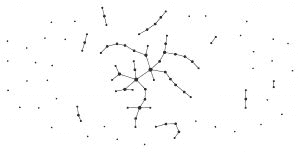
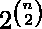
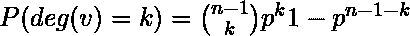
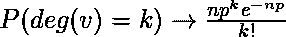
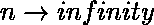
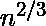
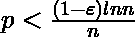

# Erdos Renyl 模型（用于生成随机图）

> 原文： [https://www.geeksforgeeks.org/erdos-renyl-model-generating-random-graphs/](https://www.geeksforgeeks.org/erdos-renyl-model-generating-random-graphs/)

在图论中，Erdos-Rényi 模型是用于生成随机图的两个紧密相关的模型之一。

鄂尔多斯-雷尼（ER）随机图模型有两个密切相关的变体。

在 G（n，M）模型中，从具有 n 个节点和 M 个边的所有图的集合中随机均匀地选择一个图。 例如，在 G（3，2）模型中，三个顶点和两个边上的三个可能图形中的每一个都以 1/3 的概率包含在内。

在 G（n，p）模型中，通过随机连接节点来构造图。 每个边以独立于其他每个边的概率 p 包含在图中。 等效地，所有具有 n 个节点和 M 个边的图具有相同的

概率



由鄂尔多斯和雷尼的二项式模型生成的图（p = 0.01）

该模型中的参数 p 可以看作是一个加权函数。 当 p 从 0 增加到 1 时，模型变得越来越可能包含具有更多边的图，而越来越少地包含具有更少边的图。 特别地，p = 0.5 的情况对应于以相等的概率选择 n 个顶点上的所有图的情况。

本文基本上将讨论 G（n，p）模型，其中 n 是要创建的节点数，p 定义每个节点相互连接的可能性。

**G（n，p）的性质**

使用上述符号，G（n，p）中的图形平均具有边。 任何特定顶点的度分布都是二项式的：



其中 n 是图中顶点的总数。 以来

 as  and np = constant

对于较大的 n 和 np = const，此分布为泊松分布。

在 1960 年的论文中，Erdos 和 Rényi 非常精确地描述了对于 p 的各种值，G（n，p）的行为。 他们的结果包括：

*   如果 np <1，则 G（n，p）中的图几乎可以肯定没有大小大于 O（log（n））的连通分量。*   如果 np = 1，则 G（n，p）中的图几乎肯定会具有最大成分，其大小约为。*   如果 np  c > 1，其中 c 为常数，那么 G（n，p）中的图几乎肯定会具有包含正分数顶点的唯一巨型分量。 没有其他组件包含超过 O（log（n））个顶点。*   如果，则 G（n，p）中的图几乎肯定会包含孤立的顶点，因此将断开连接。*   如果，那么几乎可以肯定地连接 G（n，p）中的图。

因此，是 G（n，p）的连通性的严格阈值。

随着 n 趋于无穷大，可以几乎精确地描述图的其他属性。 例如，存在 ak（n）（大约等于 2log2（n）），使得 G（n，0.5）中的最大派系几乎可以确定为 k（n）或 k（n）+1。

因此，即使在图中找到最大团的大小是 NP 完全的，但“典型”图中最大团的大小（根据此模型）还是非常容易理解的。 有趣的是，Erdos-Renyi 图的边对偶图是具有几乎相同的度数分布，但具有度数相关性和明显更高的聚类系数的图。

接下来，我将描述用于制作 ER 图的代码。 要实施以下代码，您还需要安装 netwrokx 库，还需要安装 matplotlib 库。 接下来，您将看到图的确切代码，该代码最近已作为 networkx 库的功能使用。

**Erdos_renyi_graph（n，p，seed = None，directed = False）**

返回 G（n，p）随机图，也称为 Erd？s-Rényi 图或二项式图。

G（n，p）模型以概率 p 选择每个可能的边。

函数 binomial_graph（）和 erdos_renyi_graph（）是此函数的别名。

*参数：n（int）-节点数。

p（浮点数）–边创建的概率。

种子（int，可选）–随机数生成器的种子（默认=无）。

有向（布尔型，可选（默认= False））–如果为 True，则此函数返回有向图。*

```

#importing the networkx library 
>>> import networkx as nx 

#importing the matplotlib library for plotting the graph 
>>> import matplotlib.pyplot as plt 

>>> G= nx.erdos_renyi_graph(50,0.5) 
>>> nx.draw(G, with_labels=True) 
>>> plt.show() 

```


图 1：对于 n = 50，p = 0.5

上面的示例适用于 50 个节点，因此不清楚。

当考虑较少节点数的情况（例如 10 个）时，您可以清楚地看到区别。

使用各种概率的代码，我们可以轻松看到差异：

```

>>> I= nx.erdos_renyi_graph(10,0) 
>>> nx.draw(I, with_labels=True) 
>>> plt.show() 

```


图 2：对于 n = 10，p = 0

```

>>> K=nx.erdos_renyi_graph(10,0.25) 
>>> nx.draw(K, with_labels=True) 
>>> plt.show() 

```


图 3：对于 n = 10，p = 0.25

```

>>>H= nx.erdos_renyi_graph(10,0.5) 
>>> nx.draw(H, with_labels=True) 
>>> plt.show() 

```


图 4：对于 n = 10，p = 0.5

该算法运行时间为 O（）。 对于稀疏图（即，较小的 p 值），fast_gnp_random_graph（）是一种更快的算法。

因此，以上示例清楚地定义了使用 erdos renyi 模型制作随机图的方法，以及如何使用 python 的 networkx 库使用前述方法。

接下来，我们将使用库 networkx 讨论 python 中的自我图和各种其他类型的图。

***参考文献***

*   [https://zh.wikipedia.org/wiki/Erd%C5%91s%E2%80%93R%C3%A9nyi_model](https://en.wikipedia.org/wiki/Erd%C5%91s%E2%80%93R%C3%A9nyi_model)*   [http://networkx.readthedocs.io/en/networkx-1.10/index.html](http://networkx.readthedocs.io/en/networkx-1.10/index.html)

.

本文由 **[Jayant Bisht](https://in.linkedin.com/in/jayant-bisht-978085114)** 提供。 如果您喜欢 GeeksforGeeks 并希望做出贡献，则还可以使用 [tribution.geeksforgeeks.org](http://www.contribute.geeksforgeeks.org) 撰写文章，或将您的文章邮寄至 tribution@geeksforgeeks.org。 查看您的文章出现在 GeeksforGeeks 主页上，并帮助其他 Geeks。

如果发现任何不正确的地方，或者想分享有关上述主题的更多信息，请写评论。

