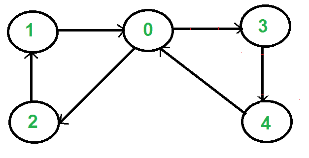

# 有向图中的欧拉电路

> 原文： [https://www.geeksforgeeks.org/euler-circuit-directed-graph/](https://www.geeksforgeeks.org/euler-circuit-directed-graph/)

[欧拉路径](http://en.wikipedia.org/wiki/Eulerian_path)是图中的一条路径，该路径恰好访问每个边一次。 欧拉回路是一条始于和终止于同一顶点的欧拉路径。

如果图具有欧拉循环，则称该图为欧拉。 我们已经讨论了无向图的[欧拉回路。 在这篇文章中，对有向图也进行了讨论。](https://www.geeksforgeeks.org/eulerian-path-and-circuit/)

例如，以下图形的欧拉循环为{1、0、3、4、0、2、1}



**如何检查有向图是否为欧拉式？**
如果满足以下条件，则有向图具有欧拉循环（来源： [Wiki](http://en.wikipedia.org/wiki/Eulerian_path#Properties) ）
1）所有非零度的顶点都属于单个[强连通分量[](https://www.geeksforgeeks.org/strongly-connected-components/) 。
2）In 度等于每个顶点的 out 度。

我们可以使用 [Kosaraju 基于 DFS 的简单算法](https://www.geeksforgeeks.org/connectivity-in-a-directed-graph/)来检测单个连接的组件。

要比较度和度，我们需要存储每个顶点的度和度。 可以通过邻接表的大小来获得出局程度。 可以通过创建大小等于顶点数的数组来存储度数。

以下方法的实现。

## C ++

```

// A C++ program to check if a given directed graph is Eulerian or not
#include<iostream>
#include <list>
#define CHARS 26
using namespace std;

// A class that represents an undirected graph
class Graph
{
    int V;    // No. of vertices
    list<int> *adj;    // A dynamic array of adjacency lists
    int *in;
public:
    // Constructor and destructor
    Graph(int V);
    ~Graph()   { delete [] adj; delete [] in; }

    // function to add an edge to graph
    void addEdge(int v, int w) { adj[v].push_back(w);  (in[w])++; }

    // Method to check if this graph is Eulerian or not
    bool isEulerianCycle();

    // Method to check if all non-zero degree vertices are connected
    bool isSC();

    // Function to do DFS starting from v. Used in isConnected();
    void DFSUtil(int v, bool visited[]);

    Graph getTranspose();
};

Graph::Graph(int V)
{
    this->V = V;
    adj = new list<int>[V];
    in = new int[V];
    for (int i = 0; i < V; i++)
       in[i] = 0;
}

/* This function returns true if the directed graph has a eulerian
   cycle, otherwise returns false  */
bool Graph::isEulerianCycle()
{
    // Check if all non-zero degree vertices are connected
    if (isSC() == false)
        return false;

    // Check if in degree and out degree of every vertex is same
    for (int i = 0; i < V; i++)
        if (adj[i].size() != in[i])
            return false;

    return true;
}

// A recursive function to do DFS starting from v
void Graph::DFSUtil(int v, bool visited[])
{
    // Mark the current node as visited and print it
    visited[v] = true;

    // Recur for all the vertices adjacent to this vertex
    list<int>::iterator i;
    for (i = adj[v].begin(); i != adj[v].end(); ++i)
        if (!visited[*i])
            DFSUtil(*i, visited);
}

// Function that returns reverse (or transpose) of this graph
// This function is needed in isSC()
Graph Graph::getTranspose()
{
    Graph g(V);
    for (int v = 0; v < V; v++)
    {
        // Recur for all the vertices adjacent to this vertex
        list<int>::iterator i;
        for(i = adj[v].begin(); i != adj[v].end(); ++i)
        {
            g.adj[*i].push_back(v);
            (g.in[v])++;
        }
    }
    return g;
}

// This function returns true if all non-zero degree vertices of 
// graph are strongly connected (Please refer 
// https://www.geeksforgeeks.org/connectivity-in-a-directed-graph/ )
bool Graph::isSC()
{
    // Mark all the vertices as not visited (For first DFS)
    bool visited[V];
    for (int i = 0; i < V; i++)
        visited[i] = false;

    // Find the first vertex with non-zero degree
    int n;
    for (n = 0; n < V; n++)
        if (adj[n].size() > 0)
          break;

    // Do DFS traversal starting from first non zero degrees vertex.
    DFSUtil(n, visited);

     // If DFS traversal doesn't visit all vertices, then return false.
    for (int i = 0; i < V; i++)
        if (adj[i].size() > 0 && visited[i] == false)
              return false;

    // Create a reversed graph
    Graph gr = getTranspose();

    // Mark all the vertices as not visited (For second DFS)
    for (int i = 0; i < V; i++)
        visited[i] = false;

    // Do DFS for reversed graph starting from first vertex.
    // Staring Vertex must be same starting point of first DFS
    gr.DFSUtil(n, visited);

    // If all vertices are not visited in second DFS, then
    // return false
    for (int i = 0; i < V; i++)
        if (adj[i].size() > 0 && visited[i] == false)
             return false;

    return true;
}

// Driver program to test above functions
int main()
{
    // Create a graph given in the above diagram
    Graph g(5);
    g.addEdge(1, 0);
    g.addEdge(0, 2);
    g.addEdge(2, 1);
    g.addEdge(0, 3);
    g.addEdge(3, 4);
    g.addEdge(4, 0);

    if (g.isEulerianCycle())
       cout << "Given directed graph is eulerian n";
    else
       cout << "Given directed graph is NOT eulerian n";
    return 0;
}

```

## 爪哇

```

// A Java program to check if a given directed graph is Eulerian or not

// A class that represents an undirected graph
import java.io.*;
import java.util.*;
import java.util.LinkedList;

// This class represents a directed graph using adjacency list
class Graph
{
    private int V;   // No. of vertices
    private LinkedList<Integer> adj[];//Adjacency List
    private int in[];            //maintaining in degree

    //Constructor
    Graph(int v)
    {
        V = v;
        adj = new LinkedList[v];
        in = new int[V];
        for (int i=0; i<v; ++i)
        {
            adj[i] = new LinkedList();
            in[i]  = 0;
        }
    }

    //Function to add an edge into the graph
    void addEdge(int v,int w)
    {
        adj[v].add(w);
        in[w]++;
    }

    // A recursive function to print DFS starting from v
    void DFSUtil(int v,Boolean visited[])
    {
        // Mark the current node as visited
        visited[v] = true;

        int n;

        // Recur for all the vertices adjacent to this vertex
        Iterator<Integer> i =adj[v].iterator();
        while (i.hasNext())
        {
            n = i.next();
            if (!visited[n])
                DFSUtil(n,visited);
        }
    }

    // Function that returns reverse (or transpose) of this graph
    Graph getTranspose()
    {
        Graph g = new Graph(V);
        for (int v = 0; v < V; v++)
        {
            // Recur for all the vertices adjacent to this vertex
            Iterator<Integer> i = adj[v].listIterator();
            while (i.hasNext())
            {
                g.adj[i.next()].add(v);
                (g.in[v])++;
            }
        }
        return g;
    }

    // The main function that returns true if graph is strongly
    // connected
    Boolean isSC()
    {
        // Step 1: Mark all the vertices as not visited (For
        // first DFS)
        Boolean visited[] = new Boolean[V];
        for (int i = 0; i < V; i++)
            visited[i] = false;

        // Step 2: Do DFS traversal starting from the first vertex.
        DFSUtil(0, visited);

        // If DFS traversal doesn't visit all vertices, then return false.
        for (int i = 0; i < V; i++)
            if (visited[i] == false)
                return false;

        // Step 3: Create a reversed graph
        Graph gr = getTranspose();

        // Step 4: Mark all the vertices as not visited (For second DFS)
        for (int i = 0; i < V; i++)
            visited[i] = false;

        // Step 5: Do DFS for reversed graph starting from first vertex.
        // Staring Vertex must be same starting point of first DFS
        gr.DFSUtil(0, visited);

        // If all vertices are not visited in second DFS, then
        // return false
        for (int i = 0; i < V; i++)
            if (visited[i] == false)
                return false;

        return true;
    }

    /* This function returns true if the directed graph has a eulerian
       cycle, otherwise returns false  */
    Boolean isEulerianCycle()
    {
        // Check if all non-zero degree vertices are connected
        if (isSC() == false)
            return false;

        // Check if in degree and out degree of every vertex is same
        for (int i = 0; i < V; i++)
            if (adj[i].size() != in[i])
                return false;

        return true;
    }

    public static void main (String[] args) throws java.lang.Exception
    {
        Graph g = new Graph(5);
        g.addEdge(1, 0);
        g.addEdge(0, 2);
        g.addEdge(2, 1);
        g.addEdge(0, 3);
        g.addEdge(3, 4);
        g.addEdge(4, 0);

        if (g.isEulerianCycle())
            System.out.println("Given directed graph is eulerian ");
        else
            System.out.println("Given directed graph is NOT eulerian ");
    }
}
//This code is contributed by Aakash Hasija

```

## Python3

```

# A Python3 program to check if a given 
# directed graph is Eulerian or not

from collections import defaultdict

class Graph():

    def __init__(self, vertices):
        self.V = vertices
        self.graph = defaultdict(list)
        self.IN = [0] * vertices

    def addEdge(self, v, u):

        self.graph[v].append(u)
        self.IN[u] += 1

    def DFSUtil(self, v, visited):
        visited[v] = True
        for node in self.graph[v]:
            if visited[node] == False:
                self.DFSUtil(node, visited)

    def getTranspose(self):
        gr = Graph(self.V)

        for node in range(self.V):
            for child in self.graph[node]:
                gr.addEdge(child, node)

        return gr

    def isSC(self):
        visited = [False] * self.V

        v = 0
        for v in range(self.V):
            if len(self.graph[v]) > 0:
                break

        self.DFSUtil(v, visited)

        # If DFS traversal doesn't visit all 
        # vertices, then return false.
        for i in range(self.V):
            if visited[i] == False:
                return False

        gr = self.getTranspose()

        visited = [False] * self.V
        gr.DFSUtil(v, visited)

        for i in range(self.V):
            if visited[i] == False:
                return False

        return True

    def isEulerianCycle(self):

        # Check if all non-zero degree vertices 
        # are connected
        if self.isSC() == False:
            return False

        # Check if in degree and out degree of 
        # every vertex is same
        for v in range(self.V):
            if len(self.graph[v]) != self.IN[v]:
                return False

        return True

g = Graph(5);
g.addEdge(1, 0);
g.addEdge(0, 2);
g.addEdge(2, 1);
g.addEdge(0, 3);
g.addEdge(3, 4);
g.addEdge(4, 0);
if g.isEulerianCycle():
   print( "Given directed graph is eulerian");
else:
   print( "Given directed graph is NOT eulerian");

# This code is contributed by Divyanshu Mehta

```

## C＃

```

// A C# program to check if a given 
// directed graph is Eulerian or not

// A class that represents an
// undirected graph
using System;
using System.Collections.Generic;

// This class represents a directed
// graph using adjacency list
class Graph{

// No. of vertices
public int V;   

// Adjacency List
public List<int> []adj;

// Maintaining in degree
public int []init;           

// Constructor
Graph(int v)
{
    V = v;
    adj = new List<int>[v];
    init = new int[V];

    for(int i = 0; i < v; ++i)
    {
        adj[i] = new List<int>();
        init[i]  = 0;
    }
}

// Function to add an edge into the graph
void addEdge(int v, int w)
{
    adj[v].Add(w);
    init[w]++;
}

// A recursive function to print DFS 
// starting from v
void DFSUtil(int v, Boolean []visited)
{

    // Mark the current node as visited
    visited[v] = true;

    // Recur for all the vertices 
    // adjacent to this vertex
    foreach(int i in adj[v])
    {

        if (!visited[i])
            DFSUtil(i, visited);
    }
}

// Function that returns reverse
// (or transpose) of this graph
Graph getTranspose()
{
    Graph g = new Graph(V);
    for(int v = 0; v < V; v++)
    {

        // Recur for all the vertices 
        // adjacent to this vertex
        foreach(int i in adj[v])
        {
            g.adj[i].Add(v);
            (g.init[v])++;
        }
    }
    return g;
}

// The main function that returns 
// true if graph is strongly connected
Boolean isSC()
{

    // Step 1: Mark all the vertices 
    // as not visited (For first DFS)
    Boolean []visited = new Boolean[V];
    for(int i = 0; i < V; i++)
        visited[i] = false;

    // Step 2: Do DFS traversal starting
    // from the first vertex.
    DFSUtil(0, visited);

    // If DFS traversal doesn't visit 
    // all vertices, then return false.
    for(int i = 0; i < V; i++)
        if (visited[i] == false)
            return false;

    // Step 3: Create a reversed graph
    Graph gr = getTranspose();

    // Step 4: Mark all the vertices as
    // not visited (For second DFS)
    for(int i = 0; i < V; i++)
        visited[i] = false;

    // Step 5: Do DFS for reversed graph 
    // starting from first vertex.
    // Staring Vertex must be same 
    // starting point of first DFS
    gr.DFSUtil(0, visited);

    // If all vertices are not visited 
    // in second DFS, then return false
    for(int i = 0; i < V; i++)
        if (visited[i] == false)
            return false;

    return true;
}

// This function returns true if the 
// directed graph has a eulerian 
// cycle, otherwise returns false  
Boolean isEulerianCycle()
{

    // Check if all non-zero degree 
    // vertices are connected
    if (isSC() == false)
        return false;

    // Check if in degree and out 
    // degree of every vertex is same
    for(int i = 0; i < V; i++)
        if (adj[i].Count != init[i])
            return false;

    return true;
}

// Driver code
public static void Main(String[] args)
{
    Graph g = new Graph(5);
    g.addEdge(1, 0);
    g.addEdge(0, 2);
    g.addEdge(2, 1);
    g.addEdge(0, 3);
    g.addEdge(3, 4);
    g.addEdge(4, 0);

    if (g.isEulerianCycle())
        Console.WriteLine("Given directed " + 
                          "graph is eulerian ");
    else
        Console.WriteLine("Given directed " + 
                          "graph is NOT eulerian ");
}
}

// This code is contributed by Princi Singh

```

**输出**：

```
Given directed graph is eulerian 

```

上述实现的时间复杂度为 O（V + E），因为 [Kosaraju 的算法](https://www.geeksforgeeks.org/connectivity-in-a-directed-graph/)需要 O（V + E）的时间。 运行 [Kosaraju 的算法](https://www.geeksforgeeks.org/connectivity-in-a-directed-graph/)后，我们遍历所有顶点，并比较度数和度数，这需要 O（V）时间。

请参阅以下内容作为此应用程序。
[查找给定的字符串数组是否可以链接形成一个圆](https://www.geeksforgeeks.org/given-array-strings-find-strings-can-chained-form-circle/)。

如果发现任何不正确的地方，或者想分享有关上述主题的更多信息，请写评论。

