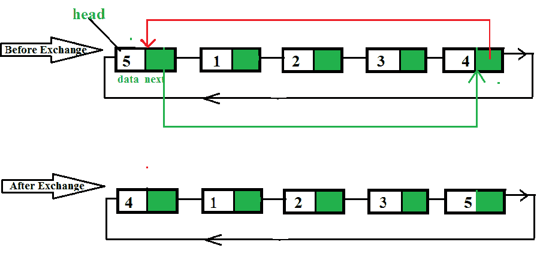

# 交换循环链接列表

中的第一个和最后一个节点

给定一个[循环链表](https://www.geeksforgeeks.org/circular-singly-linked-list-insertion/)交换第一个和最后一个节点。 该任务仅应在一个额外的节点上完成，您不能声明一个以上的额外节点，也不允许您声明任何其他临时变量。
**注意：**额外节点表示需要一个节点来遍历列表。



**示例：**，

```
Input : 5 4 3 2 1
Output : 1 4 3 2 5

Input  : 6 1 2 3 4 5 6 7 8 9
Output : 9 1 2 3 4 5 6 7 8 6

```

我们首先找到指向最后一个节点的上一个指针。 令此节点为p。 现在，我们更改下一个链接，以便交换最后一个节点和第一个节点。

## C ++

```

// CPP program to exchange first and 
// last node in circular linked list
#include<bits/stdc++.h>
using namespace std;

struct Node
{
    int data;
    struct Node *next;
};

struct Node *addToEmpty(struct Node *head, int data)
{
    // This function is only for empty list
    if (head != NULL)
    return head;

    // Creating a node dynamically.
    struct Node *temp = 
        (struct Node*)malloc(sizeof(struct Node));

    // Assigning the data.
    temp -> data = data;
    head = temp;

    // Creating the link.
    head -> next = head;

    return head;
}

struct Node *addBegin(struct Node *head, int data)
{
    if (head == NULL)
        return addToEmpty(head, data);

    struct Node *temp =
        (struct Node *)malloc(sizeof(struct Node));

    temp -> data = data;
    temp -> next = head -> next;
    head -> next = temp;

    return head;
}

/* function for traversing the list */
void traverse(struct Node *head)
{
    struct Node *p;

    // If list is empty, return.
    if (head == NULL)
    {
        cout << "List is empty." << endl;
        return;
    }

    // Pointing to first Node of the list.
    p = head;

    // Traversing the list.
    do
    {
        cout << p -> data << " ";
        p = p -> next;

    } while(p != head);
}

/* Function to exchange first and last node*/
struct Node *exchangeNodes(struct Node *head)
{
    // Find pointer to previous of last node
    struct Node *p = head;
    while (p->next->next != head)
       p = p->next;

    /* Exchange first and last nodes using
       head and p */
    p->next->next = head->next;
    head->next = p->next;
    p->next = head;
    head = head->next;

    return head;
}

// Driven Program
int main()
{
    int i;
    struct Node *head = NULL;
    head = addToEmpty(head, 6);

    for (i = 5; i > 0; i--)
    head = addBegin(head, i);
    cout << "List Before: ";
    traverse(head);
    cout << endl;

    cout << "List After: ";
    head = exchangeNodes(head);
    traverse(head);

    return 0;
}

```

## 爪哇

```

// Java program to exchange 
// first and last node in 
// circular linked list
class GFG
{

static class Node
{
    int data;
    Node next;
};

static Node addToEmpty(Node head, 
                       int data)
{
    // This function is only
    // for empty list
    if (head != null)
    return head;

    // Creating a node dynamically.
    Node temp = new Node();

    // Assigning the data.
    temp.data = data;
    head = temp;

    // Creating the link.
    head.next = head;

    return head;
}

static Node addBegin(Node head,
                     int data)
{
    if (head == null)
        return addToEmpty(head, data);

    Node temp = new Node();

    temp.data = data;
    temp.next = head.next;
    head.next = temp;

    return head;
}

// function for traversing the list 
static void traverse( Node head)
{
    Node p;

    // If list is empty, return.
    if (head == null)
    {
        System.out.print("List is empty.");
        return;
    }

    // Pointing to first 
    // Node of the list.
    p = head;

    // Traversing the list.
    do
    {
        System.out.print(p . data + " ");
        p = p . next;

    } while(p != head);
}

// Function to exchange 
// first and last node
static Node exchangeNodes( Node head)
{
    // Find pointer to previous
    // of last node
    Node p = head;
    while (p.next.next != head)
    p = p.next;

    // Exchange first and last 
    // nodes using head and p
    p.next.next = head.next;
    head.next = p.next;
    p.next = head;
    head = head.next;

    return head;
}

// Driver Code
public static void main(String args[])
{
    int i;
    Node head = null;
    head = addToEmpty(head, 6);

    for (i = 5; i > 0; i--)
    head = addBegin(head, i);
    System.out.print("List Before: ");
    traverse(head);
    System.out.println();

    System.out.print("List After: ");
    head = exchangeNodes(head);
    traverse(head);
}
}

// This code is contributed 
// by Arnab Kundu

```

## Python3

```

# Python3 program to exchange first and
# last node in circular linked list
import math

class Node:
    def __init__(self, data):
        self.data = data
        self.next = None

def addToEmpty(head, data):

    # This function is only for empty list
    if (head != None):
        return head

    # Creating a node dynamically.
    temp = Node(data)

    # Assigning the data.
    temp.data = data
    head = temp

    # Creating the link.
    head.next = head
    return head

def addBegin(head, data):

    if (head == None):
        return addToEmpty(head, data)

    temp = Node(data)
    temp.data = data
    temp.next = head.next
    head.next = temp

    return head

# function for traversing the list

def traverse(head):

    # If list is empty, return.
    if (head == None):

        print("List is empty.")
        return

    # Pointing to first Node of the list.
    p = head
    print(p.data, end=" ")
    p = p.next

    # Traversing the list.
    while(p != head):

        print(p.data, end=" ")
        p = p.next

def exchangeNodes(head):

    # Cases Handled: Linked List either empty or containing single node.
    if head == None or head.next == head:
        return head
    # Cases Handled: Linked List containing only two nodes
    elif head.next.next == head:
        head = head.next
        return head
    # Cases Handled: Linked List containing multiple nodes
    else:
        prev = None
        curr = head
        temp = head
        # finding last and second last nodes in linkedlist list
        while curr.next != head:
            prev = curr
            curr = curr.next

        # point the last node to second node of the list
        curr.next = temp.next
        # point the second last node to first node
        prev.next = temp
        # point the end of node to start ( make linked list circular )
        temp.next = curr
        # mark the starting of linked list
        head = curr

        return head

# Driver Code
if __name__ == '__main__':

    head = None
    head = addToEmpty(head, 6)
    for x in range(5, 0, -1):
        head = addBegin(head, x)
    print("List Before: ", end="")
    traverse(head)
    print()

    print("List After: ", end="")
    head = exchangeNodes(head)
    traverse(head)

# This code is contributed by Srathore
# Improved by Vinay Kumar (vinaykumar71)

```

## C＃

```

// C# program to exchange 
// first and last node in 
// circular linked list 
using System;

public class GFG 
{ 

    class Node 
    { 
        public int data; 
        public Node next; 
    }; 

    static Node addToEmpty(Node head, 
                        int data) 
    { 
        // This function is only 
        // for empty list 
        if (head != null) 
        return head; 

        // Creating a node dynamically. 
        Node temp = new Node(); 

        // Assigning the data. 
        temp.data = data; 
        head = temp; 

        // Creating the link. 
        head.next = head; 

        return head; 
    } 

    static Node addBegin(Node head, 
                        int data) 
    { 
        if (head == null) 
            return addToEmpty(head, data); 

        Node temp = new Node(); 

        temp.data = data; 
        temp.next = head.next; 
        head.next = temp; 

        return head; 
    } 

    // function for traversing the list 
    static void traverse( Node head) 
    { 
        Node p; 

        // If list is empty, return. 
        if (head == null) 
        { 
            Console.Write("List is empty."); 
            return; 
        } 

        // Pointing to first 
        // Node of the list. 
        p = head; 

        // Traversing the list. 
        do
        { 
            Console.Write(p . data + " "); 
            p = p . next; 

        } while(p != head); 
    } 

    // Function to exchange 
    // first and last node 
    static Node exchangeNodes( Node head) 
    { 
        // Find pointer to previous 
        // of last node 
        Node p = head; 
        while (p.next.next != head) 
        p = p.next; 

        // Exchange first and last 
        // nodes using head and p 
        p.next.next = head.next; 
        head.next = p.next; 
        p.next = head; 
        head = head.next; 

        return head; 
    } 

    // Driver Code 
    public static void Main() 
    { 
        int i; 
        Node head = null; 
        head = addToEmpty(head, 6); 

        for (i = 5; i > 0; i--) 
        head = addBegin(head, i); 
        Console.Write("List Before: "); 
        traverse(head); 
        Console.WriteLine(); 

        Console.Write("List After: "); 
        head = exchangeNodes(head); 
        traverse(head); 
    } 
} 

/* This code is contributed PrinciRaj1992 */

```

**输出：**

```
List Before: 6 1 2 3 4 5 
List After: 5 1 2 3 4 6 

```

本文由 **R_Raj** 提供。 如果您喜欢GeeksforGeeks并希望做出贡献，则还可以使用 [tribution.geeksforgeeks.org](http://www.contribute.geeksforgeeks.org) 撰写文章，或将您的文章邮寄至tribution@geeksforgeeks.org。 查看您的文章出现在GeeksforGeeks主页上，并帮助其他Geeks。
如果发现任何不正确的内容，或者想分享有关上述主题的更多信息，请发表评论。

注意读者！ 现在不要停止学习。 通过 [**DSA自学课程**](https://practice.geeksforgeeks.org/courses/dsa-self-paced?utm_source=geeksforgeeks&utm_medium=article&utm_campaign=gfg_article_dsa_content_bottom) 以对学生方便的价格掌握所有重要的DSA概念，并为行业做好准备。