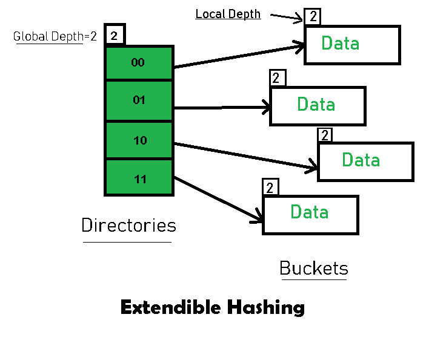
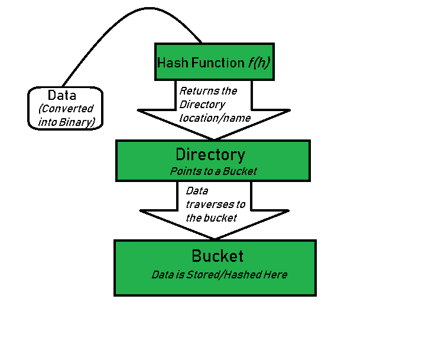
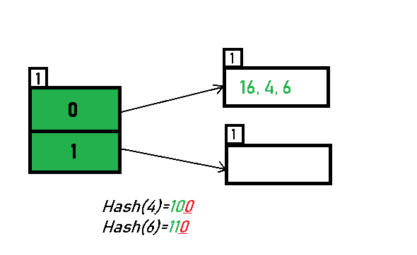
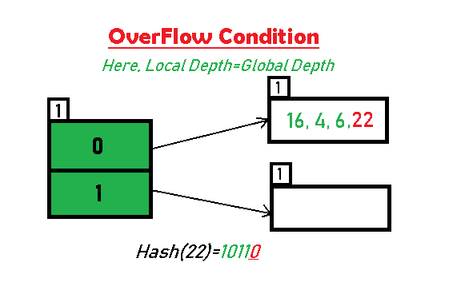
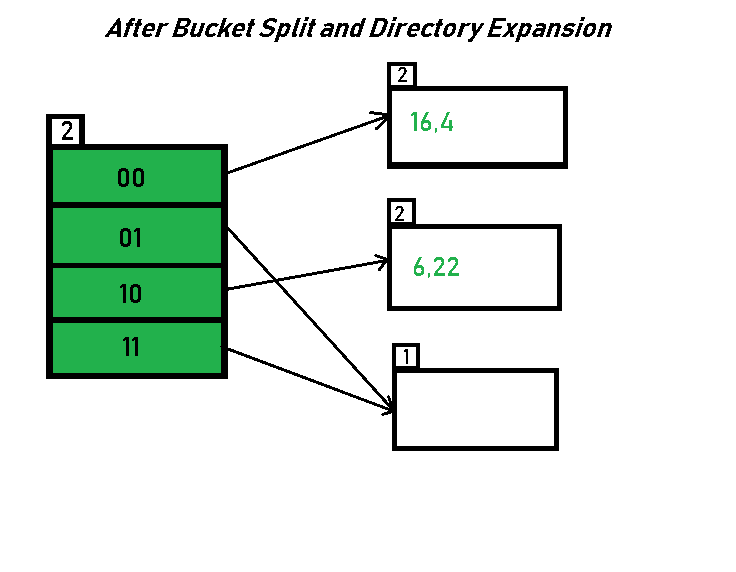
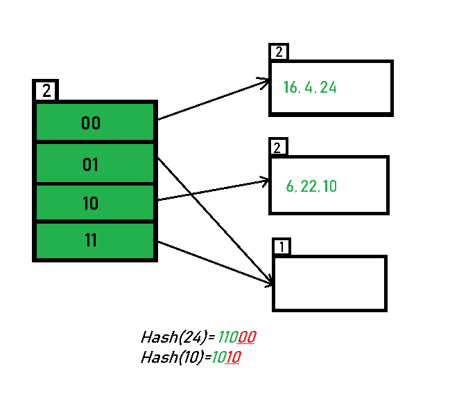
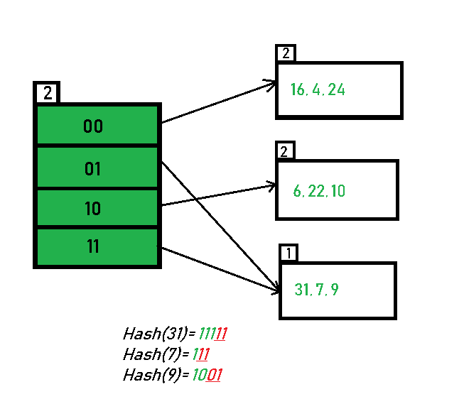
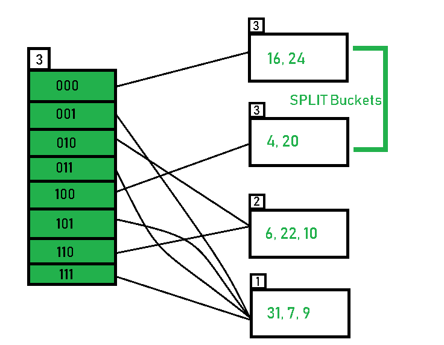

# 可扩展散列（DBMS 的动态方法）

> 原文：[https://www.geeksforgeeks.org/extendible-hashing-dynamic-approach-to-dbms/](https://www.geeksforgeeks.org/extendible-hashing-dynamic-approach-to-dbms/)

**可扩展散列** 是一种动态散列方法，其中目录和存储桶用于散列数据。 这是一种非常灵活的方法，其中哈希函数也经历动态变化。

**可扩展哈希的主要特征**：此哈希技术的主要特征是：

*   **目录**：目录在指针中存储存储区的地址。 将一个 ID 分配给每个目录，该目录可能会在每次目录扩展发生时更改。

*   **存储桶**：存储桶用于对实际数据进行哈希处理。

**可扩展哈希的基本结构**：

**可扩展哈希中的常用术语**：

*   **目录**：这些容器存储指向存储桶的指针。 每个目录都有一个唯一的 ID，该 ID 在每次扩展时都会更改。 哈希函数返回此目录 ID，该目录 ID 用于导航到相应的存储桶。 目录数= 2 ^全局深度。

*   **存储桶**：它们存储散列密钥。 目录指向存储桶。 如果存储桶的局部深度小于全局深度，则该存储桶可能包含多个指向它的指针。

*   **全局深度**：与目录关联。 它们表示哈希函数用于对密钥进行分类的位数。 全局深度=目录 ID 中的位数。

*   **本地深度**：与“全局深度”相同，不同之处在于“本地深度”与存储桶关联，而不与目录关联。 根据全局深度的局部深度用于确定发生溢出时要执行的操作。 局部深度始终小于或等于全局深度。

*   **存储桶拆分**：当存储桶中的元素数超过特定大小时，会将存储桶分为两部分。

*   **目录扩展**：目录扩展在存储桶溢出时发生。 当溢出存储桶的本地深度等于全局深度时，执行目录扩展。

**可扩展哈希的基本工作**：

*   **步骤 1 – 分析数据元素**：数据元素可能以各种形式存在，例如。 整数，字符串，浮点数等。当前，让我们考虑整数类型的数据元素。 例如：49。

*   **步骤 2 – 转换为二进制格式**：以二进制格式转换数据元素。 对于字符串元素，请考虑起始字符的 ASCII 等效整数，然后将其转换为二进制形式。 由于我们有 49 个数据元素，因此其二进制格式为 110001。

*   **步骤 3 – 检查目录的全局深度。** 假设哈希目录的全局深度为 3。

*   **步骤 4 – 识别目录**：考虑二进制数中 LSB 的“全局深度”数，并将其与目录 ID 匹配。

    例如 获得的二进制为：110001，全局深度为 3。因此，哈希函数将返回 3 个 LSB，即 110 **001** 即。 001。

*   **步骤 5 – 导航**：现在，导航到目录 ID 为 001 的目录所指向的存储桶。

*   **步骤 6 – 插入和溢出检查**：插入元素并检查存储桶是否溢出。 如果遇到溢出，请转到**步骤 7**，然后转到**步骤 8**，否则，转到**步骤 9**。

*   **Step 7 – Tackling Over Flow Condition during Data Insertion:** Many times, while inserting data in the buckets, it might happen that the Bucket overflows. In such cases, we need to follow an appropriate procedure to avoid mishandling of data.

    First, Check if the local depth is less than or equal to the global depth. Then choose one of the cases below. 
    
    *   情况 1：如果溢出的存储桶的局部深度等于全局深度，则需要执行目录扩展以及存储桶拆分。 然后将全局深度和局部深度值加 1。然后，分配适当的指针。

        目录扩展将使哈希结构中存在的目录数量增加一倍。

    *   情况 2：如果局部深度小于整体深度，则仅发生“桶分割”。 然后仅将本地深度值加 1。然后，分配适当的指针。

        

*   **步骤 8 – 拆分存储分区元素的重新哈希处理**：拆分后的溢出存储分区中存在的元素会重新填充，而不会包含目录的新全局深度。

*   **步骤 9 – 元素已成功哈希**。

 **基于可扩展散列的示例**：现在，让我们考虑对以下元素进行散列的突出示例：`16,4,6,22,24,10,31,7,9,20,26`。

**存储桶大小**：3（假定）

**哈希函数**：假设全局深度为`X`。然后哈希函数返回`X`个 LSB。

*   **解决方案**：首先，计算每个给定数字的二进制形式。

    16：0b10000

    4：0b00100

    6：0b00110

    22：0b10110

    24：0b11000

    10：0b01010

    31：0b11111

    7：0b00111

    9：0b01001

    20：0b10100

    26：0b01101

*   最初，全局深度和局部深度始终为 1。因此，哈希帧如下所示：

    

*   **插入 16**：

    二进制格式 16 为 10000，全局深度为 1。哈希函数返回 1 的 LSB 为 10000，即 0。因此，映射了 16 到`id = 0`的目录。

    

*   **插入 4 和 6**：

    4（100）和 6（110）的 LSB 均为 0。 因此，它们的散列如下：

    

*   **插入 22**：22 的二进制形式是 10110。 其 LSB 为 0。目录 0 指向的存储桶已满。 因此，发生溢出。

    

*   As directed by **Step 7-Case 1**, Since Local Depth = Global Depth, the bucket splits and directory expansion takes place. Also, rehashing of numbers present in the overflowing bucket takes place after the split. And, since the global depth is incremented by 1, now,the global depth is 2\. Hence, 16,4,6,22 are now rehashed w.r.t 2 LSBs.[ 16(100**00**),4(1**00**),6(1**10**),22(101**10**) ]

    

*   请注意，下溢的水桶未受影响。 但是，由于目录数量增加了一倍，因此我们现在有 2 个目录 01 和 11 指向同一个存储桶。 这是因为存储区的本地深度保持为 1。并且，任何一个本地深度小于全局深度的存储区都由多个目录指向。

*   **插入 24 和 10**：可以基于 ID 为 00 和 10 的目录对 24（11000）和 10（1010）进行散列。 无溢出条件。

    

*   **插入 31，7，9**：所有这些元素（31（11111），7（111），9（1001））的 LSB 中包含 01 或 11。 因此，它们映射到 01 和 11 所指向的存储桶上。在这里，我们不会遇到任何溢出情况。

    

*   **插入 20**：插入数据元素 20（10100）将再次引起溢出问题。

    

*   20 插入由 00 指向的存储桶中。按照**步骤 7 - 情况 1** 的指示，由于存储桶的**局部深度等于全局深度**，因此发生了目录扩展（加倍） 以及铲斗劈裂。 溢出的存储桶中存在的元素将使用新的全局深度进行重新填充。 现在，新的哈希表如下所示：

    

*   **插入 26**：全局深度为 3。因此，考虑 3 个 LSB 为 26（11010）。 因此，26 最适合目录 010 指出的存储桶。

    

*   The bucket overflows, and, as directed by **Step 7-Case 2,** since the **local depth of bucket < Global depth (2<3)**, directories are not doubled but, only the bucket is split and elements are rehashed.

    Finally, the output of hashing the given list of numbers is obtained.

    

*   **这样就完成了 11 个数字的散列。**

**主要观察结果**：

1.  如果存储桶的局部深度小于全局深度，则将有多个指针指向该存储桶。

2.  当存储区中发生溢出情况时，存储区中的所有条目都将以新的本地深度进行重新混合。

3.  如果溢出桶的本地深度

等于全局深度，然后目录被加倍并且全局深度增加 1。

5.  数据插入过程开始后，无法更改存储桶的大小。

**优势**：

1.  数据检索便宜（就计算而言）。

2.  由于存储容量是动态增加的，因此不会出现数据丢失的问题。

3.  随着散列函数的动态变化，与新的散列函数对应的旧值将被重新映射。

**可扩展散列的局限性**：

1.  如果在同一目录上对多个记录进行哈希处理，同时又使记录分布不均匀，则目录大小可能会大大增加。

2.  每个铲斗的尺寸是固定的。

3.  当全局深度和局部深度之差变得过大时，指针将浪费内存。

4.  此方法的编码很复杂。

**用于实现的数据结构**：

1.  [B+ 树](https://www.geeksforgeeks.org/data-structure-gq/b-and-b-trees-gq/)

2.  [数组](https://www.geeksforgeeks.org/array-data-structure/)

3.  [链接列表](http://www.geeksforgeeks.org/data-structures/linked-list/)

* * *

* * *

