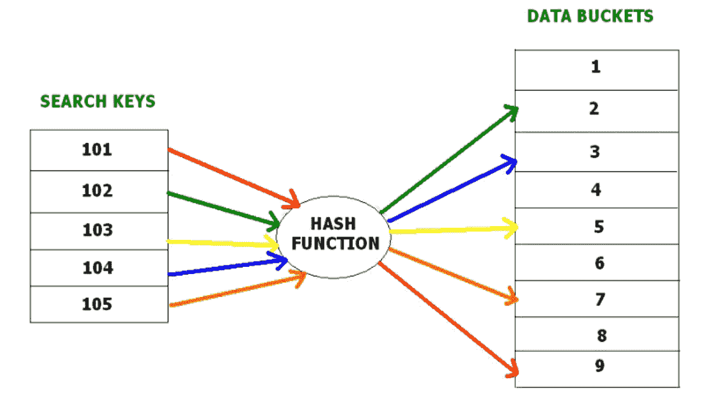
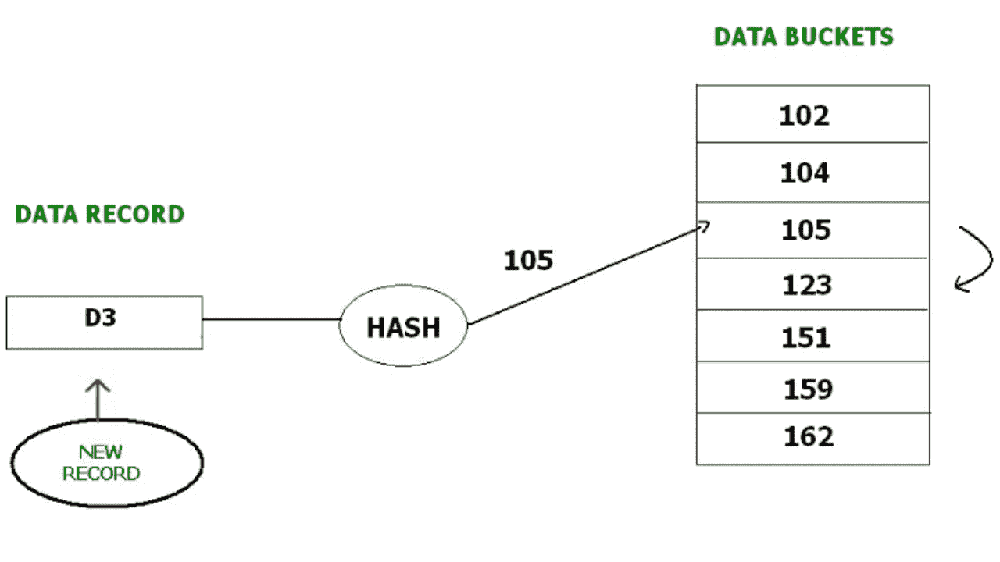
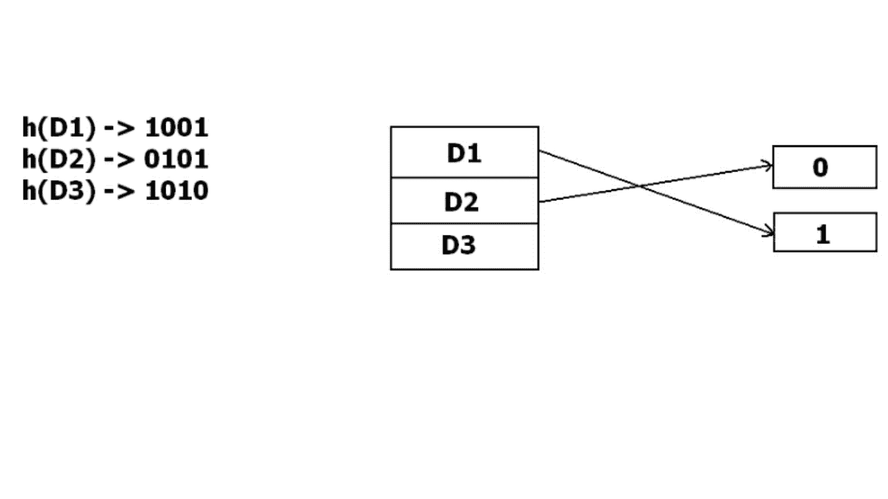
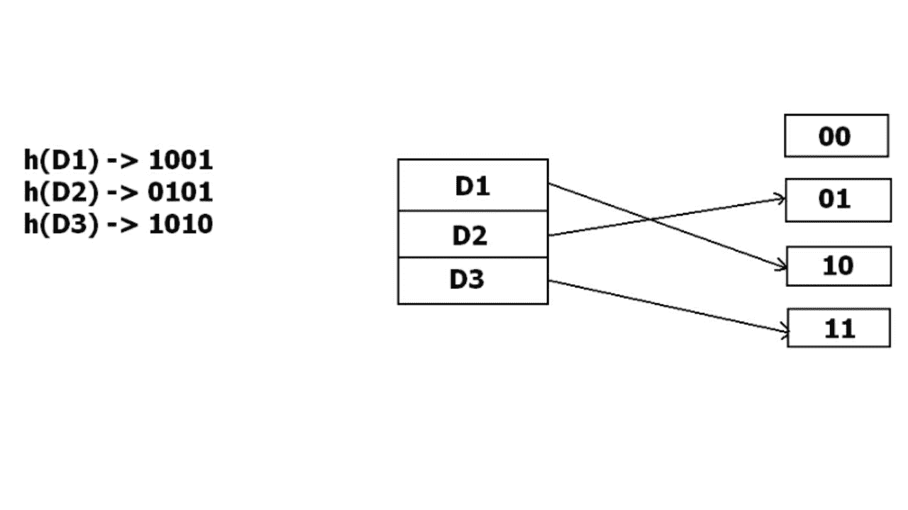

# DBMS 中的文件组织 | 系列 2

> 原文：[https://www.geeksforgeeks.org/file-organization-in-dbms-set-4/](https://www.geeksforgeeks.org/file-organization-in-dbms-set-4/)

先决条件– [散列数据结构](https://www.geeksforgeeks.org/hashing-data-structure/)

在数据库管理系统中，当我们要检索特定数据时，搜索所有索引值并到达所需数据的效率非常低。 在这种情况下，散列技术应运而生。

**哈希**是一种无需使用索引结构即可直接在磁盘上搜索所需数据位置的有效技术。 数据存储在使用哈希函数生成地址的数据块中。 这些记录的存储位置称为数据块或数据桶。

### 哈希文件组织：

*   **数据存储区**：数据存储区是存储记录的存储位置。 这些存储桶也被视为**存储单位**。

*   **哈希函数**：哈希函数是一种映射函数，它将所有搜索键集映射到实际记录地址。 通常，哈希函数使用主键来生成哈希索引-数据块的地址。 哈希函数可以是简单的数学函数，也可以是任何复杂的数学函数。

*   **哈希索引**：将整个哈希值的前缀作为哈希索引。 每个哈希索引都有一个深度值，以表示有多少位用于计算哈希函数。 这些位可以寻址`2n`个存储桶。 当所有这些位都被消耗掉了吗？ 然后深度值线性增加，并分配两次铲斗。

下面给出的图清楚地描述了哈希函数如何工作：

散列又分为两个子类别：

### 静态哈希-

在静态哈希中，当提供搜索键值时，哈希函数总是计算相同的地址。 例如，如果我们想使用`mod(5)`哈希函数为`STUDENT_ID = 76`生成地址，则它始终会导致相同的存储桶地址 4。此处存储桶地址不会有任何变化。 因此，用于该静态散列的存储器中的数据桶的数量始终保持恒定。

**操作**：

*   **插入**：将新记录插入表中时，哈希函数`h`根据其哈希键`K`为新记录生成存储桶地址。

    存储桶地址：`h(K)`

*   **搜索**：当需要搜索记录时，使用相同的哈希函数来检索记录的存储桶地址。 例如，如果我们要检索 ID 为 76 的整个记录​​，并且如果该 ID 上的哈希函数为`mod(5)`，则生成的存储区地址将为 4。然后，我们将直接到达地址 4 并为`ID104`检索整个记录。此处 ID 用作哈希键。

*   **删除**：如果我们想删除一条记录，我们将使用哈希函数首先获取应该删除的记录。 然后，我们将删除该地址在内存中的记录。

*   **更新**：首先使用哈希函数搜索需要更新的数据记录，然后更新数据记录。

现在，如果我们想在文件中插入一些新记录，但是哈希函数生成的数据存储区地址不为空，或者该地址中已经存在数据。 这成为要处理的紧急情况。 静态哈希中的这种情况称为**存储桶溢出**。

在这种情况下，我们将如何插入数据？

提供了几种方法来克服这种情况。 下面讨论了一些常用的方法：

1.  **开放哈希**：

    In Open hashing method, next available data block is used to enter the new record, instead of overwriting older one. This method is also called  linear probing.

    例如，`D3`是需要插入的新记录，哈希函数生成的地址为 105。但是它已经满了。 因此，系统将搜索下一个可用的数据段 123，并为其分配`D3`。

    

2.  **封闭哈希**：

    In Closed hashing method, a new data bucket is allocated with same address and is linked it after the full data bucket. This method is also known as  overflow chaining.

    For example, we have to insert a new record D3 into the tables. The static hash function generates the data bucket address as 105\. But this bucket is full to store the new data. In this case is a new data bucket is added at the end of 105 data bucket and is linked to it. Then new record D3 is inserted into the new bucket.

    

    *   **二次探测**：

        二次探测与开放式哈希或线性探测非常相似。 在此，新旧存储桶之间的唯一区别是线性的。 二次函数用于确定新的存储区地址。

    *   **双重哈希**：

        双重哈希是另一种类似于线性探测的方法。 这里的差异是固定的，就像线性探测一样，但是这个固定的差异是通过使用另一个哈希函数来计算的。 这就是为什么名称是双哈希。

### 动态散列–

静态哈希的缺点在于，它不会随着数据库大小的增长而动态扩展或缩小。 在动态哈希中，数据桶随着记录的增加或减少而增长或收缩（动态添加或删除）。 动态哈希也称为扩展哈希。

在动态哈希中，使哈希函数产生大量值。 例如，存在三个数据记录`D1`，`D2`和`D3`。 哈希函数分别生成三个地址 1001、0101 和 1010。 这种存储方法仅考虑该地址的一部分，尤其是仅用于存储数据的第一个位。 因此，它尝试将其中三个加载到地址 0 和 1。

但是问题是`D3`没有剩余的存储区地址。 存储桶必须动态增长以容纳`D3`。 因此它将地址更改为 2 位而不是 1 位，然后将现有数据更新为 2 位地址。 然后，它尝试容纳`D3`。

**参考**：

[cse.iitb.ac.in](https://www.cse.iitb.ac.in/~sudarsha/db-book/slide-dir/ch12.pdf)

* * *

* * *

