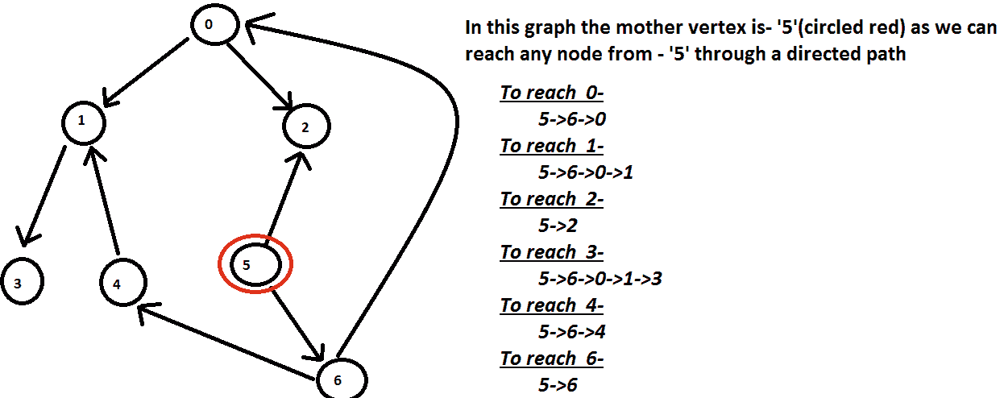

# 使用位掩码

在图形中查找母顶点

> 原文： [https://www.geeksforgeeks.org/find-a-mother-vertex-in-a-graph-using-bit-masking/](https://www.geeksforgeeks.org/find-a-mother-vertex-in-a-graph-using-bit-masking/)

**图 G =（V，E）**中的[母顶点](https://www.geeksforgeeks.org/find-a-mother-vertex-in-a-graph/)是顶点 v，使得从 v 的路径可以通过 a 到达`G`中的所有其他顶点。 v。
**的路径示例**：

> **输入**：
> [](https://media.geeksforgeeks.org/wp-content/cdn-uploads/mother1.png) 
> **输出**：
> 5

**方法**：

我们可以使用[深度优先搜索](https://www.geeksforgeeks.org/find-a-mother-vertex-in-a-graph/)方法解决此问题。 为了进一步优化我们的方法，我们将使用有效的解决方案。

下面的解决方案也使用“深度优先搜索”来解决此问题，但它仅执行一次“深度优先搜索周期”，并且一旦找到母顶点，就会停止执行。

*   在执行深度优先搜索时，我们有一个[位掩码数组](https://www.geeksforgeeks.org/bitmasking-and-dynamic-programming-set-1-count-ways-to-assign-unique-cap-to-every-person/)，表示每个顶点的位掩码。 在执行期间，此位掩码数组将传递到所有顶点。
*   每个顶点都以这种方式修改其专用位掩码，从而可以从该顶点访问包括顶点在内的所有设置位，包括当前顶点。
*   在每次迭代中，我们通过检查当前顶点位掩码值（如果设置了代表所有顶点的位）来检查是否可以从该顶点访问所有顶点。 如果可以从该顶点访问所有顶点，则它将中断执行并找到母顶点作为当前顶点。
*   如果已经从 Vertex-1 访问了 Vertex-2，并且已经较早访问了 Vertex-2，则 Vertex-1 通过对 Vertex-2 位掩码进行“或”运算来更新其位掩码。

***时间复杂度： **O（V + E）*****

**以上想法如何运作？**

让这种方法支持最多具有 32 个顶点的图。 可以扩展此方法以支持更多数量的顶点，但是此处最多处理 32 个顶点。

1.  创建一个由 32 个位掩码组成的位掩码数组。 数组的第 0 个索引表示 Vertex-0 的位掩码，而数组的第一个索引表示 Vertex-1 的位掩码，依此类推。
2.  使用[深度优先搜索算法](https://www.geeksforgeeks.org/depth-first-search-or-dfs-for-a-graph/)访问图的所有顶点，并将相同的位掩码数组传递给所有顶点。 相应地设置了位掩码值，以表示可以从该顶点访问的所有顶点。
3.  设置与相邻顶点相对应的位索引，包括自己的位索引。 相邻顶点的位掩码也将重复相同的操作，并将其返回给 Vertex-1。
4.  顶点 1 将继续对其位掩码的所有邻居的返回值执行“或”运算，以表示可以从顶点 1 访问的所有顶点。
5.  请注意，如果 Vertex-2 是 Vertex-1 的邻居，并且已经从另一个邻居顶点访问过，那么它将不会再次访问其邻居的顶点，并将其位掩码返回到第一个节点。
6.  每次迭代将检查与当前顶点对应的位掩码是否将所有位都设置为 1。如果将当前顶点均值的所有位都设置为 1，则意味着可以从当前顶点访问所有顶点，并且当前顶点是的母顶点。 图。

下面是上述方法的实现：

```

// C++ code to find Mother 
// Vertex using Bitmask 

#include <bits/stdc++.h> 
#include <iostream> 

using namespace std; 

struct Graph { 
    int V; 

    // Store in descending order 
    set<int, greater<int> >* adjList; 
}; 

Graph* CreateGraph(int N) 
{ 
    Graph* g = new Graph(); 
    g->V = N; 
    g->adjList 
        = new set<int, greater<int> >[N]; 
    return g; 
} 

void AddEdge( 
    Graph* g, int src, int dest) 
{ 

    g->adjList[src].insert(dest); 
} 

void PrintGraph(Graph* g) 
{ 

    set<int, greater<int> >::iterator it; 

    for (int i = 0; i < g->V; i++) { 

        for (it = g->adjList[i].begin(); 
             it != g->adjList[i].end(); 
             it++) { 
            cout << "There is an edge from "
                 << i << " to "
                 << *it << endl; 
        } 
    } 
} 

bool IsEdge(Graph* g, int src, int dest) 
{ 
    if (g->adjList[src].find(dest) 
        != g->adjList[src].end()) { 

        return true; 
    } 
    return false; 
} 

int MotherVertexUtil( 
    Graph* g, int index, 
    int* mask, int* m_vertex) 
{ 

    // If mother vertex is already found 
    // then simply return with existing 
    // mask of the vertex index 
    if (*m_vertex != -1) { 

        return mask[index]; 
    } 

    // if this vertex is already visited, 
    // return the bit-mask 
    // value of this vertex. 
    if (mask[index] != 0) { 
        return mask[index]; 
    } 

    int tmpmask = 0; 

    // Set the bit corresponding 
    // to vertex index in tmpmask 
    tmpmask |= (1 << index); 

    for (int i = 0; i < g->V; i++) { 
        if ((index != i) 
            && IsEdge(g, index, i)) { 

            // Set bits corresponding to all 
            // vertex which can be visite 
            // by this vertex by ORing 
            // the return value by util function 

            // Vertex is not visited 
            if (mask[i] == 0) { 

                int retmask 
                    = MotherVertexUtil( 
                        g, i, mask, m_vertex); 
                tmpmask |= retmask; 
            } 

            // Vertex is already visited 
            else { 
                tmpmask |= mask[i]; 
            } 

            // Check if current vertex is 
            // mother vertex or mother vertex 
            // is already found 
            if (tmpmask == (pow(2, g->V) - 1)) { 

                // If all bits of a mask is set 
                // it means current vertex 
                // is mother vertex 
                if (*m_vertex == -1) { 
                    *m_vertex = index; 
                } 
                return tmpmask; 
            } 
        } 
    } 

    // populate tmpmask as final 
    // bit mask of the vertex 
    mask[index] |= tmpmask; 

    return mask[index]; 
} 

int MotherVertex(Graph* g) 
{ 

    int v = g->V; 
    int* mask = new int(v); 

    // Initially bit mask 
    // for all vertex will be 0 
    for (int i = 0; i < v; i++) { 
        mask[i] = 0; 
    } 

    // DFS traversal is used to check 
    // for the mother vertex 
    // All set bits (of bitmask of a vertex) 
    // represent the current vertex index 
    // and index of vertices which could be 
    // visited from the current vertex. 

    /* Example: 
       If a vertex index is 3 
       then and vertex 5, 7 and 10 
       can be visited from this vertex 
       then final bit mask of this vertex 
       would be 
       00000000000000000000010010101000 
       (bits 3, 5, 7 and 10 are set) */

    // tmpmask is used to store 
    // the final bitmask of the vertex. 
    int tmpmask = 0; 

    // flag to check if 
    // mother vertex is found 
    int m_vertex = -1; 

    for (int index = 0; index < v; index++) { 

        // set the bit corresponding 
        // to vertex index in tmpmask 
        tmpmask = (1 << index); 

        // mask for a vertex is 0 
        // means it has not yet 
        // visited so visit this vertex 
        if (mask[index] == 0) { 

            int retmask 
                = MotherVertexUtil( 
                    g, index, 
                    mask, &m_vertex); 

            // set bits corresponding to all 
            // vertices which can be visited 
            // from this vertex by ORing 
            // the return value by util function 
            tmpmask |= retmask; 
        } 

        // check if current vertex is 
        // mother vertex or mother vertex 
        // is already found 
        // If all bits of a mask is set 
        // it means current vertex 
        // is mother vertex 
        if (tmpmask == (pow(2, v) - 1)) { 

            // current vertex is mother vertex 
            if (m_vertex == -1) { 
                m_vertex = index; 
            } 
            break; 
        } 

        // populate tmpmask as final bit 
        // mask of the vertex 
        mask[index] |= tmpmask; 
    } 

    return m_vertex; 
} 

// Driver code 
int main() 
{ 

    Graph* g = CreateGraph(7); 
    AddEdge(g, 0, 2); 
    AddEdge(g, 0, 1); 
    AddEdge(g, 1, 3); 
    AddEdge(g, 4, 1); 
    AddEdge(g, 5, 2); 
    AddEdge(g, 5, 6); 
    AddEdge(g, 6, 0); 
    AddEdge(g, 6, 4); 
    PrintGraph(g); 

    int m_vertex = MotherVertex(g); 
    if (m_vertex == -1) { 

        cout << "Mother vertex is not"
             << " existing in this graph"
             << endl; 
    } 
    else { 
        cout << "Mother vertex is: "
             << m_vertex << endl; 
    } 
    return 0; 
} 

```

**Output:**

```
There is an edge from 0 to 2
There is an edge from 0 to 1
There is an edge from 1 to 3
There is an edge from 4 to 1
There is an edge from 5 to 6
There is an edge from 5 to 2
There is an edge from 6 to 4
There is an edge from 6 to 0
Mother vertex is: 5

```


* * *

* * *

如果您喜欢 GeeksforGeeks 并希望做出贡献，则还可以使用 [tribution.geeksforgeeks.org](https://contribute.geeksforgeeks.org/) 撰写文章，或将您的文章邮寄至 tribution@geeksforgeeks.org。 查看您的文章出现在 GeeksforGeeks 主页上，并帮助其他 Geeks。

如果您发现任何不正确的地方，请单击下面的“改进文章”按钮，以改进本文。