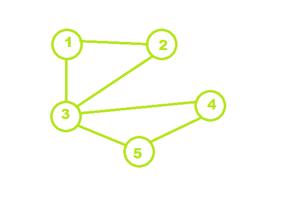

# 在无向图

中查找大小为 K 的所有集团

> 原文： [https://www.geeksforgeeks.org/find-all-cliques-of-size-k-in-an-undirected-graph/](https://www.geeksforgeeks.org/find-all-cliques-of-size-k-in-an-undirected-graph/)

给定具有 **N 个**节点和 **E** 边且值为 **K** 的无向图，任务是打印形成 **K [** 大小[小组](https://en.wikipedia.org/wiki/Clique_problem)。
集团是图的完整子图。

**示例：**

> 
> **输入：** N = 5，边缘[] = {{1，2}，{2，3}，{3，1}，{4，3}，{4， 5}，{5，3}}，K = 3
> **输出：** 1 2 3，3 4 5
> **说明：**从图像中清晰可见，1- > 2- > 3 和 3- > 4- > 5 是两个完整的子图。
> 
> **输入：** N = 4，边缘[] = {{1，2}，{2，3}，{3，1}，{4，3}}，k = 3
> **输出：** 1 2 3
> 说明：子图 1- > 2- > 3 从给定的图形成一个完整的子图。

**方法：**的想法是使用[递归](http://www.geeksforgeeks.org/recursion/)解决上述问题。 找到其度大于或等于（K-1）的所有顶点，并检查 K 个顶点的哪个子集形成一个集团。 将另一条边添加到当前列表时，将检查是否通过添加该边来确定列表是否仍然是集团。
可以按照以下步骤计算结果：

*   形成具有三个参数的递归函数，其中三个参数为起始节点，当前节点集的长度和所需的节点长度。
*   起始索引类似于不能将少于该索引的节点添加到当前集中。 因此，循环从该索引运行到 n。
*   如果发现在将节点添加到当前集中后，则该节点集仍然是团体。 如果是，则添加该节点，并使用新添加的节点的参数索引+1，当前集的长度+ 1 和所需的长度来调用递归函数。
*   如果达到所需的长度，则打印节点。

下面是上述方法的实现：

## C ++

```

// C++ implementation of the approach 
#include <bits/stdc++.h> 
using namespace std; 

const int MAX = 100; 

// Stores the vertices 
int store[MAX], n; 

// Graph 
int graph[MAX][MAX]; 

// Degree of the vertices 
int d[MAX]; 

// Function to check if the given set of vertices 
// in store array is a clique or not 
bool is_clique(int b) 
{ 
    // Run a loop for all the set of edges 
    // for the select vertex 
    for (int i = 1; i < b; i++) { 
        for (int j = i + 1; j < b; j++) 

            // If any edge is missing 
            if (graph[store[i]][store[j]] == 0) 
                return false; 
    } 
    return true; 
} 

// Function to print the clique 
void print(int n) 
{ 
    for (int i = 1; i < n; i++) 
        cout << store[i] << " "; 
    cout << ", "; 
} 

// Function to find all the cliques of size s 
void findCliques(int i, int l, int s) 
{ 
    // Check if any vertices from i+1 can be inserted 
    for (int j = i + 1; j <= n - (s - l); j++) 

        // If the degree of the graph is sufficient 
        if (d[j] >= s - 1) { 

            // Add the vertex to store 
            store[l] = j; 

            // If the graph is not a clique of size k 
            // then it cannot be a clique 
            // by adding another edge 
            if (is_clique(l + 1)) 

                // If the length of the clique is 
                // still less than the desired size 
                if (l < s) 

                    // Recursion to add vertices 
                    findCliques(j, l + 1, s); 

                // Size is met 
                else
                    print(l + 1); 
        } 
} 

// Driver code 
int main() 
{ 
    int edges[][2] = { { 1, 2 }, 
                       { 2, 3 }, 
                       { 3, 1 }, 
                       { 4, 3 }, 
                       { 4, 5 }, 
                       { 5, 3 } }, 
        k = 3; 
    int size = sizeof(edges) / sizeof(edges[0]); 
    n = 5; 

    for (int i = 0; i < size; i++) { 
        graph[edges[i][0]][edges[i][1]] = 1; 
        graph[edges[i][1]][edges[i][0]] = 1; 
        d[edges[i][0]]++; 
        d[edges[i][1]]++; 
    } 

    findCliques(0, 1, k); 

    return 0; 
} 

```