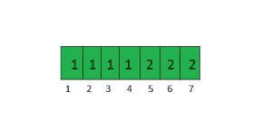

# 从给定集合

中存在的每个节点中查找所有可达节点

> 原文： [https://www.geeksforgeeks.org/find-all-reachable-nodes-from-every-node-present-in-a-given-set/](https://www.geeksforgeeks.org/find-all-reachable-nodes-from-every-node-present-in-a-given-set/)

给定一个无向图和一组顶点，从给定集中存在的每个顶点中找到所有可到达的节点。

考虑下面具有 2 个未连接组件的无向图。


```
arr[] = {1 , 2 , 5}
Reachable nodes from 1 are  1, 2, 3, 4
Reachable nodes from 2 are 1, 2, 3, 4
Reachable nodes from 5 are 5, 6, 7

```

<center>**Method 1 (Simple)**</center>

One straight forward solution is to do a [BFS traversal](https://www.geeksforgeeks.org/breadth-first-traversal-for-a-graph/) for every node present in the set and then find all the reachable nodes.

Assume that we need to find reachable nodes for n nodes, the time complexity for this solution would be O(n*(V+E)) where V is number of nodes in the graph and E is number of edges in the graph. Please note that we need to call BFS as a separate call for every node without using the visited array of previous traversals because a same vertex may need to be printed multiple times. This seems to be an effective solution but consider the case when E = Θ(V<sup>2</sup>) and n = V, time complexity becomes O(V<sup>3</sup>).

<center>**Method 2 (Efficient)**</center>

Since the given graph is undirected, all vertices that belong to same component have same set of reachable nodes. So we keep track of vertex and component mappings. Every component in the graph is assigned a number and every vertex in this component is assigned this number. We use the visit array for this purpose, the array which is used to keep track of visited vertices in BFS.

```
For a node u, 
if visit[u] is 0 then
    u has not been visited before
else // if not zero then
   visit[u] represents the component number. 

For any two nodes u and v belonging to same 
component, visit[u] is equal to visit[v]

```

要存储可达节点，请使用映射`m`，其中键作为组件号，值作为向量，用于存储所有可达节点。

要找到节点`u`的可到达节点，请返回 **m [visit [u]]**

查看下面的伪代码，以了解如何分配组件编号。

```
componentNum = 0
for i=1 to n	
    If visit[i] is NOT 0 then
        componentNum++ 

        // bfs() returns a list (or vector)
        // for given vertex 'i'
        list = bfs(i, componentNum)
        m[visit[i]]] = list

```

对于示例中显示的图形，访问数组将是。

 

对于节点 1、2、3 和 4，组件号为 1。对于节点 5、6 和 7，组件号为 2。

以上想法的 C++实现

```

// C++ program to find all the reachable nodes 
// for every node present in arr[0..n-1]. 
#include <bits/stdc++.h> 
using namespace std; 

// This class represents a directed graph using 
// adjacency list representation 
class Graph 
{ 
public: 
    int V;    // No. of vertices 

    // Pointer to an array containing adjacency lists 
    list<int> *adj; 

    Graph(int );  // Constructor 

    void addEdge(int, int); 

    vector<int> BFS(int, int, int []); 
}; 

Graph::Graph(int V) 
{ 
    this->V = V; 
    adj = new list<int>[V+1]; 
} 

void Graph::addEdge(int u, int v) 
{ 
    adj[u].push_back(v); // Add w to v’s list. 
    adj[v].push_back(u); // Add v to w’s list. 
} 

vector<int> Graph::BFS(int componentNum, int src, 
                                    int visited[]) 
{ 
    // Mark all the vertices as not visited 
    // Create a queue for BFS 
    queue<int> queue; 

    queue.push(src); 

    // Assign Component Number 
    visited[src] = componentNum; 

    // Vector to store all the reachable nodes from 'src' 
    vector<int> reachableNodes; 

    while(!queue.empty()) 
    { 
        // Dequeue a vertex from queue 
        int u = queue.front(); 
        queue.pop(); 

        reachableNodes.push_back(u); 

        // Get all adjacent vertices of the dequeued 
        // vertex u. If a adjacent has not been visited, 
        // then mark it visited nd enqueue it 
        for (auto itr = adj[u].begin(); 
                itr != adj[u].end(); itr++) 
        { 
            if (!visited[*itr]) 
            { 
                // Assign Component Number to all the 
                // reachable nodes 
                visited[*itr] = componentNum; 
                queue.push(*itr); 
            } 
        } 
    } 
    return reachableNodes; 
} 

// Display all the Reachable Nodes from a node 'n' 
void displayReachableNodes(int n, 
            unordered_map <int, vector<int> > m) 
{ 
    vector<int> temp = m[n]; 
    for (int i=0; i<temp.size(); i++) 
        cout << temp[i] << " "; 

    cout << endl; 
} 

// Find all the reachable nodes for every element 
// in the arr 
void findReachableNodes(Graph g, int arr[], int n) 
{ 
    // Get the number of nodes in the graph 
    int V = g.V; 

    // Take a integer visited array and initialize 
    // all the elements with 0 
    int visited[V+1]; 
    memset(visited, 0, sizeof(visited)); 

    // Map to store list of reachable Nodes for a 
    // given node. 
    unordered_map <int, vector<int> > m; 

    // Initialize component Number with 0 
    int componentNum = 0; 

    // For each node in arr[] find reachable 
    // Nodes 
    for (int i = 0 ; i < n ; i++) 
    { 
        int u = arr[i]; 

        // Visit all the nodes of the component 
        if (!visited[u]) 
        { 
            componentNum++; 

            // Store the reachable Nodes corresponding to 
            // the node 'i' 
            m[visited[u]] = g.BFS(componentNum, u, visited); 
        } 

        // At this point, we have all reachable nodes 
        // from u, print them by doing a look up in map m. 
        cout << "Reachable Nodes from " << u <<" are\n"; 
        displayReachableNodes(visited[u], m); 
    } 
} 

// Driver program to test above functions 
int main() 
{ 
    // Create a graph given in the above diagram 
    int V = 7; 
    Graph g(V); 
    g.addEdge(1, 2); 
    g.addEdge(2, 3); 
    g.addEdge(3, 4); 
    g.addEdge(3, 1); 
    g.addEdge(5, 6); 
    g.addEdge(5, 7); 

    // For every ith element in the arr 
    // find all reachable nodes from query[i] 
    int arr[] = {2, 4, 5}; 

    // Find number of elements in Set 
    int n = sizeof(arr)/sizeof(int); 

    findReachableNodes(g, arr, n); 

    return 0; 
} 

```

输出：

```
Reachable Nodes from 2 are
2 1 3 4 
Reachable Nodes from 4 are
2 1 3 4 
Reachable Nodes from 5 are
5 6 7 

```

**时间复杂度分析**：

n =给定集合的大小

E =边数

V =节点数

BFS 的`O(V + E)`

在最坏的情况下，将为给定中存在的每个节点显示所有 V 节点，即图中仅一个组件，因此需要 O（n * V）时间。

最坏情况下的时间复杂度：`O(V + E)`+ O（n * V）

本文由 **Chirag Agarwal** 提供。 如果您喜欢 GeeksforGeeks 并希望做出贡献，则还可以使用 [tribution.geeksforgeeks.org](http://www.contribute.geeksforgeeks.org) 撰写文章，或将您的文章邮寄至 tribution@geeksforgeeks.org。 查看您的文章出现在 GeeksforGeeks 主页上，并帮助其他 Geeks。

如果发现任何不正确的地方，或者想分享有关上述主题的更多信息，请写评论。

