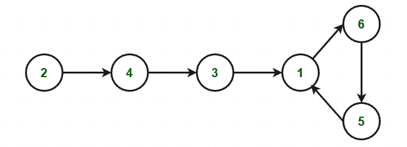

# 在只读数组中找到多个重复元素中的任何一个| 设置 2

> 原文： [https://www.geeksforgeeks.org/find-any-one-of-the-multiple-repeating-elements-in-read-only-array-set-2/](https://www.geeksforgeeks.org/find-any-one-of-the-multiple-repeating-elements-in-read-only-array-set-2/)

给定一个大小为 **N + 1** 的只读[数组](https://www.geeksforgeeks.org/introduction-to-arrays/) **arr []** ，请找到该数组中多个重复元素之一，其中该数组仅包含介于`1`和`N`。

**注意**：只读数组表示无法修改数组的内容。

**示例**：

> **输入**：N = 5，arr [] = {1、1、2、3、5、4}
> **输出**：1
> **说明：[**
> 1 是阵列中唯一重复的数字。
> 
> **输入**：N = 10，arr [] = {10、1、2、3、5、4、9、8、5、6、4}
> **输出**：5
> **说明**：
> 5 是数组中重复的数字之一。

在[先前的文章](https://www.geeksforgeeks.org/find-one-multiple-repeating-elements-read-array/)中，我们讨论了同一篇文章，但篇幅复杂 *`O(N)`和 O（sqrt（N））*。

**方法**：此方法基于 [Floyd 的草龟与野兔算法](//www.geeksforgeeks.org/detect-loop-in-a-linked-list/)（**循环检测算法**）。

1.  使用函数 **f（x）= arr [x]** 构造序列：

    > arr [0]，arr [arr [0]]，arr [arr [arr [0]]]，arr [arr [arr [arr [0]]]]…………。

2.  序列中的每个新元素都是 **arr []** 中前一个元素的索引处的元素。

3.  从 **x = arr [0]** 开始，它将产生一个带循环的链表。

4.  The cycle appears because **arr[]** contains duplicate elements(at least one). The duplicate value is an entrance to the cycle. Given below is an example to show how cycle exists:

    **For Example:** Let the array arr[] = {2, 6, 4, 1, 3, 1, 5}

    <figure class="table">

    | 指数 | 0 | 1 | 2 | 3 | 4 | 5 | 6 |

    | rr | 2 | 6 | 4 | 1 | 3 | 1 | 5 |

    </figure>

    从索引 0 开始，遍历如下所示：

    > arr [0] =`2`– > arr [2] =`4`– > arr [4] =`3`– > arr [ 3] =`1`– > arr [1] =`6`– > arr [6] =`5`– > arr [5] =`1`。

    该序列形成循环，如下所示：

    

5.  算法由两部分组成，并使用两个指针，通常称为**乌龟**和**野兔**。

    *   **兔子= arr [arr [兔子]]** 的速度是**乌龟= arr [草龟]** 的两倍。

    *   由于野兔跑得很快，它将是第一个进入周期并开始绕周期运行的人。

    *   在某些时候，乌龟也会进入循环，因为它移动的速度较慢，所以兔子在某个交叉点将乌龟赶上了。

    *   注意，在一般情况下，交点不是自行车的入口，而是在自行车中间的某个地方相交。

    *   将乌龟移动到序列的起点，兔子保持在周期内，并且以相同的速度移动，即**乌龟= arr [乌龟]** 和**兔子= arr [野兔]** 。 现在它们在重复元素处相交。

下面是上述方法的实现：

## C++

```cpp

// C++ code for the above approach 
#include <bits/stdc++.h> 
using namespace std; 

// Function to find the duplicate 
// value in the given array arr[] 
void findDuplicate(int arr[]) 
{ 

    // Initialise variables 
    int tortoise = arr[0]; 
    int hare = arr[0]; 

    // Loop till we find the 
    // duplicate element 
    while (1) { 

        tortoise = arr[tortoise]; 

        // Hare moves with twice 
        // the speed of tortoise 
        hare = arr[arr[hare]]; 
        if (tortoise == hare) 
            break; 
    } 

    tortoise = arr[0]; 

    // Loop to get start point 
    // of the cycle as start 
    // point will be the duplicate 
    // element 
    while (tortoise != hare) { 
        tortoise = arr[tortoise]; 
        hare = arr[hare]; 
    } 

    // Print the duplicate element 
    cout << tortoise; 
} 

// Driver Code 
int main() 
{ 
    // Given array 
    int arr[] = { 2, 6, 4, 1, 3, 1, 5 }; 

    // Function Call 
    findDuplicate(arr); 

    return 0; 
} 

```

## Java

```java

// Java code for the above approach 
class GFG{ 

// Function to find the duplicate 
// value in the given array arr[] 
static void findDuplicate(int arr[]) 
{ 

    // Initialise variables 
    int tortoise = arr[0]; 
    int hare = arr[0]; 

    // Loop till we find the 
    // duplicate element 
    while (true) 
    { 
        tortoise = arr[tortoise]; 

        // Hare moves with twice 
        // the speed of tortoise 
        hare = arr[arr[hare]]; 
        if (tortoise == hare) 
            break; 
    } 

    tortoise = arr[0]; 

    // Loop to get start point 
    // of the cycle as start 
    // point will be the duplicate 
    // element 
    while (tortoise != hare) 
    { 
        tortoise = arr[tortoise]; 
        hare = arr[hare]; 
    } 

    // Print the duplicate element 
    System.out.print(tortoise); 
} 

// Driver Code 
public static void main (String []args) 
{ 

    // Given array 
    int arr[] = { 2, 6, 4, 1, 3, 1, 5 }; 

    // Function Call 
    findDuplicate(arr); 
}  
} 

// This code is contributed by chitranayal 

```

## Python

```py

# Python3 program for the above approach  

# Function to find the duplicate  
# value in the given array arr[]  
def findDuplicate(arr):  

    # Initialise variables  
    tortoise = arr[0]  
    hare = arr[0] 

    # Loop till we find the  
    # duplicate element  
    while (1):  

        tortoise = arr[tortoise] 

        # Hare moves with twice  
        # the speed of tortoise  
        hare = arr[arr[hare]]  
        if (tortoise == hare):  
            break

    tortoise = arr[0]  

    # Loop to get start point  
    # of the cycle as start  
    # point will be the duplicate  
    # element  
    while (tortoise != hare): 
        tortoise = arr[tortoise]  
        hare = arr[hare] 

    # Print the duplicate element  
    print (tortoise)  

# Driver Code  

# Given array  
arr = [ 2, 6, 4, 1, 3, 1, 5 ] 

# Function Call  
findDuplicate(arr) 

# This code is contributed by PratikBasu 

```

## C#

```cs

// C# program for the above approach 
using System; 

class GFG{ 

// Function to find the duplicate 
// value in the given array []arr 
static void findDuplicate(int []arr) 
{ 

    // Initialise variables 
    int tortoise = arr[0]; 
    int hare = arr[0]; 

    // Loop till we find the 
    // duplicate element 
    while (true) 
    { 
        tortoise = arr[tortoise]; 

        // Hare moves with twice 
        // the speed of tortoise 
        hare = arr[arr[hare]]; 
        if (tortoise == hare) 
            break; 
    } 

    tortoise = arr[0]; 

    // Loop to get start point 
    // of the cycle as start 
    // point will be the duplicate 
    // element 
    while (tortoise != hare) 
    { 
        tortoise = arr[tortoise]; 
        hare = arr[hare]; 
    } 

    // Print the duplicate element 
    Console.Write(tortoise); 
} 

// Driver Code 
public static void Main(String []args) 
{ 

    // Given array 
    int []arr = { 2, 6, 4, 1, 3, 1, 5 }; 

    // Function Call 
    findDuplicate(arr); 
}  
} 

// This code is contributed by Amit Katiyar 

```

**Output:**

```
1

```

**时间复杂度**：*`O(N)`*

**辅助空间**：*`O(1)`*


* * *

* * *

如果您喜欢 GeeksforGeeks 并希望做出贡献，则还可以使用 [tribution.geeksforgeeks.org](https://contribute.geeksforgeeks.org/) 撰写文章，或将您的文章邮寄至 tribution@geeksforgeeks.org。 查看您的文章出现在 GeeksforGeeks 主页上，并帮助其他 Geeks。

如果您发现任何不正确的地方，请单击下面的“改进文章”按钮，以改进本文。