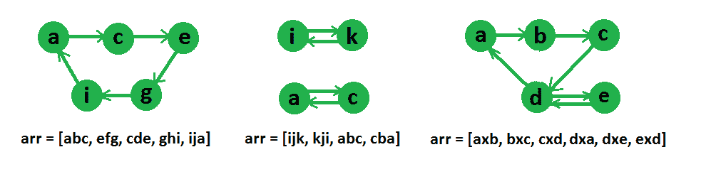

# 查找是否可以将字符串数组链接成一个圆| 设置 2

> 原文： [https://www.geeksforgeeks.org/find-array-strings-can-chained-form-circle-set-2/](https://www.geeksforgeeks.org/find-array-strings-can-chained-form-circle-set-2/)

给定一个字符串数组，查找给定的字符串是否可以链接形成一个圆。 如果 X 的最后一个字符与 Y 的第一个字符相同，则可以将一个字符串 X 放在另一个字符串 Y 之前，放在一个圆圈中。
**示例：**

```
Input: arr[] = {"geek", "king"}
Output: Yes, the given strings can be chained.
Note that the last character of first string is same
as first character of second string and vice versa is
also true.

Input: arr[] = {"for", "geek", "rig", "kaf"}
Output: Yes, the given strings can be chained.
The strings can be chained as "for", "rig", "geek" 
and "kaf"

Input: arr[] = {"aab", "bac", "aaa", "cda"}
Output: Yes, the given strings can be chained.
The strings can be chained as "aaa", "aab", "bac" 
and "cda"

Input: arr[] = {"aaa", "bbb", "baa", "aab"};
Output: Yes, the given strings can be chained.
The strings can be chained as "aaa", "aab", "bbb" 
and "baa"

Input: arr[] = {"aaa"};
Output: Yes

Input: arr[] = {"aaa", "bbb"};
Output: No

Input  : arr[] = ["abc", "efg", "cde", "ghi", "ija"]
Output : Yes
These strings can be reordered as, “abc”, “cde”, “efg”,
“ghi”, “ija”

Input : arr[] = [“ijk”, “kji”, “abc”, “cba”]
Output : No

```

## [我们强烈建议您单击此处并进行实践，然后再继续解决方案。](https://practice.geeksforgeeks.org/problem-page.php?pid=995)

我们在下面的文章中讨论了解决此问题的一种方法。
[查找是否可以将字符串数组链接成一个圆| Set 1](https://www.geeksforgeeks.org/given-array-strings-find-strings-can-chained-form-circle/)
在本文中，讨论了另一种方法。 我们通过将其视为图形问题来解决此问题，其中顶点将是字符串的第一个和最后一个字符，如果两个顶点是同一字符串的第一个和最后一个字符，我们将在两个顶点之间绘制一条边，因此 图中的边将与数组中的字符串数相同。
下图给出了一些字符串数组的图形表示。



现在，在图形表示之后可以清楚地看到，如果图形顶点之间可能存在循环，那么我们可以对字符串重新排序，否则无法重新排序。 如上图示例所示，可以在字符串的第一和第三数组中找到一个循环，而在字符串的第二个数组中找不到一个循环。 现在要检查**此图是否可以具有遍历所有顶点**的循环，我们将检查两个条件，

1.  每个顶点的 Indegree 和 Outdegree 应该相同。
2.  该图应牢固连接。

通过为每个字符保留两个数组，可以很容易地检查第一个条件。 检查一个图是否有一个遍历所有顶点的循环与检查完整的有向图是否牢固连接是相同的，因为如果它有一个遍历所有顶点的循环，那么我们可以从任何其他顶点到达任何顶点 就是说，该图将被牢固地连接，并且对于反向语句也可以给出相同的参数。
现在，为了检查第二种情况，我们将只运行任何字符的 DFS 并从中访问所有可达的顶点，如果图形具有循环，则在此 DFS 之后应访问所有的顶点，如果访问了所有的顶点，则 我们将返回 true，否则返回 false，因此**在单个 DFS 中访问所有顶点会标记字符串**之间的可能排序。

## C ++

```

//    C++ code to check if cyclic order is possible among strings
//  under given constrainsts
#include <bits/stdc++.h>
using namespace std;
#define M 26

//    Utility method for a depth first search among vertices
void dfs(vector<int> g[], int u, vector<bool> &visit)
{
    visit[u] = true;
    for (int i = 0; i < g[u].size(); ++i)
        if(!visit[g[u][i]])
            dfs(g, g[u][i], visit);
}

//    Returns true if all vertices are strongly connected
// i.e. can be made as loop
bool isConnected(vector<int> g[], vector<bool> &mark, int s)
{
    // Initialize all vertices as not visited
    vector<bool> visit(M, false);

    //    perform a dfs from s
    dfs(g, s, visit);

    //    now loop through all characters
    for (int i = 0; i < M; i++)
    {
        /*  I character is marked (i.e. it was first or last
            character of some string) then it should be
            visited in last dfs (as for looping, graph
            should be strongly connected) */
        if (mark[i] && !visit[i])
            return false;
    }

    //    If we reach that means graph is connected
    return true;
}

//    return true if an order among strings is possible
bool possibleOrderAmongString(string arr[], int N)
{
    // Create an empty graph
    vector<int> g[M];

    // Initialize all vertices as not marked
    vector<bool> mark(M, false);

    // Initialize indegree and outdegree of every
    // vertex as 0.
    vector<int> in(M, 0), out(M, 0);

    // Process all strings one by one
    for (int i = 0; i < N; i++)
    {
        // Find first and last characters
        int f = arr[i].front() - 'a';
        int l = arr[i].back() - 'a';

        // Mark the characters
        mark[f] = mark[l] = true;

        //    increase indegree and outdegree count
        in[l]++;
        out[f]++;

        // Add an edge in graph
        g[f].push_back(l);
    }

    // If for any character indegree is not equal to
    // outdegree then ordering is not possible
    for (int i = 0; i < M; i++)
        if (in[i] != out[i])
            return false;

    return isConnected(g, mark, arr[0].front() - 'a');
}

//    Driver code to test above methods
int main()
{
    // string arr[] = {"abc", "efg", "cde", "ghi", "ija"};
    string arr[] = {"ab", "bc", "cd", "de", "ed", "da"};
    int N = sizeof(arr) / sizeof(arr[0]);

    if (possibleOrderAmongString(arr, N) == false)
        cout << "Ordering not possible\n";
    else
        cout << "Ordering is possible\n";
    return 0;
}

```

## Python3

```

# Python3 code to check if 
# cyclic order is possible 
# among strings under given 
# constrainsts
M = 26

# Utility method for a depth 
# first search among vertices 
def dfs(g, u, visit):
    visit[u] = True

    for i in range(len(g[u])):
        if(not visit[g[u][i]]):
            dfs(g, g[u][i], visit)

# Returns true if all vertices 
# are strongly connected i.e. 
# can be made as loop 
def isConnected(g, mark, s):

    # Initialize all vertices 
    # as not visited 
    visit = [False for i in range(M)]

    # Perform a dfs from s
    dfs(g, s, visit)

    # Now loop through 
    # all characters 
    for i in range(M):

        # I character is marked 
        # (i.e. it was first or last 
        # character of some string) 
        # then it should be visited
        # in last dfs (as for looping, 
        # graph should be strongly 
        # connected) */
        if(mark[i] and (not visit[i])):
            return False

    # If we reach that means 
    # graph is connected 
    return True

# return true if an order among 
# strings is possible 
def possibleOrderAmongString(arr, N):

    # Create an empty graph 
    g = {}

    # Initialize all vertices 
    # as not marked 
    mark = [False for i in range(M)]

    # Initialize indegree and 
    # outdegree of every 
    # vertex as 0.
    In = [0 for i in range(M)]
    out = [0 for i in range(M)]

    # Process all strings 
    # one by one 
    for i in range(N):

        # Find first and last 
        # characters 
        f = (ord(arr[i][0]) -
             ord('a'))
        l = (ord(arr[i][-1]) -
             ord('a'))

        # Mark the characters 
        mark[f] = True
        mark[l] = True

        # Increase indegree 
        # and outdegree count 
        In[l] += 1
        out[f] += 1

        if f not in g:
            g[f] = []

        # Add an edge in graph 
        g[f].append(l)

    # If for any character 
    # indegree is not equal to 
    # outdegree then ordering 
    # is not possible 
    for i in range(M):
        if(In[i] != out[i]):
            return False

    return isConnected(g, mark, 
                       ord(arr[0][0]) -
                       ord('a'))

# Driver code
arr = ["ab", "bc", 
       "cd", "de", 
       "ed", "da"]
N = len(arr)
if(possibleOrderAmongString(arr, N) ==
   False):
    print("Ordering not possible")
else:
    print("Ordering is possible")

# This code is contributed by avanitrachhadiya2155

```

**输出：**

```
Ordering is possible

```

本文由 [**Utkarsh Trivedi**](https://in.linkedin.com/in/utkarsh-trivedi-253069a7) 提供。 如果您喜欢 GeeksforGeeks 并希望做出贡献，则还可以使用 [tribution.geeksforgeeks.org](http://www.contribute.geeksforgeeks.org) 撰写文章，或将您的文章邮寄至 tribution@geeksforgeeks.org。 查看您的文章出现在 GeeksforGeeks 主页上，并帮助其他 Geeks。
如果发现任何不正确的内容，或者想分享有关上述主题的更多信息，请发表评论。

