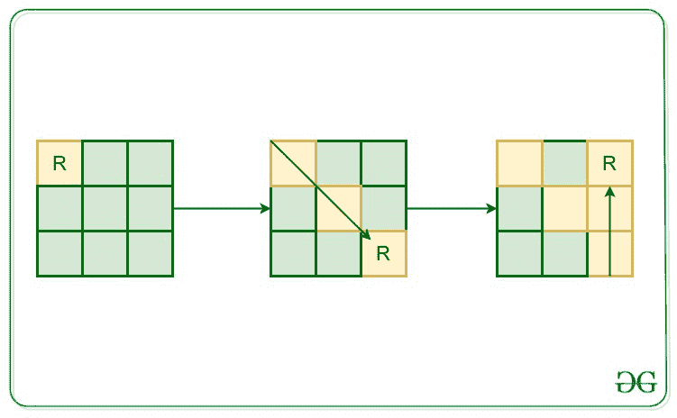

# 在矩阵中查找机器人未进行给定移动的单元格

> 原文： [https://www.geeksforgeeks.org/find-cells-in-matrix-that-are-not-visited-by-robot-for-given-movements/](https://www.geeksforgeeks.org/find-cells-in-matrix-that-are-not-visited-by-robot-for-given-movements/)

给定整数 **N，**表示矩阵的大小，即 **N * N。** 在矩阵的左上角（0，0）上放置了一个机器人，该机器人的移动方向为（N，S，W，E，NE，NW，SE，SW 分别表示北，南，西，东，东北，西北，东南，西南），并给出了在特定方向上的运动持续时间。 任务是在所有风结束时完成机器人的移动之后，找到矩阵的**未访问单元**。

**注意**：机器人只能访问一次单元。 如果机器人在任何时候都无法移动，它将停留在当前位置。 而且，机器人每秒可以移动一步。

**示例**：

> **输入**：N = 3，移动[] = {（0，SE），（2，N）}
> **输出**：4
> **说明：[**
> 
> 
> 
> **输入**：
> N = 5，[move [] =
> {（0，SE），
> （1，NE），
> （2，E），
> （6，SW），
> （15，N），
> （20，W）}
> **输出**：
> 13
> **说明**：
> 机器人移动后，未访问 13 个单元。

**方法**：的想法是使用[递归](http://www.geeksforgeeks.org/recursion/)解决此问题。 首先，将机器人的当前位置设置为（0，0）。 按照给定的方向开始机器人的运动，并标记矩阵访问的单元格。 最后，在机器人标记完全移动之后，对未标记为已访问的矩阵单元进行计数

下面的代码实现了上面讨论的方法：

## C ++

```

// C++ implementation to find the
// unvisited cells of the matrix

#include <bits/stdc++.h>

using namespace std;

// Dimension
// of the board
int n;

// Current location
// of the robot
int curr_i = 0, curr_j = 0;

// Function to move the robot
void moveRobot(
    int n, int i,
    int j, int dx,
    int dy, int& duration,
    vector<vector<bool> >& visited)
{

    // if the robot tends to move
    // out of the board
    // or tends to visit an
    // already visited position
    // or the wind direction is changed
    if (i < 0 || i >= n || j < 0 || j >= n
        || visited[i][j] == true
        || duration == 0) {

        // the robot can't move further
        // under the influence of
        // current wind direction
        return;
    }

    // Change the current location
    // and mark the current
    // position as visited
    curr_i = i;
    curr_j = j;
    visited[i][j] = true;

    // One second passed
    // visiting this position
    duration--;

    moveRobot(n, i + dx, j + dy, dx,
              dy, duration, visited);
}

// Function to find the unvisited
// cells of the matrix after movement
void findUnvisited(
    int p,
    vector<pair<int, string> > periods)
{
    // nXn matrix to store the
    // visited state of positions
    vector<vector<bool> > visited;

    // map to store the wind directions
    unordered_map<string, vector<int> > mp
        = { { "N", { -1, 0 } },
            { "S", { 1, 0 } },
            { "E", { 0, 1 } },
            { "W", { 0, -1 } },
            { "NE", { -1, 1 } },
            { "NW", { -1, -1 } },
            { "SE", { 1, 1 } },
            { "SW", { 1, -1 } } };

    // Initially all of the
    // positions are unvisited
    for (int i = 0; i < n; i++) {
        visited.push_back(vector<bool>{});
        for (int j = 0; j < n; j++) {
            visited[i].push_back(false);
        }
    }

    for (int i = 0; i < p; i++) {
        string dir = periods[i].second;
        int dx = mp[dir][0];
        int dy = mp[dir][1];

        // duration for the which the
        // current direction of wind exists
        int duration;

        if (i < p - 1) {
            // difference of the start time
            // of current wind direction
            // and start time of the
            // upcoming wind direction
            duration
                = periods[i + 1].first
                  - periods[i].first;
        }
        else {
            // the maximum time for which
            // a robot can move is
            // equal to the diagonal
            // length of the square board
            duration = sqrt(2) * n;
        }

        // If its possible to move
        // the robot once in the
        // direction of wind, then
        // move it once and call the
        // recursive function for
        // further movements
        int next_i = curr_i + dx;
        int next_j = curr_j + dy;

        if (next_i >= 0
            && next_i < n
            && next_j >= 0
            && next_j < n
            && visited[next_i][next_j] == false
            && duration > 0) {
            moveRobot(n, next_i,
                      next_j, dx, dy,
                      duration, visited);
        }
    }

    // Variable to store the
    // number of unvisited positions
    int not_visited = 0;

    // traverse over the matrix and
    // keep counting the unvisited positions
    for (int i = 0; i < n; i++) {
        for (int j = 0; j < n; j++) {
            if (visited[i][j] == false) {
                not_visited++;
            }
        }
    }

    cout << not_visited << "\n";
}

// Driver Code
int main()
{

    // Dimension of the board
    n = 5;

    // number of periods
    int p = 6;

    // vector of pairs
    vector<pair<int, string> > periods(p);
    periods[0] = { 0, "SE" };
    periods[1] = { 1, "NE" };
    periods[2] = { 2, "E" };
    periods[3] = { 6, "SW" };
    periods[4] = { 15, "N" };
    periods[5] = { 20, "W" };

    // Function Call
    findUnvisited(p, periods);
    return 0;
}

```

**Output:** 

```
13

```


* * *

* * *

如果您喜欢 GeeksforGeeks 并希望做出贡献，则还可以使用 [tribution.geeksforgeeks.org](https://contribute.geeksforgeeks.org/) 撰写文章，或将您的文章邮寄至 tribution@geeksforgeeks.org。 查看您的文章出现在 GeeksforGeeks 主页上，并帮助其他 Geeks。

如果您发现任何不正确的地方，请单击下面的“改进文章”按钮，以改进本文。