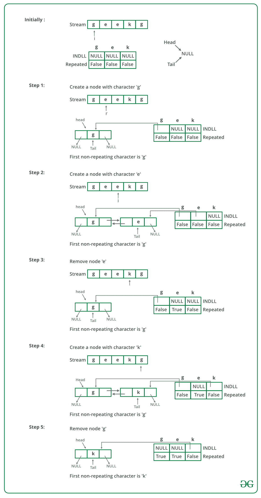

# 从字符流中查找第一个非重复字符

> 原文：[https://www.geeksforgeeks.org/find-first-non-repeating-character-stream-characters/](https://www.geeksforgeeks.org/find-first-non-repeating-character-stream-characters/)

给定字符流，请从流中找到第一个非重复字符。 您需要随时告诉`O(1)`时间中的第一个非重复字符。

如果我们遵循此处讨论的第一种方法[，那么我们需要存储该流，以便我们可以再遍历该流以随时找到第一个非重复字符。 如果我们使用在](https://www.geeksforgeeks.org/given-a-string-find-its-first-non-repeating-character/)[相同文章](https://www.geeksforgeeks.org/given-a-string-find-its-first-non-repeating-character/)中讨论的扩展方法，则每次查询第一个非重复元素时，我们都需要遍历 count 数组。 我们可以随时从流中找到第一个非重复字符，而无需遍历任何数组。

这个想法是使用 [DLL](https://www.geeksforgeeks.org/doubly-linked-list/) （ **D** 整体 **L** 涂有 **L** ist）有效地从 a 中获得第一个非重复字符 流。 DLL 按顺序包含所有非重复字符，即 DLL 的头包含第一个非重复字符，第二个节点包含第二个非重复字符，依此类推。

我们还维护两个数组：一个数组用于维护已被访问两次或两次以上的字符，我们将其称为 repeat []，另一个数组是指向链接列表节点的指针的数组，我们将其称为 inDLL []。 。 两个数组的大小等于字母大小，通常为 256。

1.  创建一个空的 DLL。 还要创建两个数组 inDLL []和重复的[]，其大小为 256。inDLL 是指向 DLL 节点的指针的数组。 repeat []是一个布尔数组，如果 x 重复两次或两次以上，则 repeat [x]为 true，否则为 false。 如果 DLL 中存在字符 x，则 inDLL [x]包含指向 DLL 节点的指针，否则为 NULL。

2.  将 inDLL []的所有条目初始化为 NULL，并将重复的[]初始化为 false。

3.  若要获取第一个非重复字符，请返回 DLL 开头的字符。

4.  以下是在流中处理新字符“ x”的步骤。

    *   如果 repeated [x]为 true，请忽略此字符（x 已在流中重复两次或更多次）

    *   如果 repeated [x]为 false，并且 inDLL [x]为 NULL（x 首次出现）。 将 x 附加到 DLL 并将新 DLL 节点的地址存储在 inDLL [x]中。

    *   如果 repeated [x]为 false 并且 inDLL [x]不为 NULL（第二次看到 x）。 使用 inDLL [x]获取 x 的 DLL 节点并删除该节点。 同样，将 inDLL [x]标记为 NULL，并将重复[x]标记为 true。

请注意，如果我们维护尾指针，则向 DLL 附加新节点是 **`O(1)`**操作。 从 DLL 中删除节点也是 **`O(1)`**。 因此，添加新字符和找到第一个非重复字符这两项操作都需要 **`O(1)`**时间。

下图是上述方法的模拟：



下面是上述方法的实现：

## C / C++

```cpp

// A C++ program to find first 
// non-repeating character 
// from a stream of characters 
#include <iostream> 
#define MAX_CHAR 256 
using namespace std; 

// A linked list node 
struct node { 
    char a; 
    struct node *next, *prev; 
}; 

// A utility function to append a character x at the end 
// of DLL. Note that the function may change head and tail 
// pointers, that is why pointers to these pointers are passed. 
void appendNode(struct node** head_ref, struct node** tail_ref, 
                char x) 
{ 
    struct node* temp = new node; 
    temp->a = x; 
    temp->prev = temp->next = NULL; 

    if (*head_ref == NULL) { 
        *head_ref = *tail_ref = temp; 
        return; 
    } 
    (*tail_ref)->next = temp; 
    temp->prev = *tail_ref; 
    *tail_ref = temp; 
} 

// A utility function to remove a node 'temp' fromt DLL. 
// Note that the function may change head and tail pointers, 
// that is why pointers to these pointers are passed. 
void removeNode(struct node** head_ref, struct node** tail_ref, 
                struct node* temp) 
{ 
    if (*head_ref == NULL) 
        return; 

    if (*head_ref == temp) 
        *head_ref = (*head_ref)->next; 
    if (*tail_ref == temp) 
        *tail_ref = (*tail_ref)->prev; 
    if (temp->next != NULL) 
        temp->next->prev = temp->prev; 
    if (temp->prev != NULL) 
        temp->prev->next = temp->next; 

    delete (temp); 
} 

void findFirstNonRepeating() 
{ 
    // inDLL[x] contains pointer to 
    // a DLL node if x is present 
    // in DLL. If x is not present, then inDLL[x] is NULL 
    struct node* inDLL[MAX_CHAR]; 

    // repeated[x] is true if x is repeated two or more times. 
    // If x is not seen so far or x is seen only once. then 
    // repeated[x] is false 
    bool repeated[MAX_CHAR]; 

    // Initialize the above two arrays 
    struct node *head = NULL, *tail = NULL; 
    for (int i = 0; i < MAX_CHAR; i++) { 
        inDLL[i] = NULL; 
        repeated[i] = false; 
    } 

    // Let us consider following stream and see the process 
    char stream[] = "geeksforgeeksandgeeksquizfor"; 
    for (int i = 0; stream[i]; i++) { 
        char x = stream[i]; 
        cout << "Reading " << x << " from stream n"; 

        // We process this character only if it has not occurred 
        // or occurred only once. repeated[x] is true if x is 
        // repeated twice or more.s 
        if (!repeated[x]) { 
            // If the character is not in DLL, then add this at 
            // the end of DLL. 
            if (inDLL[x] == NULL) { 
                appendNode(&head, &tail, stream[i]); 
                inDLL[x] = tail; 
            } 
            else // Otherwise remove this character from DLL 
            { 
                removeNode(&head, &tail, inDLL[x]); 
                inDLL[x] = NULL; 
                repeated[x] = true; // Also mark it as repeated 
            } 
        } 

        // Print the current first non-repeating character from 
        // stream 
        if (head != NULL) 
            cout << "First non-repeating character so far is "
                 << head->a << endl; 
    } 
} 

/* Driver program to test above function */
int main() 
{ 
    findFirstNonRepeating(); 
    return 0; 
} 

```

## Java

```java

// A Java program to find first non-repeating character 
// from a stream of characters 

import java.util.ArrayList; 
import java.util.List; 

public class NonReapeatingC { 
    final static int MAX_CHAR = 256; 

    static void findFirstNonRepeating() 
    { 
        // inDLL[x] contains pointer to a DLL node if x is present 
        // in DLL. If x is not present, then inDLL[x] is NULL 
        List<Character> inDLL = new ArrayList<Character>(); 

        // repeated[x] is true if x is repeated two or more times. 
        // If x is not seen so far or x is seen only once. then 
        // repeated[x] is false 
        boolean[] repeated = new boolean[MAX_CHAR]; 

        // Let us consider following stream and see the process 
        String stream = "geeksforgeeksandgeeksquizfor"; 
        for (int i = 0; i < stream.length(); i++) { 
            char x = stream.charAt(i); 
            System.out.println("Reading " + x + " from stream n"); 

            // We process this character only if it has not occurred 
            // or occurred only once. repeated[x] is true if x is 
            // repeated twice or more.s 
            if (!repeated[x]) { 
                // If the character is not in DLL, then add this at 
                // the end of DLL. 
                if (!(inDLL.contains(x))) { 
                    inDLL.add(x); 
                } 
                else // Otherwise remove this character from DLL 
                { 
                    inDLL.remove((Character)x); 
                    repeated[x] = true; // Also mark it as repeated 
                } 
            } 

            // Print the current first non-repeating character from 
            // stream 
            if (inDLL.size() != 0) { 
                System.out.print("First non-repeating character so far is "); 
                System.out.println(inDLL.get(0)); 
            } 
        } 
    } 

    /* Driver program to test above function */
    public static void main(String[] args) 
    { 
        findFirstNonRepeating(); 
    } 
} 
// This code is contributed by Sumit Ghosh 

```

## Python3

```py

# A Python program to find first non-repeating character from 
# a stream of characters 
MAX_CHAR = 256

def findFirstNonRepeating(): 

    # inDLL[x] contains pointer to a DLL node if x is present 
    # in DLL. If x is not present, then inDLL[x] is NULL 
    inDLL = [] * MAX_CHAR 

    # repeated[x] is true if x is repeated two or more times. 
    # If x is not seen so far or x is seen only once. then 
    # repeated[x] is false 
    repeated = [False] * MAX_CHAR 

    # Let us consider following stream and see the process 
    stream = "geekforgeekandgeeksandquizfor"
    for i in range(len(stream)): 
        x = stream[i] 
        print ("Reading " + x + " from stream") 

        # We process this character only if it has not occurred 
        # or occurred only once. repeated[x] is true if x is 
        # repeated twice or more.s 
        if not repeated[ord(x)]: 

            # If the character is not in DLL, then add this 
            # at the end of DLL 
            if not x in inDLL: 
                inDLL.append(x) 
            else: 
                inDLL.remove(x) 
                repeated[ord(x)] = True

        if len(inDLL) != 0: 
            print ("First non-repeating character so far is ") 
            print (str(inDLL[0])) 

# Driver program 
findFirstNonRepeating() 

# This code is contributed by BHAVYA JAIN 

```

## C#

```cs

// A C# program to find first non-repeating character 
// from a stream of characters 
using System; 
using System.Collections.Generic; 

public class NonReapeatingC { 
    readonly static int MAX_CHAR = 256; 

    static void findFirstNonRepeating() 
    { 
        // inDLL[x] contains pointer to a DLL node if x is present 
        // in DLL. If x is not present, then inDLL[x] is NULL 
        List<char> inDLL = new List<char>(); 

        // repeated[x] is true if x is repeated two or more times. 
        // If x is not seen so far or x is seen only once. then 
        // repeated[x] is false 
        bool[] repeated = new bool[MAX_CHAR]; 

        // Let us consider following stream and see the process 
        String stream = "geeksforgeeksandgeeksquizfor"; 
        for (int i = 0; i < stream.Length; i++) { 
            char x = stream[i]; 
            Console.WriteLine("Reading " + x + " from stream n"); 

            // We process this character only if it has not occurred 
            // or occurred only once. repeated[x] is true if x is 
            // repeated twice or more.s 
            if (!repeated[x]) { 
                // If the character is not in DLL, then add this at 
                // the end of DLL. 
                if (!(inDLL.Contains(x))) { 
                    inDLL.Add(x); 
                } 
                else // Otherwise remove this character from DLL 
                { 
                    inDLL.Remove((char)x); 
                    repeated[x] = true; // Also mark it as repeated 
                } 
            } 

            // Print the current first non-repeating character from 
            // stream 
            if (inDLL.Count != 0) { 
                Console.Write("First non-repeating character so far is "); 
                Console.WriteLine(inDLL[0]); 
            } 
        } 
    } 

    /* Driver code*/
    public static void Main(String[] args) 
    { 
        findFirstNonRepeating(); 
    } 
} 

// This code has been contributed by 29AjayKumar 

```

**Output:**

```
Reading g from stream
First non-repeating character so far is g
Reading e from stream
First non-repeating character so far is g
Reading e from stream
First non-repeating character so far is g
Reading k from stream
First non-repeating character so far is g
Reading s from stream
First non-repeating character so far is g
Reading f from stream
First non-repeating character so far is g
Reading o from stream
First non-repeating character so far is g
Reading r from stream
First non-repeating character so far is g
Reading g from stream
First non-repeating character so far is k
Reading e from stream
First non-repeating character so far is k
Reading e from stream
First non-repeating character so far is k
Reading k from stream
First non-repeating character so far is s
Reading s from stream
First non-repeating character so far is f
Reading a from stream
First non-repeating character so far is f
Reading n from stream
First non-repeating character so far is f
Reading d from stream
First non-repeating character so far is f
Reading g from stream
First non-repeating character so far is f
Reading e from stream
First non-repeating character so far is f
Reading e from stream
First non-repeating character so far is f
Reading k from stream
First non-repeating character so far is f
Reading s from stream
First non-repeating character so far is f
Reading q from stream
First non-repeating character so far is f
Reading u from stream
First non-repeating character so far is f
Reading i from stream
First non-repeating character so far is f
Reading z from stream
First non-repeating character so far is f
Reading f from stream
First non-repeating character so far is o
Reading o from stream
First non-repeating character so far is r
Reading r from stream
First non-repeating character so far is a
```

本文由 [**Amit Jain**](http://in.linkedin.com/in/amitjainju) 贡献。 如果发现任何不正确的地方，或者想分享有关上述主题的更多信息，请写评论。

