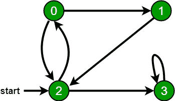

# 查找有向图中两个顶点之间是否存在路径 | 系列 2

> 原文： [https://www.geeksforgeeks.org/find-if-there-is-a-path-between-two-vertices-in-a-directed-graph-set-2/](https://www.geeksforgeeks.org/find-if-there-is-a-path-between-two-vertices-in-a-directed-graph-set-2/)

给定一个有向图和其中两个顶点，请检查是否存在从第一个给定顶点到第二个顶点的路径。

**例如**：[

> **考虑以下图表**：[
> 
> 
> 
> **输入**：（u，v）=（1，3）
> **输出**：是
> **说明**：1 至 3，1-> 2-> 3
> 
> **输入**：（u，v）=（3，6）
> **输出**：否
> **说明**：3 至 6

[这里讨论了](https://www.geeksforgeeks.org/find-if-there-is-a-path-between-two-vertices-in-a-given-graph/) [BFS](http://www.geeksforgeeks.org/breadth-first-traversal-for-a-graph/) 或 [DFS](http://www.geeksforgeeks.org/depth-first-traversal-for-a-graph/) 的解决方案。

**方法**：在这里，我们将讨论使用 [Floyd Warshall 算法](https://www.geeksforgeeks.org/floyd-warshall-algorithm-dp-16/)的基于[动态编程](https://www.geeksforgeeks.org/dynamic-programming/)的解决方案。

*   创建一个布尔 2D 矩阵 **mat** ，如果存在从顶点`i`到`j`的路径，则 **mat [i] [j]** 为真 ]。

*   对于每个起始顶点`i`和结束顶点`j`，对所有中间顶点`k`进行迭代，并检查`i`是否存在到达`j`至`k`，然后将 **mat [i] [j]** 标记为 true。

*   最后检查 **mat [u] [v]** 是否为 true，然后返回 true，否则返回 false。

下面是上述方法的实现：

## C++

```cpp

// C++ program to find if there is a
// path between two vertices in a
// directed graph using Dynamic Programming

#include <bits/stdc++.h>
using namespace std;
#define X 6
#define Z 2

// function to find if there is a
// path between two vertices in a
// directed graph
bool existPath(int V, int edges[X][Z],
               int u, int v)
{
    // dp matrix
    bool mat[V][V];
    memset(mat, false, sizeof(mat));

    // set dp[i][j]=true if there is
    // edge between i to j
    for (int i = 0; i < X; i++)
        mat[edges[i][0]][edges[i][1]] = true;

    // check for all intermediate vertex
    for (int k = 0; k < V; k++) {
        for (int i = 0; i < V; i++) {
            for (int j = 0; j < V; j++) {

                mat[i][j] = mat[i][j]
                            || mat[i][k]
                                   && mat[k][j];
            }
        }
    }

    // if vertex is invalid
    if (u >= V || v >= V) {
        return false;
    }

    // if there is a path
    if (mat[u][v])
        return true;
    return false;
}

// Driver function
int main()
{
    int V = 4;
    int edges[X][Z]
        = { { 0, 2 }, { 0, 1 },
            { 1, 2 }, { 2, 3 },
            { 2, 0 }, { 3, 3 } };
    int u = 1, v = 3;

    if (existPath(V, edges, u, v))
        cout << "Yes\n";
    else
        cout << "No\n";
    return 0;
}

```

## Java

```java

// Java program to find if there is a path 
// between two vertices in a directed graph
// using Dynamic Programming
import java.util.*;

class GFG{

static final int X = 6;
static final int Z = 2;

// Function to find if there is a
// path between two vertices in a
// directed graph
static boolean existPath(int V, int edges[][],
                         int u, int v)
{

    // mat matrix
    boolean [][]mat = new boolean[V][V];

    // set mat[i][j]=true if there is
    // edge between i to j
    for (int i = 0; i < X; i++)
        mat[edges[i][0]][edges[i][1]] = true;

    // Check for all intermediate vertex
    for(int k = 0; k < V; k++) 
    {
        for(int i = 0; i < V; i++) 
        {
            for(int j = 0; j < V; j++)
            {
                mat[i][j] = mat[i][j] || 
                            mat[i][k] &&
                            mat[k][j];
            }
        }
    }

    // If vertex is invalid
    if (u >= V || v >= V)
    {
        return false;
    }

    // If there is a path
    if (mat[u][v])
        return true;
    return false;
}

// Driver code
public static void main(String[] args)
{
    int V = 4;
    int edges[][] = { { 0, 2 }, { 0, 1 },
                      { 1, 2 }, { 2, 3 },
                      { 2, 0 }, { 3, 3 } };
    int u = 1, v = 3;

    if (existPath(V, edges, u, v))
        System.out.print("Yes\n");
    else
        System.out.print("No\n");
}
}

// This code is contributed by Princi Singh

```

## Python

```py

# Python3 program to find if there
# is a path between two vertices in a
# directed graph using Dynamic Programming
X = 6
Z = 2

# Function to find if there is a
# path between two vertices in a
# directed graph
def existPath(V, edges, u, v):

    # dp matrix
    mat = [[False for i in range(V)] 
                  for j in range(V)]

    # Set dp[i][j]=true if there is
    # edge between i to j
    for i in range(X):
        mat[edges[i][0]][edges[i][1]] = True

    # Check for all intermediate vertex
    for k in range(V):
        for i in range(V):
            for j in range(V):
                mat[i][j] = (mat[i][j] or
                             mat[i][k] and
                             mat[k][j])

    # If vertex is invalid
    if (u >= V or v >= V):
        return False

    # If there is a path
    if (mat[u][v]):
        return True

    return False

# Driver code 
V = 4
edges = [ [ 0, 2 ], [ 0, 1 ],
          [ 1, 2 ], [ 2, 3 ],
          [ 2, 0 ], [ 3, 3 ] ]

u, v = 1, 3

if (existPath(V, edges, u, v)):
    print("Yes")
else:
    print("No")

# This code is contributed by divyeshrabadiya07

```

## C#

```cs

// C# program to find if there is a path 
// between two vertices in a directed graph
// using Dynamic Programming
using System;
class GFG{

static readonly int X = 6;
static readonly int Z = 2;

// Function to find if there is a
// path between two vertices in a
// directed graph
static bool existPath(int V, int [,]edges,
                      int u, int v)
{

    // mat matrix
    bool [,]mat = new bool[V, V];

    // set mat[i,j]=true if there is
    // edge between i to j
    for (int i = 0; i < X; i++)
        mat[edges[i, 0], edges[i, 1]] = true;

    // Check for all intermediate vertex
    for(int k = 0; k < V; k++) 
    {
        for(int i = 0; i < V; i++) 
        {
            for(int j = 0; j < V; j++)
            {
                mat[i, j] = mat[i, j] || 
                            mat[i, k] &&
                            mat[k, j];
            }
        }
    }

    // If vertex is invalid
    if (u >= V || v >= V)
    {
        return false;
    }

    // If there is a path
    if (mat[u, v])
        return true;
    return false;
}

// Driver code
public static void Main(String[] args)
{
    int V = 4;
    int [,]edges = { { 0, 2 }, { 0, 1 },
                     { 1, 2 }, { 2, 3 },
                     { 2, 0 }, { 3, 3 } };
    int u = 1, v = 3;

    if (existPath(V, edges, u, v))
        Console.Write("Yes\n");
    else
        Console.Write("No\n");
}
}

// This code is contributed by sapnasingh4991

```

**Output:** 

```
Yes

```

***时间复杂度**：O（V <sup>3</sup>* ）

**辅助空间**：O（V <sup>2</sup> ）


* * *

* * *

如果您喜欢 GeeksforGeeks 并希望做出贡献，则还可以使用 [tribution.geeksforgeeks.org](https://contribute.geeksforgeeks.org/) 撰写文章，或将您的文章邮寄至 tribution@geeksforgeeks.org。 查看您的文章出现在 GeeksforGeeks 主页上，并帮助其他 Geeks。

如果您发现任何不正确的地方，请单击下面的“改进文章”按钮，以改进本文。