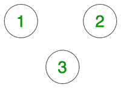
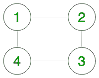

# 查找无向图

中两个顶点之间是否存在路径

> 原文： [https://www.geeksforgeeks.org/find-if-there-is-a-path-between-two-vertices-in-an-undirected-graph/](https://www.geeksforgeeks.org/find-if-there-is-a-path-between-two-vertices-in-an-undirected-graph/)

给定一个**无向图**，它具有`N`个顶点和`E`边以及该图中的两个顶点**（U，V）**， 检测两个顶点之间是否存在路径。 如果存在路径，则打印*为“是”* ，否则为*为“否”* 。

**示例**：

> 
> 
> U = 1，V = 2
> **输出**：否
> **说明**：
> 两点之间没有边，因此无法从 2 到达 2 1。
> 
> **输入**：
> 
> 
> 
> U = 1，V = 3
> **输出**：是
> **说明**：顶点 3 从顶点 1 经由顶点 2 或 4。

**天真的方法**：
的想法是使用 [Floyd Warshall 算法](http://www.geeksforgeeks.org/dynamic-programming-set-16-floyd-warshall-algorithm/)。 为了解决该问题，我们需要尝试所有范围为 **[1，N]** 的中间顶点，然后检查：

1.  如果两个节点之间已经存在直接边缘。
2.  或者，我们具有从节点`i`到中间节点`k`的路径，以及从节点`k`到节点`j`的路径。

下面是上述方法的实现：

## C++

```cpp

// C++ program to detect if a path
// exists between any two vertices
// for the given undirected graph
#include <bits/stdc++.h>
using namespace std;

// Class representing a undirected
// graph using matrix
// representation
class Graph {
    int V;
    int** g;

public:
    Graph(int V);

    // Function to add an edge to graph
    void addEdge(int v, int w);

    // Function to check if
    // there exists a path or not
    bool isReachable(int s, int d);

    // function to compute paths
    // in the matrix using
    // Floyd Warshall Algorithm
    void computePaths();
};

Graph::Graph(int V)
{
    this->V = V;
    g = new int*[V + 1];
    for (int i = 1; i < V + 1; i++) {
        // Rows may not be contiguous
        g[i] = new int[V + 1];

        // Initialize all entries
        // as false to indicate
        // that there are
        // no edges initially
        memset(g[i], 0, (V + 1) * sizeof(int));
    }

    // Initializing node to itself
    // as it is always reachable
    for (int i = 1; i <= V; i++)
        g[i][i] = 1;
}

// Function to add edge between nodes
void Graph::addEdge(int v, int w)
{
    g[v][w] = 1;
    g[w][v] = 1;
}

// Function to compute the path
void Graph::computePaths()
{
    // Use Floyd Warshall algorithm
    // to detect if a path exists
    for (int k = 1; k <= V; k++) {

        // Try every vertex as an
        // intermediate vertex
        // to check if a path exists
        for (int i = 1; i <= V; i++) {
            for (int j = 1; j <= V; j++)
                g[i][j] = g[i][j]
                          | (g[i][k]
                             && g[k][j]);
        }
    }
}

// Function to check if nodes are reachable
bool Graph::isReachable(int s, int d)
{

    if (g[s][d] == 1)
        return true;
    else
        return false;
}

// Driver code
int main()
{

    Graph _g(4);
    _g.addEdge(1, 2);
    _g.addEdge(2, 3);
    _g.addEdge(1, 4);
    _g.computePaths();

    int u = 4, v = 3;
    if (_g.isReachable(u, v))
        cout << "Yes\n";
    else
        cout << "No\n";

    return 0;
}

```

## Python3

```

# Python3 program to detect if a path 
# exists between any two vertices 
# for the given undirected graph 

# Class representing a undirected 
# graph using matrix 
# representation 
class Graph:

    def __init__(self, V):

        self.V = V

        # Initialize all entries 
        # as false to indicate 
        # that there are 
        # no edges initially 
        self.g = [[0 for j in range(self.V + 1)]
                     for i in range(self.V + 1)]

        # Initializing node to itself 
        # as it is always reachable
        for i in range(self.V + 1):
            self.g[i][i] = 1

    # Function to add edge between nodes 
    def addEdge(self, v, w):

        self.g[v][w] = 1
        self.g[w][v] = 1

    # Function to compute the path 
    def computePaths(self):

        # Use Floyd Warshall algorithm 
        # to detect if a path exists 
        for k in range(1, self.V + 1):

            # Try every vertex as an 
            # intermediate vertex 
            # to check if a path exists
            for i in range(1, self.V + 1):
                for j in range(1, self.V + 1):
                    self.g[i][j] = (self.g[i][j] | 
                                   (self.g[i][k] and
                                    self.g[k][j]))

    # Function to check if nodes
    # are reachable 
    def isReachable(self, s, d):

        if (self.g[s][d] == 1):
            return True
        else:
            return False

# Driver code 
if __name__=='__main__':

    _g = Graph(4) 
    _g.addEdge(1, 2)
    _g.addEdge(2, 3) 
    _g.addEdge(1, 4) 
    _g.computePaths() 

    u = 4
    v = 3

    if (_g.isReachable(u, v)):
        print('Yes')
    else:
        print('No')

# This code is contributed by rutvik_56

```

**Output:** 

```
Yes
```

***时间复杂度**：O（V <sup>3</sup> ）*
***辅助空间**：O（V <sup>2</sup> ）*

**高效解决方案**，
我们可以使用 [BFS](http://www.geeksforgeeks.org/breadth-first-traversal-for-a-graph/) 或 [DFS](http://www.geeksforgeeks.org/depth-first-traversal-for-a-graph/) 查找从 u 到 v 的路径。以下是基于 BFS 的解决方案

## C++

```cpp

// C++ program to check if there is exist a path between
// two vertices of an undirected graph.
#include <iostream>
#include <list>
using namespace std;

// This class represents an undirected graph
// using adjacency list representation
class Graph {
    int V; // No. of vertices

    // Pointer to an array containing adjacency lists
    list<int>* adj; 
public:
    Graph(int V); // Constructor

    // function to add an edge to graph
    void addEdge(int v, int w); 
    bool isReachable(int s, int d);
};

Graph::Graph(int V)
{
    this->V = V;
    adj = new list<int>[V];
}

void Graph::addEdge(int v, int w)
{
    adj[v].push_back(w);
    adj[w].push_back(v);
}

// A BFS based function to check whether d is reachable from s.
bool Graph::isReachable(int s, int d)
{
    // Base case
    if (s == d)
        return true;

    // Mark all the vertices as not visited
    bool* visited = new bool[V];
    for (int i = 0; i < V; i++)
        visited[i] = false;

    // Create a queue for BFS
    list<int> queue;

    // Mark the current node as visited and enqueue it
    visited[s] = true;
    queue.push_back(s);

    // it will be used to get all adjacent vertices of a vertex
    list<int>::iterator i;

    while (!queue.empty()) {
        // Dequeue a vertex from queue and print it
        s = queue.front();
        queue.pop_front();

        // Get all adjacent vertices of the dequeued vertex s
        // If a adjacent has not been visited, then mark it
        // visited  and enqueue it
        for (i = adj[s].begin(); i != adj[s].end(); ++i) {

            // If this adjacent node is the destination node, 
            // then return true
            if (*i == d)
                return true;

            // Else, continue to do BFS
            if (!visited[*i]) {
                visited[*i] = true;
                queue.push_back(*i);
            }
        }
    }

    // If BFS is complete without visiting d
    return false;
}

// Driver program to test methods of graph class
int main()
{
    // Create a graph given in the above diagram
    Graph g(4);
    g.addEdge(0, 1);
    g.addEdge(0, 2);
    g.addEdge(1, 2);
    g.addEdge(2, 0);
    g.addEdge(2, 3);
    g.addEdge(3, 3);

    int u = 1, v = 3;
    if (g.isReachable(u, v))
        cout << "\n There is a path from " << u << " to " << v;
    else
        cout << "\n There is no path from " << u << " to " << v;

    return 0;
}

```

**Output:** 

```
There is a path from 1 to 3
```

***时间复杂度**：O（V + E）*
***辅助空间**：O（V）*


* * *

* * *

如果您喜欢 GeeksforGeeks 并希望做出贡献，则还可以使用 [tribution.geeksforgeeks.org](https://contribute.geeksforgeeks.org/) 撰写文章，或将您的文章邮寄至 tribution@geeksforgeeks.org。 查看您的文章出现在 GeeksforGeeks 主页上，并帮助其他 Geeks。

如果您发现任何不正确的地方，请单击下面的“改进文章”按钮，以改进本文。