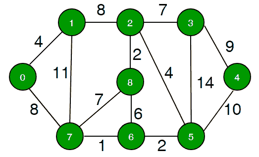

# 查找到源

的路径长度是否超过 k

> 原文： [https://www.geeksforgeeks.org/find-if-there-is-a-path-of-more-than-k-length-from-a-source/](https://www.geeksforgeeks.org/find-if-there-is-a-path-of-more-than-k-length-from-a-source/)

给定一个图，图中的一个源顶点和一个数字 k，请确定是否存在从给定源开始并在任何其他顶点处结束的简单路径（无周期）。

```


Example:
Input  : Source s = 0, k = 58
Output : True
There exists a simple path 0 -> 7 -> 1
-> 2 -> 8 -> 6 -> 5 -> 3 -> 4
Which has a total distance of 60 km which
is more than 58.

Input  : Source s = 0, k = 62
Output : False

In the above graph, the longest simple
path has distance 61 (0 -> 7 -> 1-> 2
 -> 3 -> 4 -> 5-> 6 -> 8, so output 
should be false for any input greater 
than 61.

```

**我们强烈建议您最小化浏览器，然后自己尝试。**

需要注意的重要一件事是，简单地执行 BFS 或 DFS 并在每个步骤中选择最长的边缘是行不通的。 原因是，较短的边缘会由于较高的重量边缘连接而产生较长的路径。

这个想法是使用回溯。 我们从给定的源开始，探索当前顶点的所有路径。 我们跟踪到源的当前距离。 如果距离大于 k，则返回 true。 如果一条路径的距离不超过 k，我们将回溯。

我们如何确保路径简单并且不会循环循环？ 这个想法是要跟踪数组中当前路径的顶点。 每当我们将顶点添加到路径时，我们都会检查该顶点在当前路径中是否已经存在。 如果存在，我们将忽略边缘。

以下是上述想法的实现。

## C++

```cpp

// Program to find if there is a simple path with 
// weight more than k 
#include<bits/stdc++.h> 
using namespace std; 

// iPair ==>  Integer Pair 
typedef pair<int, int> iPair; 

// This class represents a dipathted graph using 
// adjacency list representation 
class Graph 
{ 
    int V;    // No. of vertices 

    // In a weighted graph, we need to store vertex 
    // and weight pair for every edge 
    list< pair<int, int> > *adj; 
    bool pathMoreThanKUtil(int src, int k, vector<bool> &path); 

public: 
    Graph(int V);  // Constructor 

    // function to add an edge to graph 
    void addEdge(int u, int v, int w); 
    bool pathMoreThanK(int src, int k); 
}; 

// Returns true if graph has path more than k length 
bool Graph::pathMoreThanK(int src, int k) 
{ 
    // Create a path array with nothing included 
    // in path 
    vector<bool> path(V, false); 

    // Add source vertex to path 
    path[src] = 1; 

    return pathMoreThanKUtil(src, k, path); 
} 

// Prints shortest paths from src to all other vertices 
bool Graph::pathMoreThanKUtil(int src, int k, vector<bool> &path) 
{ 
    // If k is 0 or negative, return true; 
    if (k <= 0) 
        return true; 

    // Get all adjacent vertices of source vertex src and 
    // recursively explore all paths from src. 
    list<iPair>::iterator i; 
    for (i = adj[src].begin(); i != adj[src].end(); ++i) 
    { 
        // Get adjacent vertex and weight of edge 
        int v = (*i).first; 
        int w = (*i).second; 

        // If vertex v is already there in path, then 
        // there is a cycle (we ignore this edge) 
        if (path[v] == true) 
            continue; 

        // If weight of is more than k, return true 
        if (w >= k) 
            return true; 

        // Else add this vertex to path 
        path[v] = true; 

        // If this adjacent can provide a path longer 
        // than k, return true. 
        if (pathMoreThanKUtil(v, k-w, path)) 
            return true; 

        // Backtrack 
        path[v] = false; 
    } 

    // If no adjacent could produce longer path, return 
    // false 
    return false; 
} 

// Allocates memory for adjacency list 
Graph::Graph(int V) 
{ 
    this->V = V; 
    adj = new list<iPair> [V]; 
} 

// Utility function to an edge (u, v) of weight w 
void Graph::addEdge(int u, int v, int w) 
{ 
    adj[u].push_back(make_pair(v, w)); 
    adj[v].push_back(make_pair(u, w)); 
} 

// Driver program to test methods of graph class 
int main() 
{ 
    // create the graph given in above fugure 
    int V = 9; 
    Graph g(V); 

    //  making above shown graph 
    g.addEdge(0, 1, 4); 
    g.addEdge(0, 7, 8); 
    g.addEdge(1, 2, 8); 
    g.addEdge(1, 7, 11); 
    g.addEdge(2, 3, 7); 
    g.addEdge(2, 8, 2); 
    g.addEdge(2, 5, 4); 
    g.addEdge(3, 4, 9); 
    g.addEdge(3, 5, 14); 
    g.addEdge(4, 5, 10); 
    g.addEdge(5, 6, 2); 
    g.addEdge(6, 7, 1); 
    g.addEdge(6, 8, 6); 
    g.addEdge(7, 8, 7); 

    int src = 0; 
    int k = 62; 
    g.pathMoreThanK(src, k)? cout << "Yes\n" : 
                             cout << "No\n"; 

    k = 60; 
    g.pathMoreThanK(src, k)? cout << "Yes\n" : 
                             cout << "No\n"; 

    return 0; 
} 

```