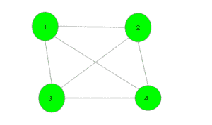
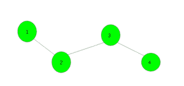

# 在图形中查找与至少一个剩余顶点连接的 K 个顶点

> 原文： [https://www.geeksforgeeks.org/find-k-vertices-in-the-graph-which-are-connected-to-at-least-one-of-remaining-vertices/](https://www.geeksforgeeks.org/find-k-vertices-in-the-graph-which-are-connected-to-at-least-one-of-remaining-vertices/)

给定一个`N`个顶点的连通图。 任务是从图中选择 k（k 必须小于或等于 n / 2，不一定是最小）个顶点，以使所有这些选择的顶点都连接到至少一个未选择的顶点。 如果有多个答案，请打印其中任何一个。

**示例**：

> **输入**：
> 
> **输出**：1
> 顶点 1 连接到所有其他非选定顶点。
> {1，2}，{2，3}，{3，4}，{1，3}，{1，4}，{2，4}也是有效答案
> 
> **输入**：
> 
> **输出**：1 3
> 顶点 1、3 连接到所有其他非选定顶点。 {2，4}也是有效答案。

**有效方法**：一种有效的方法是使用简单的 [dfs](http://www.geeksforgeeks.org/depth-first-traversal-for-a-graph/) 或 [bfs](http://www.geeksforgeeks.org/breadth-first-traversal-for-a-graph/) 函数查找偶数级和奇数级的顶点。 然后，如果奇数级的顶点小于偶数级的顶点，则打印奇数级的顶点。 否则，打印偶数个水平顶点。

下面是上述方法的实现：

## C ++

```

// C++ program to find K vertices in  
// the graph which are connected to at  
// least one of remaining vertices 
#include <bits/stdc++.h> 
using namespace std; 
#define N 200005 

// To store graph 
int n, m, vis[N]; 
vector<int> gr[N]; 
vector<int> v[2]; 

// Function to add edge 
void add_edges(int x, int y) 
{ 
    gr[x].push_back(y); 
    gr[y].push_back(x); 
} 

// Function to find level of each node 
void dfs(int x, int state) 
{ 
    // Push the vertex in respected level 
    v[state].push_back(x); 

    // Make vertex visited 
    vis[x] = 1; 

    // Traverse for all it's child nodes 
    for (auto i : gr[x]) 
        if (vis[i] == 0) 
            dfs(i, state ^ 1); 
} 

// Function to print vertices 
void Print_vertices() 
{ 
    // If odd level vertices are less 
    if (v[0].size() < v[1].size()) { 
        for (auto i : v[0]) 
            cout << i << " "; 
    } 
    // If even level vertices are less 
    else { 
        for (auto i : v[1]) 
            cout << i << " "; 
    } 
} 

// Driver code 
int main() 
{ 
    int n = 4, m = 3; 

    // Add edges 
    add_edges(1, 2); 
    add_edges(2, 3); 
    add_edges(3, 4); 

    // Function call 
    dfs(1, 0); 

    Print_vertices(); 

    return 0; 
} 

```