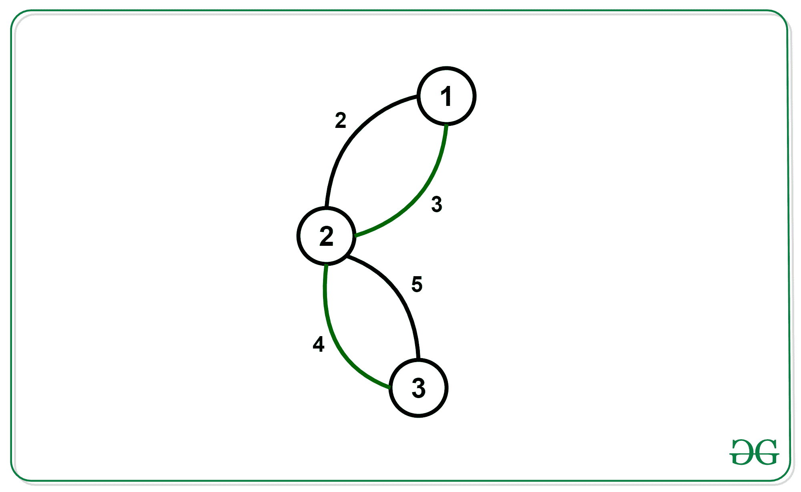

# 找出边交替的最小生成树

> 原文： [https://www.geeksforgeeks.org/find-the-minimum-spanning-tree-with-alternating-colored-edges/](https://www.geeksforgeeks.org/find-the-minimum-spanning-tree-with-alternating-colored-edges/)

给定一个具有 N 个节点和 M 个边的图形，其中每个边都有一种颜色（黑色或绿色）以及与之相关的成本。 找到图的最小生成树，以使树中的每个路径都由交替的彩色边组成。

**示例**：

> **输入**：N = 3，M = 4
> 
> **输出**：6
> 
> **输入**：N = 4，M = 6
> 
> **输出**：4

**方法**：

*   我们在这里进行的第一个观察是，每一种此类的生成树都是链。 为了证明这一点，假设我们有一棵不是链的树，并且其中的每条路径都由交替的边组成。 然后我们可以推断出至少 1 个节点的阶数为 3。在这 3 个边中，至少 2 个具有相同的颜色。 使用这两个边的路径将永远不会遵循条件，因此，此类树始终是链。

*   现在我们可以使用 bitmask-dp

    dp [mask（2 ^ n）] [Node（n）] [col_of_last_edge（2）]找到一条成本最低且边交替的链，其中 mask 是我们节点的位掩码 已添加到链中。 Node 是我们添加到链中的最后一个节点。col_of_last_edge 是用于连接 Node 的边的颜色。

*   为了从 1 状态过渡到另一状态，我们访问最后一个节点的邻接列表，并使用颜色为！= col_of_last_edge 的边。

下面是上述方法的实现：

## C++

```cpp

// C++ program for the 
// above approach 
#include <bits/stdc++.h> 
using namespace std; 

int graph[18][18][2]; 

// Initializing dp of size = 
// (2^18)*18*2\. 
long long dp[1 << 18][18][2]; 

// Recursive Function to calculate 
// Minimum Cost with alternate  
// colour edges 
long long minCost(int n, int m, int mask, int prev, int col) 
{ 
    // Base case 
    if (mask == ((1 << n) - 1)) { 
        return 0; 
    } 
    // If already calculated 
    if (dp[mask][prev][col == 1] != 0) { 
        return dp[mask][prev][col == 1]; 
    } 

    long long ans = 1e9; 

    for (int i = 0; i < n; i++) { 
        for (int j = 0; j < 2; j++) { 
            // Masking previous edges 
            // as explained in above formula. 
            if (graph[prev][i][j] && !(mask & (1 << i))  
                && (j != col)) { 
                long long z = graph[prev][i][j] +  
                              minCost(n,m,mask|(1<<i),i,j); 
                ans = min(z, ans); 
            } 
        } 
    } 

    return dp[mask][prev][col == 1] = ans; 
} 

// Function to Adjacency 
// List Representation  
// of a Graph 
void makeGraph(vector<pair<pair<int,int>, 
                      pair<int,char>>>& vp,int m){ 

  for (int i = 0; i < m; i++) { 
    int a = vp[i].first.first - 1; 
    int b = vp[i].first.second - 1; 
    int cost = vp[i].second.first; 
    char color = vp[i].second.second; 
    graph[a][b][color == 'W'] = cost; 
    graph[b][a][color == 'W'] = cost; 
  } 
} 

// Function to getCost 
// for the Minimum Spanning 
// Tree Formed 
int getCost(int n,int m){ 

    // Assigning maximum 
    // possible value. 
    long long ans = 1e9; 

    for (int i = 0; i < n; i++) { 
        ans = min(ans, minCost(n, m, 1 << i, i, 2)); 
    } 

    if (ans != 1e9) { 
        return ans; 
    } 
    else { 
        return -1; 
    } 
} 

// Driver code 
int main() 
{ 
    int n = 3, m = 4; 
    vector<pair<pair<int, int>, pair<int, char> > > vp = { 
        { { 1, 2 }, { 2, 'B' } }, 
        { { 1, 2 }, { 3, 'W' } }, 
        { { 2, 3 }, { 4, 'W' } }, 
        { { 2, 3 }, { 5, 'B' } } 
    }; 

    makeGraph(vp,m); 
    cout << getCost(n,m) << '\n'; 

    return 0; 
} 

```