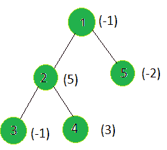

# 查找加权和最小的子树的根

> 原文： [https://www.geeksforgeeks.org/find-the-root-of-the-sub-tree-whose-weighted-sum-is-minimum/](https://www.geeksforgeeks.org/find-the-root-of-the-sub-tree-whose-weighted-sum-is-minimum/)

给定一棵树，以及所有节点的权重，任务是找到加权和最小的子树的根。

**示例**：

> **输入**：
> 
> **输出**：5
> 父级 1 的子树的权重=（（-1）+（5）+（- 2）+（-1）+（3））= 4
> 父级子树的权重 2 =（（5）+（-1）+（3））= 7
> 子树的权重 对于父级 3 = -1
> 父级 4 的子树权重= 3
> 父级 5 的子树权重= -2
> 节点 5 给出最小的子树加权总和。

**方法**：在树上执行 [dfs](http://www.geeksforgeeks.org/depth-first-traversal-for-a-graph/) ，然后为每个节点计算以当前节点为根的子树加权总和，然后找到该节点的最小总和值。

下面是上述方法的实现：

## C++

```cpp

// C++ implementation of the approach 
#include <bits/stdc++.h> 
using namespace std; 

int ans = 0, mini = INT_MAX; 

vector<int> graph[100]; 
vector<int> weight(100); 

// Function to perform dfs and update the tree 
// such that every node's weight is the sum of 
// the weights of all the nodes in the sub-tree 
// of the current node including itself 
void dfs(int node, int parent) 
{ 
    for (int to : graph[node]) { 
        if (to == parent) 
            continue; 
        dfs(to, node); 

        // Calculating the weighted 
        // sum of the subtree 
        weight[node] += weight[to]; 
    } 
} 

// Function to find the node 
// having minimum sub-tree sum 
void findMin(int n) 
{ 

    // For every node 
    for (int i = 1; i <= n; i++) { 

        // If current node's weight 
        // is minimum so far 
        if (mini > weight[i]) { 
            mini = weight[i]; 
            ans = i; 
        } 
    } 
} 

// Driver code 
int main() 
{ 
    int n = 5; 

    // Weights of the node 
    weight[1] = -1; 
    weight[2] = 5; 
    weight[3] = -1; 
    weight[4] = 3; 
    weight[5] = -2; 

    // Edges of the tree 
    graph[1].push_back(2); 
    graph[2].push_back(3); 
    graph[2].push_back(4); 
    graph[1].push_back(5); 

    dfs(1, 1); 
    findMin(n); 

    cout << ans; 

    return 0; 
} 

```

## Java

```java

// Java implementation of the approach  
import java.util.*;  

class GFG  
{  
    static int ans = 0, mini = Integer.MAX_VALUE;  

    @SuppressWarnings("unchecked") 
    static Vector<Integer>[] graph = new Vector[100];  
    static Integer[] weight = new Integer[100];  

    // Function to perform dfs and update the tree  
    // such that every node's weight is the sum of  
    // the weights of all the nodes in the sub-tree  
    // of the current node including itself  
    static void dfs(int node, int parent)  
    {  
        for (int to : graph[node])  
        {  
            if (to == parent)  
                continue;  
            dfs(to, node);  

            // Calculating the weighted  
            // sum of the subtree  
            weight[node] += weight[to];  
        }  
    }  

    // Function to find the node  
    // having minimum sub-tree sum  x  
    static void findMin(int n)  
    {  

        // For every node  
        for (int i = 1; i <= n; i++)  
        {  

            // If current node's weight  x  
            // is minimum so far  
            if (mini > weight[i])  
            {  
                mini = weight[i];  
                ans = i;  
            }  
        }  
    }  

    // Driver code  
    public static void main(String[] args)  
    {  

        int n = 5;  
        for (int i = 0; i < 100; i++)  
            graph[i] = new Vector<Integer>();  

        // Weights of the node  
        weight[1] = -1;  
        weight[2] = 5;  
        weight[3] = -1;  
        weight[4] = 3;  
        weight[5] = -2;  

        // Edges of the tree  
        graph[1].add(2);  
        graph[2].add(3);  
        graph[2].add(4);  
        graph[1].add(5);  

        dfs(1, 1);  
        findMin(n);  

        System.out.print(ans);  
    }  
}  

// This code is contributed by shubhamsingh10  

```

## C#

```cs

// C# implementation of the approach  
using System; 
using System.Collections.Generic; 

class GFG  
{  
    static int ans = 0, mini = int.MaxValue;  

    static List<int>[] graph = new List<int>[100];  
    static int[] weight = new int[100];  

    // Function to perform dfs and update the tree  
    // such that every node's weight is the sum of  
    // the weights of all the nodes in the sub-tree  
    // of the current node including itself  
    static void dfs(int node, int parent)  
    {  
        foreach (int to in graph[node])  
        {  
            if (to == parent)  
                continue;  
            dfs(to, node);  

            // Calculating the weighted  
            // sum of the subtree  
            weight[node] += weight[to];  
        }  
    }  

    // Function to find the node  
    // having minimum sub-tree sum  x  
    static void findMin(int n)  
    {  

        // For every node  
        for (int i = 1; i <= n; i++)  
        {  

            // If current node's weight  x  
            // is minimum so far  
            if (mini > weight[i])  
            {  
                mini = weight[i];  
                ans = i;  
            }  
        }  
    }  

    // Driver code  
    public static void Main(String[] args)  
    {  

        int n = 5;  
        for (int i = 0; i < 100; i++)  
            graph[i] = new List<int>();  

        // Weights of the node  
        weight[1] = -1;  
        weight[2] = 5;  
        weight[3] = -1;  
        weight[4] = 3;  
        weight[5] = -2;  

        // Edges of the tree  
        graph[1].Add(2);  
        graph[2].Add(3);  
        graph[2].Add(4);  
        graph[1].Add(5);  

        dfs(1, 1);  
        findMin(n);  

        Console.Write(ans);  
    }  
}  

// This code is contributed by Rajput-Ji 

```

## Python3

```

# Python3 implementation of the approach 
ans = 0
mini = 2**32

graph = [[] for i in range(100)]  
weight = [0]*100

# Function to perform dfs and update the tree 
# such that every node's weight is the sum of 
# the weights of all the nodes in the sub-tree 
# of the current node including itself 
def dfs(node, parent): 
    global mini, graph, weight, ans  
    for to in graph[node]:  
        if (to == parent):  
            continue
        dfs(to, node)  

        # Calculating the weighted  
        # sum of the subtree  
        weight[node] += weight[to]  

# Function to find the node 
# having minimum sub-tree sum 
def findMin(n): 
    global mini, graph, weight, ans  

    # For every node 
    for i in range(1, n + 1): 

        # If current node's weight 
        # is minimum so far 
        if (mini > weight[i]): 
            mini = weight[i] 
            ans = i 

# Driver code 
n = 5

# Weights of the node 
weight[1] = -1
weight[2] = 5
weight[3] = -1
weight[4] = 3
weight[5] = -2

# Edges of the tree 
graph[1].append(2) 
graph[2].append(3) 
graph[2].append(4) 
graph[1].append(5) 

dfs(1, 1) 
findMin(n) 

print(ans) 

# This code is contributed by SHUBHAMSINGH10 

```

**Output:**

```
5

```

**<u>复杂度分析：</u>**

*   **时间复杂度**：O（N）。
    在 dfs 中，树的每个节点都处理一次，因此，如果树中总共有 N 个节点，则由于 dfs 而导致的复杂度为 O（N）。 因此，时间复杂度为 O（N）。
*   **辅助空间**：O（n）。
    递归堆栈。


* * *

* * *

如果您喜欢 GeeksforGeeks 并希望做出贡献，则还可以使用 [tribution.geeksforgeeks.org](https://contribute.geeksforgeeks.org/) 撰写文章，或将您的文章邮寄至 tribution@geeksforgeeks.org。 查看您的文章出现在 GeeksforGeeks 主页上，并帮助其他 Geeks。

如果您发现任何不正确的地方，请单击下面的“改进文章”按钮，以改进本文。