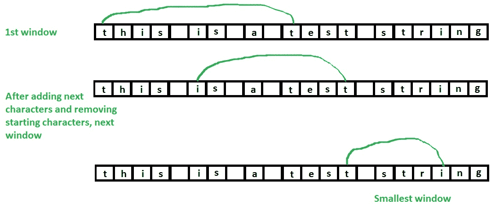

# 在包含另一个字符串

> 原文：[https://www.geeksforgeeks.org/find-the-smallest-window-in-a-string-containing-all-characters-of-another-string/](https://www.geeksforgeeks.org/find-the-smallest-window-in-a-string-containing-all-characters-of-another-string/)

的所有字符的字符串中找到最小的窗口

给定两个字符串`string1`和`string2`，任务是在`string1`中找到包含`string2`的所有字符的最小子字符串。

**示例**：

> **输入**：`string = "this is a test string", pattern = "tist"`
>
> **输出**：最小窗口为`"t stri"`
>
> **说明**：`"t stri"`包含模式的所有字符。
> 
> **输入**：`string = "geeksforgeeks", pattern = "ork"`
>
> **输出**：最小窗口为`"ksfor"`

**方法 1（蛮力解）**

1.  生成`string1`的所有子字符串（`"this is a test string`）

2.  对于每个子字符串，检查子字符串是否包含`string2`的所有字符（`"tist`）。

3.  最后，打印包含`string2`所有字符的最小子字符串。

**方法 2（有效解决方案）**

1.  首先检查字符串的长度是否小于给定模式的长度，如果是，则`"no such window can exist"`。

2.  将给定模式的字符的出现存储在`hash_pat[]`中。

3.  开始将`pattern`的字符与字符串的字符进行匹配，即如果一个字符匹配，则增加计数。

4.  检查计数是否等于模式长度，表示找到了一个窗口。

5.  如果找到了这样的窗口，请尝试通过从当前窗口的开头删除多余的字符来最小化它。

6.  更新`min_length`。

7.  打印最小长度窗口。

**解释上述算法的图**：



下面是实现上述算法的程序：

## C++

```cpp

// C++ program to find smallest window containing 
// all characters of a pattern. 
#include<bits/stdc++.h> 
using namespace std; 

const int no_of_chars = 256; 

// Function to find smallest window containing 
// all characters of 'pat' 
string findSubString(string str, string pat) 
{ 
    int len1 = str.length(); 
    int len2 = pat.length(); 

    // check if string's length is less than pattern's 
    // length. If yes then no such window can exist 
    if (len1 < len2) 
    { 
        cout << "No such window exists"; 
        return ""; 
    } 

    int hash_pat[no_of_chars] = {0}; 
    int hash_str[no_of_chars] = {0}; 

    // store occurrence ofs characters of pattern 
    for (int i = 0; i < len2; i++) 
        hash_pat[pat[i]]++; 

    int start = 0, start_index = -1, min_len = INT_MAX; 

    // start traversing the string 
    int count = 0; // count of characters 
    for (int j = 0; j < len1 ; j++) 
    { 
        // count occurrence of characters of string 
        hash_str[str[j]]++; 

        // If string's char matches with pattern's char 
        // then increment count 
        if (hash_pat[str[j]] != 0 && 
            hash_str[str[j]] <= hash_pat[str[j]] ) 
            count++; 

        // if all the characters are matched 
        if (count == len2) 
        { 
            // Try to minimize the window i.e., check if 
            // any character is occurring more no. of times 
            // than its occurrence in pattern, if yes 
            // then remove it from starting and also remove 
            // the useless characters. 
            while ( hash_str[str[start]] > hash_pat[str[start]] 
                || hash_pat[str[start]] == 0) 
            { 

                if (hash_str[str[start]] > hash_pat[str[start]]) 
                    hash_str[str[start]]--; 
                start++; 
            } 

            // update window size 
            int len_window = j - start + 1; 
            if (min_len > len_window) 
            { 
                min_len = len_window; 
                start_index = start; 
            } 
        } 
    } 

    // If no window found 
    if (start_index == -1) 
    { 
    cout << "No such window exists"; 
    return ""; 
    } 

    // Return substring starting from start_index 
    // and length min_len 
    return str.substr(start_index, min_len); 
} 

// Driver code 
int main() 
{ 
    string str = "this is a test string"; 
    string pat = "tist"; 

    cout << "Smallest window is : \n"
        << findSubString(str, pat); 
    return 0; 
} 

```

## Java

```java

// Java program to find smallest window containing 
// all characters of a pattern. 

public class GFG  
{ 
    static final int no_of_chars = 256; 

    // Function to find smallest window containing 
    // all characters of 'pat' 
    static String findSubString(String str, String pat) 
    { 
        int len1 = str.length(); 
        int len2 = pat.length(); 

        // check if string's length is less than pattern's 
        // length. If yes then no such window can exist 
        if (len1 < len2) 
        { 
            System.out.println("No such window exists"); 
            return ""; 
        } 

        int hash_pat[] = new int[no_of_chars]; 
        int hash_str[] = new int[no_of_chars]; 

        // store occurrence ofs characters of pattern 
        for (int i = 0; i < len2; i++) 
            hash_pat[pat.charAt(i)]++; 

        int start = 0, start_index = -1, min_len = Integer.MAX_VALUE; 

        // start traversing the string 
        int count = 0; // count of characters 
        for (int j = 0; j < len1 ; j++) 
        { 
            // count occurrence of characters of string 
            hash_str[str.charAt(j)]++; 

            // If string's char matches with pattern's char 
            // then increment count 
            if (hash_pat[str.charAt(j)] != 0 && 
                hash_str[str.charAt(j)] <= hash_pat[str.charAt(j)] ) 
                count++; 

            // if all the characters are matched 
            if (count == len2) 
            { 
                // Try to minimize the window i.e., check if 
                // any character is occurring more no. of times 
                // than its occurrence in pattern, if yes 
                // then remove it from starting and also remove 
                // the useless characters. 
                while ( hash_str[str.charAt(start)] > hash_pat[str.charAt(start)] 
                    || hash_pat[str.charAt(start)] == 0) 
                { 

                    if (hash_str[str.charAt(start)] > hash_pat[str.charAt(start)]) 
                        hash_str[str.charAt(start)]--; 
                    start++; 
                } 

                // update window size 
                int len_window = j - start + 1; 
                if (min_len > len_window) 
                { 
                    min_len = len_window; 
                    start_index = start; 
                } 
            } 
        } 

        // If no window found 
        if (start_index == -1) 
        { 
        System.out.println("No such window exists"); 
        return ""; 
        } 

        // Return substring starting from start_index 
        // and length min_len 
        return str.substring(start_index, start_index + min_len); 
    } 

    // Driver Method 
    public static void main(String[] args) 
    { 
        String str = "this is a test string"; 
        String pat = "tist"; 

    System.out.print("Smallest window is :\n " + 
                        findSubString(str, pat)); 
    } 
} 

```

## Python3

```py

# Python3 program to find the smallest window  
# containing all characters of a pattern.  
no_of_chars = 256

# Function to find smallest window  
# containing all characters of 'pat'  
def findSubString(string, pat):  

    len1 = len(string)  
    len2 = len(pat)  

    # check if string's length is less than pattern's  
    # length. If yes then no such window can exist  
    if len1 < len2:  

        print("No such window exists")  
        return ""  

    hash_pat = [0] * no_of_chars 
    hash_str = [0] * no_of_chars  

    # store occurrence ofs characters of pattern  
    for i in range(0, len2):  
        hash_pat[ord(pat[i])] += 1

    start, start_index, min_len = 0, -1, float('inf')  

    # start traversing the string  
    count = 0 # count of characters  
    for j in range(0, len1):  

        # count occurrence of characters of string  
        hash_str[ord(string[j])] += 1

        # If string's char matches with  
        # pattern's char then increment count  
        if (hash_pat[ord(string[j])] != 0 and
            hash_str[ord(string[j])] <= 
            hash_pat[ord(string[j])]):  
            count += 1

        # if all the characters are matched  
        if count == len2:  

            # Try to minimize the window i.e., check if  
            # any character is occurring more no. of times  
            # than its occurrence in pattern, if yes  
            # then remove it from starting and also remove  
            # the useless characters.  
            while (hash_str[ord(string[start])] >  
                   hash_pat[ord(string[start])] or
                   hash_pat[ord(string[start])] == 0):  

                if (hash_str[ord(string[start])] >  
                    hash_pat[ord(string[start])]):  
                    hash_str[ord(string[start])] -= 1
                start += 1

            # update window size  
            len_window = j - start + 1
            if min_len > len_window:  

                min_len = len_window  
                start_index = start  

    # If no window found  
    if start_index == -1: 
        print("No such window exists")  
        return ""  

    # Return substring starting from  
    # start_index and length min_len  
    return string[start_index : start_index + min_len]  

# Driver code  
if __name__ == "__main__": 

    string = "this is a test string"
    pat = "tist"

    print("Smallest window is : ") 
    print(findSubString(string, pat))  

# This code is contributed by Rituraj Jain 

```

## C#

```cs

// C# program to find smallest window containing 
// all characters of a pattern. 
using System; 

class GFG  
{ 
    static int no_of_chars = 256; 

    // Function to find smallest window containing 
    // all characters of 'pat' 
    static String findSubString(String str, String pat) 
    { 
        int len1 = str.Length; 
        int len2 = pat.Length; 

        // check if string's length is less than pattern's 
        // length. If yes then no such window can exist 
        if (len1 < len2) 
        { 
            Console.WriteLine("No such window exists"); 
            return ""; 
        } 

        int []hash_pat = new int[no_of_chars]; 
        int []hash_str = new int[no_of_chars]; 

        // store occurrence ofs characters of pattern 
        for (int i = 0; i < len2; i++) 
            hash_pat[pat[i]]++; 

        int start = 0, start_index = -1, min_len = int.MaxValue; 

        // start traversing the string 
        int count = 0; // count of characters 
        for (int j = 0; j < len1 ; j++) 
        { 
            // count occurrence of characters of string 
            hash_str[str[j]]++; 

            // If string's char matches with pattern's char 
            // then increment count 
            if (hash_pat[str[j]] != 0 && 
                hash_str[str[j]] <= hash_pat[str[j]] ) 
                count++; 

            // if all the characters are matched 
            if (count == len2) 
            { 
                // Try to minimize the window i.e., check if 
                // any character is occurring more no. of times 
                // than its occurrence in pattern, if yes 
                // then remove it from starting and also remove 
                // the useless characters. 
                while ( hash_str[str[start]] > hash_pat[str[start]] 
                    || hash_pat[str[start]] == 0) 
                { 

                    if (hash_str[str[start]] > hash_pat[str[start]]) 
                        hash_str[str[start]]--; 
                    start++; 
                } 

                // update window size 
                int len_window = j - start + 1; 
                if (min_len > len_window) 
                { 
                    min_len = len_window; 
                    start_index = start; 
                } 
            } 
        } 

        // If no window found 
        if (start_index == -1) 
        { 
            Console.WriteLine("No such window exists"); 
            return ""; 
        } 

        // Return substring starting from start_index 
        // and length min_len 
        return str.Substring(start_index, min_len); 
    } 

    // Driver Method 
    public static void Main(String[] args) 
    { 
        String str = "this is a test string"; 
        String pat = "tist"; 

        Console.WriteLine("Smallest window is :\n " + 
                        findSubString(str, pat)); 
    } 
} 

/* This code contributed by PrinciRaj1992 */

```

## PHP

```php

<?php 
// PHP program to find smallest window  
// containing all characters of a pattern.  

define("no_of_chars", 256);  

// Function to find smallest window  
// containing all characters of 'pat'  
function findSubString(&$str, &$pat)  
{  
    $len1 = strlen($str);  
    $len2 = strlen($pat);  

    // check if string's length is less  
    // than pattern's length. If yes 
    // then no such window can exist  
    if ($len1 < $len2)  
    {  
        echo "No such window exists";  
        return "";  
    }  

    $hash_pat = array_fill(0, no_of_chars, 0);  
    $hash_str = array_fill(0, no_of_chars, 0);  

    // store occurrence ofs characters 
    // of pattern  
    for ($i = 0; $i < $len2; $i++)  
        $hash_pat[ord($pat[$i])]++;  

    $start = 0; 
    $start_index = -1; 
    $min_len = PHP_INT_MAX;  

    // start traversing the string  
    $count = 0; // count of characters  
    for ($j = 0; $j < $len1 ; $j++)  
    {  
        // count occurrence of characters 
        // of string  
        $hash_str[ord($str[$j])]++;  

        // If string's char matches with  
        // pattern's char then increment count  
        if ($hash_pat[ord($str[$j])] != 0 &&  
            $hash_str[ord($str[$j])] <= 
            $hash_pat[ord($str[$j])])  
            $count++;  

        // if all the characters are matched  
        if ($count == $len2)  
        {  
            // Try to minimize the window i.e.,  
            // check if any character is occurring  
            // more no. of times than its occurrence  
            // in pattern, if yes then remove it from 
            // starting and also remove the useless  
            // characters.  
            while ($hash_str[ord($str[$start])] >  
                   $hash_pat[ord($str[$start])] ||  
                   $hash_pat[ord($str[$start])] == 0)  
            {  

                if ($hash_str[ord($str[$start])] > 
                    $hash_pat[ord($str[$start])])  
                    $hash_str[ord($str[$start])]--;  
                $start++;  
            }  

            // update window size  
            $len_window = $j - $start + 1;  
            if ($min_len > $len_window)  
            {  
                $min_len = $len_window;  
                $start_index = $start;  
            }  
        }  
    }  

    // If no window found  
    if ($start_index == -1)  
    {  
        echo "No such window exists";  
        return "";  
    }  

    // Return substring starting from  
    // start_index and length min_len  
    return substr($str, $start_index, $min_len);  
}  

// Driver code  
$str = "this is a test string";  
$pat = "tist";  

echo "Smallest window is : \n" . 
      findSubString($str, $pat);  

// This code is contributed by 
// rathbhupendra 
?> 

```

**输出**：

```
Smallest window is : 
t stri

```

本文由 [Sahil Chhabra](https://www.facebook.com/sahil.chhabra.965) 提供。 如果您喜欢 GeeksforGeeks 并希望做出贡献，则也可以使用 contribution.geeksforgeeks.org 撰写文章，或将您的文章邮寄到 contribution@geeksforgeeks.org。 查看您的文章出现在 GeeksforGeeks 主页上，并帮助其他 Geeks。

如果发现任何不正确的地方，或者想分享有关上述主题的更多信息，请写评论。

