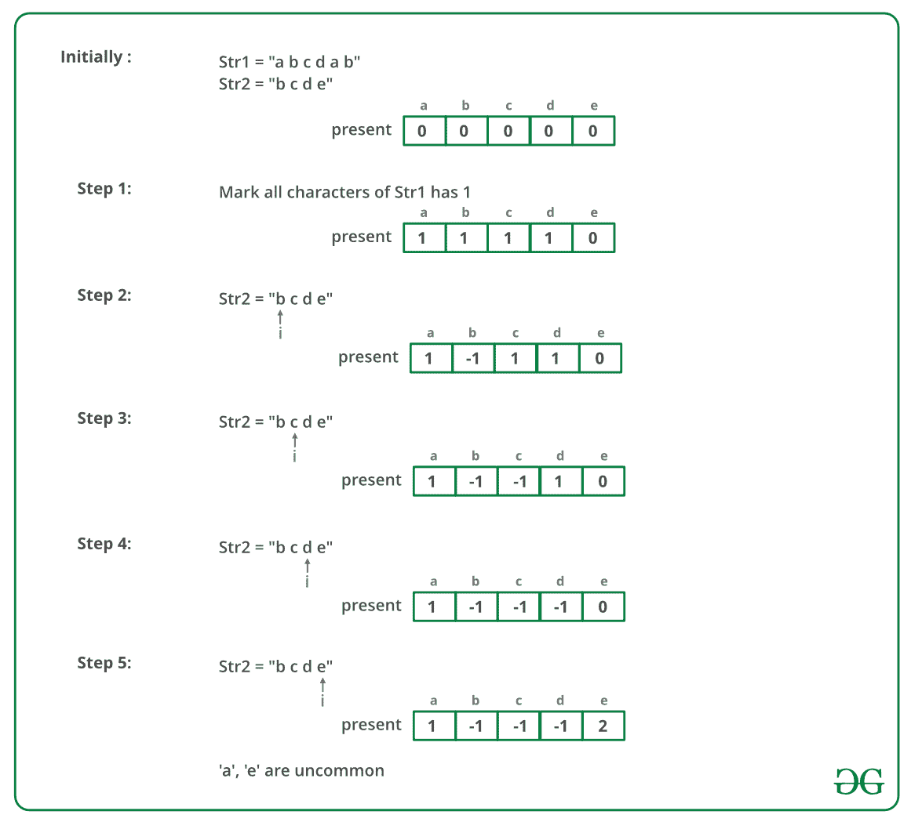

# 在两个字符串中查找不常见的字符

> 原文：[https://www.geeksforgeeks.org/find-uncommon-characters-two-strings/](https://www.geeksforgeeks.org/find-uncommon-characters-two-strings/)

查找并打印两个给定字符串中不常见的字符（按排序顺序）。 此处不常见的字符表示该字符出现在一个字符串中，或​​者出现在其他字符串中，但都不出现在两个字符串中。 字符串仅包含小写字符，并且可以包含重复项。

**来源**：[亚马逊面试经验 | 系列 355（1 年经验）](https://www.geeksforgeeks.org/amazon-interview-experience-set-355-1-year-experienced/)

**示例**：

> **输入**：`str1 = "characters", str2 = "alphabets"`
> **输出**：`b c l p r`
> 
> **输入**：`str1 = "geeksforgeeks", str2 = "geeksquiz"`
> **输出**：`f i o q r u z`

**朴素的方法**：使用两个循环，对于第一个字符串的每个字符，检查第二个字符串中是否存在该字符。 同样，对于第二字符串的每个字符，请检查第一字符串中是否存在该字符。

**时间复杂度**：`O(N ^ 2)`以及其他成本来处理重复项。

**有效方法**：有效方法是使用[散列](http://www.geeksforgeeks.org/hashing-data-structure/)。

*   将大小为 26 的哈希表用于所有小写字符。

*   最初，将每个字符的存在标记为`0`（表示两个字符串中都不存在该字符）。

*   遍历第一个字符串，并在哈希表中将第一个字符串的每个字符的存在标记为`1`（表示第一个字符串）。

*   现在，遍历第二个字符串。 对于第二个字符串的每个字符，请检查其在哈希表中的存在是否为`1`。 如果它是`1`，则将其存在标记为`-1`（表示两个字符串都共用该字符），否则将其存在标记为`2`（表示第二个字符串）。

下图是上述方法的模拟：



下面是上述方法的实现：

## C++

```cpp

// C++ implementation to find the uncommon 
// characters of the two strings 
#include <bits/stdc++.h> 
using namespace std; 

// size of the hash table 
const int MAX_CHAR = 26; 

// function to find the uncommon characters 
// of the two strings 
void findAndPrintUncommonChars(string str1, string str2) 
{ 
    // mark presence of each character as 0 
    // in the hash table 'present[]' 
    int present[MAX_CHAR]; 
    for (int i=0; i<MAX_CHAR; i++) 
        present[i] = 0; 

    int l1 = str1.size(); 
    int l2 = str2.size(); 

    // for each character of str1, mark its 
    // presence as 1 in 'present[]' 
    for (int i=0; i<l1; i++) 
        present[str1[i] - 'a'] = 1; 

    // for each character of str2 
    for (int i=0; i<l2; i++) 
    { 
        // if a character of str2 is also present 
        // in str1, then mark its presence as -1 
        if (present[str2[i] - 'a'] == 1 
            || present[str2[i] - 'a'] == -1) 
            present[str2[i] - 'a'] = -1; 

        // else mark its presence as 2 
        else
            present[str2[i] - 'a'] = 2; 
    } 

    // print all the uncommon characters 
    for (int i=0; i<MAX_CHAR; i++) 
        if (present[i] == 1 || present[i] == 2 ) 
            cout << (char(i + 'a')) << " "; 
} 

// Driver program to test above 
int main() 
{ 
    string str1 = "characters"; 
    string str2 = "alphabets"; 
    findAndPrintUncommonChars(str1, str2); 
    return 0; 
} 

```

## Java

```java

// Java implementation to find the uncommon 
// characters of the two strings 
class GFG  
{ 

    // size of the hash table 
    static int MAX_CHAR = 26; 

    // function to find the uncommon  
    // characters of the two strings 
    static void findAndPrintUncommonChars(String str1, 
                                       String str2)  
    { 
        // mark presence of each character as 0 
        // in the hash table 'present[]' 
        int present[] = new int[MAX_CHAR]; 
        for (int i = 0; i < MAX_CHAR; i++)  
        { 
            present[i] = 0; 
        } 

        int l1 = str1.length(); 
        int l2 = str2.length(); 

        // for each character of str1, mark its 
        // presence as 1 in 'present[]' 
        for (int i = 0; i < l1; i++) 
        { 
            present[str1.charAt(i) - 'a'] = 1; 
        } 

        // for each character of str2 
        for (int i = 0; i < l2; i++) 
        { 

            // if a character of str2 is also present 
            // in str1, then mark its presence as -1 
            if (present[str2.charAt(i) - 'a'] == 1
                || present[str2.charAt(i) - 'a'] == -1)  
            { 
                present[str2.charAt(i) - 'a'] = -1; 
            }  

            // else mark its presence as 2 
            else
            { 
                present[str2.charAt(i) - 'a'] = 2; 
            } 
        } 

        // print all the uncommon characters 
        for (int i = 0; i < MAX_CHAR; i++) 
        { 
            if (present[i] == 1 || present[i] == 2)  
            { 
                System.out.print((char) (i + 'a') + " "); 
            } 
        } 
    } 

    // Driver code 
    public static void main(String[] args)  
    { 
        String str1 = "characters"; 
        String str2 = "alphabets"; 
        findAndPrintUncommonChars(str1, str2); 
    } 
} 

// This code is contributed by Rajput-JI 

```

## Python 3

```

# Python 3 implementation to find the  
# uncommon characters of the two strings  

# size of the hash table  
MAX_CHAR = 26

# function to find the uncommon characters  
# of the two strings  
def findAndPrintUncommonChars(str1, str2): 

    # mark presence of each character as 0  
    # in the hash table 'present[]' 
    present = [0] * MAX_CHAR 
    for i in range(0, MAX_CHAR): 
        present[i] = 0

    l1 = len(str1) 
    l2 = len(str2) 

    # for each character of str1, mark its  
    # presence as 1 in 'present[]' 
    for i in range(0, l1): 
        present[ord(str1[i]) - ord('a')] = 1

    # for each character of str2  
    for i in range(0, l2): 

        # if a character of str2 is also present  
        # in str1, then mark its presence as -1  
        if(present[ord(str2[i]) - ord('a')] == 1 or 
           present[ord(str2[i]) - ord('a')] == -1): 
            present[ord(str2[i]) - ord('a')] = -1

        # else mark its presence as 2  
        else: 
            present[ord(str2[i]) - ord('a')] = 2

    # print all the uncommon characters  
    for i in range(0, MAX_CHAR): 
        if(present[i] == 1 or present[i] == 2): 
            print(chr(i + ord('a')), end = " ") 

# Driver Code 
if __name__ == "__main__": 
    str1 = "characters"
    str2 = "alphabets"
    findAndPrintUncommonChars(str1, str2) 

# This code is contributed 
# by Sairahul099 

```

## C#

```cs

// C# implementation to find the uncommon  
// characters of the two strings  
using System; 

class GFG  
{  

    // size of the hash table  
    static int MAX_CHAR = 26;  

    // function to find the uncommon  
    // characters of the two strings  
    static void findAndPrintUncommonChars(String str1,  
                                    String str2)  
    {  
        // mark presence of each character as 0  
        // in the hash table 'present[]'  
        int []present = new int[MAX_CHAR];  
        for (int i = 0; i < MAX_CHAR; i++)  
        {  
            present[i] = 0;  
        }  

        int l1 = str1.Length;  
        int l2 = str2.Length;  

        // for each character of str1, mark its  
        // presence as 1 in 'present[]'  
        for (int i = 0; i < l1; i++)  
        {  
            present[str1[i] - 'a'] = 1;  
        }  

        // for each character of str2  
        for (int i = 0; i < l2; i++)  
        {  

            // if a character of str2 is also present  
            // in str1, then mark its presence as -1  
            if (present[str2[i] - 'a'] == 1 
                || present[str2[i] - 'a'] == -1)  
            {  
                present[str2[i] - 'a'] = -1;  
            }  

            // else mark its presence as 2  
            else
            {  
                present[str2[i] - 'a'] = 2;  
            }  
        }  

        // print all the uncommon characters  
        for (int i = 0; i < MAX_CHAR; i++)  
        {  
            if (present[i] == 1 || present[i] == 2)  
            {  
                Console.Write((char) (i + 'a') + " ");  
            }  
        }  
    }  

    // Driver code  
    public static void Main(String[] args)  
    {  
        String str1 = "characters";  
        String str2 = "alphabets";  
        findAndPrintUncommonChars(str1, str2);  
    }  
}  

// This code is contributed by PrinciRaj1992 

```

**输出**：

```
b c l p r

```

**时间复杂度**：`O(m + n)`，其中`m`和`n`分别是两个字符串的大小。

本文由 **Ayush Jauhari** 提供。 如果您喜欢 GeeksforGeeks 并希望做出贡献，则还可以使用 [tribution.geeksforgeeks.org](http://www.contribute.geeksforgeeks.org) 撰写文章，或将您的文章邮寄至 tribution@geeksforgeeks.org。 查看您的文章出现在 GeeksforGeeks 主页上，并帮助其他 Geeks。

如果发现任何不正确的地方，或者想分享有关上述主题的更多信息，请写评论。

