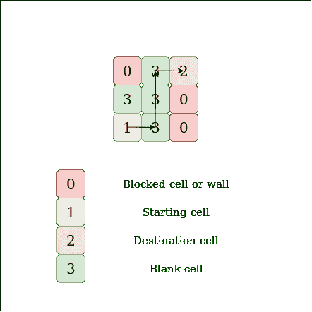
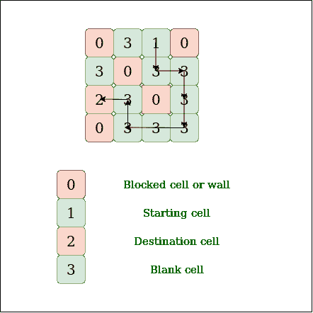

# 查找矩阵

中两个单元之间是否存在路径

> 原文： [https://www.geeksforgeeks.org/find-whether-path-two-cells-matrix/](https://www.geeksforgeeks.org/find-whether-path-two-cells-matrix/)

给定 N X N 矩阵，其中用 1，0，2，3 填充。查找是否存在从源到目标的路径，仅遍历空白单元格。 您可以上下左右移动。

*   单元格`1`的值表示源。

*   单元格`2`的值表示目标。

*   单元格`3`的值表示空白单元格。

*   单元格`0`的值表示空白墙。

注意：只有一个来源和一个目的地（接收器）。

**示例**：[

> **输入**：
> M [3] [3] = {{0，3，2}，
> {3，3，0}，
> {1，3，0}} ;
> **输出**：`Yes`
> **说明**：
> 
> 
> 
> **输入**：，
> M [4] [4] = {{0，3，1，0}，
> {3，0，3，3}，
> {2，3 ，0，3}，
> {0，3，3，3}};
> **输出**：`Yes`
> **说明**：
> 
> 

提问人： [Adob​​e 访谈](https://www.geeksforgeeks.org/adobe-interview-experience-set-41-software-engineer/) [

**<u>简单解决方案：</u>** 递归。

**方法**：在每个矩阵中找到单元的源索引，然后递归地找到从源索引到矩阵中目标的路径。 该算法涉及递归地找到所有路径，直到找到到达目的地的最终路径。

**算法**：

1.  遍历矩阵并找到矩阵的起始索引。

2.  创建一个采用索引和访问矩阵的递归函数。

3.  标记当前单元格，然后检查当前单元格是否为目的地。 如果当前单元格是目的地，则返回 true。

4.  为所有相邻的空白和未访问单元格调用递归函数。

5.  如果任何递归函数返回 true，则取消标记该单元格并返回 true，否则取消标记该单元格并返回 false。

## Java

```java

// Java program to find path between two
// cell in matrix
class Path {

    // Method for finding and printing
    // whether the path exists or not
    public static void isPath(
        int matrix[][], int n)
    {
        // Defining visited array to keep
        // track of already visited indexes
        boolean visited[][]
            = new boolean[n][n];

        // Flag to indicate whether the
        // path exists or not
        boolean flag = false;

        for (int i = 0; i < n; i++) {
            for (int j = 0; j < n; j++) {
                // if matrix[i][j] is source
                // and it is not visited
                if (
                    matrix[i][j] == 1
                    && !visited[i][j])

                    // Starting from i, j and
                    // then finding the path
                    if (isPath(
                            matrix, i, j, visited)) {
                        // if path exists
                        flag = true;
                        break;
                    }
            }
        }
        if (flag)
            System.out.println("YES");
        else
            System.out.println("NO");
    }

    // Method for checking boundries
    public static boolean isSafe(
        int i, int j,
        int matrix[][])
    {

        if (
            i >= 0 && i < matrix.length
            && j >= 0
            && j < matrix[0].length)
            return true;
        return false;
    }

    // Returns true if there is a
    // path from a source (a
    // cell with value 1) to a
    // destination (a cell with
    // value 2)
    public static boolean isPath(
        int matrix[][],
        int i, int j,
        boolean visited[][])
    {

        // Checking the boundries, walls and
        // whether the cell is unvisited
        if (
            isSafe(i, j, matrix)
            && matrix[i][j] != 0
            && !visited[i][j]) {
            // Make the cell visited
            visited[i][j] = true;

            // if the cell is the required
            // destination then return true
            if (matrix[i][j] == 2)
                return true;

            // traverse up
            boolean up = isPath(
                matrix, i - 1,
                j, visited);

            // if path is found in up
            // direction return true
            if (up)
                return true;

            // traverse left
            boolean left
                = isPath(
                    matrix, i, j - 1, visited);

            // if path is found in left
            // direction return true
            if (left)
                return true;

            // traverse down
            boolean down = isPath(
                matrix, i + 1, j, visited);

            // if path is found in down
            // direction return true
            if (down)
                return true;

            // traverse right
            boolean right
                = isPath(
                    matrix, i, j + 1,
                    visited);

            // if path is found in right
            // direction return true
            if (right)
                return true;
        }
        // no path has been found
        return false;
    }

    // driver program to
    // check above function
    public static void main(String[] args)
    {

        int matrix[][] = { { 0, 3, 0, 1 },
                           { 3, 0, 3, 3 },
                           { 2, 3, 3, 3 },
                           { 0, 3, 3, 3 } };

        // calling isPath method
        isPath(matrix, 4);
    }
}

/* This code is contributed by Madhu Priya */

```

## Python

```py

# Python3 program to find 
# path between two cell in matrix

# Method for finding and printing
# whether the path exists or not
def isPath(matrix, n):

    # Defining visited array to keep
    # track of already visited indexes
    visited = [[False for x in range (n)]
                      for y in range (n)]

    # Flag to indicate whether the
    # path exists or not
    flag = False

    for i in range (n):
        for j in range (n):

            # If matrix[i][j] is source
            # and it is not visited
            if (matrix[i][j] == 1 and not
                visited[i][j]):

                # Starting from i, j and
                # then finding the path
                if (checkPath(matrix, i, 
                              j, visited)):

                    # If path exists
                    flag = True
                    break
    if (flag):
        print("YES")
    else:
        print("NO")

# Method for checking boundries
def isSafe(i, j, matrix):

    if (i >= 0 and i < len(matrix) and
        j >= 0 and j < len(matrix[0])):
        return True
    return False

# Returns true if there is a
# path from a source(a
# cell with value 1) to a
# destination(a cell with
# value 2)
def checkPath(matrix, i, j,
              visited):

    # Checking the boundries, walls and
    # whether the cell is unvisited
    if (isSafe(i, j, matrix) and
        matrix[i][j] != 0 and not
        visited[i][j]):

        # Make the cell visited
        visited[i][j] = True

        # If the cell is the required
        # destination then return true
        if (matrix[i][j] == 2):
           return True

        # traverse up
        up = checkPath(matrix, i - 1,
                       j, visited)

        # If path is found in up
        # direction return true
        if (up):
           return True

        # Traverse left
        left = checkPath(matrix, i, 
                         j - 1, visited)

        # If path is found in left
        # direction return true
        if (left):
           return True

        # Traverse down
        down = checkPath(matrix, i + 1, 
                         j, visited)

        # If path is found in down
        # direction return true
        if (down):
           return True

        # Traverse right
        right = checkPath(matrix, i, 
                          j + 1, visited)

        # If path is found in right
        # direction return true
        if (right):
           return True

    # No path has been found
    return False

# Driver code
if __name__ == "__main__":

    matrix = [[0, 3, 0, 1],
              [3, 0, 3, 3],
              [2, 3, 3, 3],
              [0, 3, 3, 3]]

    # calling isPath method
    isPath(matrix, 4)

# This code is contributed by Chitranayal

```

## C#

```cs

// C# program to find path between two
// cell in matrix
using System;

class GFG{

// Method for finding and printing
// whether the path exists or not
static void isPath(int[,] matrix, int n)
{

    // Defining visited array to keep
    // track of already visited indexes
    bool[,] visited = new bool[n, n];

    // Flag to indicate whether the
    // path exists or not
    bool flag = false;

    for(int i = 0; i < n; i++)
    {
        for(int j = 0; j < n; j++)
        {

            // If matrix[i][j] is source
            // and it is not visited
            if (matrix[i, j] == 1 &&
              !visited[i, j])

                // Starting from i, j and
                // then finding the path
                if (isPath(matrix, i, j, 
                           visited))
                {

                    // If path exists
                    flag = true;
                    break;
                }
        }
    }
    if (flag)
        Console.WriteLine("YES");
    else
        Console.WriteLine("NO");
}

// Method for checking boundries
public static bool isSafe(int i, int j,
                          int[,] matrix)
{
    if (i >= 0 && i < matrix.GetLength(0) && 
        j >= 0 && j < matrix.GetLength(1))
        return true;

    return false;
}

// Returns true if there is a path from
// a source (a cell with value 1) to a
// destination (a cell with value 2)
public static bool isPath(int[,] matrix, int i, 
                          int j, bool[,] visited)
{

    // Checking the boundries, walls and
    // whether the cell is unvisited
    if (isSafe(i, j, matrix) && 
           matrix[i, j] != 0 &&
         !visited[i, j]) 
    {

        // Make the cell visited
        visited[i, j] = true;

        // If the cell is the required
        // destination then return true
        if (matrix[i, j] == 2)
            return true;

        // Traverse up
        bool up = isPath(matrix, i - 1,
                         j, visited);

        // If path is found in up
        // direction return true
        if (up)
            return true;

        // Traverse left
        bool left = isPath(matrix, i, 
                           j - 1, visited);

        // If path is found in left
        // direction return true
        if (left)
            return true;

        // Traverse down
        bool down = isPath(matrix, i + 1,
                           j, visited);

        // If path is found in down
        // direction return true
        if (down)
            return true;

        // Traverse right
        bool right = isPath(matrix, i, j + 1,
                            visited);

        // If path is found in right
        // direction return true
        if (right)
            return true;
    }

    // No path has been found
    return false;
}

// Driver code   
static void Main()
{
    int[,] matrix = { { 0, 3, 0, 1 },
                      { 3, 0, 3, 3 },
                      { 2, 3, 3, 3 },
                      { 0, 3, 3, 3 } };

    // Calling isPath method
    isPath(matrix, 4);
}
}

// This code is contributed by divyeshrabadiya07

```

**Output:** 

```
YES

```

**复杂度分析**：

*   **时间复杂度**：O（4 <sup>n * m</sup> ）。

    对于每个单元，可以有 4 个相邻的未访问单元，因此时间复杂度为 O（4 <sup>n * m</sup> ）。

*   **空间复杂度**：`O(N * M)`。

    需要空间来存储访问的数组。

**<u>有效解决方案：</u>** 图。

**方法**：的想法是使用[广度优先搜索](https://www.geeksforgeeks.org/breadth-first-search-or-bfs-for-a-graph/)。 将每个单元视为一个节点，并将任何两个相邻单元之间的每个边界作为一条边。 因此，Node 的总数为 N *N。

因此，想法是从起始单元开始进行广度优先搜索，直到找到结束单元。

**算法**：

1.  创建一个具有 N * N 个节点（顶点）的空图，将所有节点推入图中，并记下源顶点和宿顶点。

2.  现在在图上应用 BFS，创建一个队列并将源节点插入该队列

3.  运行循环，直到队列大小大于 0

4.  删除队列的最前面的节点，如果目标返回 true，则检查该节点是否为目标。 标记节点

5.  检查所有相邻的单元格（如果未访问），并将它们空白插入队列。

6.  如果未到达目的地，则返回 true。

## C++

```cpp

// C++ program to find path
// between two cell in matrix
#include <bits/stdc++.h>
using namespace std;
#define N 4

class Graph {
    int V;
    list<int>* adj;

public:
    Graph(int V)
    {
        this->V = V;
        adj = new list<int>[V];
    }
    void addEdge(int s, int d);
    bool BFS(int s, int d);
};

// add edge to graph
void Graph::addEdge(int s, int d)
{
    adj[s].push_back(d);
}

// BFS function to find path
// from source to sink
bool Graph::BFS(int s, int d)
{
    // Base case
    if (s == d)
        return true;

    // Mark all the vertices as not visited
    bool* visited = new bool[V];
    for (int i = 0; i < V; i++)
        visited[i] = false;

    // Create a queue for BFS
    list<int> queue;

    // Mark the current node as visited and
    // enqueue it
    visited[s] = true;
    queue.push_back(s);

    // it will be used to get all adjacent
    // vertices of a vertex
    list<int>::iterator i;

    while (!queue.empty()) {
        // Dequeue a vertex from queue
        s = queue.front();
        queue.pop_front();

        // Get all adjacent vertices of the
        // dequeued vertex s. If a adjacent has
        // not been visited, then mark it visited
        // and enqueue it
        for (
            i = adj[s].begin(); i != adj[s].end(); ++i) {
            // If this adjacent node is the
            // destination node, then return true
            if (*i == d)
                return true;

            // Else, continue to do BFS
            if (!visited[*i]) {
                visited[*i] = true;
                queue.push_back(*i);
            }
        }
    }

    // If BFS is complete without visiting d
    return false;
}

bool isSafe(int i, int j, int M[][N])
{
    if (
        (i < 0 || i >= N)
        || (j < 0 || j >= N)
        || M[i][j] == 0)
        return false;
    return true;
}

// Returns true if there is
// a path from a source (a
// cell with value 1) to a
// destination (a cell with
// value 2)
bool findPath(int M[][N])
{
    // source and destination
    int s, d;
    int V = N * N + 2;
    Graph g(V);

    // create graph with n*n node
    // each cell consider as node
    // Number of current vertex
    int k = 1;
    for (int i = 0; i < N; i++) {
        for (int j = 0; j < N; j++) {
            if (M[i][j] != 0) {
                // connect all 4 adjacent
                // cell to current cell
                if (isSafe(i, j + 1, M))
                    g.addEdge(k, k + 1);
                if (isSafe(i, j - 1, M))
                    g.addEdge(k, k - 1);
                if (i < N - 1 && isSafe(i + 1, j, M))
                    g.addEdge(k, k + N);
                if (i > 0 && isSafe(i - 1, j, M))
                    g.addEdge(k, k - N);
            }

            // Source index
            if (M[i][j] == 1)
                s = k;

            // Destination index
            if (M[i][j] == 2)
                d = k;
            k++;
        }
    }

    // find path Using BFS
    return g.BFS(s, d);
}

// driver program to check
// above function
int main()
{
    int M[N][N] = { { 0, 3, 0, 1 },
                    { 3, 0, 3, 3 },
                    { 2, 3, 3, 3 },
                    { 0, 3, 3, 3 } };

    (findPath(M) == true) ? cout << "Yes" : cout << "No" << endl;

    return 0;
}

```

## Java

```java

// Java program to find path between two
// cell in matrix
import java.util.*;

class Graph {
    int V;
    List<List<Integer> > adj;

    Graph(int V)
    {
        this.V = V;
        adj = new ArrayList<>(V);
        for (int i = 0; i < V; i++) {
            adj.add(i, new ArrayList<>());
        }
    }

    // add edge to graph
    void addEdge(int s, int d)
    {
        adj.get(s).add(d);
    }

    // BFS function to find path
    // from source to sink
    boolean BFS(int s, int d)
    {
        // Base case
        if (s == d)
            return true;

        // Mark all the vertices as not visited
        boolean[] visited = new boolean[V];

        // Create a queue for BFS
        Queue<Integer> queue
            = new LinkedList<>();

        // Mark the current node as visited and
        // enqueue it
        visited[s] = true;
        queue.offer(s);

        // it will be used to get all adjacent
        // vertices of a vertex
        List<Integer> edges;

        while (!queue.isEmpty()) {
            // Dequeue a vertex from queue
            s = queue.poll();

            // Get all adjacent vertices of the
            // dequeued vertex s. If a adjacent has
            // not been visited, then mark it visited
            // and enqueue it
            edges = adj.get(s);
            for (int curr : edges) {
                // If this adjacent node is the
                // destination node, then return true
                if (curr == d)
                    return true;

                // Else, continue to do BFS
                if (!visited[curr]) {
                    visited[curr] = true;
                    queue.offer(curr);
                }
            }
        }

        // If BFS is complete without visiting d
        return false;
    }

    static boolean isSafe(
        int i, int j, int[][] M)
    {
        int N = M.length;
        if (
            (i < 0 || i >= N)
            || (j < 0 || j >= N)
            || M[i][j] == 0)
            return false;
        return true;
    }

    // Returns true if there is a
    // path from a source (a
    // cell with value 1) to a
    // destination (a cell with
    // value 2)
    static boolean findPath(int[][] M)
    {
        // Source and destination
        int s = -1, d = -1;
        int N = M.length;
        int V = N * N + 2;
        Graph g = new Graph(V);

        // Create graph with n*n node
        // each cell consider as node
        int k = 1; // Number of current vertex
        for (int i = 0; i < N; i++) {
            for (int j = 0; j < N; j++) {
                if (M[i][j] != 0) {

                    // connect all 4 adjacent
                    // cell to current cell
                    if (isSafe(i, j + 1, M))
                        g.addEdge(k, k + 1);
                    if (isSafe(i, j - 1, M))
                        g.addEdge(k, k - 1);
                    if (i < N - 1
                        && isSafe(i + 1, j, M))
                        g.addEdge(k, k + N);
                    if (i > 0 && isSafe(i - 1, j, M))
                        g.addEdge(k, k - N);
                }

                // source index
                if (M[i][j] == 1)
                    s = k;

                // destination index
                if (M[i][j] == 2)
                    d = k;
                k++;
            }
        }

        // find path Using BFS
        return g.BFS(s, d);
    }

    // Driver program to check above function
    public static void main(
        String[] args) throws Exception
    {
        int[][] M = { { 0, 3, 0, 1 },
                      { 3, 0, 3, 3 },
                      { 2, 3, 3, 3 },
                      { 0, 3, 3, 3 } };

        System.out.println(
            ((findPath(M)) ? "Yes" : "No"));
    }
}

// This code is contributed by abhay379201

```

## Python

```py

# Python3 program to find path between two 
# cell in matrix 
from collections import defaultdict
class Graph:
    def __init__(self):
        self.graph = defaultdict(list)

    # add edge to graph
    def addEdge(self, u, v):
        self.graph[u].append(v)

    # BFS function to find path from source to sink     
    def BFS(self, s, d):

        # Base case
        if s == d:
            return True

        # Mark all the vertices as not visited 
        visited = [False]*(len(self.graph) + 1)

        # Create a queue for BFS 
        queue = []
        queue.append(s)

        # Mark the current node as visited and 
        # enqueue it 
        visited[s] = True
        while(queue):

            # Dequeue a vertex from queue
            s = queue.pop(0)

            # Get all adjacent vertices of the 
            # dequeued vertex s. If a adjacent has 
            # not been visited, then mark it visited 
            # and enqueue it 
            for i in self.graph[s]:

                # If this adjacent node is the destination 
                # node, then return true 
                if i == d:
                    return True

                # Else, continue to do BFS 
                if visited[i] == False:
                    queue.append(i)
                    visited[i] = True

        # If BFS is complete without visiting d
        return False

def isSafe(i, j, matrix):
    if i >= 0 and i <= len(matrix) and j >= 0 and j <= len(matrix[0]):
        return True
    else:
        return False

# Returns true if there is a path from a source (a 
# cell with value 1) to a destination (a cell with 
# value 2)
def findPath(M):
    s, d = None, None # source and destination 
    N = len(M)
    g = Graph()

    # create graph with n * n node 
    # each cell consider as node 
    k = 1 # Number of current vertex
    for i in range(N):
        for j in range(N):
            if (M[i][j] != 0):

                # connect all 4 adjacent cell to 
                # current cell 
                if (isSafe(i, j + 1, M)):
                    g.addEdge(k, k + 1)
                if (isSafe(i, j - 1, M)):
                    g.addEdge(k, k - 1)
                if (isSafe(i + 1, j, M)):
                    g.addEdge(k, k + N)
                if (isSafe(i - 1, j, M)):
                    g.addEdge(k, k - N)

            if (M[i][j] == 1):
                s = k

            # destination index     
            if (M[i][j] == 2):
                d = k
            k += 1

    # find path Using BFS 
    return g.BFS(s, d)

# Driver code 
if __name__=='__main__':
    M =[[0, 3, 0, 1], [3, 0, 3, 3], [2, 3, 3, 3], [0, 3, 3, 3]]
    if findPath(M):
        print("Yes")
    else:
        print("No")

# This Code is Contributed by Vikash Kumar 37

```

**Output:** 

```
Yes

```

**复杂度分析**：

*   **时间复杂度**：`O(N * M)`。

    矩阵的每个单元仅被访问一次，因此时间复杂度为`O(N * M)`。

*   **空间复杂度**：`O(N * M)`。

    需要空间来存储访问的数组并创建队列。

本文由 [**Nishant Singh**](https://practice.geeksforgeeks.org/user-profile.php?user=_code) 提供。 如果您喜欢 GeeksforGeeks 并希望做出贡献，则还可以使用 [tribution.geeksforgeeks.org](http://www.contribute.geeksforgeeks.org) 撰写文章，或将您的文章邮寄至 tribution@geeksforgeeks.org。 查看您的文章出现在 GeeksforGeeks 主页上，并帮助其他 Geeks。

如果发现任何不正确的内容，或者想分享有关上述主题的更多信息，请发表评论。

