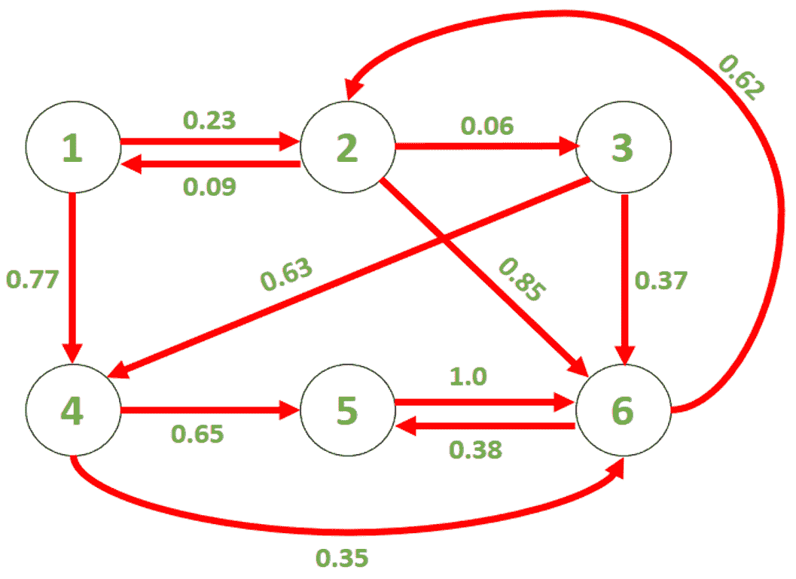

# 查找马尔可夫链中给定时间的状态概率| 设置 2

> 原文： [https://www.geeksforgeeks.org/finding-the-probability-of-a-state-at-a-given-time-in-a-markov-chain-set-2/](https://www.geeksforgeeks.org/finding-the-probability-of-a-state-at-a-given-time-in-a-markov-chain-set-2/)

给定一个马尔可夫链 G，如果我们在时间 t = 0 时从状态 S 开始，则可以找到在时间 t = T 时到达状态 F 的概率。

[马尔可夫链](https://en.wikipedia.org/wiki/Markov_chain)是一个随机过程，由各种状态和从一种状态迁移到另一种状态的概率组成。 我们可以使用有向图来表示它，其中节点代表状态，边代表从一个节点到另一个节点的概率。 从一个节点移动到另一个节点需要花费单位时间。 对于每个节点，出局边的关联概率之和为 1。

考虑给定的马尔可夫链（G），如下图所示：



**范例**：

```
Input : S = 1, F = 2, T = 1
Output: 0.23
We start at state 1 at t = 0, 
so there is a probability of 0.23 
that we reach state 2 at t = 1.

Input: S = 4, F = 2, T = 100
Output: 0.284992

```

在[上一篇文章](https://www.geeksforgeeks.org/find-the-probability-of-a-state-at-a-given-time-in-a-markov-chain-set-1/)中，讨论了一种动态编程方法，其时间复杂度为 O（N <sup>2</sup> T），其中 N 是状态数。

**矩阵求幂方法**：我们可以为马尔可夫链建立一个邻接矩阵，以表示状态之间转移的概率。 例如，上面给出的图的邻接矩阵为：

［HTG1］ ［HTG2］ ［HTG3］ ［HTG4］

我们可以观察到，在时间 t 处的概率分布由 **P（t）= M * P（t – 1）**给出，并且初始概率分布 P（0）是零向量，其中 S [ 元素为 1。 使用这些结果，我们可以求解 P（t）的递归表达式。 例如，如果我们将 S 设为 3，则 P（t）等于

［HTG1］ ［HTG2］ ［HTG3］ ［HTG4］

如果我们使用有效的矩阵求幂技术，则该方法的时间复杂度为 O（N <sup>3</sup> * log T）。 如果 T 的值明显高于状态数，即 N，则该方法比动态编程方法更好。

下面是上述方法的实现：

## C++

```cpp

// C++ implementation of the above approach 
#include <bits/stdc++.h> 
using namespace std; 

// Macro to define a vector of float 
#define vf vector<float> 

// Function to multiply two matrices A and B 
vector<vf > multiply(vector<vf > A,    vector<vf > B, int N) 
{ 
    vector<vf > C(N, vf(N, 0)); 
    for (int i = 0; i < N; ++i) 
        for (int j = 0; j < N; ++j) 
            for (int k = 0; k < N; ++k) 
                C[i][j] += A[i][k] * B[k][j]; 
    return C; 
} 

// Function to calculate the power of a matrix 
vector<vf > matrix_power(vector<vf > M, int p, int n) 
{ 
    vector<vf > A(n, vf(n, 0)); 
    for (int i = 0; i < n; ++i) 
        A[i][i] = 1; 

    while (p) { 
        if (p % 2) 
            A = multiply(A, M, n); 
        M = multiply(M, M, n); 
        p /= 2; 
    } 

    return A; 
} 

// Function to calculate the probability of  
// reaching F at time T after starting from S 
float findProbability(vector<vf > M, int N, int F,  
                                        int S, int T) 
{ 
    // Storing M^T in MT 
    vector<vf > MT = matrix_power(M, T, N); 

    // Returning the answer 
    return MT[F - 1][S - 1]; 
} 

// Driver code 
int main() 
{ 
    // Adjacency matrix 
    // The edges have been stored in the row 
    // corresponding to their end-point 
    vector<vf > G{ { 0, 0.09, 0, 0, 0, 0 }, 
                   { 0.23, 0, 0, 0, 0, 0.62 }, 
                   { 0, 0.06, 0, 0, 0, 0 }, 
                   { 0.77, 0, 0.63, 0, 0, 0 }, 
                   { 0, 0, 0, 0.65, 0, 0.38 }, 
                   { 0, 0.85, 0.37, 0.35, 1.0, 0 }}; 

    // N is the number of states 
    int N = 6; 

    int S = 4, F = 2, T = 100; 

    cout << "The probability of reaching " << F << " at time " 
                << T << "\nafter starting from " << S << " is " 
                << findProbability(G, N, F, S, T); 

    return 0; 
} 

```