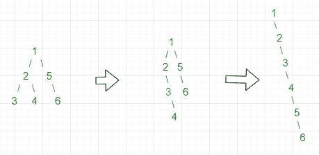

# 将二叉树展平为链接列表

给定一棵二叉树，将其平整就位到链表中。 不允许使用辅助数据结构。 展平后，每个节点的左侧应指向NULL，右侧应包含按顺序排列的下一个节点。
示例：

```
Input : 
          1
        /   \
       2     5
      / \     \
     3   4     6

Output :
    1
     \
      2
       \
        3
         \
          4
           \
            5
             \
              6

Input :
        1
       / \
      3   4
         /
        2
         \
          5
Output :
     1
      \
       3
        \
         4
          \
           2
            \ 
             5

```

**简单方法：**一个简单的解决方案是使用“队列”使用[级别订单遍历。](https://www.geeksforgeeks.org/level-order-tree-traversal/) 在级别顺序遍历中，跟踪先前的节点。 将当前节点作为上一个节点的右子节点，将上一个节点的左节点作为NULL。 该解决方案需要队列，但问题要求解决而无需其他数据结构。
**在没有附加数据结构的情况下有效**在左子树中递归查找没有孙子代且左子代和右子代的节点。 然后将节点->正确存储在温度中，并使节点->右=节点->左。 在node右侧的第一个节点NULL中，按node = node- >右侧插入temp。 重复直到将其转换为链接列表。
例如



## C ++

```

/* Program to flatten a given Binary 
   Tree into linked list */
#include <iostream>
using namespace std;

struct Node {
    int key;
    Node *left, *right;
};

/* utility that allocates a new Node 
   with the given key  */
Node* newNode(int key)
{
    Node* node = new Node;
    node->key = key;
    node->left = node->right = NULL;
    return (node);
}

// Function to convert binary tree into
// linked list by altering the right node
// and making left node point to NULL
void flatten(struct Node* root)
{
    // base condition- return if root is NULL
    // or if it is a leaf node
    if (root == NULL || root->left == NULL &&
                        root->right == NULL) {
        return;
    }

    // if root->left exists then we have 
    // to make it root->right
    if (root->left != NULL) {

        // move left recursively
        flatten(root->left);

        // store the node root->right
        struct Node* tmpRight = root->right;
        root->right = root->left;
        root->left = NULL;

        // find the position to insert
        // the stored value   
        struct Node* t = root->right;
        while (t->right != NULL) {
            t = t->right;
        }

        // insert the stored value
        t->right = tmpRight;
    }

    // now call the same function
    // for root->right
    flatten(root->right);
}

// To find the inorder traversal
void inorder(struct Node* root)
{
    // base condition
    if (root == NULL)
        return;
    inorder(root->left);
    cout << root->key << " ";
    inorder(root->right);
}

/* Driver program to test above functions*/
int main()
{
    /*    1
        /   \
       2     5
      / \     \
     3   4     6 */
    Node* root = newNode(1);
    root->left = newNode(2);
    root->right = newNode(5);
    root->left->left = newNode(3);
    root->left->right = newNode(4);
    root->right->right = newNode(6);

    flatten(root);

    cout << "The Inorder traversal after "
            "flattening binary tree ";
    inorder(root);
    return 0;
}

```

## 爪哇

```

// Java program to flatten a given 
// Binary Tree into linked list

// A binary tree node
class Node 
{
    int data;
    Node left, right;

    Node(int key)
    {
        data = key;
        left = right = null;
    }
}

class BinaryTree{

Node root;

// Function to convert binary tree into
// linked list by altering the right node
// and making left node NULL
public void flatten(Node node) 
{

    // Base case - return if root is NULL
    if (node == null)
        return;

    // Or if it is a leaf node
    if (node.left == null &&
       node.right == null)
        return;

    // If root.left children exists then we have
    // to make it node.right (where node is root)
    if (node.left != null)
    {

        // Move left recursively
        flatten(node.left);

        // Store the node.right in 
        // Node named tempNode
        Node tempNode = node.right;
        node.right = node.left;
        node.left = null;

        // Find the position to insert
        // the stored value
        Node curr = node.right;
        while (curr.right != null) 
        {
            curr = curr.right;
        }

        // Insert the stored value
        curr.right = tempNode;
    }

    // Now call the same function
    // for node.right
    flatten(node.right);

}

// Function for Inorder traversal
public void inOrder(Node node)
{

    // Base Condition
    if (node == null)
        return;

    inOrder(node.left);
    System.out.print(node.data + " ");
    inOrder(node.right);
}

// Driver code
public static void main(String[] args)
{
    BinaryTree tree = new BinaryTree();

    /*    1
        /   \
       2     5
      / \     \
     3   4     6 */

    tree.root = new Node(1);
    tree.root.left = new Node(2);
    tree.root.right = new Node(5);
    tree.root.left.left = new Node(3);
    tree.root.left.right = new Node(4);
    tree.root.right.right = new Node(6);

    System.out.println("The Inorder traversal after " +
                       "flattening binary tree ");

    tree.flatten(tree.root);
    tree.inOrder(tree.root);
}
}

// This code is contributed by Yash Singhal

```

**Output:** 

```
The Inorder traversal after flattening 
binary tree 1 2 3 4 5 6

```

注意读者！ 现在不要停止学习。 通过 [**DSA自学课程**](https://practice.geeksforgeeks.org/courses/dsa-self-paced?utm_source=geeksforgeeks&utm_medium=article&utm_campaign=gfg_article_dsa_content_bottom) 以对学生方便的价格掌握所有重要的DSA概念，并为行业做好准备。

* * *

* * *

如果您喜欢GeeksforGeeks并希望做出贡献，则还可以使用 [tribution.geeksforgeeks.org](https://contribute.geeksforgeeks.org/) 撰写文章，或将您的文章邮寄至tribution@geeksforgeeks.org。 查看您的文章出现在GeeksforGeeks主页上，并帮助其他Geeks。

如果您发现任何不正确的地方，请单击下面的“改进文章”按钮，以改进本文。