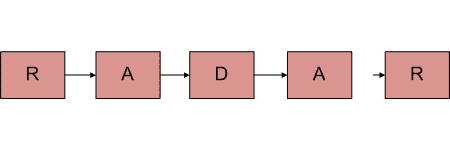
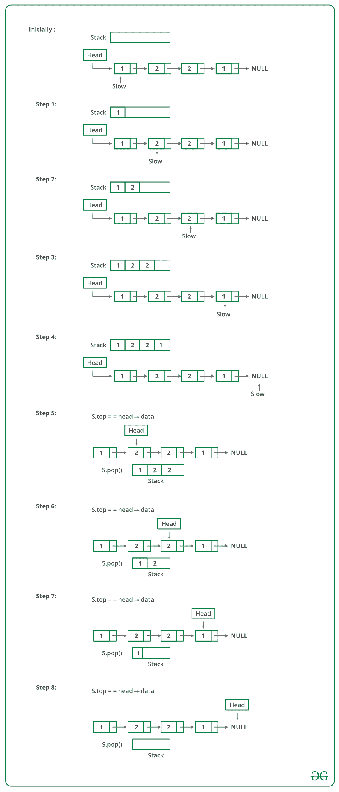

# 用于检查单链表是否是回文

> 原文：[https://www.geeksforgeeks.org/function-to-check-if-a-singly-linked-list-is-palindrome/](https://www.geeksforgeeks.org/function-to-check-if-a-singly-linked-list-is-palindrome/)

的功能

给定一个单字符列表，编写一个函数，如果给定列表是回文，则返回 true，否则返回 false。



**方法 1（使用堆栈）**

*   一个简单的解决方案是使用列表节点堆栈。 这主要涉及三个步骤。

*   从头到尾遍历给定列表，并将每个访问的节点压入堆栈。

*   再次遍历列表。 对于每个访问的节点，从堆栈中弹出一个节点，并将弹出的节点的数据与当前访问的节点进行比较。

*   如果所有节点都匹配，则返回 true，否则返回 false。

下图是上述方法的模拟：



下面是上述方法的实现：

## C++

```cpp

#include<bits/stdc++.h>
using namespace std; 

class Node {
public:
        int data;
        Node(int d){
            data = d;
        }
        Node *ptr;
};

// Function to check if the linked list 
// is palindrome or not 
bool isPalin(Node* head){

        // Temp pointer 
        Node* slow= head;

        // Declare a stack 
        stack <int> s;

        // Push all elements of the list 
        // to the stack 
        while(slow != NULL){
                s.push(slow->data);

                // Move ahead 
                slow = slow->ptr;
        }

        // Iterate in the list again and 
        // check by popping from the stack
        while(head != NULL ){

            // Get the top most element 
             int i=s.top();

             // Pop the element 
             s.pop();

             // Check if data is not
             // same as popped element 
            if(head -> data != i){
                return false;
            }

            // Move ahead 
           head=head->ptr;
        }

return true;
}

// Driver Code 
int main(){

    // Addition of linked list 
    Node one =  Node(1);
    Node two = Node(2);
    Node three = Node(3);
    Node four = Node(2);
    Node five = Node(1);

    // Initialize the next pointer
    // of every current pointer 
    five.ptr = NULL;
    one.ptr = &two;
    two.ptr = &three;
    three.ptr = &four;
    four.ptr = &five;
    Node* temp = &one;

    // Call function to check palindrome or not 
    int result = isPalin(&one);

    if(result == 1)
            cout<<"isPalindrome is true\n";
    else
        cout<<"isPalindrome is true\n";

return 0;
}

// This code has been contributed by Striver 

```

## Java

```java

/* Java program to check if linked list is palindrome recursively */
import java.util.*;

class linkeList {
    public static void main(String args[])
    {
        Node one = new Node(1);
        Node two = new Node(2);
        Node three = new Node(3);
        Node four = new Node(4);
        Node five = new Node(3);
        Node six = new Node(2);
        Node seven = new Node(1);
        one.ptr = two;
        two.ptr = three;
        three.ptr = four;
        four.ptr = five;
        five.ptr = six;
        six.ptr = seven;
        boolean condition = isPalindrome(one);
        System.out.println("isPalidrome :" + condition);
    }
    static boolean isPalindrome(Node head)
    {

        Node slow = head;
        boolean ispalin = true;
        Stack<Integer> stack = new Stack<Integer>();

        while (slow != null) {
            stack.push(slow.data);
            slow = slow.ptr;
        }

        while (head != null) {

            int i = stack.pop();
            if (head.data == i) {
                ispalin = true;
            }
            else {
                ispalin = false;
                break;
            }
            head = head.ptr;
        }
        return ispalin;
    }
}

class Node {
    int data;
    Node ptr;
    Node(int d)
    {
        ptr = null;
        data = d;
    }
}

```

## Python3

```py

# Python3 program to check if linked
# list is palindrome using stack
class Node:
    def __init__(self,data):

        self.data = data
        self.ptr = None

# Function to check if the linked list
# is palindrome or not
def ispalindrome(head):

    # Temp pointer
    slow = head

    # Declare a stack
    stack = []

    ispalin = True

    # Push all elements of the list
    # to the stack
    while slow != None:
        stack.append(slow.data)

        # Move ahead
        slow = slow.ptr

    # Iterate in the list again and
    # check by popping from the stack
    while head != None:

        # Get the top most element
        i = stack.pop()

        # Check if data is not
        # same as popped element
        if head.data == i:
            ispalin = True
        else:
            ispalin = False
            break

        # Move ahead
        head = head.ptr

    return ispalin

# Driver Code

# Addition of linked list
one = Node(1)
two = Node(2)
three = Node(3)
four = Node(4)
five = Node(3)
six = Node(2)
seven = Node(1)

# Initialize the next pointer
# of every current pointer
one.ptr = two
two.ptr = three
three.ptr = four
four.ptr = five
five.ptr = six
six.ptr = seven
seven.ptr = None

# Call function to check palindrome or not
result = ispalindrome(one)

print("isPalindrome:", result)

# This code is contributed by Nishtha Goel

```

## C#

```cs

// C# program to check if linked list
// is palindrome recursively 
using System;
using System.Collections.Generic;

class linkeList{

// Driver code
public static void Main(String []args)
{
    Node one = new Node(1);
    Node two = new Node(2);
    Node three = new Node(3);
    Node four = new Node(4);
    Node five = new Node(3);
    Node six = new Node(2);
    Node seven = new Node(1);

    one.ptr = two;
    two.ptr = three;
    three.ptr = four;
    four.ptr = five;
    five.ptr = six;
    six.ptr = seven;

    bool condition = isPalindrome(one);
    Console.WriteLine("isPalidrome :" + condition);
}

static bool isPalindrome(Node head)
{
    Node slow = head;
    bool ispalin = true;
    Stack<int> stack = new Stack<int>();

    while (slow != null)
    {
        stack.Push(slow.data);
        slow = slow.ptr;
    }

    while (head != null)
    {
        int i = stack.Pop();
        if (head.data == i) 
        {
            ispalin = true;
        }
        else
        {
            ispalin = false;
            break;
        }
        head = head.ptr;
    }
    return ispalin;
}
}

class Node 
{
    public int data;
    public Node ptr;
    public Node(int d)
    {
        ptr = null;
        data = d;
    }
}

// This code is contributed by amal kumar choubey

```

**输出**

```
 isPalindrome: true

```

上述方法的时间复杂度为`O(n)`。

**方法 2（通过反转列表）**

此方法占用`O(n)`时间和`O(1)`额外空间。

**1）**获取链接列表的中间。

**2）**反转链表的后半部分。

**3）**检查上半部分和下半部分是否相同。

**4）**通过再次反转后半部分并将其附加到前半部分，构造原始链表

要将列表分为两半，请使用此帖子的[方法 2。](https://www.geeksforgeeks.org/write-a-c-function-to-print-the-middle-of-the-linked-list/)

当节点数为偶数时，前一半和后一半恰好包含一半节点。 这种方法的挑战在于处理节点数为奇数的情况。 我们不希望中间节点成为任何列表的一部分，因为我们将比较它们是否相等。 对于奇怪的情况，我们使用单独的变量“ midnode”。

## C

```c

/* Program to check if a linked list is palindrome */
#include <stdbool.h> 
#include <stdio.h> 
#include <stdlib.h> 

/* Link list node */
struct Node { 
    char data; 
    struct Node* next; 
}; 

void reverse(struct Node**); 
bool compareLists(struct Node*, struct Node*); 

/* Function to check if given linked list is 
palindrome or not */
bool isPalindrome(struct Node* head) 
{ 
    struct Node *slow_ptr = head, *fast_ptr = head; 
    struct Node *second_half, *prev_of_slow_ptr = head; 
    struct Node* midnode = NULL; // To handle odd size list 
    bool res = true; // initialize result 

    if (head != NULL && head->next != NULL) { 
        /* Get the middle of the list. Move slow_ptr by 1 
        and fast_ptrr by 2, slow_ptr will have the middle 
        node */
        while (fast_ptr != NULL && fast_ptr->next != NULL) { 
            fast_ptr = fast_ptr->next->next; 

            /*We need previous of the slow_ptr for 
            linked lists with odd elements */
            prev_of_slow_ptr = slow_ptr; 
            slow_ptr = slow_ptr->next; 
        } 

        /* fast_ptr would become NULL when there are even elements in list. 
        And not NULL for odd elements. We need to skip the middle node 
        for odd case and store it somewhere so that we can restore the 
        original list*/
        if (fast_ptr != NULL) { 
            midnode = slow_ptr; 
            slow_ptr = slow_ptr->next; 
        } 

        // Now reverse the second half and compare it with first half 
        second_half = slow_ptr; 
        prev_of_slow_ptr->next = NULL; // NULL terminate first half 
        reverse(&second_half); // Reverse the second half 
        res = compareLists(head, second_half); // compare 

        /* Construct the original list back */
        reverse(&second_half); // Reverse the second half again 

        // If there was a mid node (odd size case) which 
        // was not part of either first half or second half. 
        if (midnode != NULL) { 
            prev_of_slow_ptr->next = midnode; 
            midnode->next = second_half; 
        } 
        else
            prev_of_slow_ptr->next = second_half; 
    } 
    return res; 
} 

/* Function to reverse the linked list Note that this 
    function may change the head */
void reverse(struct Node** head_ref) 
{ 
    struct Node* prev = NULL; 
    struct Node* current = *head_ref; 
    struct Node* next; 
    while (current != NULL) { 
        next = current->next; 
        current->next = prev; 
        prev = current; 
        current = next; 
    } 
    *head_ref = prev; 
} 

/* Function to check if two input lists have same data*/
bool compareLists(struct Node* head1, struct Node* head2) 
{ 
    struct Node* temp1 = head1; 
    struct Node* temp2 = head2; 

    while (temp1 && temp2) { 
        if (temp1->data == temp2->data) { 
            temp1 = temp1->next; 
            temp2 = temp2->next; 
        } 
        else
            return 0; 
    } 

    /* Both are empty reurn 1*/
    if (temp1 == NULL && temp2 == NULL) 
        return 1; 

    /* Will reach here when one is NULL 
    and other is not */
    return 0; 
} 

/* Push a node to linked list. Note that this function 
changes the head */
void push(struct Node** head_ref, char new_data) 
{ 
    /* allocate node */
    struct Node* new_node = (struct Node*)malloc(sizeof(struct Node)); 

    /* put in the data */
    new_node->data = new_data; 

    /* link the old list off the new node */
    new_node->next = (*head_ref); 

    /* move the head to pochar to the new node */
    (*head_ref) = new_node; 
} 

// A utility function to print a given linked list 
void printList(struct node* ptr) 
{ 
    while (ptr != NULL) { 
        printf("%c->", ptr->data); 
        ptr = ptr->next; 
    } 
    printf("NULL\n"); 
} 

/* Drier program to test above function*/
int main() 
{ 
    /* Start with the empty list */
    struct Node* head = NULL; 
    char str[] = "abacaba"; 
    int i; 

    for (i = 0; str[i] != '\0'; i++) { 
        push(&head, str[i]); 
        printList(head); 
        isPalindrome(head) ? printf("Is Palindrome\n\n") : printf("Not Palindrome\n\n"); 
    } 

    return 0; 
} 

```

## Java

```java

/* Java program to check if linked list is palindrome */

class LinkedList {
    Node head; // head of list
    Node slow_ptr, fast_ptr, second_half;

    /* Linked list Node*/
    class Node {
        char data;
        Node next;

        Node(char d)
        {
            data = d;
            next = null;
        }
    }

    /* Function to check if given linked list is
       palindrome or not */
    boolean isPalindrome(Node head)
    {
        slow_ptr = head;
        fast_ptr = head;
        Node prev_of_slow_ptr = head;
        Node midnode = null; // To handle odd size list
        boolean res = true; // initialize result

        if (head != null && head.next != null) {
            /* Get the middle of the list. Move slow_ptr by 1
               and fast_ptrr by 2, slow_ptr will have the middle
               node */
            while (fast_ptr != null && fast_ptr.next != null) {
                fast_ptr = fast_ptr.next.next;

                /*We need previous of the slow_ptr for
                  linked lists  with odd elements */
                prev_of_slow_ptr = slow_ptr;
                slow_ptr = slow_ptr.next;
            }

            /* fast_ptr would become NULL when there are even elements 
               in the list and not NULL for odd elements. We need to skip  
               the middle node for odd case and store it somewhere so that
               we can restore the original list */
            if (fast_ptr != null) {
                midnode = slow_ptr;
                slow_ptr = slow_ptr.next;
            }

            // Now reverse the second half and compare it with first half
            second_half = slow_ptr;
            prev_of_slow_ptr.next = null; // NULL terminate first half
            reverse(); // Reverse the second half
            res = compareLists(head, second_half); // compare

            /* Construct the original list back */
            reverse(); // Reverse the second half again

            if (midnode != null) {
                // If there was a mid node (odd size case) which
                // was not part of either first half or second half.
                prev_of_slow_ptr.next = midnode;
                midnode.next = second_half;
            }
            else
                prev_of_slow_ptr.next = second_half;
        }
        return res;
    }

    /* Function to reverse the linked list  Note that this
       function may change the head */
    void reverse()
    {
        Node prev = null;
        Node current = second_half;
        Node next;
        while (current != null) {
            next = current.next;
            current.next = prev;
            prev = current;
            current = next;
        }
        second_half = prev;
    }

    /* Function to check if two input lists have same data*/
    boolean compareLists(Node head1, Node head2)
    {
        Node temp1 = head1;
        Node temp2 = head2;

        while (temp1 != null && temp2 != null) {
            if (temp1.data == temp2.data) {
                temp1 = temp1.next;
                temp2 = temp2.next;
            }
            else
                return false;
        }

        /* Both are empty reurn 1*/
        if (temp1 == null && temp2 == null)
            return true;

        /* Will reach here when one is NULL
           and other is not */
        return false;
    }

    /* Push a node to linked list. Note that this function
       changes the head */
    public void push(char new_data)
    {
        /* Allocate the Node &
           Put in the data */
        Node new_node = new Node(new_data);

        /* link the old list off the new one */
        new_node.next = head;

        /* Move the head to point to new Node */
        head = new_node;
    }

    // A utility function to print a given linked list
    void printList(Node ptr)
    {
        while (ptr != null) {
            System.out.print(ptr.data + "->");
            ptr = ptr.next;
        }
        System.out.println("NULL");
    }

    /* Driver program to test the above functions */
    public static void main(String[] args)
    {

        /* Start with the empty list */
        LinkedList llist = new LinkedList();

        char str[] = { 'a', 'b', 'a', 'c', 'a', 'b', 'a' };
        String string = new String(str);
        for (int i = 0; i < 7; i++) {
            llist.push(str[i]);
            llist.printList(llist.head);
            if (llist.isPalindrome(llist.head) != false) {
                System.out.println("Is Palindrome");
                System.out.println("");
            }
            else {
                System.out.println("Not Palindrome");
                System.out.println("");
            }
        }
    }
}

```

## Python3

```py

# Python3 program to check if
# linked list is palindrome

# Node class
class Node:

    # Constructor to initialize
    # the node object
    def __init__(self, data):

        self.data = data
        self.next = None

class LinkedList:

    # Function to initialize head
    def __init__(self):

        self.head = None

    # Function to check if given
    # linked list is pallindrome or not
    def isPalindrome(self, head):

        slow_ptr = head
        fast_ptr = head
        prev_of_slow_ptr = head

        # To handle odd size list
        midnode = None

        # Initialize result
        res = True 

        if (head != None and head.next != None):

            # Get the middle of the list. 
            # Move slow_ptr by 1 and 
            # fast_ptrr by 2, slow_ptr 
            # will have the middle node
            while (fast_ptr != None and
                   fast_ptr.next != None):

                # We need previous of the slow_ptr 
                # for linked lists  with odd 
                # elements
                fast_ptr = fast_ptr.next.next
                prev_of_slow_ptr = slow_ptr
                slow_ptr = slow_ptr.next

            # fast_ptr would become NULL when 
            # there are even elements in the 
            # list and not NULL for odd elements. 
            # We need to skip the middle node for 
            # odd case and store it somewhere so 
            # that we can restore the original list
            if (fast_ptr != None):
                midnode = slow_ptr
                slow_ptr = slow_ptr.next

            # Now reverse the second half 
            # and compare it with first half
            second_half = slow_ptr

            # NULL terminate first half
            prev_of_slow_ptr.next = None

            # Reverse the second half
            second_half = self.reverse(second_half) 

            # Compare
            res = self.compareLists(head, second_half)  

            # Construct the original list back
            # Reverse the second half again
            second_half = self.reverse(second_half)

            if (midnode != None):

                # If there was a mid node (odd size
                # case) which was not part of either
                # first half or second half.
                prev_of_slow_ptr.next = midnode
                midnode.next = second_half
            else:
                prev_of_slow_ptr.next = second_half
        return res

    # Function to reverse the linked list 
    # Note that this function may change 
    # the head
    def reverse(self, second_half):

        prev = None
        current = second_half
        next = None

        while current != None:
            next = current.next
            current.next = prev
            prev = current
            current = next

        second_half = prev
        return second_half

    # Function to check if two input 
    # lists have same data
    def compareLists(self, head1, head2):

        temp1 = head1
        temp2 = head2

        while (temp1 and temp2):
            if (temp1.data == temp2.data):
                temp1 = temp1.next
                temp2 = temp2.next
            else:
                return 0

        # Both are empty return 1
        if (temp1 == None and temp2 == None):
            return 1

        # Will reach here when one is NULL
        # and other is not
        return 0

    # Function to insert a new node
    # at the beginning
    def push(self, new_data):

        # Allocate the Node &
        # Put in the data
        new_node = Node(new_data)

        # Link the old list off the new one
        new_node.next = self.head

        # Move the head to point to new Node
        self.head = new_node

    # A utility function to print
    # a given linked list 
    def printList(self):

        temp = self.head

        while(temp):
            print(temp.data, end = "->")
            temp = temp.next

        print("NULL")

# Driver code
if __name__ == '__main__':

    l = LinkedList()
    s = [ 'a', 'b', 'a', 'c', 'a', 'b', 'a' ]

    for i in range(7):
        l.push(s[i])
        l.printList()

        if (l.isPalindrome(l.head) != False):
            print("Is Palindrome\n")
        else:
            print("Not Palindrome\n")
        print()

# This code is contributed by MuskanKalra1

```

## C#

```cs

/* C# program to check if linked list is palindrome */
using System;
class LinkedList {
    Node head; // head of list
    Node slow_ptr, fast_ptr, second_half;

    /* Linked list Node*/
    public class Node {
        public char data;
        public Node next;

        public Node(char d)
        {
            data = d;
            next = null;
        }
    }

    /* Function to check if given linked list is
       palindrome or not */
    Boolean isPalindrome(Node head)
    {
        slow_ptr = head;
        fast_ptr = head;
        Node prev_of_slow_ptr = head;
        Node midnode = null; // To handle odd size list
        Boolean res = true; // initialize result

        if (head != null && head.next != null) {
            /* Get the middle of the list. Move slow_ptr by 1
               and fast_ptrr by 2, slow_ptr will have the middle
               node */
            while (fast_ptr != null && fast_ptr.next != null) {
                fast_ptr = fast_ptr.next.next;

                /*We need previous of the slow_ptr for
                  linked lists  with odd elements */
                prev_of_slow_ptr = slow_ptr;
                slow_ptr = slow_ptr.next;
            }

            /* fast_ptr would become NULL when there are even elements 
               in the list and not NULL for odd elements. We need to skip  
               the middle node for odd case and store it somewhere so that
               we can restore the original list */
            if (fast_ptr != null) {
                midnode = slow_ptr;
                slow_ptr = slow_ptr.next;
            }

            // Now reverse the second half and compare it with first half
            second_half = slow_ptr;
            prev_of_slow_ptr.next = null; // NULL terminate first half
            reverse(); // Reverse the second half
            res = compareLists(head, second_half); // compare

            /* Construct the original list back */
            reverse(); // Reverse the second half again

            if (midnode != null) {
                // If there was a mid node (odd size case) which
                // was not part of either first half or second half.
                prev_of_slow_ptr.next = midnode;
                midnode.next = second_half;
            }
            else
                prev_of_slow_ptr.next = second_half;
        }
        return res;
    }

    /* Function to reverse the linked list  Note that this
       function may change the head */
    void reverse()
    {
        Node prev = null;
        Node current = second_half;
        Node next;
        while (current != null) {
            next = current.next;
            current.next = prev;
            prev = current;
            current = next;
        }
        second_half = prev;
    }

    /* Function to check if two input lists have same data*/
    Boolean compareLists(Node head1, Node head2)
    {
        Node temp1 = head1;
        Node temp2 = head2;

        while (temp1 != null && temp2 != null) {
            if (temp1.data == temp2.data) {
                temp1 = temp1.next;
                temp2 = temp2.next;
            }
            else
                return false;
        }

        /* Both are empty reurn 1*/
        if (temp1 == null && temp2 == null)
            return true;

        /* Will reach here when one is NULL
           and other is not */
        return false;
    }

    /* Push a node to linked list. Note that this function
       changes the head */
    public void push(char new_data)
    {
        /* Allocate the Node &
           Put in the data */
        Node new_node = new Node(new_data);

        /* link the old list off the new one */
        new_node.next = head;

        /* Move the head to point to new Node */
        head = new_node;
    }

    // A utility function to print a given linked list
    void printList(Node ptr)
    {
        while (ptr != null) {
            Console.Write(ptr.data + "->");
            ptr = ptr.next;
        }
        Console.WriteLine("NULL");
    }

    /* Driver program to test the above functions */
    public static void Main(String[] args)
    {

        /* Start with the empty list */
        LinkedList llist = new LinkedList();

        char[] str = { 'a', 'b', 'a', 'c', 'a', 'b', 'a' };

        for (int i = 0; i < 7; i++) {
            llist.push(str[i]);
            llist.printList(llist.head);
            if (llist.isPalindrome(llist.head) != false) {
                Console.WriteLine("Is Palindrome");
                Console.WriteLine("");
            }
            else {
                Console.WriteLine("Not Palindrome");
                Console.WriteLine("");
            }
        }
    }
}
// This code is contributed by Arnab Kundu

```

**输出**：

```
a->NULL
Is Palindrome

b->a->NULL
Not Palindrome

a->b->a->NULL
Is Palindrome

c->a->b->a->NULL
Not Palindrome

a->c->a->b->a->NULL
Not Palindrome

b->a->c->a->b->a->NULL
Not Palindrome

a->b->a->c->a->b->a->NULL
Is Palindrome

```

**时间复杂度**：`O(n)`

**辅助空间**：`O(1)`

**方法 3（使用递归）**

左右使用两个指针。 使用递归在左右移动，并在每个递归调用中检查是否跟随。

1）子列表是回文。

2）当前左侧和右侧的值匹配。

如果以上两个条件都成立，则返回 true。

想法是使用函数调用堆栈作为容器。 递归遍历直到列表末尾。 当我们从最后一个 NULL 返回时，我们将在最后一个节点。 要与列表的第一个节点进行比较的最后一个节点。

为了访问列表的第一个节点，我们需要列表头在递归的最后一次调用中可用。 因此，我们也将 head 传递给了递归函数。 如果它们都匹配，则需要比较（2，n-2）个节点。 同样，当递归回落到第（n-2）个节点时，我们需要从头开始引用第二个节点。 我们在上一个调用中前进头指针，以引用列表中的下一个节点。

但是，识别双指针的技巧。 传递单个指针与传递值一样好，我们将一次又一次传递相同的指针。 我们需要传递头部指针的地址以反映父递归调用中的更改。

感谢 **Sharad Chandra** 提出了这种方法。

## C++

```cpp

// Recursive program to check if a given linked list is palindrome 
#include <bits/stdc++.h> 
using namespace std; 

/* Link list node */
struct node { 
    char data; 
    struct node* next; 
}; 

// Initial parameters to this function are &head and head 
bool isPalindromeUtil(struct node** left, struct node* right) 
{ 
    /* stop recursion when right becomes NULL */
    if (right == NULL) 
        return true; 

    /* If sub-list is not palindrome then no need to 
    check for current left and right, return false */
    bool isp = isPalindromeUtil(left, right->next); 
    if (isp == false) 
        return false; 

    /* Check values at current left and right */
    bool isp1 = (right->data == (*left)->data); 

    /* Move left to next node */
    *left = (*left)->next; 

    return isp1; 
} 

// A wrapper over isPalindromeUtil() 
bool isPalindrome(struct node* head) 
{ 
    isPalindromeUtil(&head, head); 
} 

/* Push a node to linked list. Note that this function 
changes the head */
void push(struct node** head_ref, char new_data) 
{ 
    /* allocate node */
    struct node* new_node = (struct node*)malloc(sizeof(struct node)); 

    /* put in the data */
    new_node->data = new_data; 

    /* link the old list off the new node */
    new_node->next = (*head_ref); 

    /* move the head to pochar to the new node */
    (*head_ref) = new_node; 
} 

// A utility function to print a given linked list 
void printList(struct node* ptr) 
{ 
    while (ptr != NULL) { 
        cout << ptr->data << "->"; 
        ptr = ptr->next; 
    } 
    cout << "NULL\n" ; 
} 

/* Driver program to test above function*/
int main() 
{ 
    /* Start with the empty list */
    struct node* head = NULL; 
    char str[] = "abacaba"; 
    int i; 

    for (i = 0; str[i] != '\0'; i++) { 
        push(&head, str[i]); 
        printList(head); 
        isPalindrome(head) ? cout << "Is Palindrome\n\n" : cout << "Not Palindrome\n\n"; 
    } 

    return 0; 
} 
//this code is contributed by shivanisinghss2110 

```

## C

```c

// Recursive program to check if a given linked list is palindrome 
#include <stdbool.h> 
#include <stdio.h> 
#include <stdlib.h> 

/* Link list node */
struct node { 
    char data; 
    struct node* next; 
}; 

// Initial parameters to this function are &head and head 
bool isPalindromeUtil(struct node** left, struct node* right) 
{ 
    /* stop recursion when right becomes NULL */
    if (right == NULL) 
        return true; 

    /* If sub-list is not palindrome then no need to 
    check for current left and right, return false */
    bool isp = isPalindromeUtil(left, right->next); 
    if (isp == false) 
        return false; 

    /* Check values at current left and right */
    bool isp1 = (right->data == (*left)->data); 

    /* Move left to next node */
    *left = (*left)->next; 

    return isp1; 
} 

// A wrapper over isPalindromeUtil() 
bool isPalindrome(struct node* head) 
{ 
    isPalindromeUtil(&head, head); 
} 

/* Push a node to linked list. Note that this function 
changes the head */
void push(struct node** head_ref, char new_data) 
{ 
    /* allocate node */
    struct node* new_node = (struct node*)malloc(sizeof(struct node)); 

    /* put in the data */
    new_node->data = new_data; 

    /* link the old list off the new node */
    new_node->next = (*head_ref); 

    /* move the head to pochar to the new node */
    (*head_ref) = new_node; 
} 

// A utility function to print a given linked list 
void printList(struct node* ptr) 
{ 
    while (ptr != NULL) { 
        printf("%c->", ptr->data); 
        ptr = ptr->next; 
    } 
    printf("NULL\n"); 
} 

/* Driver program to test above function*/
int main() 
{ 
    /* Start with the empty list */
    struct node* head = NULL; 
    char str[] = "abacaba"; 
    int i; 

    for (i = 0; str[i] != '\0'; i++) { 
        push(&head, str[i]); 
        printList(head); 
        isPalindrome(head) ? printf("Is Palindrome\n\n") : printf("Not Palindrome\n\n"); 
    } 

    return 0; 
} 

```

## C#

```cs

/* C# program to check if linked list 
is palindrome recursively */
using System;

public class LinkedList 
{ 
    Node head; // head of list 
    Node left; 

    /* Linked list Node*/
    public class Node 
    { 
        public char data; 
        public Node next; 

        public Node(char d) 
        { 
            data = d; 
            next = null; 
        } 
    } 

    // Initial parameters to this function are &head and head 
    Boolean isPalindromeUtil(Node right) 
    { 
        left = head; 

        /* stop recursion when right becomes NULL */
        if (right == null) 
            return true; 

        /* If sub-list is not palindrome then no need to 
        check for current left and right, return false */
        Boolean isp = isPalindromeUtil(right.next); 
        if (isp == false) 
            return false; 

        /* Check values at current left and right */
        Boolean isp1 = (right.data == (left).data); 

        /* Move left to next node */
        left = left.next; 

        return isp1; 
    } 

    // A wrapper over isPalindromeUtil() 
    Boolean isPalindrome(Node head) 
    { 
        Boolean result = isPalindromeUtil(head); 
        return result; 
    } 

    /* Push a node to linked list. Note that this function 
    changes the head */
    public void push(char new_data) 
    { 
        /* Allocate the Node & 
        Put in the data */
        Node new_node = new Node(new_data); 

        /* link the old list off the new one */
        new_node.next = head; 

        /* Move the head to point to new Node */
        head = new_node; 
    } 

    // A utility function to print a given linked list 
    void printList(Node ptr) 
    { 
        while (ptr != null) 
        { 
            Console.Write(ptr.data + "->"); 
            ptr = ptr.next; 
        } 
        Console.WriteLine("NULL"); 
    } 

    /* Driver code */
    public static void Main(String[] args) 
    { 
        /* Start with the empty list */
        LinkedList llist = new LinkedList(); 

        char []str = { 'a', 'b', 'a', 'c', 'a', 'b', 'a' }; 
        //String string = new String(str); 
        for (int i = 0; i < 7; i++) { 
            llist.push(str[i]); 
            llist.printList(llist.head); 
            if (llist.isPalindrome(llist.head) != false) 
            { 
                Console.WriteLine("Is Palindrome"); 
                Console.WriteLine(""); 
            } 
            else
            { 
                Console.WriteLine("Not Palindrome"); 
                Console.WriteLine(""); 
            } 
        } 
    } 
} 

// This code is contributed by Rajput-Ji

```

**输出**：

```
a->NULL
Not Palindrome

b->a->NULL
Not Palindrome

a->b->a->NULL
Is Palindrome

c->a->b->a->NULL
Not Palindrome

a->c->a->b->a->NULL
Not Palindrome

b->a->c->a->b->a->NULL
Not Palindrome

a->b->a->c->a->b->a->NULL
Is Palindrome

```

**时间复杂度**：`O(n)`

**辅助空间**：`O(n)`（如果考虑函数调用堆栈大小），否则为`O(1)`。

