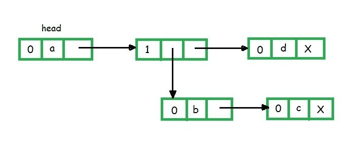
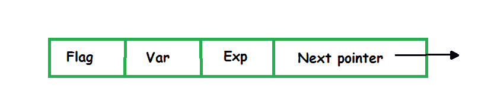
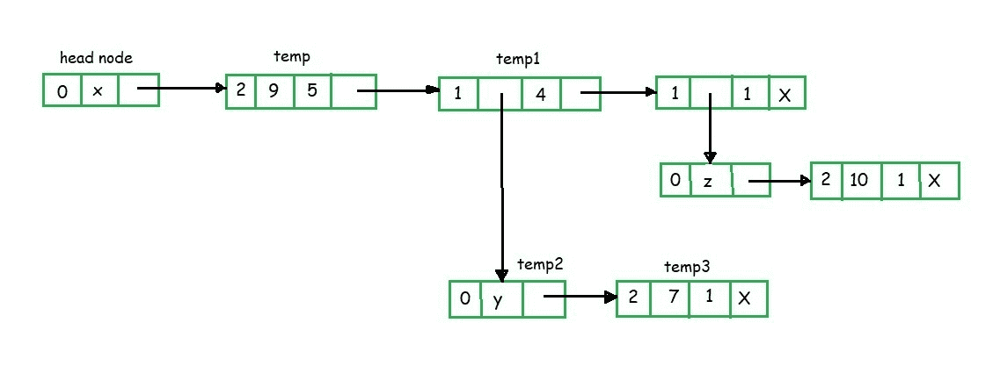

# 广义链表

> 原文：[https://www.geeksforgeeks.org/generalized-linked-list/](https://www.geeksforgeeks.org/generalized-linked-list/)

广义链表`L`定义为`n >= 0`个元素的有限序列，即`[l1, l2, ..., ln]`，使得`l[i]`是原子或原子列表。 因此：

`L = [l1, l2, ..., ln]`

其中`n`是列表中节点的总数。


为了表示项目列表，有一些关于节点结构的假设。

*   `flag = 1`表示存在`down`指针

*   `flag = 0`表示存在`next`指针

*   数据意味着原子

*   `down`指针是当前节点下的节点地址

*   `next`指针是作为下一个节点附加的节点的地址

**为什么使用广义链表？**

之所以使用广义链表，是因为尽管使用链表的多项式运算效率不错，但缺点是链表无法有效地使用*多元变量多项式方程*。 它帮助我们用元素列表表示多变量多项式。

**通用链表**的典型 C 结构

```

typedef struct node { 
    char c;                    //Data 
    int index;                 //Flag 
    struct node *next, *down;   //Next & Down pointer 
}GLL; 

```

**GLL 的示例** {列表表示}

`(a, (b, c), d)`



当第一字段为 0 时，表示第二个字段是可变的。 如果第一个字段为 1，则表示第二个字段为`next`指针，表示某些列表的开头。

**使用广义链表**

的多项式表示形式典型的节点结构为：



*   标志为 0 表示*变量*存在

*   标志为 1 表示存在*下指针*

*   标志为 2 表示存在*系数*和*指数*

**例如**：

9x <sup>5</sup> + 7xy <sup>4</sup> + 10xz



在上面的示例中，头节点的变量为 x。 temp 节点将第一个字段显示为 2，表示存在系数和指数。


由于临时节点连接到头节点，并且头节点具有变量 x，因此临时节点的系数= 9，指数=5。上述两个节点可以读取为 9x <sup>5</sup> 。


类似地，在上图中，节点`temp1`可以读取为`x ^ 4`。

*   标志字段为 1 表示向下指针存在

*   `temp2 = y`

*   `temp3 = 7`

*   指数为 1

*   标志为 2 表示节点包含系数和指数值。

*   `temp2`连接到`temp3`，这表示`7y ^ 1`，而`temp2`也连接到`temp1`，表示`temp1 x temp2`

*   `x^4 x 7y^1 = 7x^4 y^1`值由上图表示


* * *

* * *

如果您喜欢 GeeksforGeeks 并希望做出贡献，则还可以使用 [tribution.geeksforgeeks.org](https://contribute.geeksforgeeks.org/) 撰写文章，或将您的文章邮寄至 tribution@geeksforgeeks.org。 查看您的文章出现在 GeeksforGeeks 主页上，并帮助其他 Geeks。

如果您发现任何不正确的地方，请单击下面的“改进文章”按钮，以改进本文。