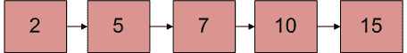

# 给定一个已排序的链表，您将如何以已排序的方式插入

给定排序的链表和要插入的值，编写一个函数以排序的方式插入值。

初始链接列表



插入 9

后的链接列表

**算法**：

让输入的链表按升序排序。

```
1) If Linked list is empty then make the node as
   head and return it.
2) If the value of the node to be inserted is smaller 
   than the value of the head node, then insert the node 
at the start and make it head.
3) In a loop, find the appropriate node after 
   which the input node (let 9) is to be inserted. 
   To find the appropriate node start from the head, 
   keep moving until you reach a node GN (10 in
   the below diagram) who's value is greater than 
   the input node. The node just before GN is the
appropriate node (7).
4) Insert the node (9) after the appropriate node
   (7) found in step 3.

```

**实施**：

## C++

```cpp

/* Program to insert in a sorted list */
#include <bits/stdc++.h> 
using namespace std; 

/* Link list node */
class Node { 
public: 
    int data; 
    Node* next; 
}; 

/* function to insert a new_node  
in a list. Note that this  
function expects a pointer to  
head_ref as this can modify the  
head of the input linked list  
(similar to push())*/
void sortedInsert(Node** head_ref, 
                  Node* new_node) 
{ 
    Node* current; 
    /* Special case for the head end */
    if (*head_ref == NULL 
        || (*head_ref)->data 
               >= new_node->data) { 
        new_node->next = *head_ref; 
        *head_ref = new_node; 
    } 
    else { 
        /* Locate the node before the 
 point of insertion */
        current = *head_ref; 
        while (current->next != NULL  
&& current->next->data  
< new_node->data) { 
            current = current->next; 
        } 
        new_node->next = current->next; 
        current->next = new_node; 
    } 
} 

/* BELOW FUNCTIONS ARE JUST  
UTILITY TO TEST sortedInsert */

/* A utility function to  
create a new node */
Node* newNode(int new_data) 
{ 
    /* allocate node */
    Node* new_node = new Node(); 

    /* put in the data */
    new_node->data = new_data; 
    new_node->next = NULL; 

    return new_node; 
} 

/* Function to print linked list */
void printList(Node* head) 
{ 
    Node* temp = head; 
    while (temp != NULL) { 
        cout << temp->data << " "; 
        temp = temp->next; 
    } 
} 

/* Driver program to test count function*/
int main() 
{ 
    /* Start with the empty list */
    Node* head = NULL; 
    Node* new_node = newNode(5); 
    sortedInsert(&head, new_node); 
    new_node = newNode(10); 
    sortedInsert(&head, new_node); 
    new_node = newNode(7); 
    sortedInsert(&head, new_node); 
    new_node = newNode(3); 
    sortedInsert(&head, new_node); 
    new_node = newNode(1); 
    sortedInsert(&head, new_node); 
    new_node = newNode(9); 
    sortedInsert(&head, new_node); 
    cout << "Created Linked List\n"; 
    printList(head); 

    return 0; 
} 
// This is code is contributed by rathbhupendra 

```

## C

```c

/* Program to insert in a sorted list */
#include <stdio.h> 
#include <stdlib.h> 

/* Link list node */
struct Node { 
    int data; 
    struct Node* next; 
}; 

/* function to insert a new_node 
 in a list. Note that this 
  function expects a pointer  
to head_ref as this can modify the 
  head of the input linked  
list (similar to push())*/
void sortedInsert(struct Node** head_ref, 
                  struct Node* new_node) 
{ 
    struct Node* current; 
    /* Special case for the head end */
    if (*head_ref == NULL 
        || (*head_ref)->data 
               >= new_node->data) { 
        new_node->next = *head_ref; 
        *head_ref = new_node; 
    } 
    else { 
        /* Locate the node before  
the point of insertion */
        current = *head_ref; 
        while (current->next != NULL 
               && current->next->data < new_node->data) { 
            current = current->next; 
        } 
        new_node->next = current->next; 
        current->next = new_node; 
    } 
} 

/* BELOW FUNCTIONS ARE JUST UTILITY TO TEST sortedInsert */

/* A utility function to create a new node */
struct Node* newNode(int new_data) 
{ 
    /* allocate node */
    struct Node* new_node  
= (struct Node*)malloc( 
sizeof(struct Node)); 

    /* put in the data  */
    new_node->data = new_data; 
    new_node->next = NULL; 

    return new_node; 
} 

/* Function to print linked list */
void printList(struct Node* head) 
{ 
    struct Node* temp = head; 
    while (temp != NULL) { 
        printf("%d  ", temp->data); 
        temp = temp->next; 
    } 
} 

/* Driver program to test count function*/
int main() 
{ 
    /* Start with the empty list */
    struct Node* head = NULL; 
    struct Node* new_node = newNode(5); 
    sortedInsert(&head, new_node); 
    new_node = newNode(10); 
    sortedInsert(&head, new_node); 
    new_node = newNode(7); 
    sortedInsert(&head, new_node); 
    new_node = newNode(3); 
    sortedInsert(&head, new_node); 
    new_node = newNode(1); 
    sortedInsert(&head, new_node); 
    new_node = newNode(9); 
    sortedInsert(&head, new_node); 
    printf("\n Created Linked List\n"); 
    printList(head); 

    return 0; 
} 

```

## Java

```java

// Java Program to insert in a sorted list 
class LinkedList { 
    Node head; // head of list 

    /* Linked list Node*/
    class Node { 
        int data; 
        Node next; 
        Node(int d) 
        { 
            data = d; 
            next = null; 
        } 
    } 

    /* function to insert a  
new_node in a list. */
    void sortedInsert(Node new_node) 
    { 
        Node current; 

        /* Special case for head node */
        if (head == null || head.data  
>= new_node.data) { 
            new_node.next = head; 
            head = new_node; 
        } 
        else { 

            /* Locate the node before point of insertion. */
            current = head; 

            while (current.next != null 
&& current.next.data < new_node.data) 
                current = current.next; 

            new_node.next = current.next; 
            current.next = new_node; 
        } 
    } 

    /*Utility functions*/

    /* Function to create a node */
    Node newNode(int data) 
    { 
        Node x = new Node(data); 
        return x; 
    } 

    /* Function to print linked list */
    void printList() 
    { 
        Node temp = head; 
        while (temp != null) { 
            System.out.print(temp.data + " "); 
            temp = temp.next; 
        } 
    } 

    /* Driver function to test above methods */
    public static void main(String args[]) 
    { 
        LinkedList llist = new LinkedList(); 
        Node new_node; 
        new_node = llist.newNode(5); 
        llist.sortedInsert(new_node); 
        new_node = llist.newNode(10); 
        llist.sortedInsert(new_node); 
        new_node = llist.newNode(7); 
        llist.sortedInsert(new_node); 
        new_node = llist.newNode(3); 
        llist.sortedInsert(new_node); 
        new_node = llist.newNode(1); 
        llist.sortedInsert(new_node); 
        new_node = llist.newNode(9); 
        llist.sortedInsert(new_node); 
        System.out.println("Created Linked List"); 
        llist.printList(); 
    } 
} 
/* This code is contributed by Rajat Mishra */

```

## Python

```py

# Python program to insert in a sorted list 

# Node class  
class Node: 

    # Constructor to initialize the node object 
    def __init__(self, data): 
        self.data = data 
        self.next = None

class LinkedList: 

    # Function to initialize head 
    def __init__(self): 
        self.head = None

    def sortedInsert(self, new_node): 

        # Special case for the empty linked list  
        if self.head is None: 
            new_node.next = self.head 
            self.head = new_node 

        # Special case for head at end 
        elif self.head.data >= new_node.data: 
            new_node.next = self.head 
            self.head = new_node 

        else : 

            # Locate the node before the point of insertion 
            current = self.head 
            while(current.next is not None and
                 current.next.data < new_node.data): 
                current = current.next

            new_node.next = current.next
            current.next = new_node 

    # Function to insert a new node at the beginning 
    def push(self, new_data): 
        new_node = Node(new_data) 
        new_node.next = self.head 
        self.head = new_node 

    # Utility function to print it the linked LinkedList 
    def printList(self): 
        temp = self.head 
        while(temp): 
            print temp.data, 
            temp = temp.next

# Driver program 
llist = LinkedList() 
new_node = Node(5) 
llist.sortedInsert(new_node) 
new_node = Node(10) 
llist.sortedInsert(new_node) 
new_node = Node(7) 
llist.sortedInsert(new_node) 
new_node = Node(3) 
llist.sortedInsert(new_node) 
new_node = Node(1) 
llist.sortedInsert(new_node) 
new_node = Node(9) 
llist.sortedInsert(new_node) 
print "Create Linked List"
llist.printList() 

# This code is contributed by Nikhil Kumar Singh(nickzuck_007) 

```

## C#

```cs

// C# Program to insert in a sorted list 
using System; 

public class LinkedList { 
    Node head; // head of list 

    /* Linked list Node*/
    class Node { 
        public int data; 
        public Node next; 
        public Node(int d) 
        { 
            data = d; 
            next = null; 
        } 
    } 

    /* function to insert a new_node in a list. */
    void sortedInsert(Node new_node) 
    { 
        Node current; 

        /* Special case for head node */
        if (head == null || head.data >= new_node.data) { 
            new_node.next = head; 
            head = new_node; 
        } 
        else { 

            /* Locate the node before  
            point of insertion. */
            current = head; 

            while (current.next != null && current.next.data < new_node.data) 
                current = current.next; 

            new_node.next = current.next; 
            current.next = new_node; 
        } 
    } 

    /*Utility functions*/

    /* Function to create a node */
    Node newNode(int data) 
    { 
        Node x = new Node(data); 
        return x; 
    } 

    /* Function to print linked list */
    void printList() 
    { 
        Node temp = head; 
        while (temp != null) { 
            Console.Write(temp.data + " "); 
            temp = temp.next; 
        } 
    } 

    /* Driver code */
    public static void Main(String[] args) 
    { 
        LinkedList llist = new LinkedList(); 
        Node new_node; 

        new_node = llist.newNode(5); 
        llist.sortedInsert(new_node); 

        new_node = llist.newNode(10); 
        llist.sortedInsert(new_node); 

        new_node = llist.newNode(7); 
        llist.sortedInsert(new_node); 

        new_node = llist.newNode(3); 
        llist.sortedInsert(new_node); 

        new_node = llist.newNode(1); 
        llist.sortedInsert(new_node); 

        new_node = llist.newNode(9); 
        llist.sortedInsert(new_node); 

        Console.WriteLine("Created Linked List"); 
        llist.printList(); 
    } 
} 

/* This code is contributed by 29AjayKumar */

```

**Output:**

```
Created Linked List
1 3 5 7 9 10 
```

**复杂度分析**：

*   **时间复杂度**：`O(n)`。

    仅需要遍历列表之一。

*   **辅助空间**：`O(1)`。

    不需要多余的空间。

**使用双指针的更短实现**：

感谢 **Murat M Ozturk** 提供此解决方案。 有关完整的功能，请参见下面的 Murat M Ozturk 的评论。 该代码使用双指针来跟踪上一个节点的下一个指针（在该节点之后插入新节点）。

请注意，代码下面的行将*当前*更改为具有节点中下一个指针的地址。

```
   current = &((*current)->next);

```

另外，请注意以下注释。

```
    /* Copies the value-at-address current to
      new_node's next pointer*/ 
    new_node->next = *current; 

    /* Fix next pointer of the node (using its address) 
       after which new_node is being inserted */ 
    *current = new_node;  

```

**时间复杂度**：`O(n)`

**参考**：[http://cslibrary.stanford.edu/105/LinkedListProblems.pdf](http://cslibrary.stanford.edu/105/LinkedListProblems.pdf)

