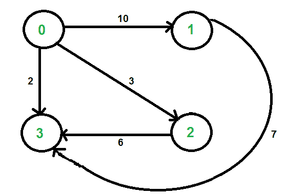

# 使用 STL 进行竞争性编程的图形实现| 设置 2（加权图）

> 原文： [https://www.geeksforgeeks.org/graph-implementation-using-stl-for-competitive-programming-set-2-weighted-graph/](https://www.geeksforgeeks.org/graph-implementation-using-stl-for-competitive-programming-set-2-weighted-graph/)

在[集合 1](https://www.geeksforgeeks.org/graph-representation-using-stl-for-competitive-programming-set-1-dfs-of-unweighted-and-undirected/) 中，讨论了非加权图。 在这篇文章中，讨论了使用 STL 的加权图表示。 该实现用于加权图的邻接表表示。



我们使用两个 STL 容器来表示图：

*   [vector：](http://quiz.geeksforgeeks.org/vector-sequence-containers-the-c-standard-template-library-stl-set-1/)一个序列容器。 在这里，我们使用它来存储所有顶点的邻接列表。 我们使用顶点数作为该向量的索引。

*   [对：](http://quiz.geeksforgeeks.org/pair-simple-containers-the-c-standard-template-library-stl/)一个简单的容器，用于存储元素对。 在这里，我们使用它来存储相邻的顶点数量和连接到相邻边的权重。

这个想法是使用一对向量的向量。 下面的代码实现相同。

```

// C++ program to represent undirected and weighted graph 
// using STL. The program basically prints adjacency list 
// representation of graph 
#include <bits/stdc++.h> 
using namespace std; 

// To add an edge 
void addEdge(vector <pair<int, int> > adj[], int u, 
                                     int v, int wt) 
{ 
    adj[u].push_back(make_pair(v, wt)); 
    adj[v].push_back(make_pair(u, wt)); 
} 

// Print adjacency list representaion ot graph 
void printGraph(vector<pair<int,int> > adj[], int V) 
{ 
    int v, w; 
    for (int u = 0; u < V; u++) 
    { 
        cout << "Node " << u << " makes an edge with \n"; 
        for (auto it = adj[u].begin(); it!=adj[u].end(); it++) 
        { 
            v = it->first; 
            w = it->second; 
            cout << "\tNode " << v << " with edge weight ="
                 << w << "\n"; 
        } 
        cout << "\n"; 
    } 
} 

// Driver code 
int main() 
{ 
    int V = 5; 
    vector<pair<int, int> > adj[V]; 
    addEdge(adj, 0, 1, 10); 
    addEdge(adj, 0, 4, 20); 
    addEdge(adj, 1, 2, 30); 
    addEdge(adj, 1, 3, 40); 
    addEdge(adj, 1, 4, 50); 
    addEdge(adj, 2, 3, 60); 
    addEdge(adj, 3, 4, 70); 
    printGraph(adj, V); 
    return 0; 
} 

```

输出：

```
Node 0 makes an edge with 
    Node 1 with edge weight =10
    Node 4 with edge weight =20

Node 1 makes an edge with 
    Node 0 with edge weight =10
    Node 2 with edge weight =30
    Node 3 with edge weight =40
    Node 4 with edge weight =50

Node 2 makes an edge with 
    Node 1 with edge weight =30
    Node 3 with edge weight =60

Node 3 makes an edge with 
    Node 1 with edge weight =40
    Node 2 with edge weight =60
    Node 4 with edge weight =70

Node 4 makes an edge with 
    Node 0 with edge weight =20
    Node 1 with edge weight =50
    Node 3 with edge weight =70

```

本文由 [**Sahil Chhabra(akku)**](https://practice.geeksforgeeks.org/user-profile.php?user=sahil_coder) 贡献。 如果您喜欢 GeeksforGeeks 并希望做出贡献，则还可以使用 [tribution.geeksforgeeks.org](http://www.contribute.geeksforgeeks.org) 撰写文章，或将您的文章邮寄至 tribution@geeksforgeeks.org。 查看您的文章出现在 GeeksforGeeks 主页上，并帮助其他 Geeks。

如果发现任何不正确的地方，或者想分享有关上述主题的更多信息，请写评论。

