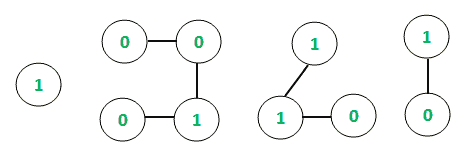

# 二进制值图

中的十六进制等效项

> 原文： [https://www.geeksforgeeks.org/hexadecimal-equivalents-in-binary-valued-graph/](https://www.geeksforgeeks.org/hexadecimal-equivalents-in-binary-valued-graph/)

给定具有`V`顶点和`E`边的二进制值[无向图](https://www.geeksforgeeks.org/graph-data-structure-and-algorithms/)，任务是找到所有连接组件的**十六进制等效项** 图的 可以将二进制值图视为仅将二进制数**（0 或 1）**作为顶点值。

**示例**：

> **输入**：E = 4，V = 7
> 
> 
> 
> **输出**：
> 链= 0 1 十六进制当量= 1
> 链= 0 0 0 十六进制当量= 0
> 链= 1 1 十六进制当量= 3
> **说明**：
> 在第一个连接的组件的情况下，二进制链为[0，1]
> 因此，二进制字符串=“ 01”且二进制数= 01
> 因此，十六进制等效项= 1
> 
> **输入**：E = 6，V = 10
> 
> 
> 
> **输出**：
> 链= 1 十六进制当量= 1
> 链= 0 0 1 0 十六进制当量= 2
> 链= 1 1 0 十六进制当量= 6
> 链= 1 0 十六进制当量= 2

**方法**：的想法是使用[深度优先搜索遍历](https://www.geeksforgeeks.org/depth-first-search-or-dfs-for-a-graph/)来跟踪无向图中的已连接组件，如本文的[中所述。 对于每个连接的组件，将显示二进制字符串，并根据该](https://www.geeksforgeeks.org/connected-components-in-an-undirected-graph/)[这篇](https://www.geeksforgeeks.org/convert-binary-number-hexadecimal-number/)文章中的说明从二进制值计算等效的十六进制值并进行打印。

下面是上述方法的实现：

## C ++

```

// C++ implementation to find 
// hexadecimal equivalents of 
// all connected components 
#include <bits/stdc++.h>
using namespace std;

// Function to traverse the undirected 
// graph using the Depth first traversal
void depthFirst(int v,
                vector<int> graph[],
                vector<bool>& visited,
                vector<int>& storeChain)
{
    // Marking the visited
    // vertex as true
    visited[v] = true;

    // Store the connected chain
    storeChain.push_back(v);

    for (auto i : graph[v]) {
        if (visited[i] == false) {

            // Recursive call to
            // the DFS algorithm
            depthFirst(i, graph,
                       visited,
                       storeChain);
        }
    }
}

// Function to create map between binary
// number and its equivalent hexadecimal
void createMap(unordered_map<string,
                             char>* um)
{

    (*um)["0000"] = '0';
    (*um)["0001"] = '1';
    (*um)["0010"] = '2';
    (*um)["0011"] = '3';
    (*um)["0100"] = '4';
    (*um)["0101"] = '5';
    (*um)["0110"] = '6';
    (*um)["0111"] = '7';
    (*um)["1000"] = '8';
    (*um)["1001"] = '9';
    (*um)["1010"] = 'A';
    (*um)["1011"] = 'B';
    (*um)["1100"] = 'C';
    (*um)["1101"] = 'D';
    (*um)["1110"] = 'E';
    (*um)["1111"] = 'F';
}

// Function to return hexadecimal
// equivalent of each connected
// component
string hexaDecimal(string bin)
{
    int l = bin.size();
    int t = bin.find_first_of('.');

    // Length of string before '.'
    int len_left = t != -1 ? t : l;

    // Add min 0's in the beginning
    // to make left substring length
    // divisible by 4
    for (int i = 1;
         i <= (4 - len_left % 4) % 4;
         i++)

        bin = '0' + bin;

    // If decimal point exists
    if (t != -1) {

        // Length of string after '.'
        int len_right = l - len_left - 1;

        // Add min 0's in the end to
        // make right substring length
        // divisible by 4
        for (int i = 1;
             i <= (4 - len_right % 4) % 4;
             i++)

            bin = bin + '0';
    }

    // Create map between binary
    // and its equivalent hex code
    unordered_map<string,
                  char>
        bin_hex_map;
    createMap(&bin_hex_map);

    int i = 0;
    string hex = "";

    while (1) {

        // Extract from left,
        // substring of size 4 and add
        // its hex code
        hex += bin_hex_map[bin.substr(i, 4)];
        i += 4;

        if (i == bin.size())
            break;

        // If '.' is encountered add it
        // to result
        if (bin.at(i) == '.') {

            hex += '.';
            i++;
        }
    }

    // Required hexadecimal number
    return hex;
}

// Function to find the hexadecimal
// equivalents of all connected
// components
void hexValue(
    vector<int> graph[],
    int vertices,
    vector<int> values)
{

    // Initializing boolean array
    // to mark visited vertices
    vector<bool> visited(10001,
                         false);

    // Following loop invokes
    // DFS algorithm
    for (int i = 1; i <= vertices;
         i++) {

        if (visited[i] == false) {

            // Variable to hold
            // temporary length
            int sizeChain;

            // Container to store
            // each chain
            vector<int> storeChain;

            // DFS algorithm
            depthFirst(i, graph,
                       visited,
                       storeChain);

            // Variable to hold each
            // chain size
            sizeChain = storeChain.size();

            // Container to store
            // values of vertices of
            // individual chains
            int chainValues[sizeChain + 1];

            // Storing the values of
            // each chain
            for (int i = 0;
                 i < sizeChain; i++) {

                int temp = values[storeChain[i] - 1];
                chainValues[i] = temp;
            }

            // Printing binary chain
            cout << "Chain = ";

            for (int i = 0;
                 i < sizeChain; i++) {

                cout << chainValues[i]
                     << " ";
            }
            cout << "\t";

            // Converting the array
            // with vertex
            // values to a binary string
            // using string stream
            stringstream ss;
            ss << chainValues[0];
            string s = ss.str();

            for (int i = 1;
                 i < sizeChain; i++) {

                stringstream ss1;
                ss1 << chainValues[i];
                string s1 = ss1.str();
                s.append(s1);
            }

            // Printing the hexadecimal
            // values
            cout << "Hexadecimal "
                 << "equivalent = ";
            cout << hexaDecimal(s)
                 << endl;
        }
    }
}

// Driver Program
int main()
{
    // Initializing graph in the
    // form of adjacency list
    vector<int> graph[1001];

    // Defining the number of
    // edges and vertices
    int E, V;
    E = 4;
    V = 7;

    // Assigning the values
    // for each vertex of the
    // undirected graph
    vector<int> values;
    values.push_back(0);
    values.push_back(1);
    values.push_back(1);
    values.push_back(1);
    values.push_back(0);
    values.push_back(1);
    values.push_back(1);

    // Constructing the
    // undirected graph
    graph[1].push_back(2);
    graph[2].push_back(1);
    graph[3].push_back(4);
    graph[4].push_back(3);
    graph[4].push_back(5);
    graph[5].push_back(4);
    graph[6].push_back(5);
    graph[5].push_back(6);
    graph[6].push_back(7);
    graph[7].push_back(6);

    hexValue(graph, V, values);
    return 0;
}

```

## 爪哇

```

// Java implementation to find  
// hexadecimal equivalents of  
// all connected components  
import java.io.*;
import java.util.*;

class GFG{

// Function to traverse the undirected
// graph using the Depth first traversal
static void depthFirst(int v,
                       List<List<Integer>> graph,
                       boolean[] visited,
                       List<Integer> storeChain)
{

    // Marking the visited
    // vertex as true
    visited[v] = true;

    // Store the connected chain
    storeChain.add(v);

    for(int i : graph.get(v))
    {
        if (visited[i] == false)
        {

            // Recursive call to
            // the DFS algorithm
            depthFirst(i, graph, visited, 
                       storeChain);
        }
    }
}

// Function to create map between binary
// number and its equivalent hexadecimal
static void createMap(Map<String, Character> um)
{
    um.put("0000", '0');
    um.put("0001", '1');
    um.put("0010", '2');
    um.put("0011", '3');
    um.put("0100", '4');
    um.put("0101", '5');
    um.put("0110", '6');
    um.put("0111", '7');
    um.put("1000", '8');
    um.put("1001", '9');
    um.put("1010", 'A');
    um.put("1011", 'B');
    um.put("1100", 'C');
    um.put("1101", 'D');
    um.put("1110", 'E');
    um.put("1111", 'F');
}

// Function to return hexadecimal
// equivalent of each connected
// component
static String hexaDecimal(String bin)
{
    int l = bin.length();
    int t = bin.indexOf('.');

    // Length of string before '.'
    int len_left = t != -1 ? t : l;

    // Add min 0's in the beginning to make
    // left substring length divisible by 4
    for(int i = 1; 
            i <= (4 - len_left % 4) % 4; 
            i++)
        bin = '0' + bin;

    // If decimal point exists
    if (t != -1) 
    {

        // Length of string after '.'
        int len_right = l - len_left - 1;

        // Add min 0's in the end to make right
        // substring length divisible by 4
        for(int i = 1; 
                i <= (4 - len_right % 4) % 4;
                i++)
            bin = bin + '0';
    }

    // Create map between binary and its
    // equivalent hex code
    Map<String, 
        Character> bin_hex_map = new HashMap<String,
                                             Character>();
    createMap(bin_hex_map);

    int i = 0;
    String hex = "";

    while (true)
    {

        // One by one extract from left, substring
        // of size 4 and add its hex code
        hex += bin_hex_map.get(bin.substring(i, i + 4));
        i += 4;

        if (i == bin.length())
            break;

        // If '.' is encountered add it
        // to result
        if (bin.charAt(i) == '.') 
        {
            hex += '.';
            i++;
        }
    }

    // Required hexadecimal number
    return hex;
}

// Function to find the hexadecimal
// equivalents of all connected
// components
static void hexValue(List<List<Integer>> graph,
                     int vertices, 
                     List<Integer> values)
{

    // Initializing boolean array
    // to mark visited vertices
    boolean[] visited = new boolean[1001];

    // Following loop invokes DFS algorithm
    for(int i = 1; i <= vertices; i++) 
    {
        if (visited[i] == false) 
        {

            // Variable to hold
            // temporary length
            int sizeChain;

            // Container to store each chain
            List<Integer> storeChain = new ArrayList<Integer>();

            // DFS algorithm
            depthFirst(i, graph, visited, storeChain);

            // Variable to hold each chain size
            sizeChain = storeChain.size();

            // Container to store values
            // of vertices of individual chains
            int[] chainValues = new int[sizeChain + 1];

            // Storing the values of each chain
            for(int j = 0; j < sizeChain; j++) 
            {
                int temp = values.get(
                    storeChain.get(j) - 1);
                chainValues[j] = temp;
            }

            // Printing binary chain
            System.out.print("Chain = ");

            for(int j = 0; j < sizeChain; j++) 
            {
                System.out.print(chainValues[j] + " ");
            }
            System.out.println();
            System.out.print("\t");

            // Converting the array with 
            // vertex values to a binary 
            // string
            String s = "";

            for(int j = 0; j < sizeChain; j++) 
            {
                String s1 = String.valueOf(
                    chainValues[j]);
                s += s1;
            }

            // Printing the hexadecimal
            // values
            System.out.println("Hexadecimal " +
                               "equivalent = " +
                               hexaDecimal(s));
        }
    }
}

// Driver code
public static void main(String[] args)
{

    // Initializing graph in the
    // form of adjacency list
    @SuppressWarnings("unchecked")
    List<List<Integer>> graph = new ArrayList();

    for(int i = 0; i < 1001; i++)
        graph.add(new ArrayList<Integer>());

    // Defining the number
    // of edges and vertices
    int E = 4, V = 7;

    // Assigning the values for each
    // vertex of the undirected graph
    List<Integer> values = new ArrayList<Integer>();
    values.add(0);
    values.add(1);
    values.add(1);
    values.add(1);
    values.add(0);
    values.add(1);
    values.add(1);

    // Constructing the undirected graph
    graph.get(1).add(2);
    graph.get(2).add(1);
    graph.get(3).add(4);
    graph.get(4).add(3);
    graph.get(4).add(5);
    graph.get(5).add(4);
    graph.get(6).add(5);
    graph.get(5).add(6);
    graph.get(6).add(7);
    graph.get(7).add(6);

    hexValue(graph, V, values);
}
}

// This code is contributed by jithin

```

**Output:** 

```
Chain = 0 1
     Hexadecimal equivalent = 1
Chain = 1 1 0 1 1
     Hexadecimal equivalent = 1B

```

***时间复杂度**：O（V <sup>2</sup> ）*
*DFS 算法要求 O（V + E）复杂度，其中 V，E 为 无向图的顶点和边缘。 此外，在每次迭代时都需要获得十六进制等效值，这需要额外的 O（V）复杂度才能进行计算。 因此，整体复杂度为 **O（V <sup>2</sup> ）**。*

[](https://practice.geeksforgeeks.org/courses/competitive-programming-live?utm_source=geeksforgeeks&utm_medium=article&utm_campaign=gfg_article_cp)

* * *

* * *

如果您喜欢 GeeksforGeeks 并希望做出贡献，则还可以使用 [tribution.geeksforgeeks.org](https://contribute.geeksforgeeks.org/) 撰写文章，或将您的文章邮寄至 tribution@geeksforgeeks.org。 查看您的文章出现在 GeeksforGeeks 主页上，并帮助其他 Geeks。

如果您发现任何不正确的地方，请单击下面的“改进文章”按钮，以改进本文。