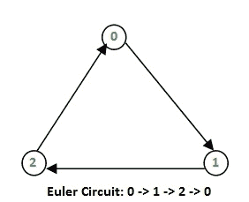
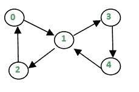
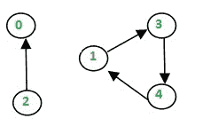
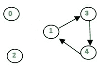

# Hierholzer 的有向图算法

> 原文： [https://www.geeksforgeeks.org/hierholzers-algorithm-directed-graph/](https://www.geeksforgeeks.org/hierholzers-algorithm-directed-graph/)

给定有向欧拉图，打印[欧拉电路](https://www.geeksforgeeks.org/eulerian-path-and-circuit/)。 欧拉电路是遍历图的每个边缘的路径，并且该路径在起始顶点处终止。

**示例**：

```
Input : Adjacency list for the below graph

Output : 0 -> 1 -> 2 -> 0 

Input : Adjacency list for the below graph

Output : 0 -> 6 -> 4 -> 5 -> 0 -> 1 
         -> 2 -> 3 -> 4 -> 2 -> 0 
Explanation:
In both the cases, we can trace the Euler circuit 
by following the edges as indicated in the output.

```

我们已经讨论了[问题，找出给定图是否为欧拉](https://www.geeksforgeeks.org/eulerian-path-and-circuit/)。 在这篇文章中，讨论了打印欧拉路径或电路的算法。 使用 [Fleury 算法](https://www.geeksforgeeks.org/fleurys-algorithm-for-printing-eulerian-path/)可以解决相同的问题，但是其复杂度为 O（E * E）。 使用 Heirholzer 的算法，我们可以找到以 O（E）表示的电路/路径，即线性时间。

下面是算法：ref（ [wiki](https://en.wikipedia.org/wiki/Eulerian_path#Hierholzer.27s_algorithm) ）。 请记住，如果满足以下条件，则有向图具有欧拉循环（1）具有非零度的所有顶点都属于单个强连通分量。 （2）每个顶点的度数和度数相同。 该算法假定给定图具有欧拉回路。

*   选择任何起始顶点 v，并跟随该顶点的边缘轨迹直至返回 v。不可能停留在 v 以外的任何顶点上，因为当轨迹进入另一个顶点时，每个顶点的入度和出度必须相同 顶点 w 必须有一个未使用的边，留下 w。
    以这种方式形成的游览是封闭的游览，但可能无法覆盖初始图形的所有顶点和边缘。
*   只要存在一个顶点 u，该顶点属于当前巡回路线，但具有相邻边而不是巡回路线的一部分，则从 u 开始另一条轨迹，跟随未使用的边直到返回 u，然后将以此方式形成的巡回路线加入到 以前的游览。

因此，我们的想法是继续跟踪未使用的边缘并移除它们，直到被卡住为止。 一旦卡住，我们便回溯到当前路径中具有未使用边的最近顶点，然后重复该过程，直到使用完所有边为止。 我们可以使用另一个容器来维护最终路径。

让我们举个例子：

```
Let the initial directed graph be as below


Let's start our path from 0.
Thus, curr_path = {0} and circuit = {}
Now let's use the edge 0->1 

Now, curr_path = {0,1} and circuit = {}
similarly we reach up to 2 and then to 0 again as

Now, curr_path = {0,1,2} and circuit = {}
Then we go to 0, now since 0 haven't got any unused
edge we put 0 in circuit and back track till we find
an edge

We then have curr_path = {0,1,2} and circuit = {0}
Similarly, when we backtrack to 2, we don't find any 
unused edge. Hence put 2 in the circuit and backtrack 
again.

curr_path = {0,1} and circuit = {0,2}

After reaching 1 we go to through unused edge 1->3 and 
then 3->4, 4->1 until all edges have been traversed.

The contents of the two containers look as:
curr_path = {0,1,3,4,1} and circuit = {0,2} 

now as all edges have been used, the curr_path is 
popped one by one into the circuit.
Finally, we've circuit = {0,2,1,4,3,1,0}

We print the circuit in reverse to obtain the path followed.
i.e., 0->1->3->4->1->1->2->0

```

下面是上述方法的实现：

## C++

```cpp

// A C++ program to print Eulerian circuit in given 
// directed graph using Hierholzer algorithm 
#include <bits/stdc++.h> 
using namespace std; 

void printCircuit(vector< vector<int> > adj) 
{ 
    // adj represents the adjacency list of 
    // the directed graph 
    // edge_count represents the number of edges 
    // emerging from a vertex 
    unordered_map<int,int> edge_count; 

    for (int i=0; i<adj.size(); i++) 
    { 
        //find the count of edges to keep track 
        //of unused edges 
        edge_count[i] = adj[i].size(); 
    } 

    if (!adj.size()) 
        return; //empty graph 

    // Maintain a stack to keep vertices 
    stack<int> curr_path; 

    // vector to store final circuit 
    vector<int> circuit; 

    // start from any vertex 
    curr_path.push(0); 
    int curr_v = 0; // Current vertex 

    while (!curr_path.empty()) 
    { 
        // If there's remaining edge 
        if (edge_count[curr_v]) 
        { 
            // Push the vertex 
            curr_path.push(curr_v); 

            // Find the next vertex using an edge 
            int next_v = adj[curr_v].back(); 

            // and remove that edge 
            edge_count[curr_v]--; 
            adj[curr_v].pop_back(); 

            // Move to next vertex 
            curr_v = next_v; 
        } 

        // back-track to find remaining circuit 
        else
        { 
            circuit.push_back(curr_v); 

            // Back-tracking 
            curr_v = curr_path.top(); 
            curr_path.pop(); 
        } 
    } 

    // we've got the circuit, now print it in reverse 
    for (int i=circuit.size()-1; i>=0; i--) 
    { 
        cout << circuit[i]; 
        if (i) 
           cout<<" -> "; 
    } 
} 

// Driver program to check the above function 
int main() 
{ 
    vector< vector<int> > adj1, adj2; 

    // Input Graph 1 
    adj1.resize(3); 

    // Build the edges 
    adj1[0].push_back(1); 
    adj1[1].push_back(2); 
    adj1[2].push_back(0); 
    printCircuit(adj1); 
    cout << endl; 

    // Input Graph 2 
    adj2.resize(7); 
    adj2[0].push_back(1); 
    adj2[0].push_back(6); 
    adj2[1].push_back(2); 
    adj2[2].push_back(0); 
    adj2[2].push_back(3); 
    adj2[3].push_back(4); 
    adj2[4].push_back(2); 
    adj2[4].push_back(5); 
    adj2[5].push_back(0); 
    adj2[6].push_back(4); 
    printCircuit(adj2); 

    return 0; 
} 

```