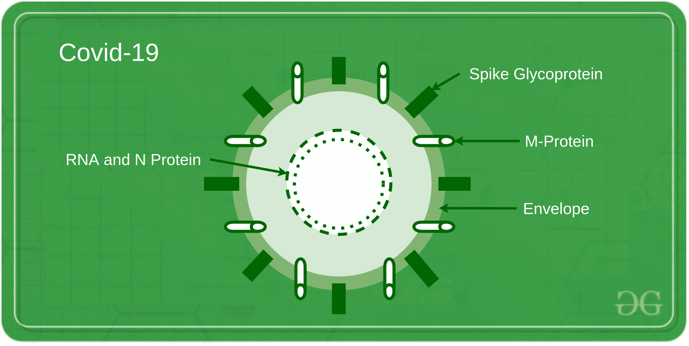
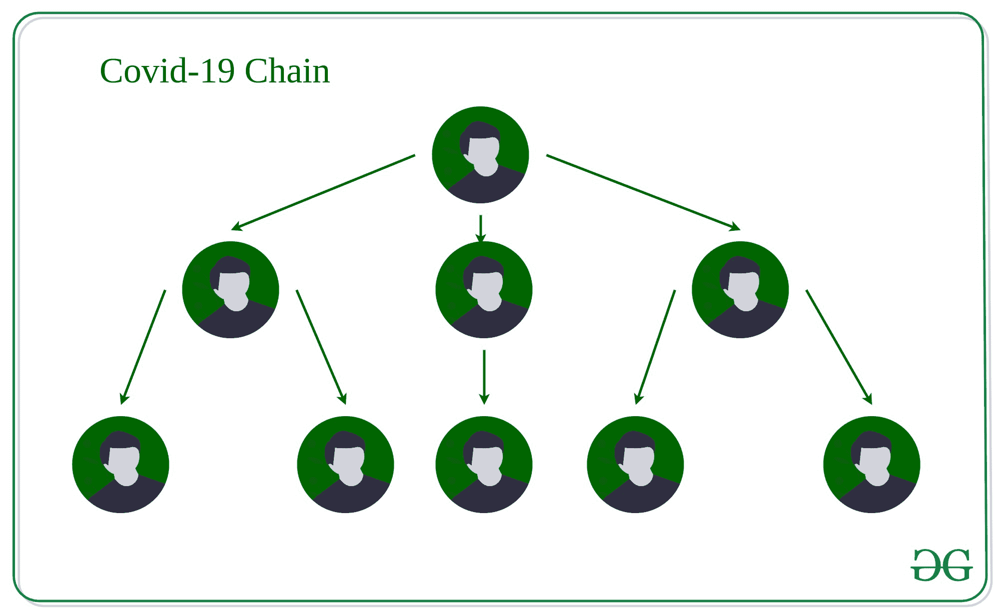
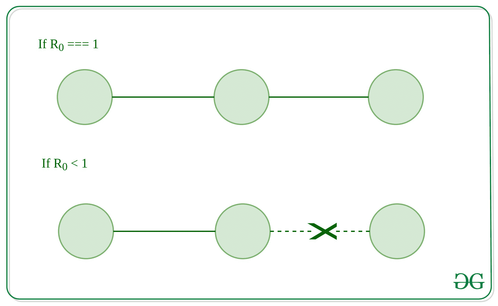

# 冠状病毒爆发如何结束？ 使用数据结构进行可视化

> 原文：[https://www.geeksforgeeks.org/how-coronavirus-outbreak-can-end-visualize-using-data-structures/](https://www.geeksforgeeks.org/how-coronavirus-outbreak-can-end-visualize-using-data-structures/)

每个计算机科学的初学者都曾经想过为什么我们要在图中找到[最短路径，或者](https://www.geeksforgeeks.org/shortest-path-unweighted-graph/)[树](https://www.geeksforgeeks.org/binary-tree-data-structure/)的用途是什么，我们是否要使用圆环链接来玩 [josephus 圆 列表](https://www.geeksforgeeks.org/josephus-circle-using-circular-linked-list/)？

因此，本文参考 [COVID-19](https://www.who.int/health-topics/coronavirus#tab=tab_1) 来讨论[数据结构和算法](https://www.geeksforgeeks.org/data-structures/)在现实世界中的重要性。

目前被称为 COVID-19 的冠状病毒急性呼吸道疾病暴发已导致重大流行病。 冠状病毒成为主要问题的主要原因是因为它的传播可以用树来建模。

据估计，在世界采取封锁措施之前，每个感染者正在感染另外 2-4 个人。 该数字称为 R0，是一种数学符号，表示传染病的传染性。 例如，如果某疾病的 R0 为 15，则患有该疾病的人会将其传播给其他 15 个人。

取决于疾病的 R0 值，存在三种传播或减少疾病的可能性：

*   如果 R0 小于 1，则每个现有感染导致少于一个新感染。 在这种情况下，疾病最终将消亡。

*   如果 R0 等于 1，则每个现有感染都会导致一个新感染。 该疾病将继续存活并稳定下来，但不会爆发。

*   如果 R0 大于 1，则每个现有感染都会导致一个以上新感染。 该疾病将被传播，并可能爆发或流行。

重要的是，疾病的 R0 值仅在人群中的每个人都完全易患该疾病时才适用，例如在 COVID-19 的情况下，没有人接种过疫苗，以前和以前没有人患过该疾病 没有办法控制疾病的传播。

在我们的模型中，R0 是树中每个节点具有的平均子级数。 这意味着-我们树中的每个节点（平均）有两个到四个孩子。

如果您对树木进行了任何深度的研究，您都会知道它会变得非常大，非常快。

全世界卫生组织的早期目标是将 R0 降低到一个（或更少）。 如果`R0 = 1`，则树中的每个叶节点现在都成为链表的头。 每个人都以相同的方式感染另一个人，即一个（单个）链接的列表引用了该列表中的下一个节点。

如果`R0 < 1`，则在某个时候，一个人将不会再感染另一个人，并且（该叶子的）感染线被破坏了。 我们可以通过使节点指向空引用来在代码中进行建模，这意味着它是链表中的最终节点。

解决冠状病毒情况的一种方法是更改​​病毒的行为，以便可以通过（最终是有限的）链表而不是树来对它进行建模。 [树](https://www.geeksforgeeks.org/binary-tree-data-structure/)，[图](https://www.geeksforgeeks.org/graph-data-structure-and-algorithms/) & [链表](https://www.geeksforgeeks.org/data-structures/linked-list/)不仅用于 [**FAANG**](https://www.geeksforgeeks.org/tips-to-get-your-resume-shortlisted-for-top-tech-companies/) 采访中， 在建模和解决实际现象中非常有用。

因此，请保持安全并留在内部，以打破日冕病毒的连锁。

* * *

* * *

如果您喜欢 GeeksforGeeks 并希望做出贡献，则还可以使用 [tribution.geeksforgeeks.org](https://contribute.geeksforgeeks.org/) 撰写文章，或将您的文章邮寄至 tribution@geeksforgeeks.org。 查看您的文章出现在 GeeksforGeeks 主页上，并帮助其他 Geeks。

如果您发现任何不正确的地方，请单击下面的“改进文章”按钮，以改进本文。