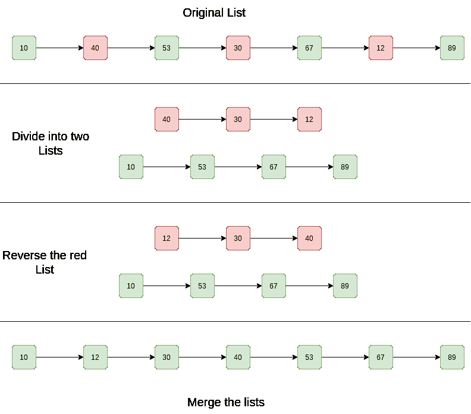

# 对链接列表进行排序，该列表按升序和降序交替排序？

> 原文：[https://www.geeksforgeeks.org/how-to-sort-a-linked-list-that-is-sorted-alternating-ascending-and-descending-orders/](https://www.geeksforgeeks.org/how-to-sort-a-linked-list-that-is-sorted-alternating-ascending-and-descending-orders/)

给定一个链表。 链接列表按升序和降序排列。 有效地对列表进行排序。

**示例**：

```
Input List: 10 -> 40 -> 53 -> 30 -> 67 -> 12 -> 89 -> NULL
Output List: 10 -> 12 -> 30 -> 43 -> 53 -> 67 -> 89 -> NULL

Input List: 1 -> 4 -> 3 -> 2 -> 5 -> NULL
Output List: 1 -> 2 -> 3 -> 4 -> 5 -> NULL

```

<u>**简单解决方案**</u>

**方法**：基本思想是对链接列表应用合并排序。

**本文讨论了该实现**：[合并链表](https://www.geeksforgeeks.org/merge-sort-for-linked-list/)的排序。

**复杂度分析**：

*   **时间复杂度**：链表的合并种类花费 O（n log n）时间。 在合并排序树中，高度为 log n。 对每个级别进行排序将花费`O(n)`时间。 因此，时间复杂度为 O（n log n）。

*   **辅助空间**：O（n log n），在合并排序树中，高度为 log n。 存储每个级别将占用`O(n)`空间。 因此，空间复杂度为 O（n log n）。

<u>**有效解决方案**</u>

**方法**：

1.  分开两个列表。

2.  以降序逆转

3.  合并两个列表。

**图表**：



以下是上述算法的实现。

## C++

```cpp

// C++ program to sort a linked 
// list that is alternatively 
// sorted in increasing and decreasing order 
#include <bits/stdc++.h> 
using namespace std; 

// Linked list node 
struct Node { 
    int data; 
    struct Node* next; 
}; 

Node* mergelist(Node* head1, Node* head2); 
void splitList(Node* head, Node** Ahead, Node** Dhead); 
void reverselist(Node*& head); 

// This is the main function that sorts the 
// linked list 
void sort(Node** head) 
{ 
    // Split the list into lists 
    Node *Ahead, *Dhead; 
    splitList(*head, &Ahead, &Dhead); 

    // Reverse the descending linked list 
    reverselist(Dhead); 

    // Merge the two linked lists 
    *head = mergelist(Ahead, Dhead); 
} 

// A utility function to create a new node 
Node* newNode(int key) 
{ 
    Node* temp = new Node; 
    temp->data = key; 
    temp->next = NULL; 
    return temp; 
} 

// A utility function to reverse a linked list 
void reverselist(Node*& head) 
{ 
    Node *prev = NULL, *curr = head, *next; 
    while (curr) { 
        next = curr->next; 
        curr->next = prev; 
        prev = curr; 
        curr = next; 
    } 
    head = prev; 
} 

// A utility function to print a linked list 
void printlist(Node* head) 
{ 
    while (head != NULL) { 
        cout << head->data << " "; 
        head = head->next; 
    } 
    cout << endl; 
} 

// A utility function to merge two sorted linked lists 
Node* mergelist(Node* head1, Node* head2) 
{ 
    // Base cases 
    if (!head1) 
        return head2; 
    if (!head2) 
        return head1; 

    Node* temp = NULL; 
    if (head1->data < head2->data) { 
        temp = head1; 
        head1->next = mergelist(head1->next, head2); 
    } 
    else { 
        temp = head2; 
        head2->next = mergelist(head1, head2->next); 
    } 
    return temp; 
} 

// This function alternatively splits 
// a linked list with head as head into two: 
// For example, 10->20->30->15->40->7 \ 
// is splitted into 10->30->40 
// and 20->15->7 
// "Ahead" is reference to head of ascending linked list 
// "Dhead" is reference to head of descending linked list 
void splitList(Node* head, Node** Ahead, Node** Dhead) 
{ 
    // Create two dummy nodes to initialize 
    // heads of two linked list 
    *Ahead = newNode(0); 
    *Dhead = newNode(0); 

    Node* ascn = *Ahead; 
    Node* dscn = *Dhead; 
    Node* curr = head; 

    // Link alternate nodes 
    while (curr) { 
        // Link alternate nodes of ascending linked list 
        ascn->next = curr; 
        ascn = ascn->next; 
        curr = curr->next; 

        // Link alternate nodes of descending linked list 
        if (curr) { 
            dscn->next = curr; 
            dscn = dscn->next; 
            curr = curr->next; 
        } 
    } 

    ascn->next = NULL; 
    dscn->next = NULL; 
    *Ahead = (*Ahead)->next; 
    *Dhead = (*Dhead)->next; 
} 

// Driver program to test above function 
int main() 
{ 
    Node* head = newNode(10); 
    head->next = newNode(40); 
    head->next->next = newNode(53); 
    head->next->next->next = newNode(30); 
    head->next->next->next->next = newNode(67); 
    head->next->next->next->next->next = newNode(12); 
    head->next->next->next->next->next->next = newNode(89); 

    cout << "Given Linked List is " << endl; 
    printlist(head); 

    sort(&head); 

    cout << "Sorted Linked List is " << endl; 
    printlist(head); 

    return 0; 
}

```

## Java

```java

// Java program to sort a 
// linked list that is alternatively 
// sorted in increasing and decreasing order 
class LinkedList { 
    Node head; // head of list 

    /* Linked list Node*/
    class Node { 
        int data; 
        Node next; 
        Node(int d) 
        { 
            data = d; 
            next = null; 
        } 
    } 

    Node newNode(int key) 
    { 
        return new Node(key); 
    } 

    /* This is the main function that sorts 
       the linked list.*/
    void sort() 
    { 
        /* Create 2 dummy nodes and initialise as 
           heads of linked lists */
        Node Ahead = new Node(0), Dhead = new Node(0); 

        // Split the list into lists 
        splitList(Ahead, Dhead); 

        Ahead = Ahead.next; 
        Dhead = Dhead.next; 

        // reverse the descending list 
        Dhead = reverseList(Dhead); 

        // merge the 2 linked lists 
        head = mergeList(Ahead, Dhead); 
    } 

    /* Function to reverse the linked list */
    Node reverseList(Node Dhead) 
    { 
        Node current = Dhead; 
        Node prev = null; 
        Node next; 
        while (current != null) { 
            next = current.next; 
            current.next = prev; 
            prev = current; 
            current = next; 
        } 
        Dhead = prev; 
        return Dhead; 
    } 

    /* Function to print linked list */
    void printList() 
    { 
        Node temp = head; 
        while (temp != null) { 
            System.out.print(temp.data + " "); 
            temp = temp.next; 
        } 
        System.out.println(); 
    } 

    // A utility function to merge 
    // two sorted linked lists 
    Node mergeList(Node head1, Node head2) 
    { 
        // Base cases 
        if (head1 == null) 
            return head2; 
        if (head2 == null) 
            return head1; 

        Node temp = null; 
        if (head1.data < head2.data) { 
            temp = head1; 
            head1.next = mergeList(head1.next, head2); 
        } 
        else { 
            temp = head2; 
            head2.next = mergeList(head1, head2.next); 
        } 
        return temp; 
    } 

    // This function alternatively splits 
    // a linked list with head as head into two: 
    // For example, 10->20->30->15->40->7 is 
    // splitted into 10->30->40 
    // and 20->15->7 
    // "Ahead" is reference to head of ascending linked list 
    // "Dhead" is reference to head of descending linked list 
    void splitList(Node Ahead, Node Dhead) 
    { 
        Node ascn = Ahead; 
        Node dscn = Dhead; 
        Node curr = head; 

        // Link alternate nodes 

        while (curr != null) { 
            // Link alternate nodes in ascending order 
            ascn.next = curr; 
            ascn = ascn.next; 
            curr = curr.next; 

            if (curr != null) { 
                dscn.next = curr; 
                dscn = dscn.next; 
                curr = curr.next; 
            } 
        } 

        ascn.next = null; 
        dscn.next = null; 
    } 

    /* Driver program to test above functions */
    public static void main(String args[]) 
    { 
        LinkedList llist = new LinkedList(); 
        llist.head = llist.newNode(10); 
        llist.head.next = llist.newNode(40); 
        llist.head.next.next = llist.newNode(53); 
        llist.head.next.next.next = llist.newNode(30); 
        llist.head.next.next.next.next = llist.newNode(67); 
        llist.head.next.next.next.next.next = llist.newNode(12); 
        llist.head.next.next.next.next.next.next = llist.newNode(89); 

        System.out.println("Given linked list"); 
        llist.printList(); 

        llist.sort(); 

        System.out.println("Sorted linked list"); 
        llist.printList(); 
    } 

} /* This code is contributed by Rajat Mishra */

```

## Python

```py

# Python program to sort a linked list that is alternatively  
# sorted in increasing and decreasing order 
class LinkedList(object): 
    def __init__(self): 
        self.head = None

    # Linked list Node 
    class Node(object): 
        def __init__(self, d): 
            self.data = d 
            self.next = None

    def newNode(self, key): 
        return self.Node(key) 

    # This is the main function that sorts 
    # the linked list. 
    def sort(self): 
        # Create 2 dummy nodes and initialise as 
        # heads of linked lists 
        Ahead = self.Node(0) 
        Dhead = self.Node(0) 
        # Split the list into lists 
        self.splitList(Ahead, Dhead) 
        Ahead = Ahead.next
        Dhead = Dhead.next
        # reverse the descending list 
        Dhead = self.reverseList(Dhead) 
        # merge the 2 linked lists 
        self.head = self.mergeList(Ahead, Dhead) 

    # Function to reverse the linked list 
    def reverseList(self, Dhead): 
        current = Dhead 
        prev = None
        while current != None: 
            self._next = current.next
            current.next = prev 
            prev = current 
            current = self._next 
        Dhead = prev 
        return Dhead 

    # Function to print linked list 
    def printList(self): 
        temp = self.head 
        while temp != None: 
            print temp.data, 
            temp = temp.next
        print '' 

    # A utility function to merge two sorted linked lists 
    def mergeList(self, head1, head2): 
        # Base cases 
        if head1 == None: 
            return head2 
        if head2 == None: 
            return head1 
        temp = None
        if head1.data < head2.data: 
            temp = head1 
            head1.next = self.mergeList(head1.next, head2) 
        else: 
            temp = head2 
            head2.next = self.mergeList(head1, head2.next) 
        return temp 

    # This function alternatively splits a linked list with head 
    # as head into two: 
    # For example, 10->20->30->15->40->7 is splitted into 10->30->40 
    # and 20->15->7 
    # "Ahead" is reference to head of ascending linked list 
    # "Dhead" is reference to head of descending linked list 
    def splitList(self, Ahead, Dhead): 
        ascn = Ahead 
        dscn = Dhead 
        curr = self.head 
        # Link alternate nodes 
        while curr != None: 
            # Link alternate nodes in ascending order 
            ascn.next = curr 
            ascn = ascn.next
            curr = curr.next
            if curr != None: 
                dscn.next = curr 
                dscn = dscn.next
                curr = curr.next
        ascn.next = None
        dscn.next = None

# Driver program 
llist = LinkedList() 
llist.head = llist.newNode(10) 
llist.head.next = llist.newNode(40) 
llist.head.next.next = llist.newNode(53) 
llist.head.next.next.next = llist.newNode(30) 
llist.head.next.next.next.next = llist.newNode(67) 
llist.head.next.next.next.next.next = llist.newNode(12) 
llist.head.next.next.next.next.next.next = llist.newNode(89) 

print 'Given linked list'
llist.printList() 

llist.sort() 

print 'Sorted linked list'
llist.printList() 

# This code is contributed by BHAVYA JAIN 

```

## C#

```cs

// C# program to sort a linked list that is alternatively 
// sorted in increasing and decreasing order 
using System; 
class LinkedList { 
    Node head; // head of list 

    /* Linked list Node*/
    public class Node { 
        public int data; 
        public Node next; 
        public Node(int d) 
        { 
            data = d; 
            next = null; 
        } 
    } 

    Node newNode(int key) 
    { 
        return new Node(key); 
    } 

    /* This is the main function that sorts  
    the linked list.*/
    void sort() 
    { 
        /* Create 2 dummy nodes and initialise as  
        heads of linked lists */
        Node Ahead = new Node(0), Dhead = new Node(0); 

        // Split the list into lists 
        splitList(Ahead, Dhead); 

        Ahead = Ahead.next; 
        Dhead = Dhead.next; 

        // reverse the descending list 
        Dhead = reverseList(Dhead); 

        // merge the 2 linked lists 
        head = mergeList(Ahead, Dhead); 
    } 

    /* Function to reverse the linked list */
    Node reverseList(Node Dhead) 
    { 
        Node current = Dhead; 
        Node prev = null; 
        Node next; 
        while (current != null) { 
            next = current.next; 
            current.next = prev; 
            prev = current; 
            current = next; 
        } 
        Dhead = prev; 
        return Dhead; 
    } 

    /* Function to print linked list */
    void printList() 
    { 
        Node temp = head; 
        while (temp != null) { 
            Console.Write(temp.data + " "); 
            temp = temp.next; 
        } 
        Console.WriteLine(); 
    } 

    // A utility function to merge two sorted linked lists 
    Node mergeList(Node head1, Node head2) 
    { 
        // Base cases 
        if (head1 == null) 
            return head2; 
        if (head2 == null) 
            return head1; 

        Node temp = null; 
        if (head1.data < head2.data) { 
            temp = head1; 
            head1.next = mergeList(head1.next, head2); 
        } 
        else { 
            temp = head2; 
            head2.next = mergeList(head1, head2.next); 
        } 
        return temp; 
    } 

    // This function alternatively splits a linked list with head 
    // as head into two: 
    // For example, 10->20->30->15->40->7 is splitted into 10->30->40 
    // and 20->15->7 
    // "Ahead" is reference to head of ascending linked list 
    // "Dhead" is reference to head of descending linked list 
    void splitList(Node Ahead, Node Dhead) 
    { 
        Node ascn = Ahead; 
        Node dscn = Dhead; 
        Node curr = head; 

        // Link alternate nodes 

        while (curr != null) { 
            // Link alternate nodes in ascending order 
            ascn.next = curr; 
            ascn = ascn.next; 
            curr = curr.next; 

            if (curr != null) { 
                dscn.next = curr; 
                dscn = dscn.next; 
                curr = curr.next; 
            } 
        } 

        ascn.next = null; 
        dscn.next = null; 
    } 

    /* Driver code */
    public static void Main(String[] args) 
    { 
        LinkedList llist = new LinkedList(); 
        llist.head = llist.newNode(10); 
        llist.head.next = llist.newNode(40); 
        llist.head.next.next = llist.newNode(53); 
        llist.head.next.next.next = llist.newNode(30); 
        llist.head.next.next.next.next = llist.newNode(67); 
        llist.head.next.next.next.next.next = llist.newNode(12); 
        llist.head.next.next.next.next.next.next = llist.newNode(89); 

        Console.WriteLine("Given linked list"); 
        llist.printList(); 

        llist.sort(); 

        Console.WriteLine("Sorted linked list"); 
        llist.printList(); 
    } 
} 

/* This code is contributed by Arnab Kundu */

```

**Output:**

```
Given Linked List is
10 40 53 30 67 12 89
Sorted Linked List is
10 12 30 40 53 67 89
```

**复杂度分析**：

*   **时间复杂度**：`O(n)`。

    需要一次遍历以分隔列表并将其反转。 排序列表的合并需要`O(n)`时间。

*   **辅助空间**：`O(1)`。

    不需要多余的空间。

感谢 Gaurav Ahirwar 提出了这种方法。

如果发现任何不正确的地方，或者您想分享有关上述主题的更多信息，请发表评论

