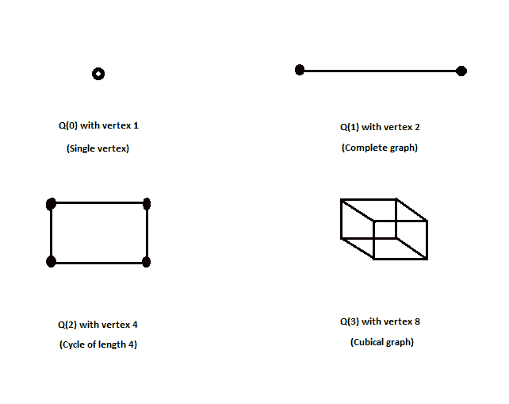

# 超立方体图

> 原文： [https://www.geeksforgeeks.org/hypercube-graph/](https://www.geeksforgeeks.org/hypercube-graph/)

给出的输入是图 n 的顺序（连接到节点的最大边数），您必须在 n 阶的 Hypercube 图中找到顶点数。
 **示例**：

```
Input : n = 3
Output : 8

Input : n = 2
Output : 4

```

在超立方体图 Q（n）中，n 表示图的程度。 超立方体图表示可以连接到图以使其成为 n 度图的最大边数，每个顶点具有相同的度 n，在该表示中，仅添加了固定数目的边和顶点，如下图所示 ：



所有超立方体图都是哈密顿量，阶次为**的超立方体图具有（2 ^ n）个顶点**，对于输入 n 作为图的阶次，我们必须找到 2 的幂。

## C++

```cpp

// C++ program to find vertices in a hypercube  
// graph of order n 
#include <iostream> 
using namespace std; 

// function to find power of 2 
int power(int n) 
{ 
    if (n == 1) 
        return 2; 
    return 2 * power(n - 1); 
} 

// driver program 
int main() 
{ 
    // n is the order of the graph 
    int n = 4; 
    cout << power(n); 
    return 0; 
} 

```

## Java

```java

// Java program to find vertices in  
// a hypercube graph of order n  
class GfG 
{ 

    // Function to find power of 2  
    static int power(int n)  
    {  
        if (n == 1)  
            return 2;  
        return 2 * power(n - 1);  
    }  

    // Driver program  
    public static void main(String []args) 
    { 

        // n is the order of the graph  
        int n = 4; 
        System.out.println(power(n)); 
    } 
} 

// This code is contributed by Rituraj Jain 

```

## Python

```py

# Python3 program to find vertices in a hypercube  
#  graph of order n 

# function to find power of 2 
def power(n): 
    if n==1: 
        return 2
    return 2*power(n-1) 

# Dricer code 
n =4
print(power(n)) 

# This code is contributed by Shrikant13 

```

## C#

```cs

// C# program to find vertices in  
// a hypercube graph of order n  
using System; 

class GfG 
{ 

    // Function to find power of 2  
    static int power(int n)  
    {  
        if (n == 1)  
            return 2;  
        return 2 * power(n - 1);  
    }  

    // Driver code  
    public static void Main() 
    { 

        // n is the order of the graph  
        int n = 4; 
        Console.WriteLine(power(n)); 
    } 
} 

// This code is contributed by Mukul Singh 

```

## 的 PHP

```

<?php 
// PHP program to find vertices in  
// a hypercube graph of order n  
{ 

    // Function to find power of 2  
    function power($n)  
    {  
        if ($n == 1)  
            return 2;  
        return 2 * power($n - 1);  
    }  

    // Driver Code 
    { 

        // n is the order of the graph  
        $n = 4; 
        echo(power($n)); 
    } 
} 

// This code is contributed by Code_Mech 
?> 

```

**Output:**

```
16

```


* * *

* * *

如果您喜欢 GeeksforGeeks 并希望做出贡献，则还可以使用 [tribution.geeksforgeeks.org](https://contribute.geeksforgeeks.org/) 撰写文章，或将您的文章邮寄至 tribution@geeksforgeeks.org。 查看您的文章出现在 GeeksforGeeks 主页上，并帮助其他 Geeks。

如果您发现任何不正确的地方，请单击下面的“改进文章”按钮，以改进本文。