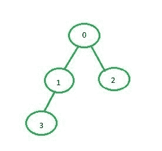

# 使用邻接矩阵

实现 BFS

> 原文： [https://www.geeksforgeeks.org/implementation-of-bfs-using-adjacency-matrix/](https://www.geeksforgeeks.org/implementation-of-bfs-using-adjacency-matrix/)

在的[文章中讨论了广度优先搜索（BFS），该文章使用邻接表进行图形表示。 在本文中，邻接矩阵将用于表示图。](https://www.geeksforgeeks.org/breadth-first-search-or-bfs-for-a-graph/)

**邻接矩阵表示**：在图的邻接矩阵表示中，大小为 n * n（其中 n 是顶点数量）的矩阵 **mat [] []** 将表示图的边。 **mat [i] [j] = 1** 表示在`i`和`j`的顶点之间有一条边，而 **mat [i] [j] = 0** 表示在顶点`i`和`j`之间没有边。


以下是上图所示图形的邻接矩阵表示：

```
  0 1 2 3
0 0 1 1 0 
1 1 0 0 1 
2 1 0 0 0 
3 0 1 0 0 

```

**示例**：

```
Input: source = 0

Output: 0 1 2 3

Input: source = 1

Output:1 0 2 3 4

```

**方法**：

*   创建一个大小为 n * n 的矩阵，其中每个元素均为 0，表示图中没有边。
*   现在，对于 i 和 j 顶点之间图的每个边，设置 mat [i] [j] = 1。
*   创建并填充邻接矩阵后，请按照此帖子的[中所述，找到图的 BFS 遍历。](https://www.geeksforgeeks.org/breadth-first-search-or-bfs-for-a-graph/)

下面是上述方法的实现：

## C++

```cpp

// C++ implementation of the approach 
#include <bits/stdc++.h> 
using namespace std; 

class Graph { 

    // Number of vertex 
    int v; 

    // Number of edges 
    int e; 

    // Adjacency matrix 
    int** adj; 

public: 
    // To create the initial adjacency matrix 
    Graph(int v, int e); 

    // Function to insert a new edge 
    void addEdge(int start, int e); 

    // Function to display the BFS traversal 
    void BFS(int start); 
}; 

// Function to fill the empty adjacency matrix 
Graph::Graph(int v, int e) 
{ 
    this->v = v; 
    this->e = e; 
    adj = new int*[v]; 
    for (int row = 0; row < v; row++) { 
        adj[row] = new int[v]; 
        for (int column = 0; column < v; column++) { 
            adj[row][column] = 0; 
        } 
    } 
} 

// Function to add an edge to the graph 
void Graph::addEdge(int start, int e) 
{ 

    // Considering a bidirectional edge 
    adj[start][e] = 1; 
    adj[e][start] = 1; 
} 

// Function to perform BFS on the graph 
void Graph::BFS(int start) 
{ 
    // Visited vector to so that 
    // a vertex is not visited more than once 
    // Initializing the vector to false as no 
    // vertex is visited at the beginning 
    vector<bool> visited(v, false); 
    vector<int> q; 
    q.push_back(start); 

    // Set source as visited 
    visited[start] = true; 

    int vis; 
    while (!q.empty()) { 
        vis = q[0]; 

        // Print the current node 
        cout << vis << " "; 
        q.erase(q.begin()); 

        // For every adjacent vertex to the current vertex 
        for (int i = 0; i < v; i++) { 
            if (adj[vis][i] == 1 && (!visited[i])) { 

                // Push the adjacent node to the queue 
                q.push_back(i); 

                // Set 
                visited[i] = true; 
            } 
        } 
    } 
} 

// Driver code 
int main() 
{ 
    int v = 5, e = 4; 

    // Create the graph 
    Graph G(v, e); 
    G.addEdge(0, 1); 
    G.addEdge(0, 2); 
    G.addEdge(1, 3); 

    G.BFS(0); 
} 

```