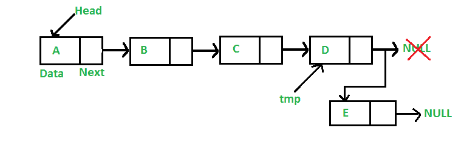
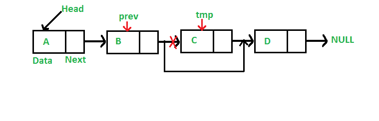

# 使用类

> 原文：[https://www.geeksforgeeks.org/implementing-a-linked-list-in-java-using-class/](https://www.geeksforgeeks.org/implementing-a-linked-list-in-java-using-class/)

在 Java 中实现链表

**先决条件**：[链表数据结构](https://www.geeksforgeeks.org/data-structures/linked-list/)

像数组一样，链表是线性数据结构。 与数组不同，链表元素不存储在连续位置，而是使用指针链接元素，如下所示。


在 Java 中，LinkedList 可以表示为一个类，而 Node 可以表示为单独的类。 LinkedList 类包含 Node 类类型的引用。

```

class LinkedList { 
    Node head; // head of list 

    /* Linked list Node*/
    class Node { 
        int data; 
        Node next; 

        // Constructor to create a new node 
        // Next is by default initialized 
        // as null 
        Node(int d) { data = d; } 
    } 
}

```

### 创建和插入

在本文中，插入列表是在最后完成的，即在给定链表的最后一个节点之后添加新节点。 例如，如果给定的链表为 5-> 10-> 15-> 20-> 25，并且要插入 30，则链表将变为 5-> 10-> 15-> 20-> 25-> 30 。

由于链表通常由其头指针表示，因此需要遍历列表直到最后一个节点，然后将最后一个节点的下一个更改为新节点。



```

import java.io.*; 

// Java program to implement 
// a Singly Linked List 
public class LinkedList { 

    Node head; // head of list 

    // Linked list Node. 
    // This inner class is made static 
    // so that main() can access it 
    static class Node { 

        int data; 
        Node next; 

        // Constructor 
        Node(int d) 
        { 
            data = d; 
            next = null; 
        } 
    } 

    // Method to insert a new node 
    public static LinkedList insert(LinkedList list, int data) 
    { 
        // Create a new node with given data 
        Node new_node = new Node(data); 
        new_node.next = null; 

        // If the Linked List is empty, 
        // then make the new node as head 
        if (list.head == null) { 
            list.head = new_node; 
        } 
        else { 
            // Else traverse till the last node 
            // and insert the new_node there 
            Node last = list.head; 
            while (last.next != null) { 
                last = last.next; 
            } 

            // Insert the new_node at last node 
            last.next = new_node; 
        } 

        // Return the list by head 
        return list; 
    } 

    // Method to print the LinkedList. 
    public static void printList(LinkedList list) 
    { 
        Node currNode = list.head; 

        System.out.print("LinkedList: "); 

        // Traverse through the LinkedList 
        while (currNode != null) { 
            // Print the data at current node 
            System.out.print(currNode.data + " "); 

            // Go to next node 
            currNode = currNode.next; 
        } 
    } 

    // Driver code 
    public static void main(String[] args) 
    { 
        /* Start with the empty list. */
        LinkedList list = new LinkedList(); 

        // 
        // ******INSERTION****** 
        // 

        // Insert the values 
        list = insert(list, 1); 
        list = insert(list, 2); 
        list = insert(list, 3); 
        list = insert(list, 4); 
        list = insert(list, 5); 
        list = insert(list, 6); 
        list = insert(list, 7); 
        list = insert(list, 8); 

        // Print the LinkedList 
        printList(list); 
    } 
} 

```

**Output:**

```
LinkedList: 1 2 3 4 5 6 7 8

```

### 遍历

对于遍历，下面是一个通用函数 printList（），它通过将列表从头节点遍历到最后一个来打印任何给定的列表。

```

import java.io.*; 

// Java program to implement 
// a Singly Linked List 
public class LinkedList { 

    Node head; // head of list 

    // Linked list Node. 
    // This inner class is made static 
    // so that main() can access it 
    static class Node { 

        int data; 
        Node next; 

        // Constructor 
        Node(int d) 
        { 
            data = d; 
            next = null; 
        } 
    } 

    // Method to insert a new node 
    public static LinkedList insert(LinkedList list, int data) 
    { 
        // Create a new node with given data 
        Node new_node = new Node(data); 
        new_node.next = null; 

        // If the Linked List is empty, 
        // then make the new node as head 
        if (list.head == null) { 
            list.head = new_node; 
        } 
        else { 
            // Else traverse till the last node 
            // and insert the new_node there 
            Node last = list.head; 
            while (last.next != null) { 
                last = last.next; 
            } 

            // Insert the new_node at last node 
            last.next = new_node; 
        } 

        // Return the list by head 
        return list; 
    } 

    // Method to print the LinkedList. 
    public static void printList(LinkedList list) 
    { 
        Node currNode = list.head; 

        System.out.print("LinkedList: "); 

        // Traverse through the LinkedList 
        while (currNode != null) { 
            // Print the data at current node 
            System.out.print(currNode.data + " "); 

            // Go to next node 
            currNode = currNode.next; 
        } 
    } 

    // **************MAIN METHOD************** 

    // method to create a Singly linked list with n nodes 
    public static void main(String[] args) 
    { 
        /* Start with the empty list. */
        LinkedList list = new LinkedList(); 

        // 
        // ******INSERTION****** 
        // 

        // Insert the values 
        list = insert(list, 1); 
        list = insert(list, 2); 
        list = insert(list, 3); 
        list = insert(list, 4); 
        list = insert(list, 5); 
        list = insert(list, 6); 
        list = insert(list, 7); 
        list = insert(list, 8); 

        // Print the LinkedList 
        printList(list); 
    } 
} 

```

**Output:**

```
LinkedList: 1 2 3 4 5 6 7 8

```

### 按 KEY 删除

删除过程可以理解如下：

**要做的事情**：

*给定一个“键”，删除此键在链表*中的首次出现。

**方法**：

要从链表中删除节点，请执行以下步骤。

1.  在列表中搜索该键的首次出现

2.  现在，三个条件中的任何一个都可以存在：

    *   **情况 1：在**头找到钥匙

        1.  在这种情况下，将节点的头更改为当前头的下一个节点。

        2.  释放已替换头节点的内存。

    *   **情况 2：除了头**之外，该键位于中间或最后一个位置

        1.  在这种情况下，查找要删除的节点的上一个节点。

        2.  将上一个节点的下一个更改为当前节点的下一个节点。

        3.  释放替换节点的内存。

    *   **情况 3：在列表**中找不到密钥

        1.  在这种情况下，无需执行任何操作。



```

import java.io.*; 

// Java program to implement 
// a Singly Linked List 
public class LinkedList { 

    Node head; // head of list 

    // Linked list Node. 
    // This inner class is made static 
    // so that main() can access it 
    static class Node { 

        int data; 
        Node next; 

        // Constructor 
        Node(int d) 
        { 
            data = d; 
            next = null; 
        } 
    } 

    // Method to insert a new node 
    public static LinkedList insert(LinkedList list, int data) 
    { 
        // Create a new node with given data 
        Node new_node = new Node(data); 
        new_node.next = null; 

        // If the Linked List is empty, 
        // then make the new node as head 
        if (list.head == null) { 
            list.head = new_node; 
        } 
        else { 
            // Else traverse till the last node 
            // and insert the new_node there 
            Node last = list.head; 
            while (last.next != null) { 
                last = last.next; 
            } 

            // Insert the new_node at last node 
            last.next = new_node; 
        } 

        // Return the list by head 
        return list; 
    } 

    // Method to print the LinkedList. 
    public static void printList(LinkedList list) 
    { 
        Node currNode = list.head; 

        System.out.print("LinkedList: "); 

        // Traverse through the LinkedList 
        while (currNode != null) { 
            // Print the data at current node 
            System.out.print(currNode.data + " "); 

            // Go to next node 
            currNode = currNode.next; 
        } 

        System.out.println(); 
    } 

    // **************DELETION BY KEY************** 

    // Method to delete a node in the LinkedList by KEY 
    public static LinkedList deleteByKey(LinkedList list, int key) 
    { 
        // Store head node 
        Node currNode = list.head, prev = null; 

        // 
        // CASE 1: 
        // If head node itself holds the key to be deleted 

        if (currNode != null && currNode.data == key) { 
            list.head = currNode.next; // Changed head 

            // Display the message 
            System.out.println(key + " found and deleted"); 

            // Return the updated List 
            return list; 
        } 

        // 
        // CASE 2: 
        // If the key is somewhere other than at head 
        // 

        // Search for the key to be deleted, 
        // keep track of the previous node 
        // as it is needed to change currNode.next 
        while (currNode != null && currNode.data != key) { 
            // If currNode does not hold key 
            // continue to next node 
            prev = currNode; 
            currNode = currNode.next; 
        } 

        // If the key was present, it should be at currNode 
        // Therefore the currNode shall not be null 
        if (currNode != null) { 
            // Since the key is at currNode 
            // Unlink currNode from linked list 
            prev.next = currNode.next; 

            // Display the message 
            System.out.println(key + " found and deleted"); 
        } 

        // 
        // CASE 3: The key is not present 
        // 

        // If key was not present in linked list 
        // currNode should be null 
        if (currNode == null) { 
            // Display the message 
            System.out.println(key + " not found"); 
        } 

        // return the List 
        return list; 
    } 

    // **************MAIN METHOD************** 

    // method to create a Singly linked list with n nodes 
    public static void main(String[] args) 
    { 
        /* Start with the empty list. */
        LinkedList list = new LinkedList(); 

        // 
        // ******INSERTION****** 
        // 

        // Insert the values 
        list = insert(list, 1); 
        list = insert(list, 2); 
        list = insert(list, 3); 
        list = insert(list, 4); 
        list = insert(list, 5); 
        list = insert(list, 6); 
        list = insert(list, 7); 
        list = insert(list, 8); 

        // Print the LinkedList 
        printList(list); 

        // 
        // ******DELETION BY KEY****** 
        // 

        // Delete node with value 1 
        // In this case the key is ***at head*** 
        deleteByKey(list, 1); 

        // Print the LinkedList 
        printList(list); 

        // Delete node with value 4 
        // In this case the key is present ***in the middle*** 
        deleteByKey(list, 4); 

        // Print the LinkedList 
        printList(list); 

        // Delete node with value 10 
        // In this case the key is ***not present*** 
        deleteByKey(list, 10); 

        // Print the LinkedList 
        printList(list); 
    } 
} 

```

**Output:**

```
LinkedList: 1 2 3 4 5 6 7 8 
1 found and deleted
LinkedList: 2 3 4 5 6 7 8 
4 found and deleted
LinkedList: 2 3 5 6 7 8 
10 not found
LinkedList: 2 3 5 6 7 8

```

### 删除位置

此删除过程可以理解为：

**要做的事情**：

*给定**'位置'**，从链表*中删除该位置的节点。

**如何执行**：

步骤如下：

1.  通过计算节点索引遍历列表

2.  对于每个索引，将索引与位置匹配

3.  现在，三个条件中的任何一个都可以存在：

    *   **情况 1：位置为 0，即要删除磁头**

        1.  在这种情况下，将节点的头更改为当前头的下一个节点。

        2.  释放已替换头节点的内存。

    *   **情况 2：位置大于 0 但小于列表的大小，即居中或最后，但**头除外

        1.  在这种情况下，查找要删除的节点的上一个节点。

        2.  将上一个节点的下一个更改为当前节点的下一个节点。

        3.  释放替换节点的内存。

    *   **情况 3：位置大于列表的大小，即列表中找不到位置**

        1.  在这种情况下，无需执行任何操作。


```

import java.io.*; 

// Java program to implement 
// a Singly Linked List 
public class LinkedList { 

    Node head; // head of list 

    // Linked list Node. 
    // This inner class is made static 
    // so that main() can access it 
    static class Node { 

        int data; 
        Node next; 

        // Constructor 
        Node(int d) 
        { 
            data = d; 
            next = null; 
        } 
    } 

    // Method to insert a new node 
    public static LinkedList insert(LinkedList list, int data) 
    { 
        // Create a new node with given data 
        Node new_node = new Node(data); 
        new_node.next = null; 

        // If the Linked List is empty, 
        // then make the new node as head 
        if (list.head == null) { 
            list.head = new_node; 
        } 
        else { 
            // Else traverse till the last node 
            // and insert the new_node there 
            Node last = list.head; 
            while (last.next != null) { 
                last = last.next; 
            } 

            // Insert the new_node at last node 
            last.next = new_node; 
        } 

        // Return the list by head 
        return list; 
    } 

    // Method to print the LinkedList. 
    public static void printList(LinkedList list) 
    { 
        Node currNode = list.head; 

        System.out.print("LinkedList: "); 

        // Traverse through the LinkedList 
        while (currNode != null) { 
            // Print the data at current node 
            System.out.print(currNode.data + " "); 

            // Go to next node 
            currNode = currNode.next; 
        } 

        System.out.println(); 
    } 

    // Method to delete a node in the LinkedList by POSITION 
    public static LinkedList deleteAtPosition(LinkedList list, int index) 
    { 
        // Store head node 
        Node currNode = list.head, prev = null; 

        // 
        // CASE 1: 
        // If index is 0, then head node itself is to be deleted 

        if (index == 0 && currNode != null) { 
            list.head = currNode.next; // Changed head 

            // Display the message 
            System.out.println(index + " position element deleted"); 

            // Return the updated List 
            return list; 
        } 

        // 
        // CASE 2: 
        // If the index is greater than 0 but less than the size of LinkedList 
        // 
        // The counter 
        int counter = 0; 

        // Count for the index to be deleted, 
        // keep track of the previous node 
        // as it is needed to change currNode.next 
        while (currNode != null) { 

            if (counter == index) { 
                // Since the currNode is the required position 
                // Unlink currNode from linked list 
                prev.next = currNode.next; 

                // Display the message 
                System.out.println(index + " position element deleted"); 
                break; 
            } 
            else { 
                // If current position is not the index 
                // continue to next node 
                prev = currNode; 
                currNode = currNode.next; 
                counter++; 
            } 
        } 

        // If the position element was found, it should be at currNode 
        // Therefore the currNode shall not be null 
        // 
        // CASE 3: The index is greater than the size of the LinkedList 
        // 
        // In this case, the currNode should be null 
        if (currNode == null) { 
            // Display the message 
            System.out.println(index + " position element not found"); 
        } 

        // return the List 
        return list; 
    } 

    // **************MAIN METHOD************** 

    // method to create a Singly linked list with n nodes 
    public static void main(String[] args) 
    { 
        /* Start with the empty list. */
        LinkedList list = new LinkedList(); 

        // 
        // ******INSERTION****** 
        // 

        // Insert the values 
        list = insert(list, 1); 
        list = insert(list, 2); 
        list = insert(list, 3); 
        list = insert(list, 4); 
        list = insert(list, 5); 
        list = insert(list, 6); 
        list = insert(list, 7); 
        list = insert(list, 8); 

        // Print the LinkedList 
        printList(list); 

        // 
        // ******DELETION AT POSITION****** 
        // 

        // Delete node at position 0 
        // In this case the key is ***at head*** 
        deleteAtPosition(list, 0); 

        // Print the LinkedList 
        printList(list); 

        // Delete node at position 2 
        // In this case the key is present ***in the middle*** 
        deleteAtPosition(list, 2); 

        // Print the LinkedList 
        printList(list); 

        // Delete node at position 10 
        // In this case the key is ***not present*** 
        deleteAtPosition(list, 10); 

        // Print the LinkedList 
        printList(list); 
    } 
} 

```

**Output:**

```
LinkedList: 1 2 3 4 5 6 7 8 
0 position element deleted
LinkedList: 2 3 4 5 6 7 8 
2 position element deleted
LinkedList: 2 3 5 6 7 8 
10 position element not found
LinkedList: 2 3 5 6 7 8

```

### 所有运作

下面是将每个操作一起应用的完整程序：

```

import java.io.*; 

// Java program to implement 
// a Singly Linked List 
public class LinkedList { 

    Node head; // head of list 

    // Linked list Node. 
    // This inner class is made static 
    // so that main() can access it 
    static class Node { 

        int data; 
        Node next; 

        // Constructor 
        Node(int d) 
        { 
            data = d; 
            next = null; 
        } 
    } 

    // **************INSERTION************** 

    // Method to insert a new node 
    public static LinkedList insert(LinkedList list, int data) 
    { 
        // Create a new node with given data 
        Node new_node = new Node(data); 
        new_node.next = null; 

        // If the Linked List is empty, 
        // then make the new node as head 
        if (list.head == null) { 
            list.head = new_node; 
        } 
        else { 
            // Else traverse till the last node 
            // and insert the new_node there 
            Node last = list.head; 
            while (last.next != null) { 
                last = last.next; 
            } 

            // Insert the new_node at last node 
            last.next = new_node; 
        } 

        // Return the list by head 
        return list; 
    } 

    // **************TRAVERSAL************** 

    // Method to print the LinkedList. 
    public static void printList(LinkedList list) 
    { 
        Node currNode = list.head; 

        System.out.print("\nLinkedList: "); 

        // Traverse through the LinkedList 
        while (currNode != null) { 
            // Print the data at current node 
            System.out.print(currNode.data + " "); 

            // Go to next node 
            currNode = currNode.next; 
        } 
        System.out.println("\n"); 
    } 

    // **************DELETION BY KEY************** 

    // Method to delete a node in the LinkedList by KEY 
    public static LinkedList deleteByKey(LinkedList list, int key) 
    { 
        // Store head node 
        Node currNode = list.head, prev = null; 

        // 
        // CASE 1: 
        // If head node itself holds the key to be deleted 

        if (currNode != null && currNode.data == key) { 
            list.head = currNode.next; // Changed head 

            // Display the message 
            System.out.println(key + " found and deleted"); 

            // Return the updated List 
            return list; 
        } 

        // 
        // CASE 2: 
        // If the key is somewhere other than at head 
        // 

        // Search for the key to be deleted, 
        // keep track of the previous node 
        // as it is needed to change currNode.next 
        while (currNode != null && currNode.data != key) { 
            // If currNode does not hold key 
            // continue to next node 
            prev = currNode; 
            currNode = currNode.next; 
        } 

        // If the key was present, it should be at currNode 
        // Therefore the currNode shall not be null 
        if (currNode != null) { 
            // Since the key is at currNode 
            // Unlink currNode from linked list 
            prev.next = currNode.next; 

            // Display the message 
            System.out.println(key + " found and deleted"); 
        } 

        // 
        // CASE 3: The key is not present 
        // 

        // If key was not present in linked list 
        // currNode should be null 
        if (currNode == null) { 
            // Display the message 
            System.out.println(key + " not found"); 
        } 

        // return the List 
        return list; 
    } 

    // **************DELETION AT A POSITION************** 

    // Method to delete a node in the LinkedList by POSITION 
    public static LinkedList deleteAtPosition(LinkedList list, int index) 
    { 
        // Store head node 
        Node currNode = list.head, prev = null; 

        // 
        // CASE 1: 
        // If index is 0, then head node itself is to be deleted 

        if (index == 0 && currNode != null) { 
            list.head = currNode.next; // Changed head 

            // Display the message 
            System.out.println(index + " position element deleted"); 

            // Return the updated List 
            return list; 
        } 

        // 
        // CASE 2: 
        // If the index is greater than 0 but less than the size of LinkedList 
        // 
        // The counter 
        int counter = 0; 

        // Count for the index to be deleted, 
        // keep track of the previous node 
        // as it is needed to change currNode.next 
        while (currNode != null) { 

            if (counter == index) { 
                // Since the currNode is the required position 
                // Unlink currNode from linked list 
                prev.next = currNode.next; 

                // Display the message 
                System.out.println(index + " position element deleted"); 
                break; 
            } 
            else { 
                // If current position is not the index 
                // continue to next node 
                prev = currNode; 
                currNode = currNode.next; 
                counter++; 
            } 
        } 

        // If the position element was found, it should be at currNode 
        // Therefore the currNode shall not be null 
        // 
        // CASE 3: The index is greater than the size of the LinkedList 
        // 
        // In this case, the currNode should be null 
        if (currNode == null) { 
            // Display the message 
            System.out.println(index + " position element not found"); 
        } 

        // return the List 
        return list; 
    } 

    // **************MAIN METHOD************** 

    // method to create a Singly linked list with n nodes 
    public static void main(String[] args) 
    { 
        /* Start with the empty list. */
        LinkedList list = new LinkedList(); 

        // 
        // ******INSERTION****** 
        // 

        // Insert the values 
        list = insert(list, 1); 
        list = insert(list, 2); 
        list = insert(list, 3); 
        list = insert(list, 4); 
        list = insert(list, 5); 
        list = insert(list, 6); 
        list = insert(list, 7); 
        list = insert(list, 8); 

        // Print the LinkedList 
        printList(list); 

        // 
        // ******DELETION BY KEY****** 
        // 

        // Delete node with value 1 
        // In this case the key is ***at head*** 
        deleteByKey(list, 1); 

        // Print the LinkedList 
        printList(list); 

        // Delete node with value 4 
        // In this case the key is present ***in the middle*** 
        deleteByKey(list, 4); 

        // Print the LinkedList 
        printList(list); 

        // Delete node with value 10 
        // In this case the key is ***not present*** 
        deleteByKey(list, 10); 

        // Print the LinkedList 
        printList(list); 

        // 
        // ******DELETION AT POSITION****** 
        // 

        // Delete node at position 0 
        // In this case the key is ***at head*** 
        deleteAtPosition(list, 0); 

        // Print the LinkedList 
        printList(list); 

        // Delete node at position 2 
        // In this case the key is present ***in the middle*** 
        deleteAtPosition(list, 2); 

        // Print the LinkedList 
        printList(list); 

        // Delete node at position 10 
        // In this case the key is ***not present*** 
        deleteAtPosition(list, 10); 

        // Print the LinkedList 
        printList(list); 
    } 
} 

```

**Output:**

```
LinkedList: 1 2 3 4 5 6 7 8 

1 found and deleted

LinkedList: 2 3 4 5 6 7 8 

4 found and deleted

LinkedList: 2 3 5 6 7 8 

10 not found

LinkedList: 2 3 5 6 7 8 

0 position element deleted

LinkedList: 3 5 6 7 8 

2 position element deleted

LinkedList: 3 5 7 8 

10 position element not found

LinkedList: 3 5 7 8

```


* * *

* * *

如果您喜欢 GeeksforGeeks 并希望做出贡献，则还可以使用 [tribution.geeksforgeeks.org](https://contribute.geeksforgeeks.org/) 撰写文章，或将您的文章邮寄至 tribution@geeksforgeeks.org。 查看您的文章出现在 GeeksforGeeks 主页上，并帮助其他 Geeks。

如果您发现任何不正确的地方，请单击下面的“改进文章”按钮，以改进本文。