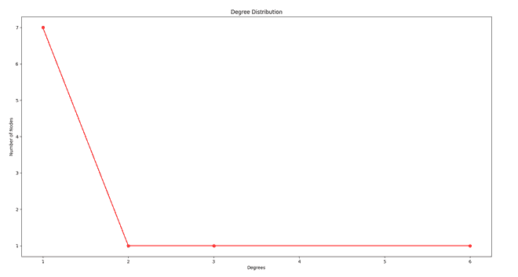

# 使用 Barabasi Albert 模型在 Python 中实现“致富”现象

> 原文： [https://www.geeksforgeeks.org/implementing-rich-getting-richer-phenomenon-using-barabasi-albert-model-in-python/](https://www.geeksforgeeks.org/implementing-rich-getting-richer-phenomenon-using-barabasi-albert-model-in-python/)

**先决条件-** [社交网络简介](https://www.geeksforgeeks.org/introduction-to-social-networks-using-networkx-in-python/)， [Barabasi Albert Graph](https://www.geeksforgeeks.org/barabasi-albert-graph-scale-free-models/)

在社交网络中，有一种现象称为“越来越丰富”，也称为“优先依恋”。 在“优先依恋”中，已经富裕的人变得越来越多，而富有的人得到的却越来越少。 这称为“越​​来越丰富的现象”或“优先依恋”。

例如，假设班上有一些学生，每个学生都是与某些学生的朋友，这被称为学位。 现在，学历高的学生是有钱的，学历低的学生是穷的。 现在假设班上有一个新学生，他/她必须结交 m 个朋友，因此他/她将选择学历更高的学生并与他们成为朋友，从而增加了有钱人的程度。 这称为**越来越丰富**或**优先附件**。

Barabasi Albert 模型是特惠附件的实现。

**逻辑–** 以下是 Barabasi Albert 模型背后的逻辑：

1.  拍摄 n 个 <sub>0</sub> 个节点的随机图，并以每个节点至少具有 1 条链接的条件将它们随机连接。
2.  每次我们添加一个小于或等于 n <sub>0</sub> 链接的新节点 n，它将新节点连接到网络中已有的 n 个节点。
3.  现在，节点连接到特定节点的概率将取决于其程度。 （优先附件）。

**方法–** 以下是实现 Barabasi Albert 模型的步骤：

1.  拍摄一个具有 n 个节点的图。
2.  从用户处获取 m，即要连接到新节点的边数。
3.  取 m0，即节点的初始数量，使 m <= m0。
4.  现在添加 n-m0 个节点。
5.  现在，根据“优先附件”向这些 n-m0 节点添加边。

以下是 Barabasi Albert 模型的实现。

## Python

```py

import networkx as nx 
import random 
import matplotlib.pyplot as plt 

def display(g, i, ne): 
    pos = nx.circular_layout(g) 

    if i == '' and ne == '': 
        new_node = [] 
        rest_nodes = g.nodes() 
        new_edges = [] 
        rest_edges = g.edges() 
    else: 
        new_node = [i] 
        rest_nodes = list(set(g.nodes()) - set(new_node)) 
        new_edges = ne 
        rest_edges = list(set(g.edges()) - set(new_edges) - set([(b, a) for (a, b) in new_edges])) 
    nx.draw_networkx_nodes(g, pos, nodelist=new_node, node_color='g') 
    nx.draw_networkx_nodes(g, pos, nodelist=rest_nodes, node_color='r') 
    nx.draw_networkx_edges(g, pos, edgelist=new_edges, style='dashdot') 
    nx.draw_networkx_edges(g, pos, edgelist=rest_edges,) 
    plt.show() 

def barabasi_add_nodes(g, n, m0): 
    m = m0 - 1

    for i in range(m0 + 1, n + 1): 
        g.add_node(i) 
        degrees = nx.degree(g) 
        node_prob = {} 

        s = 0
        for j in degrees: 
            s += j[1] 
        print(g.nodes()) 

        for each in g.nodes(): 
            node_prob[each] = (float)(degrees[each]) / s 

        node_probabilities_cum = [] 
        prev = 0

        for n, p in node_prob.items(): 
            temp = [n, prev + p] 
            node_probabilities_cum.append(temp) 
            prev += p 

        new_edges = [] 
        num_edges_added = 0
        target_nodes = [] 

        while (num_edges_added < m): 
            prev_cum = 0
            r = random.random() 
            k = 0

            while (not (r > prev_cum and r <= node_probabilities_cum[k][1])): 
                prev_cum = node_probabilities_cum[k][1] 
                k = k + 1
            target_node = node_probabilities_cum[k][0] 

            if target_node in target_nodes: 
                continue

            else: 
                target_nodes.append(target_node) 
            g.add_edge(i, target_node) 
            num_edges_added += 1
            new_edges.append((i, target_node)) 

        print(num_edges_added, ' edges added') 

    display(g, i, new_edges) 
    return g 

def plot_deg_dist(g): 
    all_degrees = [] 

    for i in nx.degree(g): 
        all_degrees.append(i[1]) 
    unique_degrees = list(set(all_degrees)) 
    unique_degrees.sort() 
    count_of_degrees = [] 

    for i in unique_degrees: 
        c = all_degrees.count(i) 
        count_of_degrees.append(c) 

    print(unique_degrees) 
    print(count_of_degrees) 

    plt.plot(unique_degrees, count_of_degrees, 'ro-') 
    plt.xlabel('Degrees') 
    plt.ylabel('Number of Nodes') 
    plt.title('Degree Distribution') 
    plt.show() 

N = 10
m0 = random.randint(2, N / 5) 
g = nx.path_graph(m0) 
display(g, '', '') 

g = barabasi_add_nodes(g, N, m0) 
plot_deg_dist(g)

```

**输出**：

```
Enter the value of n: 10
3
[0, 1, 3]
1  edges added
[0, 1, 3, 4]
1  edges added
[0, 1, 3, 4, 5]
1  edges added
[0, 1, 3, 4, 5, 6]
1  edges added
[0, 1, 3, 4, 5, 6, 7]
1  edges added
[0, 1, 3, 4, 5, 6, 7, 8]
1  edges added
[0, 1, 3, 4, 5, 6, 7, 8, 9]
1  edges added
[0, 1, 3, 4, 5, 6, 7, 8, 9, 10]
1  edges added
[1, 2, 3, 6]
[7, 1, 1, 1]

```


具有 m0 个节点的初始图


添加了新节点的最终节点



分布图

注意怪胎！ 通过 [**Python 编程基础**](https://practice.geeksforgeeks.org/courses/Python-Foundation?utm_source=geeksforgeeks&utm_medium=article&utm_campaign=GFG_Article_Bottom_Python_Foundation) 课程加强基础，并学习基础知识。

首先，您的面试准备将通过 [**Python DS**](https://practice.geeksforgeeks.org/courses/Data-Structures-With-Python?utm_source=geeksforgeeks&utm_medium=article&utm_campaign=GFG_Article_Bottom_Python_DS) 课程来增强您的数据结构概念。

* * *

* * *

如果您喜欢 GeeksforGeeks 并希望做出贡献，则还可以使用 [tribution.geeksforgeeks.org](https://contribute.geeksforgeeks.org/) 撰写文章，或将您的文章邮寄至 tribution@geeksforgeeks.org。 查看您的文章出现在 GeeksforGeeks 主页上，并帮助其他 Geeks。

如果您发现任何不正确的地方，请单击下面的“改进文章”按钮，以改进本文。