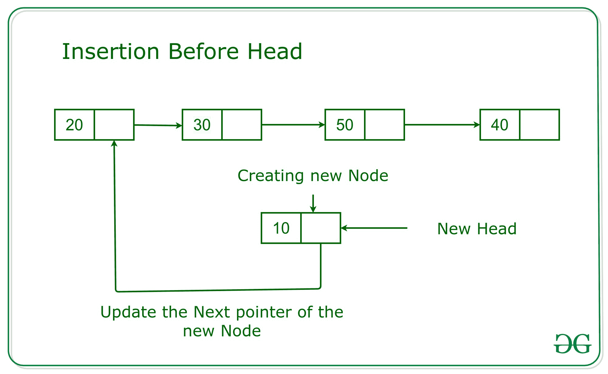
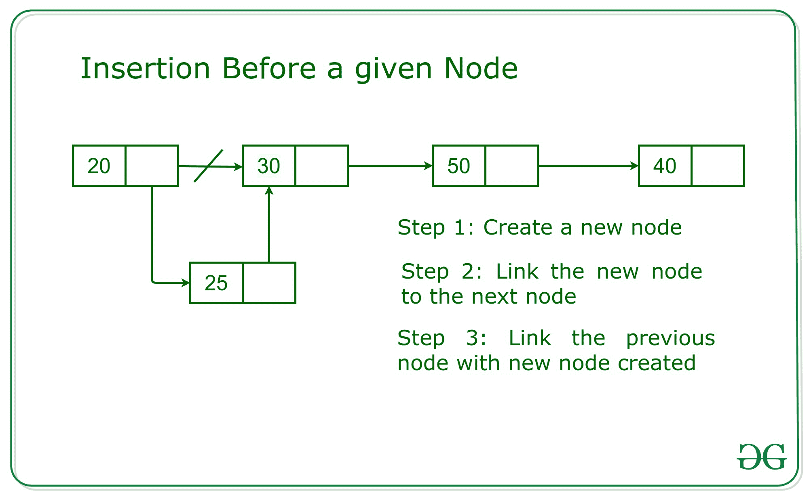

# 在给定节点

> 原文：[https://www.geeksforgeeks.org/insert-a-node-in-linked-list-before-a-given-node/](https://www.geeksforgeeks.org/insert-a-node-in-linked-list-before-a-given-node/)

之前的链表中插入一个节点

给定[链表](https://www.geeksforgeeks.org/data-structures/linked-list/)的节点`N`和值`K`，任务是在链表中给定的节点`N`之前插入值为`K`的节点。

**节点的结构：**

## C++

```cpp

// Structure of Node 
struct Node { 
    int data; 
    Node* next; 

    // Constructor of Node 
    Node(int val, Node* link = 0) 
        : data(val), next(link) 
    { 
    } 
}; 

```

**输出**：

```
5 8 6

```

在给定的问题中，可能有两种情况：

*   给定节点是头节点。

*   给定节点是除头之外的任何有效节点。

### 当给定的节点是头节点时：

这个想法是用给定值 **K** 创建一个新节点。 然后，新节点的下一部分将使用指针头进行更新。 最后，将使用新节点的地址更新头部。 下面是相同的图像：



### 当给定的节点是除头节点之外的任何有效节点：

最简单的方法是[遍历给定的链表](https://www.geeksforgeeks.org/recursive-insertion-and-traversal-linked-list/)，以搜索给定节点的前一个节点。 然后，使用给定值 **K** 创建新节点。现在，使用给定节点的地址更新新节点的下一部分，并使用新节点的地址更新前一个节点的下一部分 。 下面是借助图像说明该方法的示意图：



下面是上述方法的实现：

## C++

```cpp

// C++ prgram for the above approach 
#include <bits/stdc++.h> 
using namespace std; 

struct Node { 
    int data; 
    Node* next; 

    // Constructor of Node 
    Node(int val, Node* link = 0) 
        : data(val), next(link) 
    { 
    } 
}; 

// Create a head node 
Node* head = new Node(5); 

// Function prints the linked list 
// starting from the given node 
void printList(Node* n) 
{ 
    // Till n is not NULL 
    while (n != NULL) { 

        // Print the data 
        cout << n->data << " "; 
        n = n->next; 
    } 
} 

// Function to add a node before the 
// given node other than head node 
Node* addBefore(Node* given_ptr, int val) 
{ 

    // First check if the given pointer 
    // is the address of head 
    if (head == given_ptr) { 

        // Create a new node 
        Node* n = new Node(val); 

        // Point to next to current head 
        n->next = head; 

        // Update the head pointer 
        head = n; 
        return n; 
    } 

    // Otherwise traverse the list to 
    // find previous node of given node 
    else { 

        Node *p, *n = head; 

        // This loop will return p with 
        // previous pointer of given node 
        for (n, p; n != given_ptr; 
             p = n, n = n->next) 
            ; 

        // Create a new node 
        Node* m = new Node(val); 

        // Update the m->next 
        m->next = p->next; 

        // Update previous node's next 
        p->next = m; 

        return m; 
    } 
} 

// Driver Code 
int main() 
{ 
    // Head Node 
    head->next = new Node(6); 

    // Function Call 
    addBefore(head->next, 8); 

    // Print the linked List 
    printList(head); 
} 

```

**输出**：

```
5 8 6

```

 ***时间复杂度**：`O(n)`

**辅助空间**：`O(1)`*


* * *

* * *

如果您喜欢 GeeksforGeeks 并希望做出贡献，则还可以使用 [tribution.geeksforgeeks.org](https://contribute.geeksforgeeks.org/) 撰写文章，或将您的文章邮寄至 tribution@geeksforgeeks.org。 查看您的文章出现在 GeeksforGeeks 主页上，并帮助其他 Geeks。

如果您发现任何不正确的地方，请单击下面的“改进文章”按钮，以改进本文。