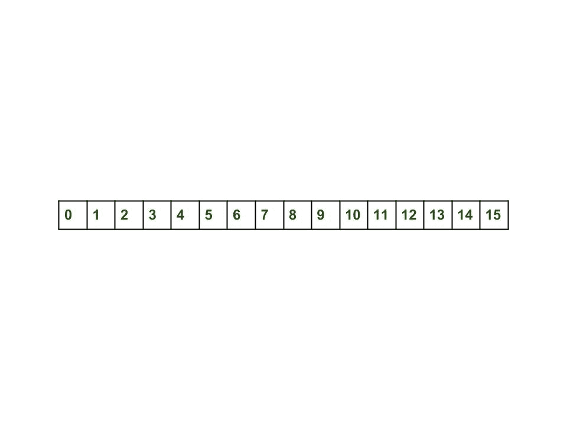
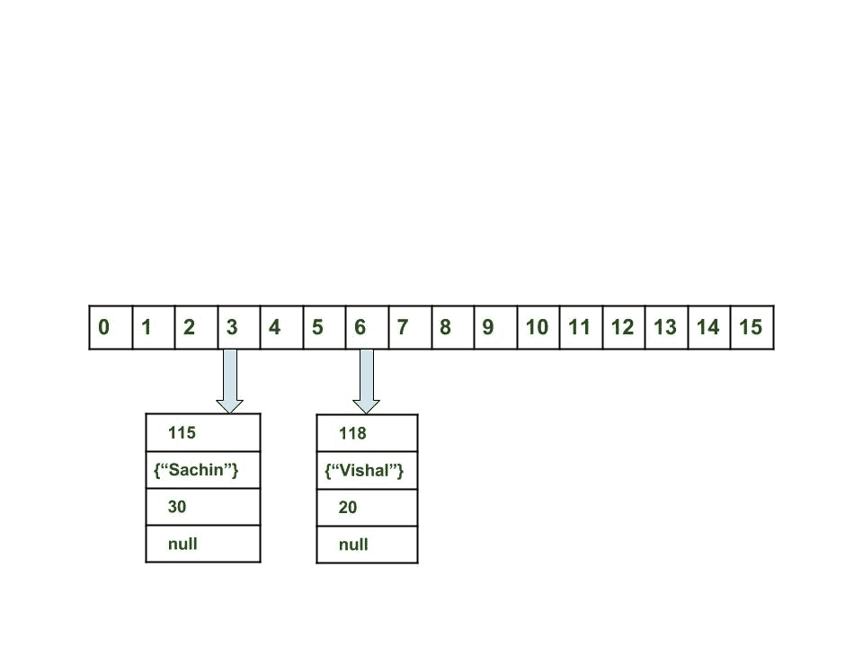

# Java 中 HashMap 的内部工作

在本文中，我们将了解 hashmap 的 get 和 put 方法在内部如何工作。 执行什么操作。 哈希如何完成。 密钥如何获取值。 键值对的存储方式。

与[先前的文章](https://www.geeksforgeeks.org/java-util-hashmap-in-java)中一样，HashMap 包含一个 Node 数组，并且 Node 可以表示具有以下对象的类：

1.  整数哈希
2.  K 键
3.  V 值
4.  下一个节点

现在，我们将了解其工作原理。 首先，我们将看到哈希过程。

**哈希**

散列是通过使用方法 hashCode（）将对象转换为整数形式的过程。 必须正确编写 hashCode（）方法，以提高 HashMap 的性能。 在这里，我使用自己的类的键，以便可以覆盖 hashCode（）方法以显示不同的场景。 我的重点课是

```
//custom Key class to override hashCode()
// and equals() method
class Key
{
  String key;
  Key(String key)
  {
    this.key = key;
  }

  @Override
  public int hashCode() 
  {
     return (int)key.charAt(0);
  }

  @Override
  public boolean equals(Object obj)
  {
    return key.equals((String)obj);
  }
}

```

在这里，覆盖的 hashCode（）方法返回第一个字符的 ASCII 值作为哈希码。 因此，只要 key 的第一个字符相同，哈希码就会相同。 您不应在程序中达到此标准。 它仅用于演示目的。 由于 HashMap 还允许使用 null 键，因此 null 的哈希码将始终为 0。

**[hashCode（）方法](https://www.geeksforgeeks.org/equals-hashcode-methods-java/)**

hashCode（）方法用于获取对象的哈希码。 对象类的 hashCode（）方法以整数形式返回对象的内存引用。 hashCode（）方法的定义是公共的本地 hashCode（）。 它表明 hashCode（）的实现是本机的，因为 java 中没有任何直接方法来获取对象的引用。 可以提供您自己的 hashCode（）实现。
在 HashMap 中，hashCode（）用于计算存储区，并因此计算索引。

**[equals（）方法](https://www.geeksforgeeks.org/equals-hashcode-methods-java/)**

equals 方法用于检查 2 个对象是否相等。 此方法由 Object 类提供。 您可以在您的类中重写此方法以提供您自己的实现。
HashMap 使用 equals（）比较密钥是否相等。 如果 equals（）方法返回 true，则它们相等，否则不相等。

**桶**

存储桶是 HashMap 数组的一个元素。 它用于存储节点。 两个或更多节点可以具有相同的存储桶。 在那种情况下，链接列表结构用于连接节点。 铲斗的容量不同。 桶与容量之间的关系如下：

```
capacity = number of buckets * load factor
```

一个存储桶可以有多个节点，这取决于 hashCode（）方法。 您的 hashCode（）方法越好，您的存储桶将被利用得越好。

**Hashmap 中的索引计算**

键的哈希码可能足够大以创建数组。 生成的哈希码可能在整数范围内，如果我们为该范围创建数组，则很容易导致 outOfMemoryException。 因此，我们生成索引以最小化数组的大小。 基本上执行以下操作来计算索引。

```
index = hashCode(key) & (n-1).

```

其中 n 是存储桶数或数组大小。 在我们的示例中，我将 n 设置为默认大小 16。

*   **Initially Empty hashMap:** Here, the hashmap is size is taken as 16.

    ```
    HashMap map = new HashMap();

    ```

    HashMap： [](https://media.geeksforgeeks.org/wp-content/uploads/Hashmap_working.jpg)

*   **Inserting Key-Value Pair:** Putting one key-value pair in above HashMap

    ```
    map.put(new Key("vishal"), 20);

    ```

    **步骤：**

    1.  计算密钥{“ vishal”}的哈希码。 它将生成为 118。
    2.  使用索引方法计算索引将为 6。
    3.  创建一个节点对象为：

        ```
        {
          int hash = 118

          // {"vishal"} is not a string but 
          // an object of class Key
          Key key = {"vishal"}

          Integer value = 20
          Node next = null
        }
        ```

    4.  如果没有其他对象，则将该对象放置在索引 6 处。

    现在 HashMap 变为： [](https://media.geeksforgeeks.org/wp-content/uploads/Hashmap_working_1.jpg)

*   **Inserting another Key-Value Pair:** Now, putting other pair that is,

    ```
    map.put(new Key("sachin"), 30);

    ```

    **步骤：**

    1.  计算密钥{“ sachin”}的 hashCode。 它将生成为 115。
    2.  使用索引方法计算索引将为 3。
    3.  创建一个节点对象为：

        ```
        {
          int hash = 115
          Key key = {"sachin"}
          Integer value = 30
          Node next = null
        }
        ```

    如果没有其他对象，则将该对象放置在索引 3 处。
    现在 HashMap 变为： [](https://media.geeksforgeeks.org/wp-content/uploads/Hashmap_working_2.jpg)

*   **发生碰撞时：**现在，放入另一对，

    ```
    map.put(new Key("vaibhav"), 40);

    ```

    **步骤：**

    1.  计算密钥{“ vaibhav”}的哈希码。 它将生成为 118。
    2.  使用索引方法计算索引将为 6。
    3.  创建一个节点对象为：

        ```
         {
          int hash = 118
          Key key = {"vaibhav"}
          Integer value = 40
          Node next = null
        }
        ```

    4.  如果此处没有其他对象，则将该对象放置在索引 6 处。
    5.  在这种情况下，在索引 6 处找到**的节点对象–这是冲突的情况。**
    6.  在这种情况下，请通过 hashCode（）和 equals（）方法检查两个键是否相同。
    7.  如果键相同，则用当前值替换该值。
    8.  否则，通过链接列表将此节点对象连接到先前的节点对象，并且两者都存储在索引 6 中。
        现在 HashMap 变为： [](https://media.geeksforgeeks.org/wp-content/uploads/Hashmap_working_3.jpg)

**使用 get method（）**

现在让我们尝试一些 get 方法来获取值。 get（K key）方法用于通过其键获取值。 如果您不知道密钥，则无法获取值。

*   **Fetch the data for key sachin:**

    ```
    map.get(new Key("sachin"));

    ```

    **步骤：**

    1.  计算密钥{“ sachin”}的哈希码。 它将生成为 115。
    2.  使用索引方法计算索引将为 3。
    3.  转到数组的索引 3，然后将第一个元素的键与给定的键进行比较。 如果两者相等，则返回该值，否则检查下一个元素是否存在。
    4.  在我们的例子中，它是第一个元素，返回值为 30。
*   Fetch the data for key vaibahv:

    ```
    map.get(new Key("vaibhav"));

    ```

    **步骤：**

    1.  计算密钥{“ vaibhav”}的哈希码。 它将生成为 118。
    2.  使用索引方法计算索引将为 6。
    3.  转到数组的索引 6，然后将第一个元素的键与给定的键进行比较。 如果两者相等，则返回该值，否则检查下一个元素是否存在。
    4.  在我们的情况下，找不到它作为第一个元素，而节点对象的下一个也不为空。
    5.  如果节点的下一个为 null，则返回 null。
    6.  如果节点的 next 不为空，则遍历第二个元素并重复过程 3，直到找不到键或 next 不为空。

```
// Java program to illustrate
// internal working of HashMap
import java.util.HashMap;
class Key {
String key;
Key(String key)
{
this .key = key;
}
@Override
public int hashCode()
{
int hash = ( int )key.charAt( 0 );
System.out.println( "hashCode for key: "
+ key + " = " + hash);
return hash;
}
@Override
public boolean equals(Object obj)
{
return key.equals(((Key)obj).key);
}
}
// Driver class
public class GFG {
public static void main(String[] args)
{
HashMap map = new HashMap();
map.put( new Key( "vishal" ), 20 );
map.put( new Key( "sachin" ), 30 );
map.put( new Key( "vaibhav" ), 40 );

System.out.println();
System.out.println( "Value for key sachin: " + map.get( new Key( "sachin" )));
System.out.println( "Value for key vaibhav: " + map.get( new Key( "vaibhav" )));
}
[ }
```

输出：

```
hashCode for key: vishal = 118
hashCode for key: sachin = 115
hashCode for key: vaibhav = 118

hashCode for key: sachin = 115
Value for key sachin: 30
hashCode for key: vaibhav = 118
Value for key vaibhav: 40

```

**Java 8 中的 HashMap 更改**

现在我们知道，在发生哈希冲突的情况下，条目对象作为节点存储在[链表](https://www.geeksforgeeks.org/linked-list-set-1-introduction/)中，并且 equals（）方法用于比较键。 在链表中查找正确密钥的比较是线性操作，因此在最坏的情况下，复杂度变为 O（n）。
为了解决此问题，Java 8 哈希元素在达到特定阈值后使用平衡树而不是链接列表。 这意味着 HashMap 首先在链表中存储 Entry 对象，但是在哈希中的项数大于某个阈值之后，哈希将从使用链表变为平衡树，这将改善 O 的最坏情况性能 （n）至 O（log n）。

**要点**

1.  放置和获取方法的时间复杂度几乎是恒定的，直到没有完成重新哈希。
2.  在发生冲突的情况下，即两个或多个节点的索引相同，节点通过链接列表连接在一起，即第二个节点由第一个节点引用，第三个由第二个节点引用，依此类推。
3.  如果给定的键已经存在于 HashMap 中，则将该值替换为新值。
4.  空键的哈希码为 0。
5.  当获取具有其键的对象时，将遍历链接列表，直到键匹配或在下一个字段中找到 null 为止。

本文由 **Vishal Garg** 提供。 如果您喜欢 GeeksforGeeks 并希望做出贡献，则还可以使用 [tribution.geeksforgeeks.org](http://www.contribute.geeksforgeeks.org) 撰写文章，或将您的文章邮寄至 tribution@geeksforgeeks.org。 查看您的文章出现在 GeeksforGeeks 主页上，并帮助其他 Geeks。

如果发现任何不正确的地方，或者想分享有关上述主题的更多信息，请写评论。

注意读者！ 现在不要停止学习。 通过 [**Java 和 Java Collections 基础课程**](https://practice.geeksforgeeks.org/courses/Java-Collections?vC=1) 以对学生方便的价格掌握所有重要的 Java 和 Collections 概念，并为行业做好准备。