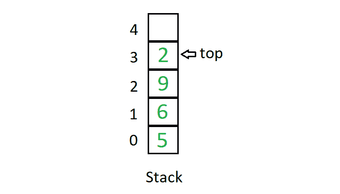
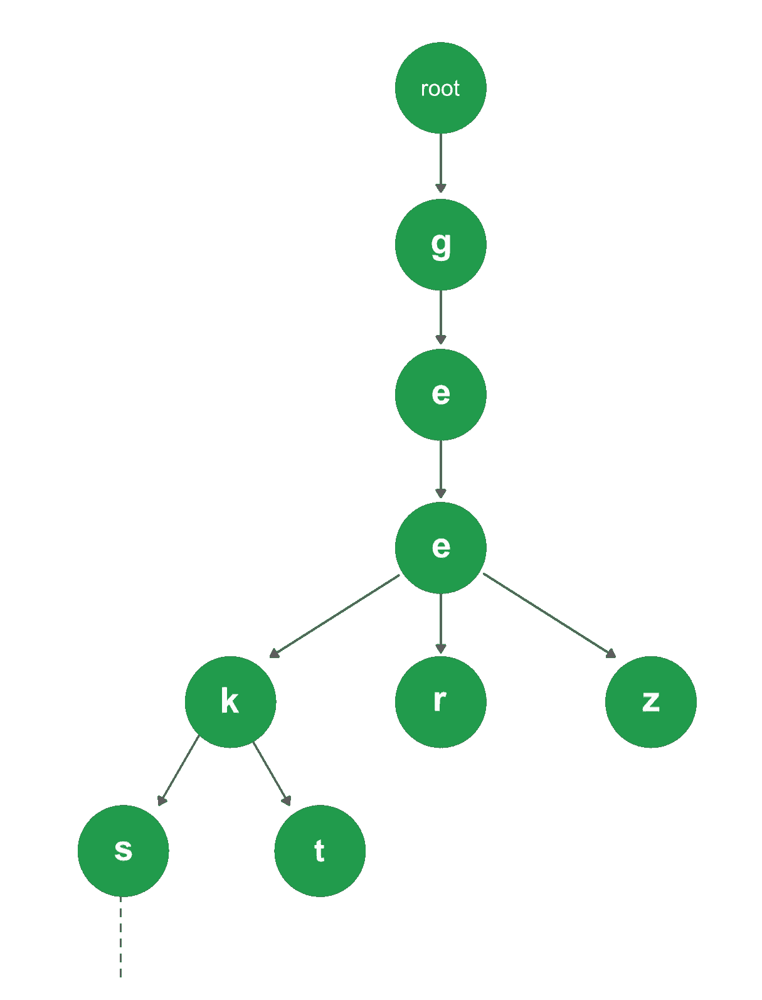

# 数据结构简介| 10 种最常用的数据结构

[数据结构](https://www.geeksforgeeks.org/data-structures/)是在计算机中组织数据的一种特殊方式，因此可以有效地使用它。 这个想法是为了减少不同任务的时间和空间复杂度。

以下是一些流行的数据结构的概述：

1.  **[Array](https://www.geeksforgeeks.org/array-data-structure/):** An array is a collection of items stored at contiguous memory locations. The idea is to store multiple items of the same type together. This makes it easier to calculate the position of each element by simply adding an offset to a base value, i.e., the memory location of the first element of the array (generally denoted by the name of the array).

    [](https://www.geeksforgeeks.org/array/)

2.  **[Linked Lists](https://www.geeksforgeeks.org/data-structures/linked-list/):** Like arrays, Linked List is a linear data structure. Unlike arrays, linked list elements are not stored at a contiguous location; the elements are linked using pointers.

    [](https://www.geeksforgeeks.org/linked-list-set-1-introduction/)

3.  **[Stack](http://www.geeksforgeeks.org/stack-data-structure/):** Stack is a linear data structure which follows a particular order in which the operations are performed. The order may be LIFO(Last In First Out) or FILO(First In Last Out).

    [](https://www.geeksforgeeks.org/stack-data-structure-introduction-program/)

    主要在堆栈中执行以下三个基本操作：

    *   **推入：**在堆栈中添加一个项目。 如果堆栈已满，则称其为溢出条件。

    *   **弹出：**从堆栈中删除一个项目。 这些项目以推入的相反顺序弹出。 如果堆栈为空，则称其为下溢条件。

    *   **窥视或顶部：**返回堆栈的顶部元素。

    *   **isEmpty：**如果堆栈为空，则返回 true，否则返回 false。

4.  **[Queue](http://www.geeksforgeeks.org/queue-data-structure/):** Like Stack, Queue is a linear structure which follows a particular order in which the operations are performed. The order is First In First Out (FIFO). A good example of the queue is any queue of consumers for a resource where the consumer that came first is served first. The difference between stacks and queues is in removing. In a stack we remove the item the most recently added; in a queue, we remove the item the least recently added.

    [](https://www.geeksforgeeks.org/queue-set-1introduction-and-array-implementation/)

    主要在队列上执行以下四个基本操作：

    *   **排队：**将项目添加到队列。 如果队列已满，则称其为溢出条件。

    *   **出队：**从队列中删除项目。 这些项目会以与推送相同的顺序弹出。 如果队列为空，则称其为下溢条件。

    *   **前：**从队列中获取前一项。

    *   **背面：**从队列中获取最后一个项目。

5.  **[Binary Tree](https://www.geeksforgeeks.org/binary-tree-data-structure/):** Unlike Arrays, Linked Lists, Stack and queues, which are linear data structures, trees are hierarchical data structures. A binary tree is a tree data structure in which each node has at most two children, which are referred to as the left child and the right child. It is implemented mainly using Links.

    二叉树由指向树中最高节点的指针表示。 如果树为空，则 root 的值为 NULL。 二叉树节点包含以下部分。

    ```
    1\. Data
    2\. Pointer to left child
    3\. Pointer to the right child
    ```

6.  **[二进制搜索树](http://www.geeksforgeeks.org/binary-search-tree-set-1-search-and-insertion/)** ：在二进制搜索树中是具有以下附加属性的二进制树：

    *   节点的左子树仅包含键小于节点键的节点。

    *   节点的右子树仅包含键大于该节点的键的节点。

    *   左和右子树也都必须是二叉搜索树。

7.  **[Heap](https://www.geeksforgeeks.org/heap-data-structure/):** A Heap is a special Tree-based data structure in which the tree is a complete binary tree. Generally, Heaps can be of two types:

    *   **最大堆：**在最大堆中，根节点上存在的密钥必须在所有子节点上存在的密钥中最大。 对于该二叉树中的所有子树，相同的属性必须递归地为 true。

    *   **最小堆：**在最小堆中，根节点上存在的密钥必须在所有子节点上存在的密钥中最小。 对于该二叉树中的所有子树，相同的属性必须递归地为 true。

    [](https://www.geeksforgeeks.org/heap-data-structure/)

8.  **[Hashing Data Structure](https://www.geeksforgeeks.org/hashing-data-structure/)**: Hashing is an important Data Structure which is designed to use a special function called the Hash function which is used to map a given value with a particular key for faster access of elements. The efficiency of mapping depends on the efficiency of the hash function used.

    让哈希函数 H（x）将值 x 映射到数组中的索引 x％10 处。 例如，如果值列表为[11、12、13、14、15]，它将分别存储在数组或哈希表中的位置{1、2、3、4、5}。

    [](https://www.geeksforgeeks.org/hashing-data-structure/)

9.  **[Matrix](https://www.geeksforgeeks.org/matrix/):** A matrix represents a collection of numbers arranged in an order of rows and columns. It is necessary to enclose the elements of a matrix in parentheses or brackets.

    包含 9 个元素的矩阵如下所示。

    [](https://www.geeksforgeeks.org/matrix/)

10.  **[Trie](http://www.geeksforgeeks.org/trie-insert-and-search/):** Trie is an efficient information re*Trie*val data structure. Using Trie, search complexities can be brought to an optimal limit (key length). If we store keys in the binary search tree, a well-balanced BST will need time proportional to M * log N, where M is maximum string length and N is the number of keys in the tree. Using Trie, we can search the key in O(M) time. However, the penalty is on Trie storage requirements.

    [](https://www.geeksforgeeks.org/trie-insert-and-search/)


* * *

* * *

如果您喜欢 GeeksforGeeks 并希望做出贡献，则还可以使用 [tribution.geeksforgeeks.org](https://contribute.geeksforgeeks.org/) 撰写文章，或将您的文章邮寄至 tribution@geeksforgeeks.org。 查看您的文章出现在 GeeksforGeeks 主页上，并帮助其他 Geeks。

如果您发现任何不正确的地方，请单击下面的“改进文章”按钮，以改进本文。