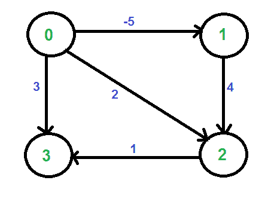
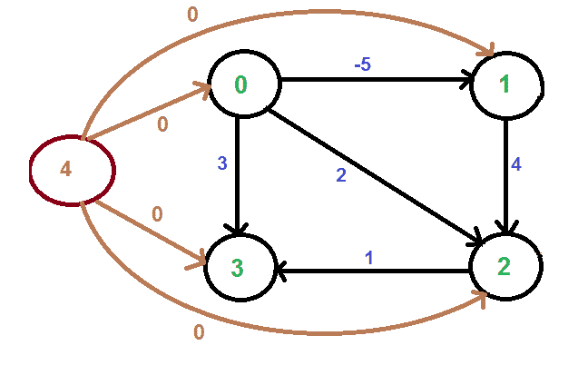

# 约翰逊全对最短路径算法

> 原文： [https://www.geeksforgeeks.org/johnsons-algorithm/](https://www.geeksforgeeks.org/johnsons-algorithm/)

问题是要在给定的加权有向图中找到每对顶点之间的最短路径，并且权重可能为负。 我们已经针对此问题讨论了 [Floyd Warshall 算法](https://www.geeksforgeeks.org/dynamic-programming-set-16-floyd-warshall-algorithm/)。 Floyd Warshall 算法的时间复杂度为Θ（V <sup>3</sup> ）。 *使用 Johnson 的算法，我们可以找到 O（V <sup>2</sup> log V + VE）时间中的所有对最短路径。* Johnson 的算法将 [Dijkstra](https://www.geeksforgeeks.org/greedy-algorithms-set-6-dijkstras-shortest-path-algorithm/) 和 [Bellman-Ford](https://www.geeksforgeeks.org/dynamic-programming-set-23-bellman-ford-algorithm/) 都用作子例程。

如果我们针对每个顶点应用 [Dijkstra 的单一源最短路径算法](https://www.geeksforgeeks.org/greedy-algorithms-set-6-dijkstras-shortest-path-algorithm/)，并将每个顶点视为源，则可以找到 O（V * VLogV）时间中的所有成对最短路径。 因此，使用 Dijkstra 的单一来源最短路径似乎比 [Floyd Warshell](https://www.geeksforgeeks.org/dynamic-programming-set-16-floyd-warshall-algorithm/) 更好，但是 Dijkstra 算法的问题在于，它不适用于负重量边。

*Johnson 算法的想法是重新加权所有边并使它们全部为正，然后将 Dijkstra 算法应用于每个顶点。*

**如何将给定图转换为具有所有非负权重边的图？**

人们可能会想到一种找到最小权重边线并将此权重添加到所有边线的简单方法。 不幸的是，这行不通，因为不同路径中的边数可能不同（例如，请参见[此](http://geeksquiz.com/data-structures-graph-question-31/)）。 如果从顶点 u 到 v 有多个路径，则所有路径都必须增加相同的量，以使最短路径在变换后的图中保持最短。

Johnson 算法的思想是为每个顶点分配权重。 令分配给顶点 u 的权重为 h [u]。 我们使用顶点权重来调整边的权重。 例如，对于权重 w（u，v）的边（u，v），新的权重变为 w（u，v）+ h [u] – h [v]。 关于这种重新加权的伟大之处在于，任意两个顶点之间的所有路径集都增加了相同的量，并且所有负权重都变为非负。 考虑两个顶点 s 和 t 之间的任何路径，每个路径的权重都增加 h [s] – h [t]，从 s 到 t 的路径上所有顶点的 h []值都相互抵消。

我们如何计算 h []值？ [Bellman-Ford 算法](https://www.geeksforgeeks.org/dynamic-programming-set-23-bellman-ford-algorithm/)用于此目的。 以下是完整的算法。 新的顶点将添加到图中，并连接到所有现有的顶点。 从新顶点到所有现有顶点的最短距离值是 h []值。

**算法**：

**1）**令给定图为 G。向图添加新顶点 s，将新顶点的边添加至 G 的所有顶点。让修改后的图 成为 G'。

**2）**在 s 为源的 G’上运行 [Bellman-Ford 算法](https://www.geeksforgeeks.org/dynamic-programming-set-23-bellman-ford-algorithm/)。 令由 Bellman-Ford 计算的距离为 h [0]，h [1]，.. h [V-1]。 如果我们发现负体重循环，则返回。 请注意，负权重循环无法由新顶点 s 创建，因为 s 没有边。 所有边均来自。

**3）**重新加权原始图形的边。 对于每个边（u，v），将新权重分配为“原始权重+ h [u] – h [v]”。

**4）**删除添加的顶点，并为每个顶点运行 [Dijkstra 的算法](https://www.geeksforgeeks.org/greedy-algorithms-set-6-dijkstras-shortest-path-algorithm/)。

**变换如何确保非负的权重边？**

由于 h []值是最短距离，因此以下属性始终成立。

```
   h[v] <= h[u] + w(u, v) < pre>
该属性仅表示，从 s 到 v 的最短距离必须小于或等于从 s 到 u 的最短距离加上边的权重（u，v）。 新的权重是 w（u，v）+ h [u]-h [v]。 由于不等式“ h [v] <= h[u] + w(u, v)". **，新权重的值必须大于或等于零。示例：
让我们考虑下图。= >** 
  
我们添加一个 source，并将 s 的边添加到原始图的所有顶点。 在下图中，s 为 4。
  

我们使用 Bellman-Ford 算法计算从 4 到所有其他顶点的最短距离。 从 4 到 0、1、2 和 3 的最短距离分别为 0，-5，-1 和 0，即 h [] = {0，-5，-1、0}。 一旦获得这些距离，就可以删除源顶点 4 并使用以下公式对边进行加权。  w（u，v）= w（u，v）+ h [u]-h [v]。
  
由于现在所有权重都为正，因此我们可以对每个顶点作为源运行 Dijkstra 的最短路径算法。
**时间复杂度**：算法中的主要步骤是调用一次的 Bellman Ford 算法和调用 V 的 Dijkstra。  Bellman Ford 的时间复杂度为 O（VE），而 Dijkstra 的时间复杂度为 O（VLogV）。 因此，总体时间复杂度为 O（V <sup> 2 </sup> log V + VE）。  
图完成时，约翰逊算法的时间复杂度与 [Floyd Warshell](https://www.geeksforgeeks.org/dynamic-programming-set-16-floyd-warshall-algorithm/) 相同（对于完整图 E = O（V <sup>2</sup> ）。但是对于稀疏图，则 该算法的性能比 [Floyd Warshell](https://www.geeksforgeeks.org/dynamic-programming-set-16-floyd-warshall-algorithm/) 好得多。
**参考**：
 [ Clifford Stein，Thomas H. Cormen，Charles E. Leiserson 和 Ronald L. Rivest 撰写的算法第三版](http://www.flipkart.com/introduction-algorithms-3/p/itmczynzhyhxv2gs?pid=9788120340077&affid=sandeepgfg) 
 [ http：//  www.youtube.com/watch?v=b6LOHvCzmkI ](http://www.youtube.com/watch?v=b6LOHvCzmkI) 
 [ http://www.youtube.com/watch?v=TV2Z6nbo1ic ](http://www.youtube.com/watch?v=TV2Z6nbo1ic) 
 [ http：// en。  wikipedia.org/wiki/Johnson%27s_algorithm ](http://en.wikipedia.org/wiki/Johnson%27s_algorithm) 
 [http://www.youtube.com/watch?v=Sygq1e0xWnM](http://www.youtube.com/watch?v=Sygq1e0xWnM) 
如果发现任何不正确的地方，或者想分享有关上述主题的更多信息，请写评论。


	=>
```